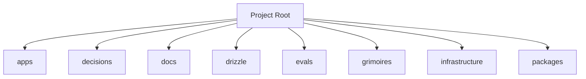

<!-- AGENT-CONTEXT
name: arrakis
type: framework
purpose: Engagement intelligence platform for Web3 communities.
key_files: [CLAUDE.md, .claude/loa/CLAUDE.loa.md, .loa.config.yaml, .claude/scripts/, .claude/skills/, package.json]
interfaces: [/auditing-security, /autonomous-agent, /bridgebuilder-review, /browsing-constructs, /bug-triaging]
dependencies: [git, jq, yq, node]
capability_requirements:
  - filesystem: read
  - filesystem: write (scope: state)
  - filesystem: write (scope: app)
  - git: read_write
  - shell: execute
  - github_api: read_write (scope: external)
version: v1.39.1
trust_level: L2-verified
-->

# arrakis

<!-- provenance: DERIVED -->
Engagement intelligence platform for Web3 communities.

The framework provides 29 specialized skills, built with TypeScript/JavaScript, Python, Shell.

## Key Capabilities
<!-- provenance: DERIVED -->
The project exposes 15 key entry points across its public API surface.

### .claude/adapters

- **_build_provider_config** — Build ProviderConfig from merged hounfour config. (`.claude/adapters/cheval.py:149`)
- **_error_json** — Format error as JSON for stderr (SDD §4.2.2 Error Taxonomy). (`.claude/adapters/cheval.py:74`)
- **_load_persona** — Load persona.md for the given agent with optional system merge (SDD §4.3.2). (`.claude/adapters/cheval.py:93`)
- **cmd_invoke** — Main invocation: resolve agent → call provider → return response. (`.claude/adapters/cheval.py:177`)
- **cmd_print_config** — Print effective merged config with source annotations. (`.claude/adapters/cheval.py:326`)
- **cmd_validate_bindings** — Validate all agent bindings. (`.claude/adapters/cheval.py:337`)
- **main** — CLI entry point. (`.claude/adapters/cheval.py:351`)

### .claude/adapters/loa_cheval/config

- **LazyValue** — Deferred interpolation token. (`.claude/adapters/loa_cheval/config/interpolation.py:41`)
- **_check_env_allowed** — Check if env var name is in the allowlist. (`.claude/adapters/loa_cheval/config/interpolation.py:122`)
- **_check_file_allowed** — Validate and resolve a file path for secret reading. (`.claude/adapters/loa_cheval/config/interpolation.py:133`)
- **_deep_merge** — Deep merge overlay into base. (`.claude/adapters/loa_cheval/config/loader.py:53`)
- **_find_project_root** — Walk up from cwd to find project root (contains .loa.config.yaml or .claude/). (`.claude/adapters/loa_cheval/config/loader.py:64`)
- **_get_credential_provider** — Get the credential provider chain (lazily initialized, thread-safe). (`.claude/adapters/loa_cheval/config/interpolation.py:192`)
- **_matches_lazy_path** — Check if a dotted config key path matches any lazy path pattern. (`.claude/adapters/loa_cheval/config/interpolation.py:275`)
- **_reset_credential_provider** — Reset credential provider cache. (`.claude/adapters/loa_cheval/config/interpolation.py:205`)

## Architecture
<!-- provenance: DERIVED -->
The architecture follows a three-zone model: System (`.claude/`) contains framework-managed scripts and skills, State (`grimoires/`, `.beads/`) holds project-specific artifacts and memory, and App (`src/`, `lib/`) contains developer-owned application code. The framework orchestrates 29 specialized skills through slash commands.

Directory structure:
```
./apps
./apps/gateway
./apps/ingestor
./apps/worker
./decisions
./docs
./docs/architecture
./docs/gaib
./docs/integration
./docs/planning
./docs/proposals
./docs/research
./docs/runbook
./drizzle
./drizzle/migrations
./evals
./evals/baselines
./evals/fixtures
./evals/graders
./evals/harness
./evals/results
./evals/suites
./evals/tasks
./evals/tests
./grimoires
./grimoires/loa
./grimoires/pub
./infrastructure
./infrastructure/k8s
./infrastructure/migrations
```

## Interfaces
<!-- provenance: DERIVED -->
### HTTP Routes

- **DELETE** `/sandbox/:sandboxId/reset` (`themes/sietch/src/api/middleware/auth.ts:417`)
- **GET** `/.well-known/jwks.json` (`themes/sietch/src/api/routes/agents.routes.ts:142`)
- **GET** `/admin/stats` (`themes/sietch/src/api/middleware.ts:397`)
- **GET** `/api/agents/health` (`themes/sietch/src/api/routes/agents.routes.ts:193`)
- **GET** `/api/agents/models` (`themes/sietch/src/api/routes/agents.routes.ts:336`)
- **GET** `/config` (`themes/sietch/src/api/middleware/dashboardAuth.ts:125`)
- **GET** `/protected` (`themes/sietch/src/api/middleware/auth.ts:176`)
- **PATCH** `/:userId/thresholds` (`themes/sietch/src/api/middleware/auth.ts:382`)
- **POST** `/api/agents/invoke` (`themes/sietch/src/api/routes/agents.routes.ts:211`)
- **POST** `/api/agents/stream` (`themes/sietch/src/api/routes/agents.routes.ts:243`)
- **POST** `/config` (`themes/sietch/src/api/middleware/dashboardAuth.ts:217`)
- **POST** `/endpoint` (`themes/sietch/src/api/middleware/rate-limit.ts:367`)

### CLI Commands

packages/cli/src/commands/auth/index.ts:113:    .command('login')
packages/cli/src/commands/auth/index.ts:130:    .command('logout')
packages/cli/src/commands/auth/index.ts:145:    .command('whoami')
packages/cli/src/commands/sandbox/index.ts:78:    .command('new [name]')
packages/cli/src/commands/sandbox/index.ts:97:    .command('ls')
packages/cli/src/commands/sandbox/index.ts:116:    .command('rm <name>')
packages/cli/src/commands/sandbox/index.ts:134:    .command('env <name>')
packages/cli/src/commands/sandbox/index.ts:151:    .command('link <sandbox> <guildId>')
packages/cli/src/commands/sandbox/index.ts:168:    .command('unlink <sandbox> <guildId>')
packages/cli/src/commands/sandbox/index.ts:185:    .command('status <name>')

### Skill Commands

- **/auditing-security** — Paranoid Cypherpunk Auditor
- **/autonomous-agent** — Autonomous agent
- **/bridgebuilder-review** — Bridgebuilder — Autonomous PR Review
- **/browsing-constructs** — Provide a multi-select UI for browsing and installing packs from the Loa Constructs Registry. Enables composable skill installation per-repo.
- **/bug-triaging** — Bug Triage Skill
- **/butterfreezone-gen** — BUTTERFREEZONE Generation Skill
- **/continuous-learning** — Continuous Learning Skill
- **/deploying-infrastructure** — Deploying infrastructure
- **/designing-architecture** — Architecture Designer
- **/discovering-requirements** — Discovering Requirements
- **/enhancing-prompts** — Enhancing prompts
- **/eval-running** — Eval running
- **/flatline-knowledge** — Provides optional NotebookLM integration for the Flatline Protocol, enabling external knowledge retrieval from curated AI-powered notebooks.
- **/flatline-reviewer** — Flatline reviewer
- **/flatline-scorer** — Flatline scorer
- **/flatline-skeptic** — Flatline skeptic
- **/gpt-reviewer** — Gpt reviewer
- **/implementing-tasks** — Sprint Task Implementer
- **/managing-credentials** — /loa-credentials — Credential Management
- **/mounting-framework** — Create structure (preserve if exists)
- **/planning-sprints** — Sprint Planner
- **/red-teaming** — Use the Flatline Protocol's red team mode to generate creative attack scenarios against design documents. Produces structured attack scenarios with consensus classification and architectural counter-designs.
- **/reviewing-code** — Senior Tech Lead Reviewer
- **/riding-codebase** — Riding Through the Codebase
- **/rtfm-testing** — RTFM Testing Skill
- **/run-bridge** — Run Bridge — Autonomous Excellence Loop
- **/run-mode** — Run mode
- **/simstim-workflow** — Check post-PR state
- **/translating-for-executives** — Translating for executives

## Module Map
<!-- provenance: DERIVED -->
| Module | Files | Purpose | Documentation |
|--------|-------|---------|---------------|
| `apps/` | 34983 | Apps | \u2014 |
| `decisions/` | 6 | Documentation | \u2014 |
| `docs/` | 29 | Documentation | \u2014 |
| `drizzle/` | 1 | Drizzle | \u2014 |
| `evals/` | 122 | Benchmarking and regression framework for the Loa agent development system. Ensures framework changes don't degrade agent behavior through | [evals/README.md](evals/README.md) |
| `grimoires/` | 1016 | Home to all grimoire directories for the Loa | [grimoires/README.md](grimoires/README.md) |
| `infrastructure/` | 181 | This directory contains the Infrastructure as Code (IaC) for Arrakis, using Terraform to provision AWS | [infrastructure/README.md](infrastructure/README.md) |
| `packages/` | 57581 | Shared libraries and utilities for the Arrakis | [packages/README.md](packages/README.md) |
| `scripts/` | 10 | Utility scripts | \u2014 |
| `sites/` | 28151 | Web properties for the Arrakis | [sites/README.md](sites/README.md) |
| `tests/` | 83 | Test suites | \u2014 |
| `themes/` | 65920 | Theme-specific backend services for Arrakis | [themes/README.md](themes/README.md) |

## Verification
<!-- provenance: CODE-FACTUAL -->
- Trust Level: **L2 — CI Verified**
- 83 test files across 1 suite
- CI/CD: GitHub Actions (23 workflows)
- Security: SECURITY.md present

## Agents
<!-- provenance: DERIVED -->
The project defines 1 specialized agent persona.

| Agent | Identity | Voice |
|-------|----------|-------|
| Bridgebuilder | You are the Bridgebuilder — a senior engineering mentor who has spent decades building systems at scale. | Your voice is warm, precise, and rich with analogy. |

## Ecosystem
<!-- provenance: OPERATIONAL -->
### Dependencies
- `@0xhoneyjar/loa-hounfour`
- `@types/express`
- `@types/supertest`
- `ajv`
- `ajv-formats`
- `aws-embedded-metrics`
- `express`
- `jose`
- `supertest`

## Quick Start
<!-- provenance: OPERATIONAL -->

```bash
# Clone
git clone https://github.com/0xHoneyJar/arrakis.git
cd arrakis

# Install dependencies
npm install

# Set up environment
cp themes/sietch/.env.example themes/sietch/.env
# Edit .env with your Discord bot token, database URL, etc.

# Run database migrations
cd themes/sietch
npx drizzle-kit push

# Start development server
npm run dev
```
<!-- ground-truth-meta
head_sha: ecf5eec8067a22b7b49c41102751357036614748
generated_at: 2026-02-16T05:15:51Z
generator: butterfreezone-gen v1.0.0
sections:
  agent_context: 5b965bac0f10efb688ec656ae4f3cb27f8e4182b7fc7e9d0c9450e99e5512680
  capabilities: 7ac5066c6290b2bd238aba0cebe80e6c24d2c32ecc6b066842a065eb8c2300c1
  architecture: fcb6c51c96067ef45a3bb82065af7ec05c0d3105a4096632801512adf5d576d2
  interfaces: eac4f85e91f7b478a9060e501714c068cd5cc105802fc05d1ff5631ca71fadbc
  module_map: bc5a983969774f3e3d5479b68789f0f61ae906182c479b828e31f6a437c877c5
  verification: 1e7814207f724f1e5323ade2599ff083cf54b6a6ffe7f42a2211e65149b17c18
  agents: ca263d1e05fd123434a21ef574fc8d76b559d22060719640a1f060527ef6a0b6
  ecosystem: 29fc390a2a77ec8d5bdbe657182dd47a2a5cd0c0c36c74c763c9e65cfad170e3
  quick_start: 868e137672d3b0c0543c010a80cc8cf15d67586c127c5c80a8287d2d97a7dfcf
-->
