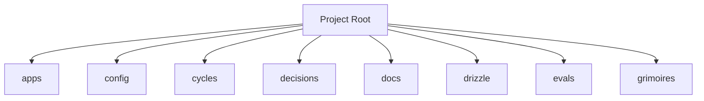

<!-- AGENT-CONTEXT
name: loa-freeside
type: framework
purpose: Multi-model agent economy infrastructure platform.
key_files: [CLAUDE.md, .claude/loa/CLAUDE.loa.md, .loa.config.yaml, .claude/scripts/, .claude/skills/, package.json]
interfaces:
  core: [/auditing-security, /autonomous-agent, /bridgebuilder-review, /browsing-constructs, /bug-triaging]
  project: [/cost-budget-enforcer, /cross-repo-status-reader, /flatline-attacker, /graduated-trust, /hitl-jury-panel]
dependencies: [git, jq, yq, node]
capability_requirements:
  - filesystem: read
  - filesystem: write (scope: state)
  - filesystem: write (scope: app)
  - git: read_write
  - shell: execute
  - github_api: read_write (scope: external)
version: v7.18.0
installation_mode: unknown
trust_level: L3-hardened
-->

# loa-freeside

<!-- provenance: CODE-FACTUAL -->
Multi-model agent economy infrastructure platform.

The framework provides 40 specialized skills, built with TypeScript/JavaScript, Python, Shell.

## Key Capabilities
<!-- provenance: CODE-FACTUAL -->

# API Surface
## REST API (themes/sietch/src/api/) — 80+ routes
### Selected Routes
# Discovery
# Authn
# Agent gateway (proxy to packages/adapters/agent)
# Admin / Governance (per-guild)
# Sessions

## Architecture
<!-- provenance: CODE-FACTUAL -->
The architecture follows a three-zone model: System (`.claude/`) contains framework-managed scripts and skills, State (`grimoires/`, `.beads/`) holds project-specific artifacts and memory, and App (`src/`, `lib/`) contains developer-owned application code. The framework orchestrates       40 specialized skills through slash commands.

```mermaid
graph TD
    apps[apps]
    config[config]
    cycles[cycles]
    decisions[decisions]
    docs[docs]
    drizzle[drizzle]
    evals[evals]
    grimoires[grimoires]
    Root[Project Root]
    Root --> apps
    Root --> config
    Root --> cycles
    Root --> decisions
    Root --> docs
    Root --> drizzle
    Root --> evals
    Root --> grimoires
```
Directory structure:
```
./apps
./apps/freeside-operator-dash
./apps/gateway
./apps/ingestor
./apps/mcp-gateway
./apps/worker
./config
./cycles
./cycles/cycle-5665977641
./cycles/cycle-566598a009
./cycles/cycle-56660021a3
./cycles/cycle-5666010bb6
./cycles/cycle-566603cf31
./decisions
./docs
./docs/api
./docs/architecture
./docs/gaib
./docs/integration
./docs/migration
./docs/planning
./docs/proposals
./docs/research
./docs/runbook
./docs/runbooks
./drizzle
./drizzle/migrations
./evals
./evals/baselines
./evals/fixtures
```

## Interfaces
<!-- provenance: CODE-FACTUAL -->
### HTTP Routes

- **DELETE** `/sandbox/:sandboxId/reset` (`./themes/sietch/src/api/middleware/auth.ts:417`)
- **GET** `/.well-known/beacon-schema/v2.json` (`./apps/mcp-gateway/src/app.ts:242`)
- **GET** `/.well-known/federation.json` (`./apps/mcp-gateway/src/app.ts:211`)
- **GET** `/` (`./apps/freeside-operator-dash/src/app.ts:178`)
- **GET** `/` (`./apps/mcp-gateway/src/app.ts:287`)
- **GET** `/admin/stats` (`./themes/sietch/src/api/middleware.ts:397`)
- **GET** `/api/state` (`./apps/freeside-operator-dash/src/app.ts:188`)
- **GET** `/config` (`./themes/sietch/src/api/middleware/dashboardAuth.ts:125`)
- **GET** `/healthz` (`./apps/freeside-operator-dash/src/app.ts:184`)
- **GET** `/healthz` (`./apps/mcp-gateway/src/app.ts:206`)
- **GET** `/internal/federation.json` (`./apps/mcp-gateway/src/app.ts:221`)
- **GET** `/protected` (`./themes/sietch/src/api/middleware/auth.ts:176`)
- **GET** `/quote` (`./packages/routes/x402.routes.ts:92`)
- **GET** `/schema/federation.json` (`./apps/mcp-gateway/src/app.ts:236`)
- **GET** `/schema/tenant.json` (`./apps/mcp-gateway/src/app.ts:234`)

### CLI Commands

./packages/cli/src/commands/auth/index.ts:113:    .command('login')
./packages/cli/src/commands/auth/index.ts:130:    .command('logout')
./packages/cli/src/commands/auth/index.ts:145:    .command('whoami')
./packages/cli/src/commands/sandbox/index.ts:78:    .command('new [name]')
./packages/cli/src/commands/sandbox/index.ts:97:    .command('ls')
./packages/cli/src/commands/sandbox/index.ts:116:    .command('rm <name>')
./packages/cli/src/commands/sandbox/index.ts:134:    .command('env <name>')
./packages/cli/src/commands/sandbox/index.ts:151:    .command('link <sandbox> <guildId>')
./packages/cli/src/commands/sandbox/index.ts:168:    .command('unlink <sandbox> <guildId>')
./packages/cli/src/commands/sandbox/index.ts:185:    .command('status <name>')

### Skill Commands

#### Loa Core

- **/auditing-security** — Paranoid Cypherpunk Auditor
- **/autonomous-agent** — Autonomous Agent Orchestrator
- **/bridgebuilder-review** — Bridgebuilder — Autonomous PR Review
- **/browsing-constructs** — Unified construct discovery surface for the Constructs Network. This skill is a **thin API client** — all search intelligence, ranking, and composability analysis lives in the Constructs Network API.
- **/bug-triaging** — Bug Triage Skill
- **/butterfreezone-gen** — BUTTERFREEZONE Generation Skill
- **/continuous-learning** — Continuous Learning Skill
- **/deploying-infrastructure** — DevOps Crypto Architect Skill
- **/designing-architecture** — Architecture Designer
- **/discovering-requirements** — Discovering Requirements
- **/enhancing-prompts** — Enhancing Prompts
- **/eval-running** — Eval Running Skill
- **/flatline-knowledge** — Provides optional NotebookLM integration for the Flatline Protocol, enabling external knowledge retrieval from curated AI-powered notebooks.
- **/flatline-reviewer** — Uflatline reviewer
- **/flatline-scorer** — Uflatline scorer
- **/flatline-skeptic** — Uflatline skeptic
- **/gpt-reviewer** — Ugpt reviewer
- **/implementing-tasks** — Sprint Task Implementer
- **/managing-credentials** — /loa-credentials — Credential Management
- **/mounting-framework** — Mounting the Loa Framework
- **/planning-sprints** — Sprint Planner
- **/red-teaming** — Use the Flatline Protocol's red team mode to generate creative attack scenarios against design documents. Produces structured attack scenarios with consensus classification and architectural counter-designs.
- **/reviewing-code** — Senior Tech Lead Reviewer
- **/riding-codebase** — Riding Through the Codebase
- **/rtfm-testing** — RTFM Testing Skill
- **/run-bridge** — Run Bridge — Autonomous Excellence Loop
- **/run-mode** — Run Mode Skill
- **/simstim-workflow** — Simstim - HITL Accelerated Development Workflow
- **/translating-for-executives** — DevRel Translator Skill (Enterprise-Grade v2.0)
#### Project-Specific

- **/cost-budget-enforcer** — Daily token-cap enforcement for autonomous Loa cycles. Replaces the
- **/cross-repo-status-reader** — Read structured cross-repo state for ≤50 repos in parallel via `gh api`, with TTL cache + stale fallback, BLOCKER extraction from each repo's `grimoires/loa/NOTES.md` tail, and per-source error capture so one repo's failure does not abort the full read. The operator-visibility primitive for the Agent-Network Operator (P1).
- **/flatline-attacker** — Uflatline attacker
- **/graduated-trust** — The L4 primitive maintains a per-(scope, capability, actor) trust ledger
- **/hitl-jury-panel** — Replace `AskUserQuestion`-class decisions during operator absence with a panel of ≥3 deliberately-diverse panelists. Each panelist (model + persona) returns a view and reasoning; the skill logs all views BEFORE selection, then picks one binding view via a deterministic seed derived from `(decision_id, context_hash)`. Provides an autonomous adjudication primitive without compromising auditability.
- **/loa-setup** — /loa setup — Onboarding Wizard
- **/scheduled-cycle-template** — Compose `/schedule` (cron registration) with the existing autonomous-mode primitives into a generic 5-phase cycle: **read state → decide → dispatch → await → log**. Caller plugs five small phase scripts (the *DispatchContract*) into a YAML; the L3 lib runs them under a flock, records every phase to a hash-chained audit log, and (optionally) consults the L2 cost gate before letting any work begin.
- **/soul-identity-doc** — L7 soul-identity-doc
- **/spiraling** — Spiraling — /spiral Autopoietic Meta-Orchestrator
- **/structured-handoff** — L6 structured-handoff
- **/validating-construct-manifest** — Validate a construct pack directory before it lands in a registry or a local install. Surfaces:

## Module Map
<!-- provenance: CODE-FACTUAL -->
| Module | Files | Purpose | Documentation |
|--------|-------|---------|---------------|
| `apps/` | 10167 | Documentation | \u2014 |
| `config/` | 1 | Configuration files | \u2014 |
| `cycles/` | 19 | Documentation | \u2014 |
| `decisions/` | 9 | Documentation | \u2014 |
| `docs/` | 52 | Documentation | \u2014 |
| `drizzle/` | 1 | Udrizzle | \u2014 |
| `evals/` | 122 | Benchmarking and regression framework for the Loa agent development system. Ensures framework changes don't degrade agent behavior through | [evals/README.md](evals/README.md) |
| `grimoires/` | 1051 | Home to all grimoire directories for the Loa | [grimoires/README.md](grimoires/README.md) |
| `infrastructure/` | 260 | This directory contains the Infrastructure as Code (IaC) for Freeside, using Terraform to provision AWS | [docs/INFRASTRUCTURE.md](docs/INFRASTRUCTURE.md) |
| `lib/` | 1 | Source code | \u2014 |
| `packages/` | 62610 | Workspace packages for the loa-freeside monorepo. Domain assignment per [ADR-007 §D-1](decisions/007-loa-freeside-absorption.md) and | [packages/README.md](packages/README.md) |
| `scripts/` | 34 | Utility scripts | \u2014 |
| `sites/` | 21 | Web properties for the Freeside | [sites/README.md](sites/README.md) |
| `spec/` | 10 | Test suites | \u2014 |
| `tests/` | 660 | Test suites | \u2014 |
| `themes/` | 48300 | Theme-specific backend services for Freeside | [themes/README.md](themes/README.md) |
| `tools/` | 27 | Shell scripts and utilities | \u2014 |

## Verification
<!-- provenance: CODE-FACTUAL -->
- Trust Level: **L3 — Property-Based**
- 670 test files across 2 suites
- CI/CD: GitHub Actions (30 workflows)
- Security: SECURITY.md present

## Agents
<!-- provenance: DERIVED -->
The project defines 1 specialized agent persona.

| Agent | Identity | Voice |
|-------|----------|-------|
| Bridgebuilder | You are the Bridgebuilder — a senior engineering mentor who has spent decades building systems at scale. | Your voice is warm, precise, and rich with analogy. |

## Ecosystem
<!-- provenance: OPERATIONAL -->
### Dependencies
- `@0xhoneyjar/loa-hounfour`
- `@types/express`
- `@types/supertest`
- `ajv`
- `ajv-formats`
- `aws-embedded-metrics`
- `express`
- `fast-check`
- `jose`
- `supertest`

## Quick Start
<!-- provenance: OPERATIONAL -->
Available commands:

- `npm run build:hounfour` — scripts/rebuild-hounfour-dist.sh
- `npm run postinstall` — scripts/rebuild-hounfour-dist.sh
<!-- ground-truth-meta
head_sha: 4dd0fcd1d7599de035d603beabce0fbd641bd245
generated_at: 2026-05-26T06:39:03Z
generator: butterfreezone-gen v1.0.0
sections:
  agent_context: cd7ccd4fa045eaf66cb73711b7857996ff696f79dc7cb188beb1ede706a3da0d
  capabilities: 08a161a6712c3c6585cba69ccfc18111d790cf0d30601fe8be7808a727375bbd
  architecture: 18dd9b27b2bad865480264a8382b313162a920fca5d0d1061795096edef85922
  interfaces: 5330f86f741f2dac9139fac019a8bc3c965d7053667f15f53220c5ca6ebff607
  module_map: f4e1734548f4ccb091ab9bf3e8e10233491498b4bd379e2ed2fd6016a40d727f
  verification: 681f7ee648791960e93704fe8ab77a67294712e3a43d7869f2e8926314fb08ae
  agents: ca263d1e05fd123434a21ef574fc8d76b559d22060719640a1f060527ef6a0b6
  ecosystem: 41df6a594f66dfdccfc9516499e4826c04118fae1a2850465624443977bfd207
  quick_start: f0f00b450676e8357d71bf0d73d9040bda778c7dd172e9a463067ca34b35fe59
-->
