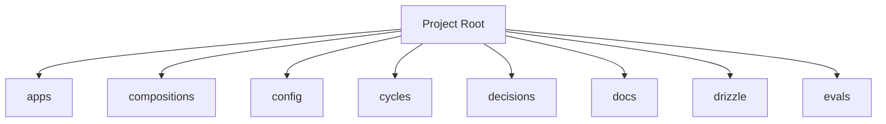

<!-- AGENT-CONTEXT
name: loa-freeside
type: framework
purpose: Multi-model agent economy infrastructure platform.
key_files: [CLAUDE.md, .claude/loa/CLAUDE.loa.md, .loa.config.yaml, .claude/scripts/, .claude/skills/, package.json]
interfaces:
  core: [/auditing-security, /autonomous-agent, /bridgebuilder-review, /browsing-constructs, /bug-triaging]
  project: [/cost-budget-enforcer, /cross-repo-status-reader, /flatline-attacker, /graduated-trust, /hitl-jury-panel]
dependencies: [git, jq, yq, node]
capability_requirements:
  - filesystem: read
  - filesystem: write (scope: state)
  - filesystem: write (scope: app)
  - git: read_write
  - shell: execute
  - github_api: read_write (scope: external)
version: v7.77.0
installation_mode: unknown
trust_level: L3-hardened
-->

# loa-freeside

<!-- provenance: CODE-FACTUAL -->
Multi-model agent economy infrastructure platform.

The framework provides 41 specialized skills, built with TypeScript/JavaScript, Python, Shell.

## Key Capabilities
<!-- provenance: CODE-FACTUAL -->
The project exposes 4 key entry points across its public API surface.
### API & Command Surface — loa-freeside (current, in-repo)
#### REST (themes/sietch — Express 5)
- **48 route modules → 300+ endpoints** (`themes/sietch/src/api/routes/index.ts`). Server init `themes/sietch/src/api/server.ts:119-761`.
- Mount points: `publicRouter`, `adminRouter`, `memberRouter`, `billingRouter`, `badgeRouter`, `boostRouter`, `componentRouter`, `themeRouter`, `telegramRouter`, `verifyRouter`, `internalRouter`, `internalAgentRouter`, `agentTbaRouter`, `agentGovernanceRouter`, `velocityRouter`, `eventsRouter`, `governanceRouter`.
- Representative modules:
- **Auth middleware**: `requireAuth`, `requireRoles`, `requireApiKey`, `requireDashboardAuth`. Security: helmet CSP, `memberRateLimiter` / `webhookRateLimiter`, cookie parser, CORS.
#### REST (in-repo services — Hono; 130 raw route registrations scanned 2026-07-19)
- `packages/services/ordering` → `bin/http.ts` + `bin/worker.ts` + `bin/fulfillment-orchestrator.ts` — **24 route registrations** (largest in-repo Hono surface; grew through the CR cycle: collection-report list/detail projections CR-206, attention receipts + mark-seen CR-305, capability demand lifecycle CR-208, public authorization CR-007A). Registered in registry.yaml as cell `ordering`, runtime_state deployed.
- `packages/services/shadow-audit` → `bin/http.ts` (Access-Risk Audit API) — 8 registrations
- `packages/services/shadow-mode` → `src/index.ts` (member-graph ledger) — 6 registrations
- `packages/freeside-registry` → serves HTTP `GET /federation.json` manifest endpoint
- `apps/mcp-gateway` → `bin/http.ts` (Hono; MCP federation v0.3) — 9 registrations
- `apps/freeside-operator-dash` — 4 registrations
#### Discord (discord.js) — 23 commands
#### Telegram (Grammy) — 12 commands
#### CLIs — 2
- **freeside-cli** (`packages/freeside-cli/bin/freeside-cli.ts`) — 6 verbs: `list`, `inspect <slug>`, `doctor [--remote|--acvp|--cells-dir]`, `order (place|status|ingredients)`, `kitchen (probe|advance)`, `fulfill (watch)`. Exit codes 0 ok · 1 usage · 2 unreachable · 3 API error · 4 ambiguous · 5 timeout · 6 failed.
- **gaib** (`packages/cli/bin/gaib.ts`, Commander) — groups: `auth` (login/logout/whoami), `sandbox` (list/create/destroy/connect/link/unlink), `user` (create/ls/grant/access/revoke), `server` (init/apply/diff/destroy/export/import/theme/workspace/backup/restore). Levenshtein typo detection.
#### MCP
#### Webhooks (6)

## Architecture
<!-- provenance: CODE-FACTUAL -->
The architecture follows a three-zone model: System (`.claude/`) contains framework-managed scripts and skills, State (`grimoires/`, `.beads/`) holds project-specific artifacts and memory, and App (`src/`, `lib/`) contains developer-owned application code. The framework orchestrates       41 specialized skills through slash commands.

```mermaid
graph TD
    apps[apps]
    compositions[compositions]
    config[config]
    cycles[cycles]
    decisions[decisions]
    docs[docs]
    drizzle[drizzle]
    evals[evals]
    Root[Project Root]
    Root --> apps
    Root --> compositions
    Root --> config
    Root --> cycles
    Root --> decisions
    Root --> docs
    Root --> drizzle
    Root --> evals
```
Directory structure:
```
./apps
./apps/freeside-operator-dash
./apps/gateway
./apps/ingestor
./apps/mcp-gateway
./apps/worker
./compositions
./compositions/discovery
./config
./cycles
./cycles/cycle-234904aa37
./cycles/cycle-23509724af
./cycles/cycle-2418979794
./cycles/cycle-283774a088
./cycles/cycle-2877944302
./cycles/cycle-29219684ea
./cycles/cycle-296348dc68
./cycles/cycle-30138914f8
./cycles/cycle-3058600cab
./cycles/cycle-3074254dba
./cycles/cycle-313561e162
./decisions
./docs
./docs/api
./docs/architecture
./docs/gaib
./docs/integration
./docs/migration
./docs/planning
./docs/product
```

## Interfaces
<!-- provenance: CODE-FACTUAL -->
### HTTP Routes

- **GET** `/.well-known/beacon-schema/v2.json` (`./.claude/worktrees/agent-a385c54e014895968/apps/mcp-gateway/src/app.ts:242`)
- **GET** `/.well-known/federation.json` (`./.claude/worktrees/agent-a385c54e014895968/apps/mcp-gateway/src/app.ts:211`)
- **GET** `/` (`./.claude/worktrees/agent-a385c54e014895968/apps/freeside-operator-dash/src/app.ts:204`)
- **GET** `/` (`./.claude/worktrees/agent-a385c54e014895968/apps/mcp-gateway/src/app.ts:287`)
- **GET** `/api/events` (`./.claude/worktrees/agent-a385c54e014895968/apps/freeside-operator-dash/src/app.ts:263`)
- **GET** `/api/state` (`./.claude/worktrees/agent-a385c54e014895968/apps/freeside-operator-dash/src/app.ts:214`)
- **GET** `/healthz` (`./.claude/worktrees/agent-a385c54e014895968/apps/freeside-operator-dash/src/app.ts:210`)
- **GET** `/healthz` (`./.claude/worktrees/agent-a385c54e014895968/apps/mcp-gateway/src/app.ts:206`)
- **GET** `/internal/federation.json` (`./.claude/worktrees/agent-a385c54e014895968/apps/mcp-gateway/src/app.ts:221`)
- **GET** `/quote` (`./.claude/worktrees/agent-a385c54e014895968/packages/routes/x402.routes.ts:92`)
- **GET** `/schema/federation.json` (`./.claude/worktrees/agent-a385c54e014895968/apps/mcp-gateway/src/app.ts:236`)
- **GET** `/schema/tenant.json` (`./.claude/worktrees/agent-a385c54e014895968/apps/mcp-gateway/src/app.ts:234`)
- **GET** `/schema/tenants.json` (`./.claude/worktrees/agent-a385c54e014895968/apps/mcp-gateway/src/app.ts:235`)
- **GET** `/status.json` (`./.claude/worktrees/agent-a385c54e014895968/apps/mcp-gateway/src/app.ts:244`)
- **GET** `/v1/audit` (`./.claude/worktrees/agent-a385c54e014895968/packages/services/shadow-audit/src/http/audit-router.ts:182`)

### CLI Commands

./.claude/worktrees/agent-a385c54e014895968/packages/cli/src/commands/auth/index.ts:113:    .command('login')
./.claude/worktrees/agent-a385c54e014895968/packages/cli/src/commands/auth/index.ts:130:    .command('logout')
./.claude/worktrees/agent-a385c54e014895968/packages/cli/src/commands/auth/index.ts:145:    .command('whoami')
./.claude/worktrees/agent-a385c54e014895968/packages/cli/src/commands/sandbox/index.ts:78:    .command('new [name]')
./.claude/worktrees/agent-a385c54e014895968/packages/cli/src/commands/sandbox/index.ts:97:    .command('ls')
./.claude/worktrees/agent-a385c54e014895968/packages/cli/src/commands/sandbox/index.ts:116:    .command('rm <name>')
./.claude/worktrees/agent-a385c54e014895968/packages/cli/src/commands/sandbox/index.ts:134:    .command('env <name>')
./.claude/worktrees/agent-a385c54e014895968/packages/cli/src/commands/sandbox/index.ts:151:    .command('link <sandbox> <guildId>')
./.claude/worktrees/agent-a385c54e014895968/packages/cli/src/commands/sandbox/index.ts:168:    .command('unlink <sandbox> <guildId>')
./.claude/worktrees/agent-a385c54e014895968/packages/cli/src/commands/sandbox/index.ts:185:    .command('status <name>')

### Skill Commands

#### Loa Core

- **/auditing-security** — Paranoid Cypherpunk Auditor
- **/autonomous-agent** — Autonomous Agent Orchestrator
- **/bridgebuilder-review** — Bridgebuilder — Autonomous PR Review
- **/browsing-constructs** — Unified construct discovery surface for the Constructs Network. This skill is a **thin API client** — all search intelligence, ranking, and composability analysis lives in the Constructs Network API.
- **/bug-triaging** — Bug Triage Skill
- **/butterfreezone-gen** — BUTTERFREEZONE Generation Skill
- **/continuous-learning** — Continuous Learning Skill
- **/deploying-infrastructure** — DevOps Crypto Architect Skill
- **/designing-architecture** — Architecture Designer
- **/discovering-requirements** — Discovering Requirements
- **/enhancing-prompts** — Enhancing Prompts
- **/eval-running** — Eval Running Skill
- **/flatline-knowledge** — Provides optional NotebookLM integration for the Flatline Protocol, enabling external knowledge retrieval from curated AI-powered notebooks.
- **/flatline-reviewer** — Flatline reviewer
- **/flatline-scorer** — Flatline scorer
- **/flatline-skeptic** — Flatline skeptic
- **/gpt-reviewer** — Gpt reviewer
- **/implementing-tasks** — Sprint Task Implementer
- **/managing-credentials** — /loa-credentials — Credential Management
- **/mounting-framework** — Mounting the Loa Framework
- **/planning-sprints** — Sprint Planner
- **/red-teaming** — Use the Flatline Protocol's red team mode to generate creative attack scenarios against design documents. Produces structured attack scenarios with consensus classification and architectural counter-designs.
- **/reviewing-code** — Senior Tech Lead Reviewer
- **/riding-codebase** — Riding Through the Codebase
- **/rtfm-testing** — RTFM Testing Skill
- **/run-bridge** — Run Bridge — Autonomous Excellence Loop
- **/run-mode** — Run Mode Skill
- **/simstim-workflow** — Simstim - HITL Accelerated Development Workflow
- **/translating-for-executives** — DevRel Translator Skill (Enterprise-Grade v2.0)
#### Project-Specific

- **/cost-budget-enforcer** — Daily token-cap enforcement for autonomous Loa cycles. Replaces the
- **/cross-repo-status-reader** — Read structured cross-repo state for ≤50 repos in parallel via `gh api`, with TTL cache + stale fallback, BLOCKER extraction from each repo's `grimoires/loa/NOTES.md` tail, and per-source error capture so one repo's failure does not abort the full read. The operator-visibility primitive for the Agent-Network Operator (P1).
- **/flatline-attacker** — Flatline attacker
- **/graduated-trust** — The L4 primitive maintains a per-(scope, capability, actor) trust ledger
- **/hitl-jury-panel** — Replace `AskUserQuestion`-class decisions during operator absence with a panel of ≥3 deliberately-diverse panelists. Each panelist (model + persona) returns a view and reasoning; the skill logs all views BEFORE selection, then picks one binding view via a deterministic seed derived from `(decision_id, context_hash)`. Provides an autonomous adjudication primitive without compromising auditability.
- **/loa-aleph** — Loa Aleph host orchestration
- **/loa-setup** — /loa setup — Onboarding Wizard
- **/scheduled-cycle-template** — Compose `/schedule` (cron registration) with the existing autonomous-mode primitives into a generic 5-phase cycle: **read state → decide → dispatch → await → log**. Caller plugs five small phase scripts (the *DispatchContract*) into a YAML; the L3 lib runs them under a flock, records every phase to a hash-chained audit log, and (optionally) consults the L2 cost gate before letting any work begin.
- **/soul-identity-doc** — L7 soul-identity-doc
- **/spiraling** — Spiraling — /spiral Autopoietic Meta-Orchestrator
- **/structured-handoff** — L6 structured-handoff
- **/validating-construct-manifest** — Validate a construct pack directory before it lands in a registry or a local install. Surfaces:

## Module Map
<!-- provenance: CODE-FACTUAL -->
| Module | Files | Purpose | Documentation |
|--------|-------|---------|---------------|
| `apps/` | 39816 | Documentation | \u2014 |
| `compositions/` | 3 | Compositions | \u2014 |
| `config/` | 1 | Configuration files | \u2014 |
| `cycles/` | 78 | Cycles | \u2014 |
| `decisions/` | 12 | Documentation | \u2014 |
| `docs/` | 586 | Documentation | \u2014 |
| `drizzle/` | 1 | Drizzle | \u2014 |
| `evals/` | 197 | Benchmarking and regression framework for the Loa agent development system. Ensures framework changes don't degrade agent behavior through | [evals/README.md](evals/README.md) |
| `grimoires/` | 2158 | Home to all grimoire directories for the Loa | [grimoires/README.md](grimoires/README.md) |
| `infrastructure/` | 129 | This directory contains the Infrastructure as Code (IaC) for Freeside, using Terraform to provision AWS | [docs/infrastructure.md](docs/infrastructure.md) |
| `lib/` | 1 | Source code | \u2014 |
| `packages/` | 137470 | Workspace packages for the loa-freeside monorepo. Domain assignment per [ADR-007 §D-1](../decisions/007-loa-freeside-absorption.md) and | [packages/README.md](packages/README.md) |
| `product/` | 2 | Product | \u2014 |
| `scripts/` | 37 | Utility scripts | \u2014 |
| `sites/` | 21 | Web properties for the Freeside | [sites/README.md](sites/README.md) |
| `spec/` | 14 | Test suites | \u2014 |
| `tests/` | 825 | Test suites | \u2014 |
| `themes/` | 46236 | Theme-specific backend services for Freeside | [themes/README.md](themes/README.md) |
| `tools/` | 86 | Test suites | \u2014 |
| `wt-gv6-parity/` | 6342 | [](CHANGELOG.md) | [wt-gv6-parity/README.md](wt-gv6-parity/README.md) |
| `wt-gv6-ring1/` | 6405 | [](CHANGELOG.md) | [wt-gv6-ring1/README.md](wt-gv6-ring1/README.md) |
| `wt-theatre-refresh/` | 6413 | [](CHANGELOG.md) | [wt-theatre-refresh/README.md](wt-theatre-refresh/README.md) |

## Verification
<!-- provenance: CODE-FACTUAL -->
- Trust Level: **L3 — Property-Based**
- 894 test files across 2 suites
- CI/CD: GitHub Actions (40 workflows)
- Security: SECURITY.md present

## Agents
<!-- provenance: DERIVED -->
The project defines 1 specialized agent persona.

| Agent | Identity | Voice |
|-------|----------|-------|
| Bridgebuilder | You are the Bridgebuilder — a senior engineering mentor who has spent decades building systems at scale. | Your voice is warm, precise, and rich with analogy. |

## Ecosystem
<!-- provenance: OPERATIONAL -->
### Dependencies
- `@0xhoneyjar/loa-hounfour`
- `@types/express`
- `@types/supertest`
- `ajv`
- `ajv-formats`
- `aws-embedded-metrics`
- `express`
- `fast-check`
- `jose`
- `oxlint`
- `supertest`
- `vitest`

## Quick Start
<!-- provenance: OPERATIONAL -->
Available commands:

- `npm run build:hounfour` — scripts/rebuild-hounfour-dist.sh
- `npm run postinstall` — scripts/rebuild-hounfour-dist.sh
<!-- ground-truth-meta
head_sha: b5df718a3687f54ec014f68a63518455ee70bbcb
generated_at: 2026-07-19T07:56:00Z
generator: butterfreezone-gen v1.0.0
sections:
  agent_context: e1529c1e0a6ea1ee2d2e5b65fd14ff2e49a99d7c8bc27ab49736fe11df51c0ec
  capabilities: 237c533d7360f5057a6c9570ec5c7158d8ce20c9e4da5d786ac7fa91a38513f3
  architecture: 44cb44ab56bdb2a8c12523883e51848dd517be1277f2a38c0d7c1a7ab9cda467
  interfaces: a10e1f3add87fb316ea2af9b8f2d18c3520c497a98a617035fb3e433d15e05a3
  module_map: a1a5490cba368c798cc09c2f804773e3f0a3e44f424f0328150b4a10e7860f8b
  verification: 3f1e58cb7dff55dd07fe96e6858c7e8f33d480f118f1822ad2d68a36d0de89f8
  agents: ca263d1e05fd123434a21ef574fc8d76b559d22060719640a1f060527ef6a0b6
  ecosystem: 13a77f04de876d84b046f95905abae1a476280171a5f028d0acb8d03296bd502
  quick_start: f0f00b450676e8357d71bf0d73d9040bda778c7dd172e9a463067ca34b35fe59
-->
