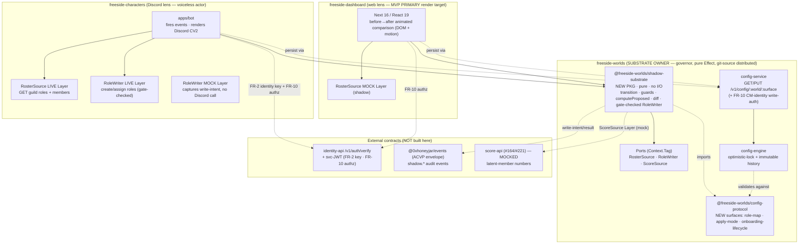
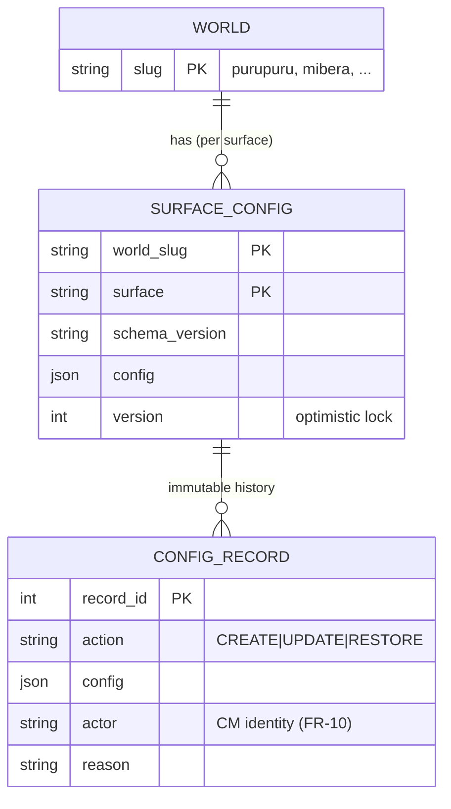
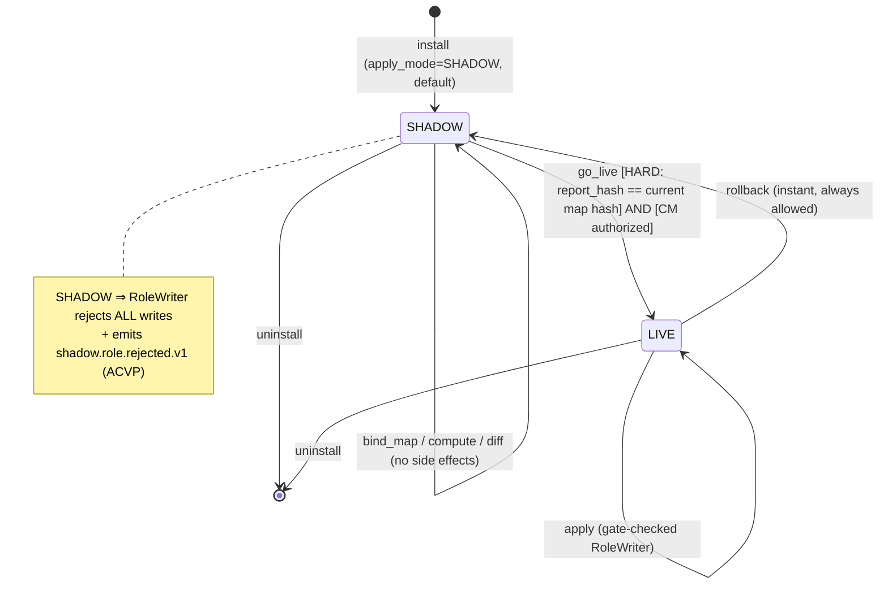

# Software Design Document — Shadow-Mode Onboarding Substrate + Before/After Comparison

**Version:** 1.2 (sprint-flatline-refined)
**Date:** 2026-06-01
**Author:** Architecture Designer Agent (ARCH: the-arcade + protocol, craft lens)
**Status:** Draft (3-model SDD flatline + 3-model sprint flatline integrated — see §13)
**Cycle:** `shadow-onboarding-substrate` (domain: `shared`)
**PRD Reference:** `grimoires/loa/cycles/shadow-onboarding-substrate/prd.md`
**ARCH brief:** `grimoires/loa/context/2026-06-01-shadow-onboarding-substrate-brief.md`

> **Scope guard.** This SDD designs across THREE repos — `freeside-worlds` (substrate owner), `freeside-characters` (Discord I/O actor), `freeside-dashboard` (web lens). `score-api` is **NOT ours** (Zerker's); latent-member data is **mocked** for the MVP and the real-data gaps are tracked as GitHub issues (#164, #221), never built here. This document does NOT touch the top-level `grimoires/loa/{prd,sdd}.md` (those are `/ride` platform-as-built snapshots).

---

## Table of Contents

1. [Project Architecture](#1-project-architecture)
2. [Software Stack](#2-software-stack)
3. [Data & Contract Design (the config seam + state record)](#3-data--contract-design)
4. [The Pure Substrate (Effect core + ports)](#4-the-pure-substrate)
5. [UI / Lens Design (the before/after comparison)](#5-ui--lens-design)
6. [API & Event Specifications](#6-api--event-specifications)
7. [Error Handling Strategy](#7-error-handling-strategy)
8. [Testing Strategy (incl. the provable-shadow proof)](#8-testing-strategy)
9. [Development Phases](#9-development-phases)
10. [Known Risks and Mitigation](#10-known-risks-and-mitigation)
11. [Open Questions](#11-open-questions)
12. [Appendix](#12-appendix)
13. [Flatline Disposition (SDD, 3-model, 2026-06-01)](#13-flatline-disposition-sdd-3-model-2026-06-01)

---

## 1. Project Architecture

### 1.1 System Overview

This cycle builds a **universal preview/diff primitive** ("shadow") as an **Effect-typed substrate** owned and *distributed* by `freeside-worlds`. The substrate splits crisply into a **pure core** (data-in/data-out functions: `computeProposed`, `diff`, `roleMapVersionHash`, `transition`) and **effectful ports/programs** (`loadCurrentRoster`, `loadLatentCounts`, `resolveAuthz`, the audit-emitting `GateCheckedRoleWriter`) — I/O lives only in injected Layers, never in the pure core (CLUSTER 7/IMP-005; §4.2 draws the exact line). It computes a proposed effect, loads (or mocks) the current reality, projects a **before → after diff**, and applies the effect **only** behind two gates — a per-world `apply_mode` state gate AND a CM-identity *actor* gate (PRD FR-3, FR-10).

The substrate is **medium-agnostic**: entry surfaces (the dashboard web page, a Discord invite handled by `freeside-characters`) are **voiceless lenses** that fire transition events and render the diff. They contain **no onboarding logic** (PRD G-4). Cohesion across media is a *consequence* of one substrate + pure projection, not a guideline (PRD NFR-4).

> From `prd.md` (§1): "Shadow is a **universal preview/diff primitive**… compute proposed, render **current → proposed** as an animated before/after, and apply only behind an explicit, **substrate-enforced** gate."

The MVP instance is **role assignment + creation + scaffolding** for the **Purupuru** test world. The substrate is feature-generic: `verify-message` preview is the already-shipped instance #1, roles are instance #2 (this cycle), announcements are instance #3 (next cycle, no substrate change) (PRD G-5).

### 1.2 Architectural Pattern

**Pattern:** **Distributed pure-functional core ("governor") + thin I/O actors ("speakers")**, atop the existing **config-seam** persistence and **NATS+ACVP** event substrate.

This is the brains-in-vats / cyberdeck split the cluster already runs:
- **Governor (Construct plane):** `freeside-worlds` owns the pure Effect substrate — state machine, guards, `computeProposed`, `diff`, the gate-checked `RoleWriter`. No I/O. Distributed as a **git-source, SHA-pinned** package (PRD NFR-1; matches the sovereign-distribution doctrine — these are `private:true` workspace packages consumed via bun git-tarball install, **not** npm).
- **Speaker / lens (Execution plane):** `freeside-characters` (Discord) and `freeside-dashboard` (web) import the substrate, **supply the I/O Layers** (`RosterSource`, `RoleWriter`), fire transition events, and render diffs through their medium.
- **Contract plane:** the config-seam surfaces (`/v1/config/:world/:surface`), the ACVP event envelope, and the Effect-typed port interfaces. A lens talks to a *schema*, never to another building directly.

**Justification.** PRD G-4/NFR-1 mandate worlds-api ownership + distribution with the bot as a voiceless executor; PRD FR-3/NFR-3 mandate the side-effect gate be **enforced in the substrate, not the consumer** — which is only provable if the gate lives in pure code that ships *with* the substrate. A monolith in the bot would re-trap the logic the PRD explicitly wants extracted; a separate microservice call for every diff would add a network hop to a pure computation and defeat the "one substrate ⇒ cohesion" invariant. The governor/speaker split is the only pattern that makes "SHADOW ⇒ zero side-effects" a *compile-and-test-provable* property rather than a runtime hope.

### 1.3 Component Diagram



### 1.4 System Components

#### C1 · `@freeside-worlds/shadow-substrate` (NEW package — the keystone)
- **Purpose:** the pure, distributed shadow core. The "empty centerpiece" (PRD R-1) made real.
- **Responsibilities:** typed lifecycle state machine (`transition`); guards (`go_live` HARD hash-match guard, `rollback` always-allowed); PURE `computeProposed(roleMapConfig, roster)` + `diff(current, proposed, latentCounts) → Discrepancy`; EFFECTFUL `loadCurrentRoster` / `loadLatentCounts` / `resolveAuthz` (the I/O seam, §4.2); the **gate-checked `RoleWriter`** wrapper (apply_mode read at invocation, `WriteCapability`-bound, audit-before-write) that rejects writes when `apply_mode == SHADOW` and emits an ACVP write-intent/result event.
- **Interfaces (exported symbols — the FR-8 stub symbol table, §4.6):** PURE — `transition`, `computeProposed`, `diff`, `roleMapVersionHash`; EFFECTFUL — `loadCurrentRoster`, `loadLatentCounts`, `resolveAuthz`, `GateCheckedRoleWriter`; ports — `RosterSource` / `RoleWriter` / `ScoreSource` (Tags); the `WriteCapability` branded type + `WriteIntentBatch`/`GoLiveJobState`/`AuthzContext`, the error ADT, and the state/event schemas.
- **Dependencies:** `@freeside-worlds/config-protocol` (the surface schemas), `@0xhoneyjar/events` (envelope construction), `effect` + `@effect/schema`. **No** HTTP/DB/discord.js dependency — that is the invariant that makes shadow provable.
- **Import-direction / circular-dep guard (sprint-flatline D1):** `BoundedString` is **owned by `config-protocol`** (`surface-config.ts`); `shadow-substrate` imports it one-way (`shadow-substrate → config-protocol`). The S0 substrate authors the config-surface *payload* schemas in-package, but the S2 wiring adds those surfaces to `config-protocol` by **re-exporting the substrate's payload schemas into `config-protocol`** — `config-protocol` must NOT import back from `shadow-substrate` for `BoundedString` (it already owns it), or a day-one circular dependency forms. The dependency arrow is single-direction `shadow-substrate → config-protocol`; verify in Phase 1/2 (Task 403.1) that no reverse import exists.
- **Distribution:** git-source SHA-pinned; `private: true` workspace package, consumed by lenses via bun git-tarball install pinned in the consumer lockfile (PRD NFR-1).

#### C2 · `config-protocol` surface extensions (worlds-api, existing package)
- **Purpose:** add the new config surfaces the substrate reads/persists, following the sealed `verify-message` precedent.
- **Responsibilities:** define `role-map`, `apply-mode`, `onboarding-lifecycle` surfaces in `surface-config.ts` (`@effect/schema`); extend `SurfaceSchema`, `SurfaceConfigMap`, `KNOWN_SURFACES`; preserve the BLOCKER-1 `BoundedString` write-side hardening.
- **Interfaces:** the Effect-schema surface payload types (§3.2).
- **Dependencies:** none new (already on `@effect/schema ^0.75`, `effect ^3.10`).

#### C3 · `config-service` write-auth (worlds-api, FR-10 floor)
- **Purpose:** close the R-3 hole — `resolveWriter` currently accepts **any non-empty Bearer** (`packages/config-service/src/auth.ts`).
- **Responsibilities:** replace the stub with **CM-identity-scoped** authorization: verify the identity-api session/svc token, assert the actor is in the world's **admin allowlist** (a managed set on the world manifest/config), reject otherwise (403). NOT "any bearer."
- **Interfaces:** `resolveWriter(req, worldSlug) → Writer | null` (signature preserved; body replaced).
- **Dependencies:** identity-api token verification (`@freeside-auth/adapters` jwks-validator pattern), the per-world admin allowlist.

#### C4 · `RosterSource` / `RoleWriter` Layers (freeside-characters)
- **Purpose:** the I/O actors the substrate's ports resolve to. The **mock ↔ live switch is the Layer choice** (PRD FR-8).
- **Responsibilities:** LIVE `RosterSource` reads Discord guild roles + members (the bot's `GET /guild-roles`-equivalent); LIVE `RoleWriter` creates/assigns Discord roles; MOCK Layers capture write-intent and return fixtures with **zero Discord calls**.
- **Interfaces:** `Layer<RosterSource>`, `Layer<RoleWriter>` — `Layer.succeed` (mock) / `Layer.effect` (live), matching the existing persona-engine `ambient/{ports,mock,live}` idiom.
- **Dependencies:** discord.js (the bot's existing client), the substrate's port Tags.

#### C5 · Before/after comparison lens (freeside-dashboard — **MVP PRIMARY**)
- **Purpose:** render `diff` as an **animated** current→proposed comparison + latent-member counts (PRD FR-5/FR-6).
- **Responsibilities:** consume the substrate's `Discrepancy` read-model, render web DOM with motion, fire `bind_map` / `go_live` / `rollback` events back through the substrate, persist via the config seam.
- **Interfaces:** React components; server actions calling config-service.
- **Dependencies:** the substrate package, a motion library (net-new dep — `motion` / framer-motion), the existing worlds-api config-client.

#### C6 · Discord CV2 render (freeside-characters — second target, same substrate)
- **Purpose:** the medium-agnostic proof — the same `Discrepancy` rendered as a Discord Components-V2 message. Built to the contract; full polish is post-MVP per FR-5 ("MVP picks ONE primary render target for acceptance").

### 1.5 Data Flow

**Shadow preview (default, no side effects):**
```
lens fires bind_map(role-map cfg) ─▶ substrate.computeProposed(cfg, roster)
roster = RosterSource.consume()  [LIVE Discord roster | MOCK fixture]
score  = ScoreSource.read()      [MOCK latent-member numbers (score-api not ours)]
        ─▶ diff(current, proposed) ─▶ Discrepancy (read-model, hashed)
        ─▶ lens renders before→after (motion) + latent counts
        ── NO RoleWriter invoked; apply_mode == SHADOW ──
```

**Go-live (the only path that writes) — modeled as an ASYNC JOB (IMP-004/IMP-009, SKP-002/SKP-004):**

Applying a role create+assign batch to a real Discord guild is rate-limited (~5 assigns/s/guild, 429+backoff) and partial-failure-prone, so `go_live` is **not** a near-instant transition — it is an async job whose progress is polled on the per-CM `onboarding-lifecycle` record.
```
lens fires go_live(report_hash) with CM session token + authz context (§6.2)
  ├─ GATE 1 (state): apply_mode SHADOW→LIVE allowed?
  │     guard: report_hash == roleMapVersionHash(current map)  → else GuardFailed (stale report)
  │     (2-week soak = SOFT advisory, surfaced, never GuardFailed)
  ├─ GATE 2 (actor): CM authorized for world? (resolveAuthz SERVICE PREFLIGHT, FR-10 — §4.4/HC5)
  │     authz context {actor, world, report_hash, token metadata, transition version} bound to THIS batch
  ├─ both pass ─▶ apply_mode := LIVE ─▶ emit shadow.role.intent.v1 (ACVP, CONFIRMED before any write — §6.3/CLUSTER-4)
  └─ enqueue ASYNC JOB (job_id):  GateCheckedRoleWriter.applyBatch(WriteIntentBatch, authzCtx)
        for each op (stable op_id + idempotency_key):
          createRole = check-then-create (GET roles; create only if absent)  ─▶ append to roles_created ledger
          assignRole = idempotent assign                                      ─▶ per-op status
          on 429 → backoff w/ jitter, bounded retries, max_concurrent cap
          emit shadow.role.applied.v1 (per successful op)  |  partial-failure → per-op status recorded
        update onboarding-lifecycle.go_live_job.progress  (lens polls for completion)
```
The lens fires `go_live`, receives a `job_id`, and **polls** `onboarding-lifecycle.go_live_job` for `{status, progress, roles_created[]}` until terminal (`done | partial_failure | failed`). See §4.4 for the batch model, idempotency, and reconciliation.

**Rollback (instant, always allowed) — non-destructive for ASSIGNED roles, GC for UNASSIGNED (sprint-flatline B2):**
```
lens fires rollback ─▶ apply_mode LIVE→SHADOW (no guard)
  ─▶ halt further assignments
  ─▶ created roles WITH ≥1 assignment  → KEEP (non-destructive, FR-9/R-6 — never strip users); warn
  ─▶ created-but-UNASSIGNED Freeside-namespaced roles → GARBAGE-COLLECT (delete) so repeated
        go_live/rollback cycles cannot accumulate orphan empty roles toward Discord's 250 ceiling (B2/SKP-001)
  ─▶ Collab.Land role set untouched (namespaced coexistence, FR-9)
```

### 1.6 External Integrations

| Service | Purpose | API Type | Status / Reference |
|---------|---------|----------|--------------------|
| identity-api `/v1/auth/verify` | FR-2 cross-medium identity key (`user_id` UUID) + FR-10 CM authz token | REST (Bearer) | LIVE — `freeside-auth packages/protocol/src/api/auth.ts` (`VerifyResp = {user_id, primary_wallet, session:{token, expires_at}}`) |
| identity-api svc-JWT | FR-10 service-to-service authz substrate (ES256, `svc-` kid, per-cell `operator_grants`) | JWT/JWKS | LIVE — `svc-jwt-claims.ts` |
| `@0xhoneyjar/events` (in-repo `packages/events`) | ACVP envelope for shadow audit events | lib (NATS publish) | LIVE — `acvp-l1-v2` envelope, 3-segment topics, schema registry |
| config-service `/v1/config/:world/:surface` | persist role-map / apply-mode / lifecycle | REST | LIVE for `verify-message`; **HARD dep for apply/persist** (PRD NFR-6); shadow-preview may run on mock |
| score-api | latent-member numbers (qualified-but-not-joined wallets) | REST | **NOT OURS — MOCKED** (PRD R-2; gaps → #164, #221) |
| Discord API (via discord.js) | LIVE RosterSource (read roles/members) + LIVE RoleWriter (create/assign) | SDK | the bot's existing client |

### 1.7 Deployment Architecture

- **Substrate package:** no runtime deployment — it is a *library*, distributed via git-source and consumed by the lenses' build. Versioned by git SHA in each consumer's lockfile.
- **config-service:** existing Railway service (`freeside-worlds`); FR-10 write-auth ships as a code change to the running service. `CONFIG_SERVICE_URL` cutover (the verify-message #59 move) is the hard dep for *apply* — shadow-preview runs on mock until then. **Deployed-config-service smoke test (sprint-flatline D4):** before the cutover, a smoke test hits the *deployed* config-service (new surfaces GET/PUT + FR-10 token-format + routing) to catch routing/schema/token-format issues against the live environment, not just the in-memory `ConfigStore` integration tests — so a deploy-time mismatch surfaces before apply, not during it.
- **freeside-characters / freeside-dashboard:** existing Railway/Vercel deployments; consume the new substrate SHA, supply Layers.
- **Private git-tarball build credential (REFINEMENT A, HC6/IMP-006) — Phase-3 deploy note:** `@freeside-worlds/shadow-substrate` is a **private** git-source, SHA-pinned dependency. Railway authenticates its builds, but **Vercel does not fetch private git repos without credentials** — so the **dashboard's Vercel build will fail to resolve the private tarball unless a `GITHUB_TOKEN` (or deploy-key) is configured** for the build (a repo-scoped token with read access to `freeside-worlds`, set as a Vercel build env var / `.npmrc`/bun git auth). This matches the cluster's authed-private-distribution decision already taken for score-api. The dashboard (freeside-dashboard) MUST have this credential provisioned before Phase 3 deploy; characters (Railway) inherits Railway's authed-build path. Mitigation cost is low (one build secret) but it is a hard build blocker if omitted.
- **Purupuru world:** **precondition work** — a `purupuru.yaml` world manifest must be created in `packages/registry/worlds/` (none exists today; only apdao/mibera/midi/rektdrop). Discord guild id + NFT contract addresses + member/holder set are documented preconditions (PRD §7, FL-disputed2), not assumed.

#### 1.7.1 Cross-repo substrate version contract (sprint-flatline B7)

The substrate is the security boundary, and it is consumed git-source/SHA-pinned by THREE repos. If `freeside-dashboard` and `freeside-characters` pin **different** SHAs, the web lens, the `AuthzContext`, and the live writer could disagree on schemas, the `roleMapVersionHash` algorithm, or the `WriteCapability` shape — a silent, dangerous skew on the boundary that enforces "SHADOW ⇒ zero writes." The MVP therefore ships a **single-SHA version contract**:

| Element | Decision |
|---------|----------|
| **Canonical SHA** | One pinned `@freeside-worlds/shadow-substrate` git SHA recorded in the **cycle artifact** (`grimoires/loa/cycles/shadow-onboarding-substrate/substrate-sha.lock`) — the single source of truth all consumers pin to. |
| **CI compatibility check** | Each consumer repo (`freeside-worlds`, `freeside-characters`, `freeside-dashboard`) runs a CI job asserting its lockfile-pinned substrate SHA **equals** the cycle's canonical SHA (fail the build on mismatch). |
| **Schema/hash compatibility tests** | A shared conformance fixture (the `roleMapVersionHash` of a canonical input + a frozen `Discrepancy`/`AuthzContext`/`WriteCapability` shape) is asserted identical across all three consumers, so a SHA bump that changes the hash algorithm or a schema shape fails loud before deploy. |
| **Rollback procedure** | A substrate-SHA bump is rolled out by: (1) update `substrate-sha.lock`; (2) bump all three consumers in lockstep + re-run the conformance fixture; (3) deploy. **Rollback** = revert `substrate-sha.lock` to the prior SHA, revert the three consumer lockfile pins, redeploy — never leave consumers on mixed SHAs. |

### 1.8 Scalability Strategy

Out of scope for MVP (Purupuru is a single test world). The architecture scales by construction: the substrate is stateless/pure (horizontal scaling is free); per-world state is keyed in the config seam (already optimistic-locked); adding worlds is additive config, adding features (announcements) is a new surface + the same substrate. No scaling work is in this cycle.

### 1.9 Security Architecture

- **Two-gate side-effect authorization (NFR-3, the core invariant):** a Discord role write is authorized **IFF** `apply_mode == LIVE` **AND** the CM is authorized for the world. Gate 1 (state) lives in the pure substrate; Gate 2 (actor, FR-10) lives in config-service write-auth. Both must pass.
- **FR-10 authz floor (NEW per flatline — the one scope change):** writes to a real Discord server require an *actor* guard, not just the state gate. config-service replaces "any bearer" with CM-identity-scoped authorization (admin allowlist + identity-scoped write token). Mandatory for MVP because go-live writes to a real server.
  - **Allowlist storage + lifecycle (CLUSTER 6, IMP-003/SKP-003/SKP-007 — resolved, was OQ):** the admin allowlist is a **world-manifest field** `admin_principals: [identity_id, ...]` committed alongside `purupuru.yaml` (deploy-bound, like `guild_ids`). Read at `resolveWriter`/`resolveAuthz` time from the manifest. **Bootstrap authority:** the operator who creates/commits the world manifest (the same authority that provisions the world). **Revocation:** remove the principal from `admin_principals` and redeploy the manifest; a short cache TTL (**≤10s**, sprint-flatline B6 DESIGN CALL — reduced from 60s) bounds revocation latency for BOTH read and write (B4); the `go_live` confirm re-checks authz freshly bypassing the cache (B6). **Audit:** every authz decision (grant/deny) emits an ACVP audit event (`shadow.authz.decided.v1`) carrying an `authz_decision_id`, which is bound into the `WriteCapability` + `AuthzContext` (B3). **Single authoritative flow:** one `resolveAuthz` decision function backs both `resolveWriter` and `resolveReader` (§6.2). **Circularity guard:** config-service MUST NOT authorize writes to the allowlist itself — the allowlist lives in the manifest, not in a config surface, so the write-auth path can never grant itself authority.
  - **Write-batch authz binding (CLUSTER 6, B14/SKP-002 confused-deputy):** every LIVE write batch carries an `AuthzContext { actor, world, report_hash, token-verification metadata, transition_version }`. `GateCheckedRoleWriter` validates the batch is bound to a **valid, current** authz decision AND a matching `report_hash` before any write — a consumer cannot set `apply_mode := LIVE` via one authorized config write and then fire unrelated/unbound Discord writes later. The batch's authz + `report_hash` MUST match the authorized `go_live` transition (§4.4.3/§4.4.4).
- **Where the security boundary actually lives (sprint-flatline B9 — DESIGN CALL):** the enforced side-effect boundary is the substrate-side `GateCheckedRoleWriter` (invocation-time `apply_mode` read + server-enforced `AuthzContext`/`admin_principals` check + write-after-audit) — NOT the `WriteCapability` branded type. The capability is a **compile-time** accident-prevention constraint (it stops an honest dev from forgetting the gate); it is not an unforgeable runtime secret. See §4.4.4 for the full reframe. This matters for implementors: under-protecting the gate while over-trusting the token would produce a false sense of structural safety.
- **ACVP audit (provable):** every write-intent and write-result (incl. **shadow-mode rejections**) is emitted as a signed, hash-chained ACVP envelope event. The "SHADOW ⇒ zero writes" property is provable from the audit trail AND from the test suite (§8.4).
- **Write-side input hardening:** the config surfaces inherit the existing `BoundedString` defense (length-capped, control-byte/zero-width-rejecting) — render-side per-medium escaping stays the lens's job (the existing RENDER-CONTRACT split).
- **Collab.Land coexistence (FR-9):** Freeside manages only a **namespaced role set** (Freeside-prefixed role ids) OR requires explicit per-role handoff before LIVE — never silently contends for a role another bot owns.

---

## 2. Software Stack

### 2.1 Substrate (freeside-worlds — the new package)

| Category | Technology | Version | Justification |
|----------|------------|---------|---------------|
| Language | TypeScript | 5.x (repo baseline) | Cluster standard; the substrate is type-load-bearing |
| Effect system | `effect` | ^3.10.0 | Matches worlds-api `config-protocol`; provides `Layer`/`Context.Tag` (the port/mock/live mechanism), typed errors, `Effect.gen` |
| Schema | `@effect/schema` | ^0.75 | Matches the config-protocol surface schemas + the cluster zod→Effect direction; typed states/transitions, fail-loud decode |
| Runtime | Bun | repo baseline | worlds-api is Bun-native (zero-runtime-dep posture) |
| Events | `@0xhoneyjar/events` | in-repo (`packages/events`) | ACVP envelope `acvp-l1-v2`; the audit substrate |
| Distribution | git-source (bun git-tarball, SHA-pinned) | — | PRD NFR-1; sovereign distribution, NOT npm |

**Key principle (NFR-2):** every state, transition, and error is Effect-typed; illegal transitions fail loud as typed `GuardFailed`; pure functions have **no I/O** — all I/O is injected as `Layer`s.

### 2.2 Discord lens (freeside-characters)

| Category | Technology | Version | Justification |
|----------|------------|---------|---------------|
| Effect Layers | `effect` | repo baseline | The `ambient/{ports,mock,live}` idiom already in `persona-engine` is the model for RosterSource/RoleWriter |
| Discord | discord.js | repo baseline | Existing bot client; LIVE Layers wrap it |
| Render | Discord Components-V2 (CV2) | — | Second render target (FR-5); same `Discrepancy` contract as web |

### 2.3 Web lens (freeside-dashboard — MVP PRIMARY)

| Category | Technology | Version | Justification |
|----------|------------|---------|---------------|
| Framework | Next.js | 16.1.4 | Existing dashboard |
| UI | React | 19.2.3 | Existing dashboard |
| Effect | `effect` | ^3.10.0 | Already present — consumes the substrate directly |
| Motion | `motion` (Framer Motion) | **pinned tested major: `^12`** (NOT `latest`) | **NET-NEW dep** — FR-5 requires *animated* before→after; not currently in dashboard. The one new dependency the comparison component needs. **REFINEMENT C (disputed-1/IMP-011):** pin a tested major version (verified against Next 16 / React 19) rather than `latest stable` to prevent silent UI-dep drift. Minor concern, but cheap hygiene on a React-19 surface. |
| Config client | existing worlds-api config-client | — | Already wired (`tests/unit/freeside-worlds/config-client.test.ts`) |

**Render-target decision (resolves PRD §8 OQ-1):** **web DOM (dashboard) is the MVP primary render target for acceptance.** Rationale: the dashboard already runs `effect ^3.10` (consumes the substrate with zero adapter), the only new dependency is a motion library, and FR-5's "animated" requirement is most cheaply met in the DOM. Discord CV2 is the *second* target, built to the same `Discrepancy` contract to prove medium-agnosticism, but acceptance binds to web (FR-5/§6, FL-HC7).

---

## 3. Data & Contract Design

> The substrate is **pure** — it owns no database. All persistence flows through the **existing worlds-api config seam** (`config-engine` optimistic-locked, immutable-history store). This section defines the *contract shapes* (config surfaces + the resumable state record), not new tables. The config seam already maps `(world_slug, surface) → validated JSON` with a head-pointer + append-only `config_record` history (`config-engine/src/store.ts`).

### 3.1 Persistence model (reuse, not net-new)

The config seam's `ConfigStore` port is the persistence machinery (PRD NFR-6 "versioned, optimistic-locked records"):
- **head-pointer** row per `(world_slug, surface)` with a monotonic `version`;
- **immutable `config_record` history** (every write appended; `CREATE | UPDATE | RESTORE`);
- **version-guarded UPDATE** (`WHERE version = expected`) → 0-rows = `ConfigVersionConflictError` (409).

No schema migration is invented for `role-map` / `apply-mode`; the new surfaces are new *rows*, not new tables.

> **Flatline correction (B1 / SKP-006) — the lifecycle surface is keyed PER-CM, not per-world.** The default config-seam key `(world_slug, surface)` is correct for `role-map` and `apply-mode` (one role map, one safety state, per world). It is **wrong** for `onboarding-lifecycle`: the resumable setup-progress record is **per-(CM, world)**. If two CMs onboard the same world under one `(world_slug, "onboarding-lifecycle")` row they would overwrite each other's progress and leak one CM's lifecycle state to another. **Fix:** the `onboarding-lifecycle` surface key is extended to the composite `(world_slug, surface, cm_identity_id)` — a per-CM record under the surface, NOT a single shared row. The `role-map` and `apply-mode` surfaces keep the per-`(world, surface)` key as-is. See §3.2/§3.4/§6.1 for the key plumbing.

### 3.2 New config surfaces (extend `config-protocol/surface-config.ts`)

Three surfaces are added by extending `SurfaceSchema`, `SurfaceConfigMap`, and `KNOWN_SURFACES` (the exact additive pattern the sealed `verify-message` surface established).



**Surface `role-map`** — the role rules + scaffolding config (the proposed effect's source):
```typescript
// @effect/schema; reuses BoundedString from surface-config.ts (BLOCKER-1)
export const RoleRule = S.Struct({
  role_key: NonEmptyBounded(NAME_MAX),       // stable join key; Freeside-namespaced (FR-9 coexistence)
  display_name: NonEmptyBounded(NAME_MAX),
  // qualification predicate (MVP: tier threshold; opaque to substrate, evaluated by ScoreSource read-model)
  qualifies: S.Struct({
    source: S.Literal("tier"),               // MVP single source; extensible
    min_tier: NonEmptyBounded(NAME_MAX),     // opaque tier id (score-api owns the values — #221)
  }),
  create_if_absent: S.Boolean,               // role CREATION (FR-4)
});
export const RoleMapConfig = S.Struct({
  enabled: S.Boolean,
  namespace_prefix: NonEmptyBounded(NAME_MAX),  // FR-9: the Freeside-managed role set boundary
  rules: S.Array(RoleRule),
  scaffolding: S.optional(/* structure to scaffold; bounded */),
});
```

**Surface `apply-mode`** — the single safety-bearing state field (FR-3):
```typescript
export const ApplyModeConfig = S.Struct({
  apply_mode: S.Literal("SHADOW", "LIVE"),   // DEFAULT SHADOW (caller default on 404)
  // FR-7: the report hash the last go_live was authorized against (audit/forensic)
  last_go_live_report_hash: S.optional(Hex64),
});
```

**Surface `onboarding-lifecycle`** — the resumable cross-medium state record (FR-2), **stored as a per-CM composite-keyed record** `(world_slug, "onboarding-lifecycle", cm_identity_id)` (B1/SKP-006). `cm_identity_id` is BOTH a key component AND carried in the payload (it identifies the record):
```typescript
export const OnboardingLifecycle = S.Struct({
  // FR-2: the storage KEY is the composite (world_slug, surface, cm_identity_id) — NOT the
  // default (world_slug, surface). Two CMs onboarding the same world get TWO records, never
  // one shared/overwritten row (B1/SKP-006). cm_identity_id = identity-api user_id (UUID),
  // the stable cross-medium key.
  cm_identity_id: S.UUID,
  // the resumable position — the LENS's view of setup progress, persisted so
  // website<->Discord resume at the same point. NOT the apply_mode state machine.
  step: S.Literal("install", "servers", "role_map", "shadow_preview", "go_live", "done"),
  // FR-2 failure/recovery states (FL-HC6): never silently fork
  link_state: S.Literal("linked", "unlinked", "degraded"),
  last_medium: S.Literal("web", "discord"),
  // CLUSTER-2 (SKP-004/SKP-006): the idempotent roles-created ledger + async go-live job
  // progress live on THIS per-CM record (see §4.4). Optional until a go_live runs.
  go_live_job: S.optional(GoLiveJobState),  // { job_id, status, progress, roles_created[] } — §4.4
});
```

### 3.3 The role-map version hash (FR-7 — the go_live HARD guard)

> **Flatline correction (IMP-001/IMP-002, blockers SKP-001×3, SKP-003).** The earlier draft folded volatile roster metadata (`member_count`, `role_count`, `snapshot_at`) into the version hash. That is self-contradictory: a `snapshot_at` timestamp changes on every roster re-fetch, and `member_count`/`role_count` change on every join/leave — so the hash would **flap** between `bind_map` and `go_live`, making the `go_live` report-hash guard impossible to pass in any active server (a non-deterministic "stale_report" trap). The hash now covers **ONLY the deterministic rules**. The roster is a report *input*, never a version-hash field.

`roleMapVersionHash` is a **content hash (sha256, JCS-canonical)** over EXACTLY three deterministic rule fields — reusing the events package's `jcsCanonicalize` + `sha256Hex` so the hash is byte-deterministic across producers/consumers:

```
roleMapVersionHash = sha256( JCS({
  role_rules:        RoleMapConfig.rules,            // RoleRule[] — role_key, display_name, qualifies{source,min_tier}, create_if_absent
  scaffolding_config: RoleMapConfig.scaffolding,     // the bounded scaffolding structure (RoleMapConfig.scaffolding)
  world_config:      WorldConfigHashFields,          // EXACTLY: { world_slug, guild_id, namespace_prefix, nft_contracts[] } from the world manifest — NO timestamps, NO roster, NO member/role counts
}))
```

**Exact hashed fields (no prose placeholder):**

| Field | Source | Why deterministic |
|-------|--------|-------------------|
| `role_rules` | `RoleMapConfig.rules` (each `RoleRule`: `role_key`, `display_name`, `qualifies.source`, `qualifies.min_tier`, `create_if_absent`) | Operator-authored rules; changes only on a deliberate edit |
| `scaffolding_config` | `RoleMapConfig.scaffolding` | Operator-authored structure |
| `world_config` | `{ world_slug, guild_id, namespace_prefix, nft_contracts[] }` from the world manifest | Deploy-bound; changes only on a manifest edit |

The roster (member ids, role ids, counts, fetch time) is **NOT in the hash**. It is a *report input* consumed by `computeProposed`/`diff` and rendered in the `Discrepancy`, but it does not version the map.

A `Discrepancy` report carries `role_map_hash = roleMapVersionHash(map it was computed against)`. `go_live` HARD guard: `report.role_map_hash == roleMapVersionHash(current_map)` — a stale report against a *changed map* → `GuardFailed("stale_report")`. **What invalidates a report:** a change to the role rules, the scaffolding config, or the relevant world-config fields — i.e., a change to the **rules**, not to the membership. **The 2-week soak is a SOFT advisory** (a surfaced recommendation), **never** a `GuardFailed` (FR-7, FL-B9).

**Roster fingerprint (NOT a version-hash field — now load-bearing for the B1 go_live re-eval).** A separate, **non-timestamped, coarse** identifier `rosterFingerprint = sha256(JCS(sorted(member_ids ⊕ role_ids)))` is computed at report-generation time and carried in `AuthzContext.roster_version` (§6.2). At `go_live`, the substrate recomputes it against the freshly-loaded roster: an unchanged fingerprint means no drift; a changed fingerprint triggers the **roster-freshness re-evaluation** which `GuardFailed("roster_drift")`s when newly-qualifying members exceed `ROSTER_DRIFT_THRESHOLD` (default `0`, §6.2/§4.1, sprint-flatline B1). This fingerprint is **never** part of `roleMapVersionHash` (it would flap the rules-hash guard) and only ever surfaces as the dedicated roster-drift guard — the rules-hash guard and the roster-freshness guard are two independent checks at `go_live`.

### 3.4 Identity key (FR-2) & failure states (FL-HC6)

The resumable `onboarding-lifecycle` state is stored under the **composite key `(world_slug, "onboarding-lifecycle", cm_identity_id)`** (B1/SKP-006): `cm_identity_id` = identity-api `user_id` (UUID from `/v1/auth/verify`), `world_slug` = the world. This is a per-CM record — distinct CMs onboarding the same world never collide. (The `role-map` and `apply-mode` surfaces remain per-`(world, surface)`.)

| Condition | State | Behavior |
|-----------|-------|----------|
| identity resolved | `link_state: linked` | normal resume across web↔Discord |
| identity-link failure | `link_state: unlinked` | onboarding **blocks** with a clear "link your identity" state; **never silently forks** a second state |
| identity-api / config outage | `link_state: degraded` | machine reports a **recoverable `degraded`** state; resumes on recovery; **no partial/ambiguous state persisted** |

---

## 4. The Pure Substrate

> This is the heart of the cycle — the keystone the PRD says to "build first" (R-1). All of §4 is **pure Effect, no I/O** (NFR-2).

### 4.1 State machine & transitions

`apply_mode` is the only safety-bearing *state* (per world). The 6 onboarding steps are the lens's view of progress (§3.2 `onboarding-lifecycle`), not the safety state machine — keeping the safety machine tiny.



`transition(state, event, guardInputs) → Effect<State, GuardFailed>` — pure; illegal transitions fail loud. `guardInputs` carries **already-resolved** values — `{ report_hash, current_map_hash, authz_decision }` — so the function does NO I/O (CLUSTER 7/HC5). Authz is resolved by the `resolveAuthz` service preflight (§4.2) and the result is passed in, never fetched here.

| event | effect | guard |
|---|---|---|
| `install` | record install · `apply_mode=SHADOW` | valid guild · CM authorized (FR-10) |
| `bind_map` | (no state change) validate + stage role-map config | valid role-map schema |
| `go_live` | `SHADOW → LIVE` | **HARD:** `report_hash == roleMapVersionHash(current)` where the hash covers ONLY {role_rules, scaffolding_config, world_config} — roster excluded so the guard does not flap (§3.3, IMP-001/SKP-001) · **roster-freshness re-eval** (B1): recompute the roster fingerprint and `GuardFailed("roster_drift")` if newly-qualifying members exceed `ROSTER_DRIFT_THRESHOLD` (§6.2) · CM authorized (FR-10) · explicit operator act |
| `rollback` | `LIVE → SHADOW` (instant) | **always allowed** · Collab.Land untouched |
| `uninstall` | teardown (non-destructive: keeps created roles, R-6) | — |

### 4.2 Pure functions vs effectful programs (CLUSTER 7, IMP-005/SKP-001 — crisp boundary)

> The flatline review (IMP-005/SKP-001) flagged that the original §4.2 blurred pure projection with effectful ports — `computeCurrent` "consumes" a roster via a Layer, and authz/audit appeared inside otherwise-pure paths. Purity must be crisp or the "SHADOW is compile-and-test-provable" claim weakens. The substrate therefore splits into **PURE functions** (data-in → data-out, NO Layers, NO `Effect` requirement channel) and **EFFECTFUL programs** (Effect programs that need Layers / do I/O). Authz resolution in particular is I/O and is a **service preflight, NOT part of the pure `transition`** (HC5/IMP-005).

**PURE (data-in / data-out — no I/O, no Layers, deterministic, trivially testable):**
- `computeProposed(roleMapConfig, roster) → ProposedRoster` — given the role-map AND an already-loaded roster value, computes who *should* hold which roles + which roles must be created. The roster is a **parameter**, not a port read.
- `diff(currentRoster, proposed, latentCounts) → Discrepancy` — pure projection (a read-model, not state): role-by-role added/removed/created + **latent qualified members** (counts passed in as data). Carries `role_map_hash` (§3.3).
- `roleMapVersionHash(rules) → Hex64` — pure sha256(JCS) over the deterministic rule fields (§3.3).
- `transition(applyMode, event, guardInputs) → Effect<ApplyMode, GuardFailed>` — pure decision over **already-resolved** guard inputs (the report hash, the current map hash, an authz-decision boolean produced by the preflight). It does NO identity-api I/O. §4.1.

**EFFECTFUL (separate Effect programs that REQUIRE Layers — the I/O seam):**
- `loadCurrentRoster(world) : Effect<CurrentRoster, RosterError, RosterSource>` — reads the live roster (or mock). Was `computeCurrent("consume"|"mock")`; renamed to make the I/O explicit. Its output feeds the pure `computeProposed`/`diff`.
- `loadLatentCounts(world, rules) : Effect<LatentCounts, ScoreError, ScoreSource>` — reads latent-member numbers (MOCKED). Output feeds pure `diff`.
- `resolveAuthz(actor, world) : Effect<AuthzDecision, AuthzError>` — **the FR-10 authz SERVICE PREFLIGHT (HC5/IMP-005)**. Runs BEFORE `transition`, resolving the admin-allowlist check via the world manifest (§6.2). Its boolean result is passed INTO the pure `transition` as a guard input — `transition` itself never touches identity-api.
- `emitWriteAudit(event, payload) : Effect<void, AuditError>` — the confirm-before-write ACVP emit (§4.4.2). Effectful by construction; lives in the `GateCheckedRoleWriter` wrapper, never inside a pure function.

The exported-symbol table (§4.6) marks each symbol PURE or EFFECTFUL so consumers cannot accidentally route I/O through a path assumed deterministic.

### 4.3 Ports (the I/O seam — `Context.Tag`)

Following the existing `persona-engine ambient/{ports,mock,live}` idiom exactly:

```typescript
// ports/roster-source.port.ts
export class RosterSource extends Context.Tag("shadow/RosterSource")<
  RosterSource,
  { readonly currentRoster: (world: WorldSlug) => Effect.Effect<CurrentRoster, RosterError> }
>() {}

// ports/role-writer.port.ts  — the GATE is internal (§4.4). LIVE adapter requires a WriteCapability (§4.4.4);
// every write carries the batch's op (op_id + idempotency_key, §4.4.1).
export class RoleWriter extends Context.Tag("shadow/RoleWriter")<
  RoleWriter,
  {
    readonly createRole: (cap: WriteCapability, i: CreateRoleIntent)  => Effect.Effect<RoleId, WriteError | ShadowGateRejected>;
    readonly assignRole: (cap: WriteCapability, i: AssignRoleIntent)  => Effect.Effect<void,   WriteError | ShadowGateRejected>;
  }
>() {}

// ports/score-source.port.ts  — latent-member numbers (MOCKED for MVP)
export class ScoreSource extends Context.Tag("shadow/ScoreSource")<
  ScoreSource,
  { readonly latentQualified: (world: WorldSlug, rule: RoleRule) => Effect.Effect<number, ScoreError> }
>() {}
```

### 4.4 The gate-checked RoleWriter (FR-3/FR-8 — enforced IN the substrate)

The gate is **not** in the consumer. `GateCheckedRoleWriter` is a substrate-provided wrapper that receives the inner (actor-supplied) writer plus the read-at-invocation `apply_mode`, an authorization context, and an ACVP emitter, and **rejects every write when `apply_mode == SHADOW`**, emitting an ACVP rejection event. The flatline review surfaced five distinct gaps in the original sketch; the model below resolves all of them.

#### 4.4.0 apply_mode read timing (CLUSTER 3, SKP-002/B3) — read AT INVOCATION, never captured

> The original sketch took `applyMode: ApplyMode` as a **constructor argument** captured at Layer-provision time. That is a correctness bug: a writer provisioned while the world is in SHADOW would stay SHADOW even after a successful `go_live` flipped `apply_mode` to LIVE — the CM would complete the go-live ceremony and see nothing happen, while misleading `shadow.role.rejected.v1` events kept firing (the "provable" property becomes a lie for the live path).

`GateCheckedRoleWriter` MUST resolve `apply_mode` **at invocation time**, not at Layer-provision time — either from a mutable `Ref<ApplyMode>` updated on transition, or by re-reading the `apply-mode` surface from the config seam at the start of each `applyBatch`. It MUST NOT close over a value captured when the Layer was built. (§4.5 documents the chosen mechanism: a `Ref` seeded from the config seam and updated by the `mode.transitioned` path.)

**Mode-race during an active batch (sprint-flatline B5 — the inverse race).** Reading the `Ref` at invocation closes the *Layer-build* capture bug (R-10), but it does NOT by itself close the TOCTOU window between the mode-read and the Discord write completing: a concurrent `rollback` (LIVE→SHADOW) that lands *after* the `Ref` is read but *before* the op's Discord call returns would let the write proceed under a mode that has already flipped to SHADOW — the audit trail would show `shadow.role.intent.v1` under LIVE while the write executed during a SHADOW window. **Fix: acquire a read-lock on the mode `Ref` for the duration of the write batch** — the `GateCheckedRoleWriter` holds a mode read-lock across `applyBatch` so a concurrent mode-transition (rollback) **cannot interleave** mid-batch; the transition either runs before the batch starts or after it terminates. (A `rollback` is therefore observed at a batch boundary, halting *further* batches/ops, never mid-op.) The §8.4 property suite adds the inverse-race counterexample: flip the `Ref` to SHADOW after a write is dispatched and assert the write is either not committed under the new mode or the mode-transition is serialized to wait out the in-flight batch.

#### 4.4.1 Write-intent BATCH model (CLUSTER 2, IMP-004/IMP-009, SKP-002/SKP-004)

LIVE writes go through a `WriteIntentBatch`, not one-op-at-a-time fire-and-forget:

```typescript
export interface WriteOp {
  readonly op_id: string;            // STABLE per logical operation (deterministic from {kind, role_key, member_id})
  readonly idempotency_key: string;  // = sha256(JCS({world, op_id, report_hash})) — safe to retry
  readonly kind: "create_role" | "assign_role";
  readonly intent: CreateRoleIntent | AssignRoleIntent;
}
export interface WriteIntentBatch {
  readonly world: WorldSlug;
  readonly report_hash: Hex64;       // binds the batch to the authorized go_live report (§6.2)
  readonly authz: AuthzContext;      // {actor, world, report_hash, token metadata, transition_version} (CLUSTER 6)
  readonly ops: ReadonlyArray<WriteOp>;
  readonly max_concurrent: number;   // default 4; caps in-flight Discord calls
}
// Persisted on the per-CM onboarding-lifecycle record (§3.2):
export interface GoLiveJobState {
  readonly job_id: string;
  readonly status: "queued" | "running" | "done" | "partial_failure" | "failed";
  readonly progress: { readonly total: number; readonly completed: number; readonly failed: number };
  readonly roles_created: ReadonlyArray<{ role_key: string; role_id: RoleId; op_id: string }>; // idempotent ledger
  readonly op_status: ReadonlyArray<{ op_id: string; status: "pending"|"ok"|"failed"; error?: string }>;
}
```

Rules:
- **Idempotent create (check-then-create), serialized per world (sprint-flatline B10 — TOCTOU fix):** `createRole` first `GET`s the guild roles and creates **only if a role with the namespaced key is absent**; a found role reuses its id. **The check-then-create sequence is NOT atomic from Discord's perspective**, so two concurrent batches targeting the same world could both observe a role as absent and both create it (duplicate snowflakes, or a second-attempt error that reconciliation misclassifies as transient). The `idempotency_key` only dedupes *within* a single batch, never *across* concurrent ones. Therefore role-creation is **serialized per world via a world-scoped advisory lock** (Postgres advisory lock keyed on `world_slug`, with a Redis `SETNX` fallback or a per-world job queue) that wraps the entire check-then-create span; only one batch may be in its create phase for a given world at a time. `max_concurrent` is an **intra-batch** in-flight cap (it does NOT prevent same-world cross-batch concurrency — that is the lock's job). Every created role is appended to the `roles_created` ledger persisted on the lifecycle surface, so a crashed/retried job never double-creates. A concurrency test (§8.4) fires two simultaneous batches at the same guild and asserts exactly one role is created.
- **Idempotent assign:** `assignRole` is a PUT-member-role (Discord assign is naturally idempotent); re-assigning a held role is a no-op.
- **Rate-limit handling:** on HTTP 429, **exponential backoff with jitter**, bounded retries; 429s are classified as transient `WriteError("rate_limited")`, **never** mistaken for a hard failure that triggers rollback. `max_concurrent` caps in-flight calls (default 4) to stay under the ~5 assigns/s/guild ceiling.
- **Partial success / partial failure:** each op carries an independent status. A batch that completes some ops and fails others ends `status: partial_failure` with per-op detail; the job does **not** abort the whole batch on a single op failure. **Reconciliation:** a retry re-runs only `pending`/`failed` ops (matched by `idempotency_key` against the `roles_created` ledger + `op_status`); already-`ok` ops are skipped. `apply_mode` stays `LIVE` across a partial failure.
- **Rollback GC (sprint-flatline B2) + role-count quota check (sprint-flatline D3/SKP-001):** rollback (§1.5) is **non-destructive for created roles that have ≥1 assignment** (never strip users, FR-9/R-6), but **garbage-collects created-but-UNASSIGNED Freeside-namespaced roles** so repeated go_live/rollback/partial-failure cycles cannot accumulate orphan empty roles toward Discord's **250-role-per-guild** hard ceiling. The `roles_created` ledger distinguishes Freeside-created from pre-existing roles (only Freeside-namespaced, zero-assignment roles are GC-eligible). Complementarily, **before a go_live batch starts, a role-count quota check** verifies that `(existing guild roles + roles this batch would create) ≤ 250`; if it would exceed, the batch is refused with a clear "this would exceed Discord's 250-role limit" error and the overage is surfaced predictively in the before/after comparison (§5.1/§6.4, D3).
- **Async job:** `applyBatch` runs as a job (`job_id`); progress is written to `onboarding-lifecycle.go_live_job` and polled by the lens. Job-internal locking uses a job-scoped key (never the cycle/config lock).

#### 4.4.2 Audit BEFORE write — strong consistency (CLUSTER 4 — DECIDED, SKP-005)

> **DESIGN DECISION (DECIDED): write-after-audit / strong consistency.** "Best-effort NATS" contradicts "provable audit." The substrate emits **and confirms** the ACVP `shadow.role.intent.v1` event BEFORE the side-effecting Discord write. If the audit emit fails (NATS unavailable), the write **does NOT proceed** (fail-loud `WriteError("audit_unavailable")`) — there is no un-audited LIVE write. Symmetrically, `shadow.role.rejected.v1` is confirmed before a SHADOW rejection returns.
>
> **Tradeoff (documented):** this couples LIVE writes to NATS availability — if NATS is down, go-live is blocked rather than proceeding un-audited. We accept this: the provable-shadow invariant (NFR-3) is the load-bearing property and must hold even under NATS failure. **FUTURE alternative (NOT MVP):** a durable write-ahead log to the config seam (transactional outbox) with an async NATS relay would let writes proceed under a NATS partition while preserving auditability; it is recorded here as a documented future path, not built in this cycle.

#### 4.4.3 The wrapper (resolves CLUSTERs 2/3/4/6)

```typescript
// The wrapper the substrate exports; the actor NEVER calls a raw writer directly.
// NOTE: apply_mode is read at invocation (Ref/seam), NOT captured at Layer build (§4.4.0).
export const GateCheckedRoleWriter = (
  modeRef: Ref<ApplyMode>,          // read at invocation, not captured (CLUSTER 3)
  inner: Layer<RoleWriter>,         // actor's mock OR live writer
  emit: AcvpEmitter,                // confirm-before-write (CLUSTER 4)
): Layer<RoleWriter> => /* Effect.gen wrapper, per applyBatch:
   mode <- Ref.get(modeRef)                                  // INVOCATION-TIME read
   assert batch.authz bound to current authz + report_hash   // CLUSTER 6 confused-deputy guard
   if mode === "SHADOW":
     emitConfirmed(shadow.role.rejected.v1, { intent })       // CONFIRMED, then:
     fail(ShadowGateRejected)                                 // typed, fail-loud
   else:  // LIVE
     for op in batch.ops (bounded by max_concurrent):
       emitConfirmed(shadow.role.intent.v1, { op, report_hash })   // AUDIT FIRST (CLUSTER 4)
       // emit failure ⇒ fail WriteError("audit_unavailable"); write does NOT run
       result <- inner.write(op)  // check-then-create / idempotent (CLUSTER 2)
       emitConfirmed(shadow.role.applied.v1, { op, result, actor })
       persist roles_created / op_status to lifecycle.go_live_job
*/
```

#### 4.4.4 Branded write-capability token (CLUSTER 7, HC5/SKP-005 — cross-repo enforcement)

> A package export test (§8.4) proves *the substrate* exposes no raw live-writer path, but it cannot stop a consumer in `freeside-characters` from calling `discord.js` directly. The invariant must survive the repo boundary.

> **HONESTY REFRAME (sprint-flatline B9 — DESIGN CALL, DECIDED).** `WriteCapability` is a **type-level, compile-time accident-prevention constraint** — it stops an honest developer from forgetting the gate (the LIVE writer's signature will not type-check without a capability). It is **NOT a runtime security primitive.** The branded type is a module-boundary convention, not an unforgeable runtime secret: any code in the same process can in principle bypass it (prototype manipulation, bundler aliasing, dynamic import, a hand-rolled object cast). **The REAL security boundary is the substrate-side `GateCheckedRoleWriter`** — its invocation-time `Ref<ApplyMode>` read + the `AuthzContext` validation (server-enforced authz against `admin_principals`) + the **write-after-audit** sequence. The capability *prevents accidents*; the gate + server-side authz + the confirmed audit trail *enforce* the invariant. Implementors MUST treat the gate (not token possession) as the security model: the §8.4 property test exercises the **gate path** directly under adversarial input; the reachability/export test (proof 1) is accident-prevention coverage, **not** a substitute for testing the gate. Code comments on the `WriteCapability` type and the `GateCheckedRoleWriter` wrapper MUST state this explicitly.

A successful substrate transition to LIVE — with a valid authz context AND a `report_hash` matching the current map — issues a **branded `WriteCapability` token** (an opaque branded type whose constructor is NOT exported; only `transition`'s LIVE path mints it — a *compile-time* seam, see the honesty reframe above). The LIVE `RoleWriter` adapter **REQUIRES** a `WriteCapability` as an argument to every write, so a raw `discord.js` call written by mistake will not type-check; the *enforced* boundary remains the gate + server-side authz + audit, not the token's runtime forgeability:

```typescript
declare const __brand: unique symbol;
// COMPILE-TIME accident-prevention seam — NOT a runtime security secret (B9 honesty reframe, §4.4.4).
// The enforced boundary is GateCheckedRoleWriter (Ref<ApplyMode> read + AuthzContext check + write-after-audit).
// This branded type only stops an honest dev from forgetting the gate; it is not unforgeable at runtime.
export type WriteCapability = { readonly [__brand]: "shadow/WriteCapability"; readonly report_hash: Hex64; readonly transition_version: number; readonly authz_decision_id: string /* B3: bound to the resolveAuthz decision */ };
// minted ONLY inside the substrate's go_live LIVE path; constructor not exported (a module convention, not a runtime invariant).
// LIVE RoleWriter signature requires it (compile-time gate):
//   createRole(cap: WriteCapability, i: CreateRoleIntent): Effect<RoleId, WriteError | ShadowGateRejected>
```

Enforced three ways: (1) the token type — no token, no write; (2) **static lint / import-boundary checks** in `freeside-characters` that forbid `discord.js` role-mutation calls outside the gated adapter module; (3) **integration tests in `freeside-characters`** proving there is no un-gated live-writer path (a raw `guild.roles.create` outside the adapter is a build/CI failure).

#### 4.4.5 The invariant (NFR-3), provable

A concrete live writer is reachable **only** through `GateCheckedRoleWriter` — the *enforced* boundary: `apply_mode == LIVE` (read at invocation via `Ref`), server-side `AuthzContext` validation (actor in `admin_principals`, fresh per §6.2), `report_hash` match, and a confirmed ACVP intent event before the write. The `WriteCapability` adds a *compile-time* accident-prevention layer on top (the LIVE signature will not type-check without it — B9, §4.4.4), but it is not the runtime security primitive. §8.4 proves the invariant by exercising the **gate path** directly under adversarial input (zero `inner` invocations under SHADOW across all event sequences, audit-before-write under NATS failure), plus cross-repo import-boundary tests (CLUSTER 7); the type-level reachability/export test is accident-prevention coverage, not a substitute for the gate proof.

### 4.5 Mock ↔ live switch (FR-8 — one mechanism, two Layers)

The actor chooses the Layer; that choice **is** the shadow/apply switch:
- **MOCK Layer** (`Layer.succeed`, with `seed*`/`reset*` fixtures like `wallet-resolver.mock.ts`): `RosterSource` returns fixtures, `RoleWriter` captures intent and performs **no** Discord call → **shadow/visualize**.
- **LIVE Layer** (`Layer.effect` + `Effect.gen`, like `mibera-resolver.live.ts`): `RosterSource` reads real Discord roles, `RoleWriter` performs real creates/assigns → **apply**.

Shadow-preview always runs on the mock writer (or live roster + gate-rejected writer); apply requires the live writer AND `apply_mode == LIVE` (read at invocation) AND CM authorization AND a valid `WriteCapability`.

**apply_mode read-timing mechanism (CLUSTER 3, SKP-002/B3).** The gate-checked writer does **not** capture `apply_mode` when the Layer is provisioned. The chosen mechanism: a `Ref<ApplyMode>` seeded at provision from the `apply-mode` config surface and updated whenever the `mode.transitioned` path fires (so `go_live` SHADOW→LIVE and `rollback` LIVE→SHADOW both propagate to the live writer). `GateCheckedRoleWriter` calls `Ref.get(modeRef)` at the start of each `applyBatch` (§4.4.0/§4.4.3) **and holds a read-lock on the mode `Ref` for the batch duration (B5)** so a concurrent `rollback` cannot interleave mid-batch — it is serialized to a batch boundary, halting further batches/ops without ever executing a write during a SHADOW window. (An equivalent valid mechanism is a fresh re-read of the `apply-mode` surface per `applyBatch` under the same read-lock; the `Ref` is chosen to avoid a config-seam round-trip per op.)

### 4.6 Exported-symbol stub table (FR-8, FL-HC5)

The package ships an explicit `index.ts` exported-symbol table so the seam is unambiguous to consumers. Each symbol is marked **PURE** (data-in/data-out, no Layers) or **EFFECTFUL** (Effect program requiring Layers) per the §4.2 boundary (CLUSTER 7/IMP-005/SKP-001):

| Export | Kind | Purity | Consumer use |
|--------|------|--------|--------------|
| `transition` | fn | PURE (Effect over resolved guard inputs, no I/O) | fire lifecycle events |
| `computeProposed`, `diff` | fn | PURE | compute the before/after from loaded data |
| `roleMapVersionHash` | fn | PURE | compute/verify the FR-7 guard hash (rules only, §3.3) |
| `loadCurrentRoster` | fn | EFFECTFUL (req. `RosterSource`) | resolve the BEFORE roster (live/mock) |
| `loadLatentCounts` | fn | EFFECTFUL (req. `ScoreSource`) | resolve latent-member counts (MOCKED) |
| `resolveAuthz` | fn | EFFECTFUL (FR-10 service preflight, HC5) | the ONE authoritative authz decision flow (B3/B4); returns `AuthzDecision` w/ `authz_decision_id` |
| `resolveReader` | fn | EFFECTFUL (B4) | read-path authz — wraps `resolveAuthz` so revoked admins lose READ too |
| `RosterSource`, `RoleWriter`, `ScoreSource` | Tag | (port) | the ports the actor supplies |
| `GateCheckedRoleWriter` | Layer factory | EFFECTFUL (audit emit inside) | the ONLY writer path (gate + capability check + audit-before-write inside) |
| `WriteCapability` | branded type | (capability) | required by every LIVE write; constructor NOT exported (CLUSTER 7) |
| `WriteIntentBatch`, `WriteOp`, `GoLiveJobState`, `AuthzContext` | type/schema | (data) | the async-job batch model (§4.4.1) |
| `RoleMapConfig`, `ApplyModeConfig`, `OnboardingLifecycle` | schema | (data) | config surface payloads |
| `Discrepancy`, `ProposedRoster`, `CurrentRoster` | type/schema | (data) | render-model the lens consumes |
| `GuardFailed`, `ShadowGateRejected`, `WriteError`, `AuditError`, `AuthzError`, …​ | error ADT | (data) | typed error handling |

The substrate deliberately does **NOT** export a raw live-writer constructor nor the `WriteCapability` constructor — that absence is what §8.4's reachability test asserts.

---

## 5. UI / Lens Design

### 5.1 The before/after comparison component (FR-5 — the proof-of-value surface)

**BEFORE** = current roles (consumed live, or mock) → **AFTER** = proposed roles for current members **+ latent qualified members (numbers, MOCKED)**, with **motion** so the improvement is *perceived*, not explained (FEEL/KANSEI territory — anchored in the ARCH brief §2).

**Managed vs pre-existing distinction (sprint-flatline D2 — load-bearing for CM trust + MVP acceptance).** The comparison MUST **visually distinguish Freeside-MANAGED roles (the namespaced set this substrate creates/assigns) from pre-existing / Collab.Land roles** the server already has. Pre-existing roles are shown as **untouched context** and MUST NEVER appear as "would change" / "would be created" — only Freeside-namespaced roles carry the `created`/`added`/`removed` change affordances. Showing a CM's existing Collab.Land roles as if Freeside would alter them would make the safe shadow look destructive and break MVP acceptance. The `Discrepancy` read-model carries the `managed` flag per role (§6.4) so the lens renders the two classes distinctly (e.g. managed = active diff styling; pre-existing = dimmed/locked context).

**Predictive 250-role-limit surfacing (sprint-flatline D3).** When the proposed set would push the guild over Discord's **250-role ceiling**, the comparison surfaces the projected total + overage predictively (before go_live), so the CM sees the block *in the preview* rather than as a go_live partial-failure (the substrate's pre-go_live quota check, §4.4.1, is the hard guard).

**MVP primary render target: web DOM (dashboard).** Discord CV2 is the second target, same `Discrepancy` contract.

### 5.2 Key user flow (the CM journey)

```
Entry (web invite OR Discord invite)
  → identity link (identity-api) ──unlinked──▶ "link your identity" block (FR-2)
  → bind role-map (or load existing)
  → SHADOW PREVIEW: animated before→after + "N wallets qualify, not in your server"
  → [stay in shadow forever — legitimate] OR
  → go_live  ──guard fail──▶ "report is stale, re-preview" (FR-7)
            ──not authorized──▶ "you are not an admin for this world" (FR-10)
            ──pass──▶ roles created + assigned (audited) → done
  → rollback (anytime) → instant SHADOW, roles kept, Collab.Land untouched
```

### 5.3 Page/view structure (dashboard)

| View | Purpose | Key components |
|------|---------|----------------|
| Onboarding stepper | resumable setup (FR-2) | step rail (install→done), resume banner |
| Role-map editor | bind the role rules + namespace | rule list, namespace prefix, validation |
| **Before/After comparison** | the centerpiece (FR-5) | animated current→proposed, latent-member counter |
| Go-live confirm | the two-gate moment | hash-match status, authz status, soak advisory |

### 5.4 State management

Lens-local UI state is ephemeral; the **resumable lifecycle** state and `apply_mode` persist server-side via the config seam (§3.2). The lens never holds onboarding logic — it renders substrate read-models and fires events (G-4).

### 5.5 Cross-medium resumability render note

Both lenses key off `cm_identity_id × world_slug`. A CM who starts on web and opens the Discord invite resumes at the persisted `step` (FR-2). Render is medium-specific (DOM vs CV2); the *state* is one record.

---

## 6. API & Event Specifications

### 6.1 Config seam (existing routes; new surfaces)

```http
GET  /v1/config/:world/role-map            → 200 {envelope, version} | 404 (use defaults) | 401
PUT  /v1/config/:world/role-map            → 200 {envelope, version} | 409 conflict | 403 (FR-10) | 422
GET  /v1/config/:world/apply-mode          → 200 | 404 (default SHADOW)
PUT  /v1/config/:world/apply-mode          → 200 | 409 | 403 (FR-10)
GET  /v1/config/:world/onboarding-lifecycle?cm=:cm_identity_id → 200 | 404   # PER-CM (B1/SKP-006)
PUT  /v1/config/:world/onboarding-lifecycle?cm=:cm_identity_id → 200 | 409 | 403
```

Routes already exist (`config-service/src/app.ts`); this cycle adds the surfaces to `KNOWN_SURFACES` and the FR-10 write-auth (C3). `apply-mode` PUT to `LIVE` is the persisted go-live; the substrate's gate is what authorizes it.

> **Lifecycle keying (B1/SKP-006).** `role-map` and `apply-mode` are keyed `(world, surface)`. The `onboarding-lifecycle` surface is keyed `(world, surface, cm_identity_id)` — the `cm` query parameter (the authenticated CM's identity-api `user_id`) selects the per-CM record so concurrent CMs never overwrite one another. The config-engine store key is extended to the composite for this surface; the head-pointer + immutable-history machinery is otherwise unchanged. A CM may only read/write their OWN lifecycle record (the `cm` MUST match the authenticated `claims.sub`).
>
> **Read-path authority (sprint-flatline B4).** The `cm == claims.sub` check is per-CM *isolation*, not *authority*. Every config **GET** also calls `resolveReader` (the unified `resolveAuthz` flow, §6.2) so a revoked admin loses READ access to lifecycle/role-map/proposed-role config within the ≤10s TTL — not only WRITE access. Identity-verified-but-deauthorized reads are denied (403).

### 6.2 FR-10 write-auth contract (C3 — closing R-3)

```
PUT requires Authorization: Bearer <identity-api session token>
# ONE authoritative decision flow (B3/B4); resolveWriter AND resolveReader both call it.
resolveAuthz(actor, world, { bypassCache? }):       # bypassCache=true at go_live confirm (B6)
  1. verify token (identity-api jwks-validator pattern)
  2. load world.admin_principals from the WORLD MANIFEST (purupuru.yaml), TTL-cached (≤10s, B6) unless bypassCache
  3. decision := (claims.sub ∈ admin_principals) ? "grant" : "deny"   (CM-identity-scoped, NOT "any bearer")
  4. emit shadow.authz.decided.v1 (ACVP: {actor, world, decision, authz_decision_id})
  5. → AuthzDecision { decision, authz_decision_id, actor, world, evaluated_at, reason }

resolveWriter(req, world):  → resolveAuthz(claims.sub, world); grant ⇒ { actor } | deny ⇒ 403
resolveReader(req, world):  → resolveAuthz(claims.sub, world); deny ⇒ 403  # B4: revoked admin loses READ too
```

> From `auth.ts` (current stub): "C-1 accepts ANY non-empty Bearer and uses it verbatim as the actor string." This SDD's C3 is precisely the C-2 replacement the stub's seam comment anticipates.

**Allowlist storage + lifecycle (CLUSTER 6, IMP-003/SKP-003/SKP-007 — resolves OQ):**

| Concern | Decision |
|---------|----------|
| Concern | Decision |
|---------|----------|
| **Storage** | `admin_principals: [identity_id, ...]` — a **world-manifest field** in `purupuru.yaml` (deploy-bound, like `guild_ids` / NFT contracts). NOT a config surface. |
| **Read path** | `resolveAuthz` (the single authoritative decision flow below) reads the manifest field, TTL-cached (**≤10s**, sprint-flatline B6 DESIGN CALL — reduced from 60s). Both `resolveWriter` and `resolveReader` consume `resolveAuthz`. |
| **Bootstrap authority** | the operator who commits the world manifest (same authority that provisions the world). No empty-allowlist deadlock — the manifest ships with at least one principal. |
| **Revocation** | remove the principal + redeploy the manifest; the **≤10s** cache TTL bounds revocation latency (B6). Revocation applies to **both read and write** (B4 — `resolveReader` shares the decision flow), so a revoked admin loses read access within the same window. Emergency revocation = TTL=0 / cache flush. |
| **Audit** | every authz decision emits `shadow.authz.decided.v1` (grant AND deny), carrying a stable `authz_decision_id`. |
| **Circularity guard** | config-service MUST NOT authorize writes to the allowlist itself — it lives in the manifest, never in a config surface; the write-auth path cannot self-grant (SKP-007). |

**Unified authorization decision flow (sprint-flatline B3/B4 — ONE authoritative `resolveAuthz`).** The earlier draft split authority ambiguously across the S1 substrate preflight, the S2 config-service token verification, and the manifest allowlist, with no single decision point. There is now **one authoritative `resolveAuthz(actor, world)` decision flow** producing a typed `AuthzDecision { decision: "grant"|"deny", authz_decision_id, actor, world, evaluated_at, reason }`. **Both** the write path (`resolveWriter`, config PUT) **and** the read path (`resolveReader`, config GET) call `resolveAuthz` — two consumers of one decision function, not two independent checks. This closes B4: a revoked admin loses **read** access immediately (within the ≤10s TTL), not just write access. The old read check (`cm == claims.sub` alone) is necessary for per-CM isolation but NOT sufficient for ongoing authority — `resolveReader` now re-evaluates `admin_principals` exactly as `resolveWriter` does.

**Binding the decision into the capability/context (sprint-flatline B3).** The `authz_decision_id` produced by `resolveAuthz` at the authorizing `go_live` is bound into BOTH the minted `WriteCapability` and the `AuthzContext` (§4.4.4/§6.2). `GateCheckedRoleWriter` asserts the batch's `authz.authz_decision_id` matches the capability's — so a batch cannot be replayed against a *different* (later-revoked or re-issued) authorization. Revocation **during an in-progress onboarding flow** is an explicit test target (§8.4): revoke the actor mid-flow, assert subsequent reads AND writes are denied within the TTL window.

**TTL + go_live freshness (sprint-flatline B6 — DESIGN CALL, DECIDED).** The cache TTL is reduced to **≤10s** (from 60s) to bound the stale-grant window — in a role-assignment system a 60s window is long enough to push roles to an entire guild after a revocation. **Additionally, the `go_live` confirmation step (the highest-risk write) does NOT rely on the cached grant: it re-checks authz freshly** (a live `resolveAuthz` evaluation bypassing the cache) immediately before the apply batch is authorized, so the actual apply is gated on a fresh allowlist read, not a cached decision. The ≤10s TTL covers the lower-risk read/preview paths; the load-bearing apply is always fresh.

**Write-batch authz binding (CLUSTER 6, B14/SKP-002 — confused-deputy guard):** the FR-10 check at config-write time is necessary but not sufficient; the LIVE Discord write must ALSO be bound to the authorized transition. Every `WriteIntentBatch` (§4.4.1) carries:
```typescript
export interface AuthzContext {
  readonly actor: string;             // identity-api user_id (claims.sub)
  readonly world: WorldSlug;
  readonly report_hash: Hex64;        // MUST match the go_live transition + current map hash
  readonly token_metadata: { kid: string; verified_at: string; exp: string };
  readonly transition_version: number; // ties the batch to one authorized SHADOW→LIVE transition
  readonly authz_decision_id: string;  // B3: the exact resolveAuthz decision this batch is bound to; must match the WriteCapability's
  // ROSTER-FRESHNESS (sprint-flatline B1) — the rules-only report_hash does NOT catch roster drift.
  readonly roster_version: {
    readonly fingerprint: Hex64;       // sha256(JCS(sorted(member_ids ⊕ role_ids))) at report-gen time (NON-timestamped, §3.3)
    readonly fetched_at: string;       // ISO timestamp the base roster was loaded (for staleness display only)
    readonly member_count: number;     // base-roster size at report-gen (for delta computation)
  };
}
```
`GateCheckedRoleWriter` validates `batch.authz` is current (token not expired, actor still allowlisted) AND `batch.authz.report_hash == roleMapVersionHash(current_map)` BEFORE invoking the inner writer (§4.4.3). This prevents a consumer from flipping `apply_mode := LIVE` once and then firing unbound writes later.

**Roster-freshness re-evaluation (sprint-flatline B1 — separate from the rules-hash guard).** The `roleMapVersionHash` correctly excludes the roster to stop the FR-7 guard from flapping (§3.3) — but that means the `go_live` report-hash guard does **not** catch *roster drift*: members joining/leaving between report-generation and `go_live` (e.g. a CM previews, waits hours, then clicks go-live). A blind apply against a severely-drifted roster could execute unintended mass assignments. So `go_live` performs a **separate roster-freshness re-evaluation**, distinct from the rules-hash guard:

1. At `go_live`, re-load the current roster and recompute `rosterFingerprint = sha256(JCS(sorted(member_ids ⊕ role_ids)))`.
2. If the fingerprint matches `authz.roster_version.fingerprint` → no drift, proceed.
3. If it differs, compute the roster delta and apply the **drift threshold**: **fail the guard (`GuardFailed("roster_drift")`) if the number of newly-qualifying members (members not in the base roster who now match a `RoleRule`) is `> ROSTER_DRIFT_THRESHOLD`** (default `0` for the MVP — i.e. *any* new qualifying member forces a re-preview; a higher threshold is operator-tunable per world). The lens surfaces "the roster moved since you previewed — re-preview before going live."

This is a `go_live`-time re-eval, NOT a version-hash field: it never flaps a stored hash and never blocks `bind_map`/preview. The MVP threshold is deliberately conservative (`0`) so the CM always re-previews against a roster that changed in a role-relevant way.

### 6.3 ACVP audit events (register in `packages/events` registry)

New event families, 3-segment topic `{aggregate}.{noun}.{verb}.v{N}`, signed `acvp-l1-v2` envelope, payload schema registered in `registry.ts`:

| event_type | When | Payload (key fields) |
|------------|------|----------------------|
| `shadow.role.rejected.v1` | RoleWriter write attempted under SHADOW | `world`, `intent`, `apply_mode: "SHADOW"` |
| `shadow.role.intent.v1` | LIVE write-intent before apply | `world`, `intent`, `report_hash` |
| `shadow.role.applied.v1` | LIVE write succeeded | `world`, `intent`, `result`, `actor` |
| `shadow.mode.transitioned.v1` | apply_mode changed | `world`, `from`, `to`, `actor`, `report_hash?` |
| `shadow.authz.decided.v1` | FR-10 authz decision (grant OR deny) | `world`, `actor`, `decision`, `reason` (CLUSTER 6) |

These make "SHADOW ⇒ zero writes" *provable from the trace* (NFR-3) — every rejection is a signed, hash-chained record.

**Emit ordering — audit BEFORE write (CLUSTER 4 — DECIDED: write-after-audit, SKP-005).** `shadow.role.intent.v1` is emitted **and confirmed** BEFORE the side-effecting Discord write; `shadow.role.applied.v1` follows the write. If the intent emit fails (NATS unavailable), the write does NOT proceed (`WriteError("audit_unavailable")`, §7.1) — there is **no un-audited LIVE write**, and a `shadow.role.rejected.v1` is likewise confirmed before a SHADOW rejection returns. This deliberately couples LIVE writes to NATS availability (go-live blocks if NATS is down) so the provable invariant holds even under network partition. **FUTURE alternative (NOT MVP):** a durable WAL-to-config-seam transactional outbox + async NATS relay would let writes proceed under a NATS partition while preserving auditability — recorded as a documented future path, not built here.

### 6.4 Discrepancy read-model (lens contract)

```json
{
  "world": "purupuru",
  "role_map_hash": "<sha256 hex>",
  "before": { "roles": [{ "role_key": "...", "members": 12, "managed": true }] },
  "after":  { "roles": [{ "role_key": "...", "members": 18, "created": true, "managed": true }] },
  "preexisting": { "roles": [{ "role_key": "collabland:holder", "members": 30, "managed": false }] },
  "latent_qualified": [{ "role_key": "...", "count": 47, "source": "MOCK" }],
  "role_count": { "existing": 31, "to_create": 4, "projected_total": 35, "limit": 250, "exceeds": false },
  "generated_at": "2026-06-01T..Z"
}
```

> **Managed flag (sprint-flatline D2):** every role entry carries `managed` — `true` for the Freeside-namespaced set this substrate owns, `false` for pre-existing/Collab.Land roles. Only `managed: true` roles ever carry `created`/added/removed change affordances; the lens renders `managed: false` roles as untouched context and NEVER as "would change." `preexisting.roles` are surfaced explicitly so the comparison shows them as locked context.
>
> **Role-count projection (sprint-flatline D3):** `role_count` carries `{existing, to_create, projected_total, limit: 250, exceeds}` so the lens surfaces a 250-limit overage predictively; `exceeds: true` mirrors the substrate's pre-go_live quota refusal (§4.4.1).

---

## 7. Error Handling Strategy

### 7.1 Typed error ADT (substrate — fail loud, NFR-2)

| Error | Meaning | Surfaced as |
|-------|---------|-------------|
| `GuardFailed("stale_report")` | go_live report hash ≠ current map hash (FR-7) | "re-preview before going live" |
| `GuardFailed("roster_drift")` | go_live roster-freshness re-eval: newly-qualifying members > `ROSTER_DRIFT_THRESHOLD` since report-gen (B1, §6.2) | "the roster moved since you previewed — re-preview before going live" |
| `GuardFailed("not_authorized")` | CM not in world admin allowlist (FR-10) | "you are not an admin for this world" |
| `ShadowGateRejected` | write attempted under SHADOW (FR-3) | (should never reach a user; logged + audited) |
| `WriteError("rate_limited")` | Discord 429 in LIVE | **transient** — exponential backoff w/ jitter, bounded retries; **NOT** treated as a hard failure / does not trigger rollback (CLUSTER 2/SKP-002) |
| `WriteError("op_failed")` | a single batch op failed (perms, Discord outage) | per-op status recorded; batch ends `partial_failure`; reconciliation retry re-runs only `pending`/`failed` ops by `idempotency_key` (CLUSTER 2/SKP-004) |
| `WriteError("audit_unavailable")` | ACVP intent emit failed before write (CLUSTER 4) | **fail-loud** — the write does NOT proceed; go-live blocked, never an un-audited LIVE write (SKP-005) |
| `AuthzError` | FR-10 authz preflight failed (token/allowlist/revoked) | 403 to the CM; resolved by `resolveAuthz` BEFORE transition (HC5) |
| `AuditError` | ACVP envelope construction/sign failure | surfaced; blocks the gated write (CLUSTER 4) |
| `RosterError` / `ScoreError` | port read failed | degraded preview (mock fallback) |
| identity `unlinked` / `degraded` | FR-2 link/outage states | block / recoverable degraded (§3.4) |

**Batch-level outcomes (CLUSTER 2 — the async go-live job, §4.4.1):** a `WriteIntentBatch` ends in one of `{ done, partial_failure, failed }`. `partial_failure` records per-op `op_status` and the `roles_created` ledger so a retry is idempotent and a rollback can distinguish Freeside-created roles from pre-existing ones (FR-9/R-6). `apply_mode` remains `LIVE` across a partial failure (rollback is the explicit revert).

### 7.2 Config seam HTTP errors (existing)

| Status | Cause |
|--------|-------|
| 401 | bad service token (read) |
| 403 | **FR-10** — not a CM-authorized writer (was: any-bearer accepted) |
| 409 | optimistic-lock version conflict |
| 422 | schema validation failed (`BoundedString` etc.) |
| 404 | not configured → caller uses defaults (`apply_mode` defaults SHADOW) |

### 7.3 Recovery semantics (FL-HC6)

No partial/ambiguous lifecycle state is ever persisted. Outage → `degraded` (recoverable, resumes on recovery). Identity-link failure → `unlinked` block (never a silent fork). Soft-soak advisory never blocks (FR-7).

---

## 8. Testing Strategy

### 8.1 Testing pyramid

| Level | Coverage target | Tools | What |
|-------|-----------------|-------|------|
| Unit (substrate) | High — it is pure | bun test + `@effect/vitest` | `transition`, guards, `computeProposed`, `diff`, hash |
| Contract (ports) | each port: mock + (recorded) live | the `.contract.test.ts` idiom (persona-engine) | RosterSource/RoleWriter/ScoreSource conform |
| Integration | config seam + write-auth | bun test (memory ConfigStore) | new surfaces round-trip, 409/403/422 paths |
| E2E | the Purupuru loop | manual / scripted | web entry → shadow preview → (mock) go-live |

### 8.2 The substrate is pure ⇒ trivially testable

No mocks needed for the compute functions — they take data, return data. The state machine is exhaustively testable over the finite event set.

### 8.3 Contract tests (mock ↔ live parity)

Each port has a contract test both Layers satisfy (the existing `llm-gateway.contract.test.ts` pattern), so the mock used in shadow and the live used in apply are behaviorally interchangeable at the seam.

### 8.4 The provable-shadow proof (NFR-3 / G-3 — REQUIRED)

Four complementary proofs that "SHADOW ⇒ zero Discord writes" and that the LIVE path is gated, capability-bound, and audited:

1. **Type-level / reachability (accident-prevention coverage — B9):** the exported symbol table (§4.6) exposes *no* path to a raw live writer and *no* `WriteCapability` constructor — the only `RoleWriter` a consumer can obtain is through `GateCheckedRoleWriter`, and a LIVE write **at the type level** requires a `WriteCapability` minted only by an authorized transition (CLUSTER 7). A test asserts the package exports contain no un-gated live-writer symbol and no token constructor. **This proves the export surface, NOT the runtime enforcement** — per the B9 reframe (§4.4.4) the enforced boundary is the gate (proof 2/3), and this reachability test is accident-prevention coverage, not a substitute for the gate proof.
2. **Property test (concrete tooling — REFINEMENT B / IMP-010):** framework = **`@effect/vitest` + `fast-check`** (property-based). The generator produces random `apply_mode`/event/write-op sequences. **Bounds:** sequence length 0–32 events; 1–50 write ops per batch; `numRuns` ≥ 1000 (CI), ≥ 200 (pre-commit). **Invariant under test:** for every sequence that does NOT contain a successful `go_live` (valid hash-match + authorized + capability minted), assert (a) the actor's `inner` writer is invoked **zero** times, and (b) a confirmed `shadow.role.rejected.v1` event is emitted for each attempted write. **Invalid-path examples that MUST be rejected (counterexamples the suite asserts cannot write):** `go_live` with a stale `report_hash`; `go_live` by a non-allowlisted actor; a write attempted with a forged/absent `WriteCapability`; a write whose batch `authz.report_hash` ≠ the minting transition's `report_hash`; a write after a `rollback` re-flipped `apply_mode` to SHADOW mid-job (CLUSTER 3). **This property test is the acceptance gate for G-3.**
3. **Audit-before-write under NATS failure (CLUSTER 4 / SKP-005):** a test injects an `AcvpEmitter` that fails the intent emit and asserts the inner writer is invoked **zero** times and the result is `WriteError("audit_unavailable")` — proving the provable invariant holds even when NATS is down (no un-audited LIVE write).
4. **Cross-repo import-boundary proof (CLUSTER 7 / HC5/SKP-005):** static lint/import-boundary checks in `freeside-characters` (e.g. an ESLint `no-restricted-imports`/`no-restricted-syntax` rule forbidding `discord.js` role-mutation calls outside the single gated adapter module) PLUS integration tests in `freeside-characters` proving there is no un-gated live-writer path — a raw `guild.roles.create`/role-assign outside the gated adapter is a CI failure. The substrate-export test (proof 1) cannot reach across the repo boundary; this proof closes that gap. **Known limits (sprint-flatline D5, ties to B9):** the static lint is **accident-prevention, not airtight** — it catches the syntactic/direct-import shapes but does NOT catch dynamic imports (`await import(...)`), indirect/aliased references to the discord.js client, or reflection. These limits MUST be documented alongside the rule so reviewers do not over-trust it as a hard security boundary; the *enforced* boundary remains the runtime gate (`GateCheckedRoleWriter`), exactly as in the B9 reframe (§4.4.4). The integration tests (not the lint) are the stronger of the two checks for the un-gated-path invariant.

### 8.5 Mocked-data acceptance split (G-2 / FL-HC1)

MVP acceptance = the before/after renders with **mocked** latent-member data. Real-data acceptance is a **separate Phase-2 gate** (depends on score-api #221, not ours). Tests assert the `latent_qualified.source == "MOCK"` flag is present and honest in MVP.

---

## 9. Development Phases

Phase order honors PRD R-1 ("build the keystone first") and the critical path in the ARCH brief §5.

### Phase 1 — The keystone substrate (worlds-api, pure)
- [ ] New package `@freeside-worlds/shadow-substrate` (git-source, SHA-pinned).
- [ ] Effect state machine + `transition` + guards (incl. FR-7 hash guard, soft soak as advisory).
- [ ] PURE `computeProposed`, `diff` + `roleMapVersionHash` (rules-only JCS+sha256 via events pkg, §3.3) — crisp pure/effectful split (CLUSTER 7).
- [ ] EFFECTFUL `loadCurrentRoster` / `loadLatentCounts` / `resolveAuthz` (authz preflight, NOT inside `transition` — HC5).
- [ ] Ports (`Context.Tag`) + `GateCheckedRoleWriter` wrapper (FR-3 gate inside, apply_mode read-at-invocation via `Ref` — CLUSTER 3; `WriteCapability` mint + batch authz binding — CLUSTERs 6/7; audit-before-write — CLUSTER 4).
- [ ] `WriteIntentBatch` async-job model: stable op_ids + idempotency keys, check-then-create, `roles_created` ledger, 429 backoff+jitter, max_concurrent, partial-failure reconciliation (CLUSTER 2).
- [ ] Exported-symbol stub table w/ PURE/EFFECTFUL markings (FR-8/FL-HC5) + the §8.4 provable-shadow tests (property test + audit-under-NATS-failure + cross-repo import-boundary).

### Phase 2 — Config surfaces + persistence + FR-10 authz (worlds-api)
- [ ] Add `role-map`, `apply-mode`, `onboarding-lifecycle` surfaces to `config-protocol` (extend `SurfaceSchema`/`SurfaceConfigMap`/`KNOWN_SURFACES`).
- [ ] **FR-10 write-auth (C3):** replace `resolveWriter` stub with CM-identity-scoped authz (admin allowlist + identity token). *Mandatory before any go-live path.*
- [ ] Minimum-viable persistence contract verified (state record shape + version) so config-service is not a hidden late-failing dep (NFR-6).

### Phase 3 — Web lens + comparison component (dashboard, MVP PRIMARY)
- [ ] Add motion dep **pinned to `^12`** (NOT `latest`; REFINEMENT C/IMP-011); build the animated before/after comparison (FR-5).
- [ ] **Provision the Vercel build credential (`GITHUB_TOKEN`/deploy-key) for the private git-tarball substrate dep** before deploy (REFINEMENT A/HC6 — hard build blocker if omitted; §1.7).
- [ ] Resumable onboarding stepper keyed by the per-CM composite `(world, surface, cm_identity_id)` (FR-2, B1/SKP-006) + link/degraded states (FL-HC6).
- [ ] Latent-member counter (MOCKED, honest flag) (FR-6).
- [ ] Wire `bind_map`/`go_live`/`rollback` events + config-seam persistence; `go_live` returns a `job_id`, poll `onboarding-lifecycle.go_live_job` for progress (CLUSTER 2 async job).

### Phase 4 — Discord lens Layers + the Purupuru loop (characters)
- [ ] LIVE/MOCK `RosterSource` + `RoleWriter` Layers (persona-engine idiom); LIVE `RoleWriter` requires a `WriteCapability` arg + does check-then-create / idempotent assign / 429 backoff (CLUSTERs 2/7).
- [ ] **Cross-repo import-boundary enforcement (CLUSTER 7/HC5):** static lint (`no-restricted-syntax` forbidding `discord.js` role-mutation outside the gated adapter) + integration tests proving no un-gated live-writer path.
- [ ] Discord CV2 render of the same `Discrepancy` (second target).
- [ ] FR-9: namespaced-role-set coexistence + non-destructive rollback (keep roles, warn); `roles_created` ledger distinguishes Freeside-created from pre-existing (CLUSTER 2).
- [ ] **Purupuru precondition:** create `purupuru.yaml` world manifest (guild id, NFT contracts, member set, **`admin_principals: [identity_id,...]`** — the FR-10 allowlist, CLUSTER 6) — currently absent.
- [ ] `CONFIG_SERVICE_URL` cutover for *apply* (shadow-preview already runs on mock).

### Cross-repo issues (NOT built — flag only)
- [ ] score-api #221 (Purupuru-scoped wallet→score→tier) — context comment, track for real latent data.
- [ ] score-api #164 (holder-centric population) — already commented 2026-06-01.

---

## 10. Known Risks and Mitigation

| ID | Risk | Prob | Impact | Mitigation |
|----|------|------|--------|------------|
| R-1 | Empty centerpiece (the diff engine) | Med | High | **Phase 1 first**; pure substrate is the highest-confidence build |
| R-2 | Latent-member data depends on score-api (not ours) | High | Med | **MOCKED** for MVP (honest flag); real = separate gate (G-2); #164/#221 |
| R-3 | config-seam accepts any bearer | High | **High** | **FR-10 floor (C3) is mandatory MVP** — admin allowlist + identity-scoped token |
| R-4 | Roles-vs-announcements maturity gap | Low | Low | Roles-first MVP; announcements = next instance, same substrate |
| R-5 | Bot drops Purupuru events (router hardcoded MST) | Med | Low | Out of MVP scope (announcements); flag for next |
| R-6 | Scaffolded-role rollback strips user roles if destructive | Med | High | **Non-destructive for ASSIGNED roles** (FR-9): halt assignments, KEEP roles that have users, warn; `roles_created` ledger identifies Freeside-created roles (CLUSTER 2). **GC created-but-UNASSIGNED Freeside roles on rollback** (B2) so empty orphans don't accumulate |
| R-16 | Discord 250-role-per-guild ceiling exhausted by orphan/scaffolded roles | Med | High | **Rollback GC of unassigned Freeside roles** (B2) + **pre-go_live role-count quota check** `(existing + to-create) ≤ 250` with a clear refusal + predictive surfacing in the comparison (D3/SKP-001) |
| R-7 | Purupuru world not provisioned (no manifest) | High | Med | Phase-4 precondition; documented assumptions (§1.7, PRD §7), not assumed; manifest carries `admin_principals` (CLUSTER 6) |
| R-8 | Motion is a net-new dashboard dep | Low | Low | Single dependency, **pinned `^12`** (REFINEMENT C); scoped to the comparison component |
| R-9 | LIVE Discord apply is rate-limited + partial-failure-prone | High | High | **Async-job batch model** (CLUSTER 2/IMP-004/IMP-009): stable op-ids + idempotency keys, check-then-create, `roles_created` ledger, 429 backoff+jitter, max_concurrent, partial-failure reconciliation, job-progress polling |
| R-10 | apply_mode captured at Layer-build ⇒ go-live no-ops | High | **High** | **Read at invocation** via `Ref`/seam re-read (CLUSTER 3/SKP-002); never closed over at provision |
| R-11 | NATS down ⇒ un-audited LIVE write breaks provable invariant | Med | High | **Write-after-audit / strong consistency** (CLUSTER 4/SKP-005): audit confirmed before write; emit failure blocks the write (`audit_unavailable`). Tradeoff: go-live coupled to NATS; durable-WAL outbox is a documented FUTURE alt |
| R-12 | Confused-deputy: LIVE flip once, then unbound writes | Med | High | **Write-batch authz binding** (CLUSTER 6/B14/SKP-002): every batch carries `AuthzContext` validated current + `report_hash`-matched before any write |
| R-13 | Raw discord.js bypasses the gate across repo boundary | Med | High | **Branded `WriteCapability` token** (CLUSTER 7/HC5) + static import-boundary lint + cross-repo integration tests (§8.4) |
| R-14 | Two CMs overwrite each other's lifecycle state | Med | Med | **Per-CM composite key** `(world, surface, cm_identity_id)` for `onboarding-lifecycle` (CLUSTER 5/B1) |
| R-15 | Private git-tarball blocks Vercel build w/o creds | Med | Med | **Phase-3 deploy note** (REFINEMENT A/HC6): provision `GITHUB_TOKEN`/deploy-key for the dashboard Vercel build |

---

## 11. Open Questions

| Question | Resolution / Owner | Status |
|----------|--------------------|--------|
| Which render target ships first (web DOM vs Discord CV2)? | **RESOLVED: web DOM (dashboard) is MVP primary** (§2.3); CV2 second, same contract | Resolved |
| Lifecycle state shape + role-map version hash definition | **RESOLVED:** per-CM `onboarding-lifecycle` record keyed `(world, surface, cm_identity_id)` (§3.2, CLUSTER 5) + rules-only 3-field JCS hash `{role_rules, scaffolding_config, world_config}` (§3.3, CLUSTER 1) | Resolved |
| How does a not-yet-created role appear in before/after? | **Proposed:** AFTER marks `created: true` on the role entry; BEFORE omits it (§6.4). Confirm in Phase-3 FEEL pass | Open (UI detail) |
| Exact world admin-allowlist storage (manifest field vs config surface)? | **RESOLVED (CLUSTER 6, IMP-003/SKP-003/SKP-007; refined by sprint-flatline B3/B4/B6):** world-manifest field `admin_principals: [identity_id,...]` in `purupuru.yaml`, read TTL-cached (**≤10s**, B6) via ONE authoritative `resolveAuthz` backing both `resolveWriter` and `resolveReader` (B4); bootstrap = manifest committer; revocation = manifest edit + redeploy (≤10s TTL, read+write); `go_live` re-checks authz freshly bypassing cache (B6); decisions audited w/ `authz_decision_id` (`shadow.authz.decided.v1`); config-service may NOT authorize writes to the allowlist itself (§6.2) | Resolved |
| Purupuru guild id / NFT contracts / member set | Operator precondition (PRD §7); blocks Phase-4 live | Open (precondition) |

---

## 12. Appendix

### A. Glossary

| Term | Definition |
|------|------------|
| Shadow | A universal preview/diff primitive: compute proposed, render current→proposed, apply only behind a gate |
| `apply_mode` | The single safety-bearing per-world state: `SHADOW` (default, no writes) or `LIVE` (writes gated) |
| Governor / Speaker | worlds-api = pure governor (logic); characters/dashboard = voiceless speakers (I/O + render) |
| Lens | A medium-specific entry surface that fires events + renders diffs; holds no onboarding logic |
| Discrepancy | The pure read-model produced by `diff` — the before/after the lens renders |
| Gate-checked RoleWriter | The substrate wrapper that rejects writes under SHADOW + emits ACVP audit BEFORE writing; reads apply_mode at invocation; requires a `WriteCapability`; the ONLY writer path |
| WriteCapability | A **compile-time accident-prevention** branded token minted ONLY by an authorized SHADOW→LIVE transition (valid authz + matching report_hash + `authz_decision_id`); REQUIRED on every LIVE write signature so a forgotten gate fails to type-check. **NOT a runtime security secret** (B9 reframe, §4.4.4) — the enforced boundary is `GateCheckedRoleWriter` + server-side authz + write-after-audit |
| WriteIntentBatch / go-live job | The async, idempotent batch model for applying role creates+assigns to Discord (stable op-ids, idempotency keys, `roles_created` ledger, 429 backoff, partial-failure reconciliation); progress polled on the per-CM lifecycle record (CLUSTER 2) |
| Latent member | A wallet that qualifies for a role but has not joined the Discord (growth intelligence; MOCKED in MVP) |
| ACVP | Agentic Cryptographically-Verifiable Protocol — schema-verified, events-traced, hash-proven substrate |
| role-map version hash | sha256(JCS) over ONLY the deterministic rules {role_rules, scaffolding_config, world_config} — the FR-7 guard key. Roster metadata is deliberately EXCLUDED (it would flap the guard; IMP-001/SKP-001) |

### B. References (grounded against)

- PRD: `grimoires/loa/cycles/shadow-onboarding-substrate/prd.md`
- ARCH brief: `grimoires/loa/context/2026-06-01-shadow-onboarding-substrate-brief.md`
- Config seam: `freeside-worlds/packages/config-service/src/app.ts` + `auth.ts` (the FR-10/R-3 stub seam)
- Surface protocol: `freeside-worlds/packages/config-protocol/surface-config.ts` (extension points; `BoundedString`)
- Persistence: `freeside-worlds/packages/config-engine/src/store.ts` (optimistic-lock + history)
- Port/Layer idiom: `freeside-characters/packages/persona-engine/src/ambient/{ports,mock,live}/*`
- ACVP envelope: `packages/events/src/{envelope,topics,registry,jcs}.ts` (`acvp-l1-v2`)
- Identity: `freeside-auth/packages/protocol/src/api/auth.ts` (`VerifyResp`) + `svc-jwt-claims.ts` (svc-JWT authz)
- Dashboard stack: `freeside-dashboard/package.json` (Next 16.1.4 / React 19.2.3 / effect ^3.10)

### C. Change Log

| Version | Date | Changes | Author |
|---------|------|---------|--------|
| 1.0 | 2026-06-01 | Initial SDD — cross-repo substrate design, all 11 converged decisions + 9 flatline blockers honored | Architecture Designer |
| 1.1 | 2026-06-01 | **Flatline-hardened (3-model, 8 HC + 15 blockers + 1 disputed, 90% agreement).** Integrated 7 clusters + 3 refinements: rules-only version hash (§3.3); async write-batch model (§1.5/§4.4/§7.1); apply_mode read-at-invocation (§4.4/§4.5); write-after-audit strong consistency (§4.4/§6.3/§8.4); per-CM lifecycle key (§3.1/§3.2/§3.4/§6.1); authz allowlist lifecycle + batch binding (§1.9/§6.2/§11); branded WriteCapability + cross-repo enforcement + pure/effectful split (§1.1/§4.2/§4.4/§4.6/§8.4); Vercel private-tarball cred (§1.7); concrete property-test tooling (§8.4); pinned motion `^12` (§2.3). 2 design decisions recorded (§13). | Architecture Designer (flatline integration) |
| 1.2 | 2026-06-01 | **Sprint-flatline-refined (3-model, 5 HC + 10 blockers + 5 disputed, 58% agreement).** Design-level refinements fed back from the sprint flatline: **B9 DESIGN CALL** — WriteCapability reframed as a compile-time accident-prevention seam, NOT a runtime security primitive; the enforced boundary is `GateCheckedRoleWriter` + server-side authz + write-after-audit (§1.9/§4.4.4/§4.4.5, code comments). **B1** — roster-freshness re-eval at go_live (`AuthzContext.roster_version` + `GuardFailed("roster_drift")`, threshold default 0) separate from the rules-hash guard (§3.3/§4.1/§6.2/§7.1). **B10** — per-world advisory lock serializing check-then-create (TOCTOU) (§4.4.1). **B5** — mode-Ref read-lock for the batch duration (inverse mode race) (§4.4.0/§4.5). **B3/B4/B6 DESIGN CALL** — ONE authoritative `resolveAuthz` backing both `resolveWriter` and new `resolveReader` (revoked admins lose READ too); `authz_decision_id` bound into WriteCapability/AuthzContext; **TTL ≤10s + go_live re-checks authz freshly** (§1.9/§6.1/§6.2/§4.6). **B7** — cross-repo single-SHA version contract + CI compat + conformance fixture + rollback (§1.7.1). **B2/D2/D3** — rollback GC of unassigned roles + pre-go_live 250-role quota check; comparison distinguishes managed vs pre-existing/Collab.Land roles + predictive limit surfacing (`managed` flag + `role_count` in Discrepancy) (§1.5/§4.4.1/§5.1/§6.4/R-6/R-16). **D1/D4/D5** — BoundedString one-way import guard (§1.4); deployed config-service smoke test pre-cutover (§1.7); import-boundary lint known-limits documented (§8.4 proof 4). 2 new DESIGN CALLS recorded (§13.2.3/§13.2.4). | Architecture Designer (sprint-flatline integration) |

---

## 13. Flatline Disposition (SDD, 3-model, 2026-06-01)

A 3-model adversarial Flatline review (GPT + Opus + gemini-headless tertiary, interactive mode) ran against SDD v1.0. Findings file: `/tmp/fl-sdd.json`.

**Counts:** **8 HIGH-CONSENSUS** · **15 blockers** · **1 disputed** · **0 low-value** · **90% model agreement** · confidence `full`.

All HC + blocker findings were assessed **correct** and integrated (no relitigation). The disputed item (IMP-011, low-cost dep hygiene) was also integrated as a minor note. Two findings required a **design choice** rather than a mechanical fix; both are recorded explicitly below for operator review.

> **v1.2 addendum — sprint-flatline design refinements (2026-06-01).** A subsequent **3-model sprint flatline** (5 HC · 10 blockers · 5 disputed · 58% agreement) surfaced findings that fed back into this SDD (not just the sprint plan). They are integrated in-place across §1.4/§1.7/§1.7.1/§1.9/§3.3/§4.1/§4.4.0/§4.4.1/§4.4.4/§4.4.5/§4.5/§4.6/§5.1/§6.1/§6.2/§6.4/§7.1/§8.4 and the risk register (R-6/R-16). **Two new DESIGN CALLS** (§13.2.3 WriteCapability honesty reframe · §13.2.4 ≤10s TTL + go_live fresh authz re-check) are recorded for operator review. The full finding→section map lives in the sprint plan's *Flatline Disposition (sprint…)* section.

### 13.1 Cluster → integration map

| Cluster | Findings (HC / blockers) | Fix integrated | Section(s) |
|---------|--------------------------|----------------|------------|
| **C1 — version hash self-contradictory** | IMP-001, IMP-002, SKP-001 (×3 CRIT/HIGH), SKP-003 | `roleMapVersionHash` covers ONLY deterministic rules `{role_rules, scaffolding_config, world_config}`; roster is a report input, never a hash field; exact fields enumerated; optional non-timestamped roster fingerprint (advisory only) | §3.3, §4.1, §12 glossary |
| **C2 — LIVE write execution underspecified** | IMP-004, IMP-009, SKP-002 (rate-limit), SKP-004 (×2 partial-apply) | `WriteIntentBatch` async-job model: stable op-ids + idempotency keys, check-then-create, `roles_created` ledger, 429 backoff+jitter, max_concurrent, per-op status, partial-success/failure + reconciliation; go_live = async job (`job_id`, progress polled on lifecycle record) | §1.5, §4.4.1, §7.1, §3.2 (`GoLiveJobState`), Phase 1/3/4, R-9 |
| **C3 — apply_mode read timing** | SKP-002 (CRIT, B3) | `GateCheckedRoleWriter` reads `apply_mode` AT INVOCATION (via `Ref` seeded from / re-read against the config seam), never captured at Layer-build | §4.4.0, §4.4.3, §4.5, R-10 |
| **C4 — audit↔write ordering** *(DESIGN DECISION)* | SKP-005 (HIGH) | **DECIDED: write-after-audit / strong consistency** — confirm ACVP intent BEFORE the write; emit failure ⇒ write does NOT proceed (`audit_unavailable`); tradeoff (NATS-coupling) documented; durable-WAL outbox noted as FUTURE alt | §4.4.2, §6.3, §8.4 (proof 3), §7.1, R-11 |
| **C5 — lifecycle storage key** | SKP-006 (CRIT, B1) | `onboarding-lifecycle` keyed by composite `(world_slug, surface, cm_identity_id)` — per-CM record; `role-map`/`apply-mode` stay per-`(world, surface)` | §3.1, §3.2, §3.4, §6.1, R-14 |
| **C6 — authz allowlist lifecycle + batch binding** | IMP-003, SKP-003 (CRIT), SKP-007 (HIGH), SKP-002 (CRIT confused-deputy / B14) | Allowlist = world-manifest field `admin_principals`; bootstrap/revocation/TTL/audit/circularity specified; every LIVE batch carries `AuthzContext {actor, world, report_hash, token meta, transition_version}` validated current + hash-matched before write; OQ resolved | §1.9, §6.2, §6.3 (`shadow.authz.decided.v1`), §11, R-12 |
| **C7 — gate enforcement across repos + purity** *(DESIGN DECISION)* | SKP-005 (HIGH cross-repo), SKP-001 (HIGH purity / IMP-005 HC) | Branded `WriteCapability` token (minted only by authorized transition, REQUIRED by LIVE writer) + static import-boundary lint + cross-repo integration tests; **DECIDED: authz resolution is a SERVICE PREFLIGHT, NOT inside the pure `transition`** — crisp pure (`computeProposed`/`diff`/hash/`transition`) vs effectful (`loadCurrentRoster`/`loadLatentCounts`/`resolveAuthz`/`emitWriteAudit`) split | §1.1, §4.2, §4.4.4, §4.6, §8.4 (proofs 1/4), R-13 |
| **Refinement A** | IMP-006 (HC6) | Private git-tarball substrate dep ⇒ dashboard Vercel build needs `GITHUB_TOKEN`/deploy-key (authed-private distribution, matching score-api) | §1.7, Phase 3, R-15 |
| **Refinement B** | IMP-010 (HC8) | Property-test acceptance gate named concretely: `@effect/vitest` + `fast-check`, bounds (seq 0–32, ops 1–50, numRuns ≥1000), invalid-path counterexamples | §8.4 (proof 2) |
| **Refinement C** | IMP-011 (disputed-1) | Motion lib pinned to tested major `^12` (not `latest`) to prevent UI dep drift on Next 16 / React 19 | §2.3, R-8 |

### 13.2 Design decisions made (operator-reviewable)

Two findings could not be closed by a mechanical fix — they required choosing between valid alternatives. Both are pre-decided per the integration brief and flagged here so the operator can override:

1. **Audit↔write ordering = write-after-audit (strong consistency).** *(C4, SKP-005.)* The ACVP audit event is emitted and **confirmed before** the side-effecting Discord write; if the audit emit fails (NATS down), the write is **blocked** (`WriteError("audit_unavailable")`) rather than proceeding un-audited. **Tradeoff:** LIVE go-live is now coupled to NATS availability — a NATS partition blocks go-live. We accept this to preserve the provable-shadow invariant (NFR-3) even under failure. **Documented FUTURE alternative (NOT MVP):** durable WAL-to-config-seam transactional outbox + async NATS relay, which would let writes proceed under a partition while preserving auditability.

2. **Authz resolution = service preflight, not in the pure transition.** *(C7, HC5/IMP-005.)* `resolveAuthz` (identity-api / allowlist I/O) runs as a separate Effect program BEFORE `transition`; its boolean result is passed into the pure `transition` as a guard input. The pure core (`computeProposed`, `diff`, `roleMapVersionHash`, `transition`) does no I/O, keeping "SHADOW is compile-and-test-provable" intact. **Alternative considered & rejected:** resolving authz inside `transition` — rejected because it would make the central correctness function effectful and undermine the property-test proof.

### 13.2.3 WriteCapability = compile-time accident-prevention seam, NOT a runtime security primitive *(sprint-flatline B9 — DESIGN CALL, DECIDED)*

The sprint flatline (B9, CRITICAL) flagged that the SDD v1.1 security narrative over-claimed: "`WriteCapability` makes the LIVE path structurally unreachable." In JS/TS an unexported constructor is a module convention, not an unforgeable runtime invariant — same-process code can bypass it (prototype manipulation, bundler aliasing, dynamic import). **DECIDED:** reframe `WriteCapability` explicitly as a **type-level / compile-time accident-prevention constraint** (it stops an honest dev from forgetting the gate) and state that the **real security boundary is the substrate-side `GateCheckedRoleWriter`** — invocation-time `Ref<ApplyMode>` read + server-enforced `AuthzContext`/`admin_principals` check + write-after-audit. SDD §1.9, §4.4.4, §4.4.5 and the code comments now say this; the §8.4 property test exercises the gate path directly under adversarial input (the export/reachability test is accident-prevention coverage, not a substitute). **Why this matters:** if implementors trust the token as the primitive, they under-protect the gate and over-trust the token — a false sense of structural safety. **Operator-reviewable:** this is a *framing* correction (no mechanism is weakened — the gate was always the enforcer), but it changes what acceptance binds to (the gate proof, not token possession).

### 13.2.4 Authz cache TTL ≤10s + go_live re-checks authz freshly *(sprint-flatline B6 — DESIGN CALL, DECIDED)*

The sprint flatline (B6, HIGH) flagged the 60s `admin_principals` cache TTL as a stale-grant window: 60s is long enough to push roles to an entire guild after a revocation, with no emergency revocation path. **DECIDED (per the integration brief):** (a) **reduce the cache TTL to ≤10s** (bounding the read/preview stale-grant window for BOTH read and write, since `resolveReader` shares the flow per B4); AND (b) **the `go_live` confirmation step re-checks authz freshly** — a live `resolveAuthz` evaluation that bypasses the cache, so the highest-risk write (the actual apply) is never gated on a cached grant. SDD §1.9, §6.2, §6.1. **Alternatives considered:** a super-admin cache-bust endpoint (more surface area, deferred) or documenting the 60s window as accepted risk (rejected — the role-assignment blast radius is too high). **Operator-reviewable:** ≤10s is a chosen ceiling; tune per deployment if revocation-latency requirements differ.

---

*Generated by Architecture Designer Agent. score-api is NOT ours — latent data mocked, gaps tracked via #164/#221. v1.1 integrates the 3-model SDD flatline (§13).*
