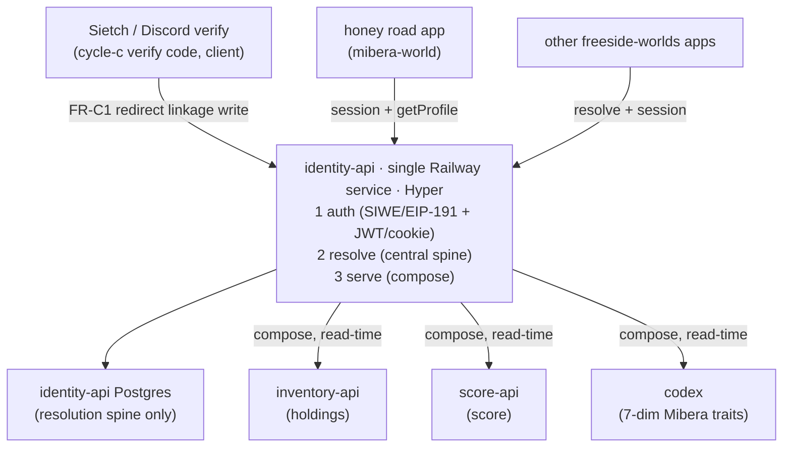
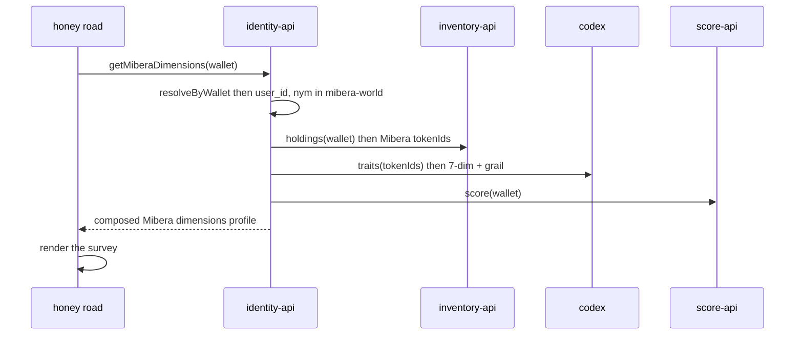

# PRD — identity-api

## §0 Frame

**identity-api is a new freeside building: the single, central organ that knows *who a human is* across every world in the ecosystem, and serves a composed profile per world.** It is deployed as one Railway service, built on Hyper, and it absorbs write-authority for identity — authentication, identity resolution, and profile serving all converge here.

The name "identity API" blurred three seams that this PRD keeps distinct:

| Seam | Question | Today | This building |
|------|----------|-------|---------------|
| **① Authenticate** | "prove you're you" | Sietch wallet-verify (EIP-191) + Dynamic (honey-road) | **owns** — SIWE/EIP-191 + Hyper sessions; Dynamic removed |
| **② Resolve** | "connect the dots: 1 human ↔ N wallets ↔ N per-world nyms" | scattered (`wallet_links`, `member_profiles`, `midi_profiles`) | **owns** — the central resolution spine |
| **③ Serve profile** | "compose + display holdings + score + dimensions per world" | each app fetches its own (honey-road via Alchemy) | **owns** — composes downstream buildings on read |

**This is NOT a greenfield identity build.** The verify lifecycle, signature verification, and wallet-link data already exist (`themes/sietch/src/packages/verification/VerificationService.ts`, `themes/sietch/src/db/migrations/046_wallet_links.ts`). The ready-to-build `cycle-c-freeside-auth-substrate` already specs the linkage write. identity-api **reuses that verify code and redirects its write into itself** — it does not re-implement verification, and it does not subsume cycle-c as a megabuild. cycle-c's verify lifecycle becomes a *client* of this SoR.

**Headline achievement (the acceptance bar):** a user's **Mibera dimensions profile** — their tokens' 7-dimension codex traits + holdings + score — served by identity-api and **surveyed on the honey road** (the mibera-world app), sourced from identity-api rather than Alchemy/Dynamic.

**Baseline pattern (proven):** the inventory-api federation that "worked well" — one repo (schema+runtime+docs), a BeaconV3 identity declaration, a registry entry, deployed behind the MCP federation gateway (`apps/mcp-gateway/`, `mcp.0xhoneyjar.xyz`), consumed two-organ: typed SDK (`@0xhoneyjar/inventory`) for code-mode + MCP for discovery. identity-api replicates this exactly.

---

## §1 Goals

Every goal carries a `G-N` id for traceability (per repo CLAUDE.md). Delivery is sequenced: **G-1/G-2/G-3 → G-5 → G-6 → G-4** (the cycle-c redirect lands last because it couples to a separate in-flight cycle).

| ID | Goal | Success metric |
|----|------|----------------|
| **G-1** | `identity-api` exists as a freeside building — single Railway service, Hyper-based, with BeaconV3 + registry entry + typed SDK (`@0xhoneyjar/identity`) + MCP surface | beacon broadcasts a valid V3 doc; building registered in `packages/freeside-registry/registry.yaml`; `import { resolveUser } from '@0xhoneyjar/identity'` type-checks; reachable through the mcp-gateway federation manifest |
| **G-2** | Central **resolution spine** (the SoR) — `users` anchor ↔ `wallet_links` (+ primary) ↔ `linked_accounts` ↔ `world_identity` | one human with 2 verified wallets and 2 distinct per-world nyms resolves to a single `user_id` from any of: wallet address, discord id, or (world_slug, nym) |
| **G-3** | Replace Dynamic — **wallet-first** auth: SIWE/EIP-191 verify + Hyper JWT/encrypted-cookie sessions; `dynamic_user_id` demoted to one row in `linked_accounts` | zero Dynamic SDK calls in the auth path; an honey-road session is issued and validated by identity-api; no `NEXT_PUBLIC_DYNAMIC_*` dependency in the login flow |
| **G-4** | **cycle-c redirect** — Sietch verify-completion writes linkage to identity-api (HTTP/typed-SDK), not direct cross-DB to `midi_profiles` | a Discord `/verify` completion produces/updates a row in identity-api's spine; the direct `MidiPgIdentityLink` write path (cycle-c D3) is replaced by an identity-api client call |
| **G-5** | **Profile serving** — compose a per-world profile from inventory-api (holdings) + score-api (score) + codex (dimensions), federating content not stored in the spine | a profile read returns spine fields + composed content; when a downstream building is unreachable the response degrades gracefully (partial, flagged) rather than failing |
| **G-6** | **Headline** — serve a user's Mibera dimensions profile, surveyed on the honey road | honey-road renders a holder's 7-dimension Mibera profile (archetype/ancestor/element/tarot/era/molecule/swag + grail-ness) sourced from `@0xhoneyjar/identity`, not Alchemy |

---

## §2 Scope

### §2.1 In scope (v1)

- **Building skeleton (G-1):** new `identity-api` building. `packages/protocol/` (sealed schemas) ↔ `src/api/` (Hyper runtime) per ADR-008 §D-11.2 (substrate folds into runtime). BeaconV3 doc, registry entry, typed SDK export (`@0xhoneyjar/identity`), MCP tool surface, mcp-gateway tenant entry.
- **Resolution spine (G-2):** the five-table central schema (§4.2). Bidirectional resolvers: wallet→user, account→user, (world,nym)→user, user→full-identity.
- **Wallet-first auth (G-3):** SIWE + legacy EIP-191 verify (reuse Sietch's `SignatureVerifier`), Hyper JWT + encrypted-cookie sessions, CSRF. Nonce/challenge lifecycle (reuse `wallet_link_nonces` shape). Primary-wallet selection + enforcement.
- **Dynamic removal (G-3):** `dynamic_user_id` becomes a `linked_accounts` provider row; honey-road's auth front swaps from Dynamic to identity-api sessions.
- **Profile serving (G-5):** the compose endpoint — pull holdings (inventory-api), score (score-api), dimensions (codex), join onto the spine, return a per-world profile. Graceful degradation per downstream.
- **Mibera dimensions path (G-6):** the codex 7-dim resolver + the honey-road survey read. Swap honey-road's `lib/alchemy.ts` profile reads → `@0xhoneyjar/identity`.
- **cycle-c redirect (G-4):** an `IdentityLinkPort` impl that calls identity-api instead of writing midi-PG directly; Sietch wires to it.

### §2.2 Out of scope (v1 — later cycles)

| Deferred | Why |
|----------|-----|
| Passkey / email / social login | D3: wallet-first; passkey/email is a nice-to-have, additive via Hyper auth plugins later |
| ACVP signed identity attestations (loa-oracle pattern) | Power-up: makes a dimensions profile a *verifiable credential*; not required to hit the honey-road bar |
| Telegram linked-account flow | provider row reserved in schema; flow deferred |
| Worlds beyond THJ + Mibera | spine is world-generic; only THJ + mibera-world are wired in v1 |
| NATS event-based linkage sync | v1 redirect is a synchronous client call; eventing is cycle-c+1 doctrine |
| Embedded-wallet onboarding | D3: removed entirely; rebuild from first principles only if demanded |
| Rich profile *content* storage (bios, dimensions) in the spine | D2: federated, composed on read — not centralized |

### §2.3 Non-goals (explicitly NOT doing)

| Non-goal | Why |
|----------|-----|
| Re-implement signature verification | reuse Sietch's `SignatureVerifier` / EIP-191 lifecycle |
| Re-implement holdings / score / dimensions | compose inventory-api / score-api / codex; identity-api never indexes chains or computes score |
| Make identity-api a per-world ECS task | D4: it is a singleton cross-cutting service on one Railway service |
| Modify the codex or inventory-api schemas | consume their sealed schemas; do not fork them |
| Centralize per-world profile content | D2 hybrid: spine central, content federated |

---

## §3 Decisions (load-bearing)

### D1 — Central SoR, redirect cycle-c (operator 2026-05-24)
identity-api is the canonical identity graph **and** the writer. cycle-c's verify code is reused; its linkage write (cycle-c D3 `MidiPgIdentityLink`, direct PG to `midi_profiles`) redirects to an identity-api client call. Sietch (Discord verify) and honey-road become thin clients. cycle-c is **not** discarded and **not** absorbed as a megabuild — its verify lifecycle is a client of this SoR.

### D2 — Hybrid graph: spine central, content federated (operator 2026-05-24)
Centralize only the *resolution spine* — the part that connects the dots: `users` ↔ `wallet_links` (+ primary) ↔ `linked_accounts` (discord / telegram / dynamic_user_id) ↔ `world_identity` (world × user → nym). Federate heavy, world-specific *content* (bios, Mibera dimensions, holdings) — composed at read-time from the owning building, never stored in the spine.

### D3 — Full Dynamic replacement, wallet-first (operator 2026-05-24)
Dynamic is removed entirely — no embedded-wallet onboarding (rebuild from first principles only if ever needed). Wallet auth = SIWE + legacy EIP-191 + Hyper JWT/encrypted-cookie sessions. `dynamic_user_id` survives only as a `linked_accounts` provider row for backfill/continuity. Passkey/email is a deferred nice-to-have.

### D4 — Hyper + single Railway service (operator 2026-05-24)
Built on Hyper (hyperjs.ai): one route definition emits runtime + OpenAPI 3.1 + typed RPC client + MCP server, with built-in JWT (EdDSA/RS256/HS256) + encrypted-cookie sessions + CSRF. This delivers the two-organ consume model (typed client = code-mode, MCP = discovery) **and** the auth primitives in one definition. Deployed as a **single Railway service** — not the loa-vps AWS coordination cluster, not a per-world ECS task.

### D5 — Composes with inventory-api + score-api + codex (operator 2026-05-24)
Profile serving (③) composes: **inventory-api** for holdings, **score-api** for score, **codex** for the 7-dimension Mibera traits (archetype/ancestor/element/tarot/era/molecule/swag + grail-ness). One-way: identity-api consumes these; none consume identity-api's profile output (auth claims may be consumed cross-cutting — see §6.3).

### D6 — Cross-cutting credential plane, orthogonal to the data-depth DAG (derived)
Per ADR-008 §D-8 (plane ≠ domain) and the network map: the data-depth DAG runs raw → derived → integrated → presented. identity-api is **not** a node in that DAG — it is an orthogonal credential/identity plane that guards and enriches the others. This matches the freeside-auth posture (auth failures isolate; buildings degrade gracefully).

### D7 — Reuse the inventory-api federation pattern verbatim (derived)
BeaconV3 + registry entry + typed SDK + MCP tenant in mcp-gateway, identical to the inventory-api baseline. No new discovery/consume mechanism is invented.

### D8 — Conflict policy inherits cycle-c FR-L3 unless operator overrides (open → §9)
Default for wallet↔identity collisions: same-discord + new-wallet → update wallet (latest-wins, audited); same-wallet + new-discord → update discord (latest-wins, audited); a *third-party already-claimed* pair → hard-fail `cross_user_collision`. Operator may pick first-claim-wins instead.

---

## §4 Functional Requirements

### §4.1 Building / contract surface (G-1)

| ID | Requirement |
|----|-------------|
| **FR-B1** | Building scaffolded per ADR-008 §D-11: `packages/protocol/` holds sealed schemas (identity-resolution, profile-shape); `src/api/` holds the Hyper runtime. One repo = schema + runtime + docs. |
| **FR-B2** | BeaconV3 doc declares `slug: identity-api`, `is` / `is_not` (≥2 anti-scope entries), `composes_with: {inventory-api, score-api, codex}`, `capabilities`, `cycle_state: candidate`. Mirrors `packages/beacon-schema/src/beacon-v3.ts` shape. |
| **FR-B3** | Registered in `packages/freeside-registry/registry.yaml` (git_url, beacon_url, visibility, owner). Appears in `/.well-known/federation.json` via the gateway. |
| **FR-B4** | Typed SDK published as `@0xhoneyjar/identity` (npm scope `@0xhoneyjar`, NOT `@freeside`) exporting the resolve + profile client (code-mode / consume organ). |
| **FR-B5** | MCP tool surface exposed and added as an mcp-gateway tenant (`apps/mcp-gateway/src/tenants.ts`: slug, upstream, auth, access, visibility, status) for the discovery organ. |

### §4.2 Resolution spine — the central schema (G-2)

```
users(
  user_id            uuid pk,
  primary_wallet     text null,            -- FK → wallet_links.wallet_address
  created_at         timestamptz
)
wallet_links(
  wallet_address     text,
  user_id            uuid fk,
  chain_ids          text[],               -- multi-chain (per cycle-c D6 IChainProvider posture)
  is_primary         bool,
  verified_at        timestamptz,
  unlinked_at        timestamptz null,
  unique(wallet_address) where unlinked_at is null
)
linked_accounts(
  user_id            uuid fk,
  provider           text,                 -- 'discord' | 'telegram' | 'dynamic_user_id'
  external_id        text,
  verified_at        timestamptz,
  unique(provider, external_id)
)
worlds(
  world_slug         text pk,              -- references the freeside-worlds registry
  ...
)
world_identity(
  user_id            uuid fk,
  world_slug         text fk,
  nym                text,                 -- the per-world name ("different names across apps")
  joined_at          timestamptz,
  unique(world_slug, nym)
)
```

| ID | Requirement |
|----|-------------|
| **FR-R1** | `resolveByWallet(address) → user_id?` — resolves a verified wallet to its owner. |
| **FR-R2** | `resolveByAccount(provider, external_id) → user_id?` — e.g. discord_id → user. |
| **FR-R3** | `resolveByNym(world_slug, nym) → user_id?` — per-world name lookup. |
| **FR-R4** | `getIdentity(user_id) → { wallets[], primary_wallet, accounts[], world_identities[] }` — the full dot-connection for one human. |
| **FR-R5** | Primary-wallet selection: exactly one `is_primary=true` per `user_id`; setting a new primary clears the prior; resolvers expose the primary distinctly. |
| **FR-R6** | A single human with N wallets and M per-world nyms is ONE `user_id`; linking a new wallet/account/nym to an existing user is idempotent and audited. |

### §4.3 Authentication — wallet-first (G-3)

| ID | Requirement |
|----|-------------|
| **FR-A1** | Challenge issue + verify: SIWE (EIP-4361) primary, legacy EIP-191 (`personal_sign`) supported (reuse Sietch `SignatureVerifier`). Nonce lifecycle mirrors `wallet_link_nonces` (migration 046). |
| **FR-A2** | On verify success: resolve-or-create `user_id`, link the wallet (FR-R6), issue a Hyper JWT + encrypted-cookie session (CSRF double-submit). |
| **FR-A3** | Session validation middleware usable by client apps (honey-road, Sietch) to authorize requests against identity-api sessions. |
| **FR-A4** | `dynamic_user_id` is accepted only as a `linked_accounts` provider row (backfill/continuity). No Dynamic SDK call exists in the auth path. |
| **FR-A5** | Honey-road login swaps from Dynamic to identity-api sessions with no embedded-wallet onboarding dependency. |

### §4.4 Profile serving — compose (G-5)

| ID | Requirement |
|----|-------------|
| **FR-P1** | `getProfile(user_id \| wallet, world_slug) → Profile` composing: spine fields (nym, wallets, accounts) + holdings (inventory-api) + score (score-api) + world-specific content (codex for mibera-world). |
| **FR-P2** | Composition is fan-out with per-source timeouts; a downstream failure yields a partial profile with a `degraded: [source]` flag, never a hard 5xx (D6 isolation). |
| **FR-P3** | Holdings sourced from inventory-api typed SDK (`@0xhoneyjar/inventory`); score from score-api; never re-indexed or re-computed here. |
| **FR-P4** | Profile shape is a sealed schema in `packages/protocol/`, consumed by honey-road via `@0xhoneyjar/identity`. |

### §4.5 Mibera dimensions on the honey road (G-6, headline)

| ID | Requirement |
|----|-------------|
| **FR-M1** | `getMiberaDimensions(user_id \| wallet) →` per-token 7-dimension profile: archetype, ancestor, element, tarot, era, molecule, swag-rank + grail-ness; tokens resolved via inventory-api holdings, traits via codex. |
| **FR-M2** | The honey-road app reads a holder's Mibera dimensions profile from `@0xhoneyjar/identity` (replacing the `lib/alchemy.ts` path), and renders the **survey** (semantics per §9 Q1). |
| **FR-M3** | Grail-ness is codex-authoritative (codex-only data); identity-api surfaces it verbatim from codex without re-deriving. |

### §4.6 cycle-c redirect (G-4)

| ID | Requirement |
|----|-------------|
| **FR-C1** | Provide an `IdentityLinkPort` implementation that POSTs verified linkage `{tenant/world, discord_id, wallet_address, dynamic_user_id?}` to identity-api (typed-SDK or HTTP), replacing cycle-c's direct `MidiPgIdentityLink` PG write (cycle-c D3). |
| **FR-C2** | Sietch `VerificationService.completeSession` calls this port on verify success (the existing call-site; cycle-c §6.3). Failure isolation preserved: link failure does not roll back the verify (cycle-c NFR-3). |
| **FR-C3** | Conflict handling per D8 / cycle-c FR-L3 (latest-wins on single-axis change; hard-fail `cross_user_collision` on third-party claimed pair) — implemented server-side in identity-api. |
| **FR-C4** | Backfill: existing `midi_profiles` rows (mibera-honeyroad `lib/db/schema/index.ts:441-481`) import into the spine (one-time migration), preserving discord/wallet/dynamic_user_id linkages. |

---

## §5 Non-Functional Requirements

| ID | Requirement |
|----|-------------|
| **NFR-1** | **Latency** — resolve endpoints < 100ms p95 (spine is local PG); compose profile < 800ms p95 (fan-out bounded by slowest downstream timeout). |
| **NFR-2** | **Isolation (D6)** — a downstream building (inventory/score/codex) outage degrades the profile, never the auth or resolve paths. |
| **NFR-3** | **Single service** — one Railway service; identity-api owns its Postgres (spine). No per-world ECS tasks. |
| **NFR-4** | **Sovereignty** — no third-party auth dependency (Dynamic) in the critical path; keys/sessions self-hosted (Hyper JWT, 32-byte secret minimum). |
| **NFR-5** | **Auditability** — every link/unlink/primary-change/conflict emits an audit event (reuse the existing audit hook shape from Sietch `WalletVerificationService`). |
| **NFR-6** | **Two-organ parity** — every capability reachable both via typed SDK (code-mode) and MCP (discovery); the OpenAPI + typed client + MCP server all derive from one Hyper route definition. |
| **NFR-7** | **Idempotency** — re-linking the same (wallet, user) or (account, user) is a no-op; spine writes are upserts with conflict policy (D8). |
| **NFR-8** | **Migration safety** — the `midi_profiles` backfill (FR-C4) is idempotent and reversible; runs once, verified against row counts. |

---

## §6 Architecture

### §6.1 Topology (the chosen path: Central SoR)



### §6.2 The Mibera survey flow (G-6 acceptance)



### §6.3 Where auth claims flow (cross-cutting)
identity-api issues sessions/claims consumed by client apps for authorization. This is the orthogonal credential plane (D6) — it does not make identity-api a DAG node; downstream buildings still compose one-way under it.

### §6.4 Reused vs new
- **Reused:** Sietch `SignatureVerifier` / EIP-191 lifecycle, `wallet_link_nonces` shape (migration 046), audit-hook shape, inventory-api federation pattern (beacon/registry/SDK/gateway), cycle-c verify call-site.
- **New:** the spine schema (§4.2), Hyper runtime + sessions, the compose endpoint, the codex dimensions resolver, the `IdentityLinkPort` redirect impl, the `@0xhoneyjar/identity` SDK.

---

## §7 Sequenced delivery (full v1)

| Phase | Goals | Lands |
|-------|-------|-------|
| **1 · Spine + Auth** | G-1, G-2, G-3 | building skeleton + beacon/registry/SDK/MCP + resolution spine + SIWE/EIP-191 + Hyper sessions + Dynamic removed |
| **2 · Serve** | G-5 | compose endpoint (inventory + score + codex), graceful degradation, sealed profile schema |
| **3 · Mibera** | G-6 | codex dimensions resolver + honey-road survey read swap (Alchemy → identity-api) |
| **4 · Redirect** | G-4 | `IdentityLinkPort` → identity-api; Sietch wired; `midi_profiles` backfill |

Redirect (G-4) is last by design: it couples to the separate in-flight cycle-c. Phases 1–3 deliver the honey-road achievement without waiting on that coupling.

---

## §8 Risks + mitigations

| Risk | Mitigation |
|------|------------|
| Dynamic removal regresses honey-road onboarding UX | D3 accepted (operator: rebuild from first principles if needed); wallet-first is the explicit posture; passkey/email available later via Hyper plugins |
| cycle-c redirect couples two cycles, risking deadlock | sequence redirect last (Phase 4); keep cycle-c's direct-write as a fallback during cutover (cycle-c D3 V2 pattern) |
| Compose fan-out latency / downstream outage | NFR-1/NFR-2: per-source timeouts + graceful degradation; never block auth/resolve on profile content |
| Hyper is young / "distributed as source" | vendor source in-repo (Hyper's model is source distribution); pin; spike auth plugins early in Phase 1 |
| Cross-user wallet collision policy wrong | D8 inherits cycle-c FR-L3 audited semantics; operator confirms policy (§9 Q2) before Phase 4 |
| `midi_profiles` backfill data loss | NFR-8: idempotent, reversible, row-count-verified one-time migration |
| Building domain/commit-scope under ADR-007 firewall | resolve platform/network/shared scope (and whether it lands in-monolith first or as an external repo) at SDD/sprint |

---

## §9 Open questions (queued for operator — not blocking PRD)

1. **"Survey" semantics (G-6)** — does the honey-road survey mean: (a) a user views their *own* Mibera dimensions profile, (b) anyone queries *across all holders*, or (c) a *leaderboard/ranking* view? This shapes whether the serve API is single-subject (`getProfile`) or aggregate (`queryHolders`). Default v1: **(a) self-view** unless told otherwise.
2. **Cross-user collision policy (D8)** — inherit cycle-c FR-L3 (latest-wins + hard-fail on third-party claimed) or switch to first-claim-wins?
3. **Sequencing of the redirect (G-4)** — does cycle-c implement-then-redirect (cycle-c ships its midi write, we cut it over), or does identity-api land first and cycle-c target it from the start (cycle-c never ships the direct-PG write)?
4. **Repo placement** — does `identity-api` start in-monolith (extraction later) or as an external `0xHoneyJar/identity-api` repo from day one? (affects ADR-007 commit-scope.)
5. **Worlds source-of-truth** — `worlds` table references the freeside-worlds registry; is that registry queryable at runtime, or does identity-api seed `worlds` from it at deploy?

---

## §10 Dependencies

| Dependency | Role | State |
|------------|------|-------|
| Hyper (hyperjs.ai) | runtime + OpenAPI + typed client + MCP + auth | external; spike in Phase 1 |
| inventory-api (`@0xhoneyjar/inventory`) | holdings (compose) | typed SDK exists (the GOLD baseline) |
| score-api | score (compose) | building exists; typed facade to verify |
| codex (mibera-codex) | 7-dim Mibera traits + grail (compose) | exists; read-only |
| cycle-c-freeside-auth-substrate | verify code + linkage write to redirect | ready-to-implement; coupling at Phase 4 |
| Sietch verification substrate | reused verify lifecycle + call-site | production-grade, exists |
| mcp-gateway (`apps/mcp-gateway/`) | federation/discovery | live at `mcp.0xhoneyjar.xyz` |
| Railway | single-service hosting | operator directive (D4) |
| midi_profiles (mibera-honeyroad) | backfill source | schema exists (`lib/db/schema/index.ts:441-481`) |

---

> **Sources** (grounded):
> - Operator fork resolution 2026-05-24 (this session: D1 Central SoR, D2 Hybrid graph, D3 wallet-first Dynamic removal; scope cut = full v1 sequenced)
> - cycle-c PRD — `grimoires/loa/cycles/cycle-c-freeside-auth-substrate-2026-05-05/prd.md` (verify lifecycle, `@freeside-auth` shapes, FR-L3 conflict semantics, D3 midi-write, `dynamic_user_id` V2-TODO at :319, midi_profiles columns at mibera-honeyroad `lib/db/schema/index.ts:441-481`)
> - ADR-008 §D-11 *-api convention + §D-8 plane≠domain — `decisions/008-freeside-as-factory.md`
> - Network map / gap audit — `grimoires/freeside-network/FREESIDE.md`, `ECOSYSTEM-BASELINE.md`
> - Federation baseline — `apps/mcp-gateway/src/{app.ts,tenants.ts,beacon-resolver.ts}`; BeaconV3 `packages/beacon-schema/src/beacon-v3.ts`; registry `packages/freeside-registry/registry.yaml`; inventory beacon fixture `packages/beacon-schema/tests/fixtures/freeside-inventory-v3.yaml`
> - Existing identity/profile/wallet data — `themes/sietch/src/services/{profile.ts,IdentityService.ts}`; migrations `002_social_layer.ts` (member_profiles: member_id/discord_user_id/nym/tier), `046_wallet_links.ts` (wallet_link_nonces, wallet_links), `037_agent_identity.ts`, `030_credit_ledger.ts`; `packages/adapters/security/wallet-verification.ts` (EIP-191)
> - Hyper — hyperjs.ai (Bun framework, one-def → runtime + OpenAPI 3.1 + typed RPC client + MCP server; JWT EdDSA/RS256/HS256 + encrypted-cookie sessions + CSRF)
> - npm scope `@0xhoneyjar` (memory: project_freeside-npm-scope-and-consume)
> - loa-oracle (proof-of-life signed-envelope + SOUL identity) noted as the optional ACVP power-up (out of v1 scope)
> - Vault world-model (`world-system-pattern`, `mibera-world-consolidation`) used as ORIENTATION ONLY (background_only) — not cited as a requirement authority

*PRD authored 2026-05-24 via /plan-and-analyze. Forks resolved with operator before generation. Ready for /architect (SDD) at operator approval.*
