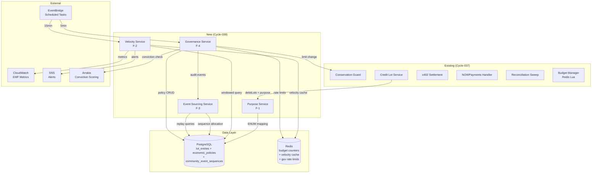
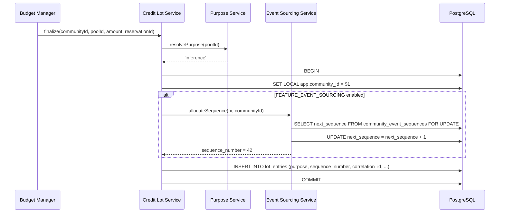
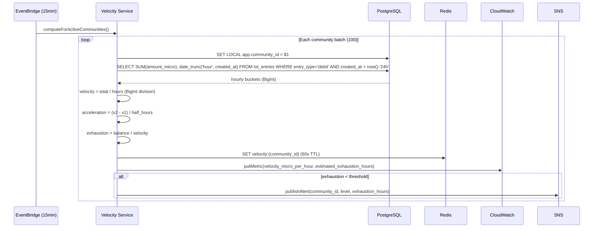
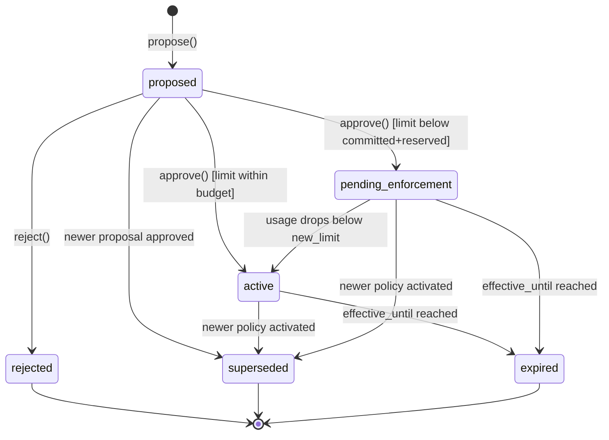
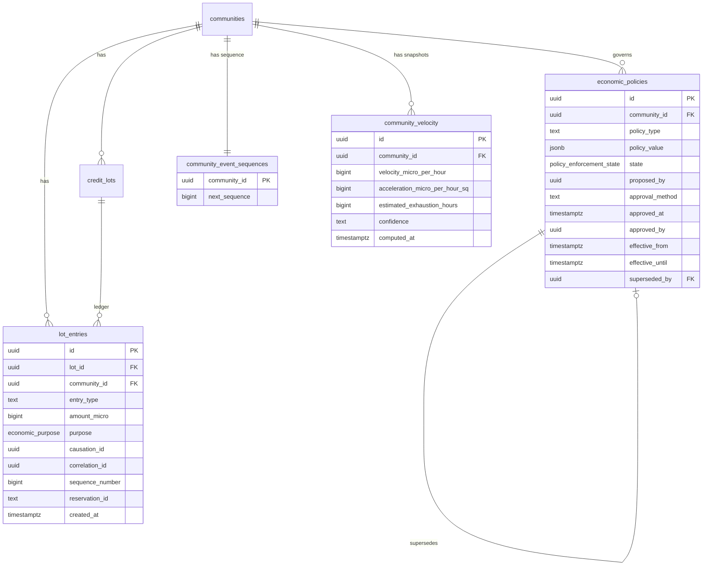

# Software Design Document: The Ostrom Protocol

**Version:** 2.0.0
**Date:** 2026-02-24
**Author:** Architecture Designer Agent
**Status:** Draft
**PRD Reference:** grimoires/loa/prd.md v1.2.0
**Cycle:** cycle-038
**Predecessor SDD:** grimoires/loa/archive/2026-02-24-proof-of-economic-life-complete/sdd.md (cycle-037)

---

## Table of Contents

1. [Project Architecture](#1-project-architecture)
2. [Software Stack](#2-software-stack)
3. [Database Design](#3-database-design)
4. [API Specifications](#4-api-specifications)
5. [Component Design](#5-component-design)
6. [Error Handling Strategy](#6-error-handling-strategy)
7. [Testing Strategy](#7-testing-strategy)
8. [Development Phases](#8-development-phases)
9. [Known Risks and Mitigation](#9-known-risks-and-mitigation)
10. [Open Questions](#10-open-questions)
11. [Appendix](#11-appendix)

---

## 1. Project Architecture

### 1.1 System Overview

Cycle-038 extends the cycle-037 economic loop with four capabilities that transform it from a billing mechanism into an economic protocol. All changes are additive — existing conservation invariants (I-1..I-5), credit lot ledger, and payment integrations continue to function identically. New components are feature-flagged independently.

> From prd.md: "This cycle makes the unconscious conscious. It adds four capabilities that transform the economic loop from a billing mechanism into an economic protocol."

### 1.2 Architectural Pattern

**Pattern:** Hexagonal (Ports & Adapters) — extending existing architecture

**Justification:**
Cycle-037 established a hexagonal architecture with strict separation between core domain logic (services), infrastructure adapters (Redis, Postgres, HTTP), and external integrations (NOWPayments, x402, Arrakis). The four new components follow this established pattern:

- **Ports**: New interfaces in `packages/core/ports/` (IVelocityService, IGovernanceService)
- **Services**: New domain logic in `packages/services/` alongside conservation-guard.ts and credit-lot-service.ts
- **Adapters**: Database queries in existing Postgres adapter layer; Redis for rate limiting and velocity caching

No new architectural patterns are introduced. The system remains a modular monolith deployed on ECS Fargate.

### 1.3 Component Diagram



### 1.4 System Components

#### 1.4.1 Purpose Service (F-1)

- **Purpose**: Map pool_id to economic_purpose ENUM at debit time
- **Responsibilities**: Purpose resolution, unclassified rate monitoring, retrospective reclassification
- **Interfaces**: `resolvePurpose(poolId: string): EconomicPurpose`
- **Dependencies**: Configuration (POOL_PURPOSE_MAP), CloudWatch (metrics)
- **Location**: `packages/services/purpose-service.ts`

#### 1.4.2 Velocity Service (F-2)

- **Purpose**: Compute credit consumption rate and predict exhaustion using BigInt-only arithmetic
- **Responsibilities**: Velocity computation, acceleration detection, alert emission, historical trending
- **Interfaces**: `computeSnapshot(communityId): VelocitySnapshot`, `checkAlerts(communityId): Alert[]`
- **Dependencies**: lot_entries (read), CloudWatch (metrics), SNS (alerts), Redis (velocity cache)
- **Location**: `packages/services/velocity-service.ts`

#### 1.4.3 Event Sourcing Service (F-3)

- **Purpose**: Manage per-community monotonic sequencing, replay capability, and consistency verification
- **Responsibilities**: Sequence allocation, state replay, consistency checking, legacy backfill
- **Interfaces**: `allocateSequence(tx, communityId): bigint`, `replayState(communityId): CommunityEconomicState`, `verifyConsistency(communityId): ConsistencyReport`
- **Dependencies**: community_event_sequences (read/write), lot_entries (read), conservation-guard (cross-validation)
- **Location**: `packages/services/event-sourcing-service.ts`

#### 1.4.4 Governance Service (F-4)

- **Purpose**: Policy lifecycle management with role-based authorization and conservation guard integration
- **Responsibilities**: Policy CRUD, state machine transitions, rate limiting, RLS enforcement, conviction bridge
- **Interfaces**: `propose(policy): PolicyId`, `approve(policyId, role): Policy`, `getActivePolicy(communityId, type): Policy`, `sweepExpired(): SweepResult`
- **Dependencies**: economic_policies (read/write), conservation-guard (limit propagation), Redis (rate limits), Arrakis (conviction), lot_entries (governance events via F-3)
- **Location**: `packages/services/governance-service.ts`

### 1.5 Data Flow

#### Debit with Purpose (F-1 + F-3)



#### Velocity Computation (F-2)



#### Governance Lifecycle (F-4)



### 1.6 External Integrations

| Service | Purpose | API Type | Existing? |
|---------|---------|----------|-----------|
| PostgreSQL (RDS) | Primary data store — lot_entries, economic_policies, sequences | SQL | Yes |
| Redis (ElastiCache) | Budget counters, velocity cache, governance rate limits | ioredis | Yes |
| EventBridge | Scheduled velocity computation (15min) and governance sweep (5min) | AWS SDK | Yes (reconciliation uses same pattern) |
| CloudWatch | EMF metrics for velocity, purpose spend, governance ops | EMF | Yes |
| SNS | Velocity exhaustion alerts (warning/critical/emergency) | AWS SDK | New topic |
| Arrakis | Conviction scoring for governance approval | HTTP REST | New integration (graceful degradation — see circuit breaker spec below) |

**Arrakis Client Circuit Breaker** (IMP-002):
- **Timeout**: 3s per request (conviction check is non-blocking for approval flow)
- **Circuit breaker** (opossum): `errorThresholdPercentage: 50`, `resetTimeout: 30000ms`, `rollingCountTimeout: 10000ms`
- **Retries**: 1 retry with 500ms backoff (max 2 attempts)
- **Fallback**: When circuit is open or all retries exhausted, approval proceeds without conviction score. `conviction_score` is set to NULL and `approval_method` defaults to 'admin' (operator approval sufficient). Log warning + emit CloudWatch metric `arrakis_fallback_count`.
- **Max added latency**: 6.5s worst case (3s timeout × 2 attempts + 500ms backoff). Normal path: <500ms.

### 1.7 Deployment Architecture

No changes to deployment architecture. Cycle-038 components deploy as part of the existing ECS Fargate service. New database migrations run via Drizzle Kit. New EventBridge rules added via Terraform.

### 1.8 Scalability Strategy

> From prd.md (IMP-008): "Design for ≤1,000 active communities, ≤50 concurrent economic operations per community"

- **Horizontal scaling**: ECS service auto-scales on CPU/memory (existing). Velocity computation and governance sweep are stateless — scale with task count.
- **Sequence contention**: Tiered strategy controlled by `SEQUENCE_LOCK_MODE` flag:
  - **Tier 1 (`for_update`, default)**: `SELECT next_sequence FROM community_event_sequences WHERE community_id = $1 FOR UPDATE` + `UPDATE ... SET next_sequence = next_sequence + 1 RETURNING next_sequence - 1`. Serializes at community level. Sufficient for ≤100 TPS/community.
  - **Tier 2 (`advisory_lock`)**: `SELECT pg_advisory_xact_lock(hashtext($1::text))` then `UPDATE community_event_sequences SET next_sequence = next_sequence + 1 WHERE community_id = $1 RETURNING next_sequence - 1 AS allocated`. Advisory lock avoids row-level contention; released at transaction end. Suitable for 100-500 TPS/community.
  - **Tier 3 (`range_allocation`)**: Atomically allocate N sequences: `UPDATE community_event_sequences SET next_sequence = next_sequence + $2 WHERE community_id = $1 RETURNING next_sequence - $2 AS range_start`. Process holds range [start, start+N) in memory with lease expiry. On crash, ranges may be skipped but never duplicated. Replay consumers MUST tolerate gaps (IMP-002). Suitable for >500 TPS/community.
  - **Correctness guarantee**: All tiers maintain monotonicity. Gaps are allowed (IMP-002); duplicates are never allowed. Tier transitions are safe — upgrade by changing flag; no data migration needed.
  - **Gap semantics** (SKP-002 BLOCKER resolution):
    - **Acceptable causes**: Transaction rollback (Tier 1/2), process crash with allocated range (Tier 3), manual sequence adjustment by operator
    - **Maximum gap size**: Tier 1/2: 1 sequence per rollback. Tier 3: up to N (allocation batch size, default 100). Alert if gap > 1000 (indicates crash during large allocation).
    - **API pagination with gaps**: `GET /events?from_sequence=N` returns events with `sequence_number >= N` ordered by sequence. `has_more` is based on existence of rows with higher sequence, not contiguity. Consumers paginate by `next_sequence = max(returned sequences) + 1`.
    - **verifyConsistency treatment**: Consistency check compares replayed state against materialized state; it does NOT assert sequence contiguity. A separate `sequenceGapReport(communityId)` function identifies gaps with their probable cause (rollback vs crash) for operator inspection.
    - **Tier 3 allocation lease tracking**: When using range allocation, record each allocation in `community_event_sequences` metadata (JSONB column `allocated_ranges`): `[{start, end, allocated_at, process_id}]`. On crash, unfinished ranges are visible and explainable. Pruned after 24h.
    - **Monitoring**: CloudWatch metric `sequence_gap_count` per community; alarm at >100 gaps/hour (abnormal).
- **Velocity batching**: Communities processed in batches of 100 with configurable parallelism (default: 10 concurrent).

### 1.9 Security Architecture

- **Authentication**: S2S JWT (existing) or session token for governance API
- **Authorization**: Role-based — member/operator/admin/agent (see F-4 authorization model in PRD)
- **RLS** (SKP-003 BLOCKER resolution): Multi-layered enforcement
  - **Layer 1 — DB role isolation**: Three DB roles with distinct privileges:
    - `app_role`: Used by application connections. RLS enforced, no BYPASSRLS. `ALTER ROLE app_role SET app.community_id = '';` — default empty string ensures COALESCE denial if withCommunityScope is missed.
    - `admin_tooling_role`: Used by platform admin service. Separate connection pool. Has SELECT on admin_audit_log. RLS still enforced — must SET LOCAL explicitly.
    - `migration_role`: Used by Drizzle migrations only. Has BYPASSRLS for schema changes. Never used by application code.
  - **Layer 2 — RLS policies**: All tenant tables use `current_setting('app.community_id', true)` (missing_ok) with COALESCE to impossible UUID
  - **Layer 3 — Application middleware**: `withCommunityScope` wraps all tenant DB operations
  - **Layer 4 — Automated testing**:
    - Integration test: execute representative queries (debit, reserve, velocity read, policy CRUD) without SET LOCAL — verify RLS denies all
    - Background job test: run reconciliation sweep, velocity batch, governance sweep in test harness — verify each uses withCommunityScope
    - CI scan: grep for `pool.query` or `client.query` outside withCommunityScope wrapper in adapter/service files — fail CI
  - RLS enabled on ALL tenant tables: lot_entries, credit_lots, economic_policies, community_event_sequences, community_velocity
  - **Role taxonomy reconciliation**: The Actor type includes `'member' | 'operator' | 'admin' | 'agent'` for community-level roles. `platform_admin` is a separate system-level role NOT part of Actor — it's resolved from the JWT `iss` claim and handled by `requireCommunityMatch()` middleware before Actor resolution. Document this distinction explicitly in the Actor interface:
- **Rate Limiting**: Governance API rate-limited per role/community via Redis (IMP-001)
- **Audit**: All governance operations emit append-only events in lot_entries
- **Admin Bypass**: Explicit audit logging to `admin_audit_log` table (SKP-007)
  - `admin_audit_log` has no RLS (platform-level) but access is strictly restricted via DB role:
    - `REVOKE ALL ON admin_audit_log FROM app_role; GRANT INSERT ON admin_audit_log TO app_role;`
    - app_role can INSERT audit entries but CANNOT SELECT (prevents cross-tenant audit data exposure)
    - Separate `audit_reader_role` with SELECT for platform-admin audit service (dedicated connection)
- **Community ID Cross-Check** (multi-tenant guard):
  - Mandatory middleware guard: `actor.community_id === req.params.communityId`
  - Reject with 403 if mismatch, unless actor is platform-admin with audited override
  - `withCommunityScope` always uses the verified `communityId` after this check
  - CI test: scan all route handlers for `params.communityId` usage without cross-check guard

---

## 2. Software Stack

### 2.1 Backend Technologies (Existing — No Changes)

| Category | Technology | Version | Justification |
|----------|------------|---------|---------------|
| Runtime | Node.js | 20 LTS | Existing — matches current codebase |
| Language | TypeScript | 5.3+ | Existing — strict mode, BigInt support |
| Framework | Express | 4.21 | Existing — HTTP server |
| ORM | Drizzle Kit | 0.20+ | Existing — migrations, schema management |
| Redis Client | ioredis | 5.9.2 | Existing — Lua script support |
| Testing | Vitest | 1.6+ | Existing — fast, TypeScript-native |
| Logging | Pino | 9.5 | Existing — structured JSON, PII scrubber |
| Schema Validation | Zod | 3.23 | Existing — runtime type validation |
| Circuit Breaker | opossum | 8.1.0 | Existing — Redis/HTTP fault tolerance |

### 2.2 New Dependencies

| Library | Version | Purpose | Justification |
|---------|---------|---------|---------------|
| None | — | — | All cycle-038 features use existing dependencies |

**Design decision**: Zero new runtime dependencies. Purpose mapping, velocity arithmetic, event sourcing, and governance are all implementable with existing Node.js BigInt, ioredis, Drizzle, and Express. This minimizes supply chain risk and keeps the dependency tree unchanged.

### 2.3 Infrastructure (Existing + Additions)

| Category | Technology | Change |
|----------|------------|--------|
| Compute | ECS Fargate | No change |
| Database | RDS PostgreSQL 15 | New tables + migrations |
| Cache | ElastiCache Redis 7 | New key patterns (velocity, gov rate limits) |
| Scheduling | EventBridge | New rules: velocity (15min), gov sweep (5min) |
| Alerts | SNS | New topic: velocity-exhaustion-alerts |
| Monitoring | CloudWatch EMF | New metrics namespace additions |
| IaC | Terraform | New resources: SNS topic, EventBridge rules, CloudWatch alarms |

---

## 3. Database Design

### 3.1 Database Technology

**Primary Database:** PostgreSQL 15 (RDS)
**Existing Schema:** credit_lots, lot_entries, lot_balances (view), usage_events, webhook_events, crypto_payments, reconciliation_cursor

### 3.2 Schema Changes

#### 3.2.1 Migration 0012: Economic Purpose Type (F-1)

```sql
-- Create purpose enum type
CREATE TYPE economic_purpose AS ENUM (
  'inference', 'tool_use', 'embedding', 'image_gen',
  'storage', 'governance', 'unclassified'
);

-- Phase 1: Add purpose column as NULLABLE (metadata-only, non-blocking)
ALTER TABLE lot_entries
  ADD COLUMN purpose economic_purpose NULL;

-- Phase 2: Backfill in small batches (run OUTSIDE migration as operational step)
-- NOTE: DO blocks cannot COMMIT between iterations — use an application-side
-- script or psql loop instead. Each iteration is its own transaction.
--
-- Operational script (run via psql or Node.js migration runner):
--
--   SET statement_timeout = '5s';
--   SET lock_timeout = '2s';
--
--   -- Repeat until 0 rows updated:
--   UPDATE lot_entries SET purpose = 'unclassified'
--   WHERE id IN (
--     SELECT id FROM lot_entries
--     WHERE purpose IS NULL
--     ORDER BY id
--     LIMIT 5000
--     FOR UPDATE SKIP LOCKED
--   );
--   -- COMMIT (implicit in autocommit, or explicit in script)
--   -- Sleep 100ms between batches to yield to production traffic
--
-- Alternatively, use CREATE PROCEDURE with COMMIT support (PG 11+):
--
--   CREATE PROCEDURE backfill_purpose(batch_size INT DEFAULT 5000)
--   LANGUAGE plpgsql AS $$
--   DECLARE rows_updated INT;
--   BEGIN
--     LOOP
--       UPDATE lot_entries SET purpose = 'unclassified'
--       WHERE id IN (
--         SELECT id FROM lot_entries WHERE purpose IS NULL
--         ORDER BY id LIMIT batch_size
--         FOR UPDATE SKIP LOCKED
--       );
--       GET DIAGNOSTICS rows_updated = ROW_COUNT;
--       EXIT WHEN rows_updated = 0;
--       COMMIT;  -- valid in PROCEDURE, not in DO block
--       PERFORM pg_sleep(0.1);
--     END LOOP;
--   END $$;
--   CALL backfill_purpose();

-- Phase 3: Add default (metadata-only in PG 11+, no rewrite)
ALTER TABLE lot_entries ALTER COLUMN purpose SET DEFAULT 'unclassified';

-- Phase 4: Add CHECK constraint NOT VALID (no table scan)
ALTER TABLE lot_entries
  ADD CONSTRAINT lot_entries_purpose_not_null
  CHECK (purpose IS NOT NULL) NOT VALID;

-- Phase 5: Validate constraint (ShareUpdateExclusiveLock — non-blocking for writes)
ALTER TABLE lot_entries VALIDATE CONSTRAINT lot_entries_purpose_not_null;

-- Note: SET NOT NULL is optional after CHECK constraint validates.
-- The CHECK constraint provides equivalent enforcement without ACCESS EXCLUSIVE lock.

-- Purpose breakdown view
CREATE VIEW community_purpose_breakdown AS
SELECT
  community_id,
  purpose,
  SUM(amount_micro) FILTER (WHERE entry_type = 'debit') AS total_spent_micro,
  COUNT(*) FILTER (WHERE entry_type = 'debit') AS operation_count,
  date_trunc('day', created_at) AS day
FROM lot_entries
GROUP BY community_id, purpose, date_trunc('day', created_at);
```

**Online DDL**: `ALTER TABLE ADD COLUMN ... DEFAULT` is non-blocking in PostgreSQL 11+ (uses a rewrite-free default). Zero downtime.

#### 3.2.2 Migration 0013: Event Sourcing Columns (F-3)

```sql
-- Ensure pgcrypto extension is available for gen_random_uuid()
-- (uuid-ossp also acceptable; pgcrypto is preferred as it's bundled with RDS)
CREATE EXTENSION IF NOT EXISTS pgcrypto;

-- Event sourcing columns on lot_entries
ALTER TABLE lot_entries ADD COLUMN causation_id UUID;
ALTER TABLE lot_entries ADD COLUMN correlation_id UUID NOT NULL DEFAULT gen_random_uuid();
ALTER TABLE lot_entries ADD COLUMN sequence_number BIGINT;
-- sequence_number nullable for legacy rows; NOT NULL enforced at application level
-- when FEATURE_EVENT_SOURCING is enabled for a community.
-- correlation_id NOT NULL DEFAULT gen_random_uuid() is rewrite-free in PG 11+.

-- Event sourcing enforcement trigger (SKP-001 BLOCKER):
-- When a community has event sourcing enabled (row exists in community_event_sequences),
-- all lot_entries INSERTs for that community MUST have non-null sequence_number and
-- correlation_id. This catches any code path that bypasses the repository function.
CREATE OR REPLACE FUNCTION enforce_event_sourcing_fields()
RETURNS TRIGGER AS $$
BEGIN
  -- Only enforce for communities that have been initialized for event sourcing
  IF EXISTS (
    SELECT 1 FROM community_event_sequences WHERE community_id = NEW.community_id
  ) THEN
    IF NEW.entry_type != 'governance' AND NEW.sequence_number IS NULL THEN
      RAISE EXCEPTION 'sequence_number is required for community % (event sourcing enabled)',
        NEW.community_id;
    END IF;
    IF NEW.correlation_id IS NULL THEN
      RAISE EXCEPTION 'correlation_id is required for community % (event sourcing enabled)',
        NEW.community_id;
    END IF;
  END IF;
  RETURN NEW;
END;
$$ LANGUAGE plpgsql;

CREATE TRIGGER lot_entries_enforce_event_sourcing
  BEFORE INSERT ON lot_entries
  FOR EACH ROW
  EXECUTE FUNCTION enforce_event_sourcing_fields();

-- Enforce lot_id NOT NULL for all economic entry types (governance is the only exception)
ALTER TABLE lot_entries
  ADD CONSTRAINT lot_entries_lot_id_required
  CHECK (entry_type = 'governance' OR lot_id IS NOT NULL) NOT VALID;
ALTER TABLE lot_entries VALIDATE CONSTRAINT lot_entries_lot_id_required;

-- Per-community monotonic sequence counter
CREATE TABLE community_event_sequences (
  community_id UUID PRIMARY KEY REFERENCES communities(id),
  next_sequence BIGINT NOT NULL DEFAULT 1,
  created_at TIMESTAMPTZ NOT NULL DEFAULT NOW()
);

-- RLS on community_event_sequences
ALTER TABLE community_event_sequences ENABLE ROW LEVEL SECURITY;
-- Use current_setting with missing_ok=true to avoid hard error when GUC unset.
-- Coalesce to impossible UUID ensures denial rather than error on missing scope.
CREATE POLICY community_event_sequences_tenant
  ON community_event_sequences
  FOR ALL
  USING (community_id = COALESCE(
    NULLIF(current_setting('app.community_id', true), '')::uuid,
    '00000000-0000-0000-0000-000000000000'::uuid
  ));

-- IMPORTANT: The following CREATE INDEX CONCURRENTLY statements MUST run
-- outside a transaction block. Drizzle migration must use `transaction: false`
-- for this migration, or split into separate migration files:
--   0013a: columns + table (transactional)
--   0013b: indexes (non-transactional, CONCURRENTLY)

-- Replay index (covers new and backfilled rows)
CREATE INDEX CONCURRENTLY idx_lot_entries_replay
  ON lot_entries (community_id, sequence_number ASC)
  WHERE sequence_number IS NOT NULL;

-- Velocity windowed query index (F-2 integration)
CREATE INDEX CONCURRENTLY idx_lot_entries_velocity
  ON lot_entries (community_id, created_at DESC)
  WHERE entry_type = 'debit';

-- Operation-level aggregation view (SKP-002)
-- Groups strictly by (community_id, correlation_id) — one row per logical operation.
-- All postings created by one logical operation MUST share the same correlation_id
-- across lots and entry types. Breakdowns by purpose/entry_type are provided as
-- JSONB aggregates rather than GROUP BY dimensions to avoid fragmenting operations.
CREATE VIEW community_operations AS
SELECT
  community_id,
  correlation_id,
  COUNT(*) AS posting_count,
  SUM(amount_micro) AS total_amount_micro,
  MIN(created_at) AS operation_at,
  MIN(sequence_number) AS first_sequence,
  MAX(sequence_number) AS last_sequence,
  jsonb_agg(DISTINCT entry_type) AS entry_types,
  jsonb_agg(DISTINCT purpose) AS purposes,
  jsonb_object_agg(
    entry_type,
    amount_micro
  ) FILTER (WHERE entry_type IS NOT NULL) AS amount_by_entry_type
FROM lot_entries
GROUP BY community_id, correlation_id;

-- For detailed per-posting breakdowns, query lot_entries directly
-- filtered by correlation_id. The view provides operation-level headers only.
```

**Online DDL**: `ALTER TABLE ADD COLUMN` (nullable, no default rewrite for causation_id; gen_random_uuid() default for correlation_id is rewrite-free in PG 11+). `CREATE INDEX CONCURRENTLY` used for the two new indexes to avoid table locks.

#### 3.2.3 Migration 0014: Economic Policies (F-4)

```sql
-- Policy enforcement state enum
CREATE TYPE policy_enforcement_state AS ENUM (
  'proposed', 'active', 'pending_enforcement',
  'superseded', 'rejected', 'expired'
);

-- Economic policies table
CREATE TABLE economic_policies (
  id UUID PRIMARY KEY DEFAULT gen_random_uuid(),
  community_id UUID NOT NULL REFERENCES communities(id),
  policy_type TEXT NOT NULL,
  policy_value JSONB NOT NULL,
  state policy_enforcement_state NOT NULL DEFAULT 'proposed',
  proposed_by UUID NOT NULL,
  proposal_reason TEXT,
  approval_method TEXT NOT NULL DEFAULT 'admin',
  conviction_score NUMERIC,
  approved_at TIMESTAMPTZ,
  approved_by UUID,
  effective_from TIMESTAMPTZ NOT NULL DEFAULT NOW(),
  effective_until TIMESTAMPTZ,
  superseded_by UUID REFERENCES economic_policies(id),
  created_at TIMESTAMPTZ NOT NULL DEFAULT NOW(),
  updated_at TIMESTAMPTZ NOT NULL DEFAULT NOW()
);

-- RLS: community_id = app.current_community_id()
ALTER TABLE economic_policies ENABLE ROW LEVEL SECURITY;
-- missing_ok=true + COALESCE to impossible UUID: denies access when scope unset
CREATE POLICY economic_policies_tenant
  ON economic_policies
  FOR ALL
  USING (community_id = COALESCE(
    NULLIF(current_setting('app.community_id', true), '')::uuid,
    '00000000-0000-0000-0000-000000000000'::uuid
  ));

-- One active/pending policy per (community, type) — SKP-006
CREATE UNIQUE INDEX idx_one_active_policy
  ON economic_policies (community_id, policy_type)
  WHERE state IN ('active', 'pending_enforcement');

-- Active policy lookup (fast path)
-- Note: Cannot use NOW() in partial index predicate (non-immutable).
-- Filter effective_until at query time instead.
CREATE INDEX idx_active_policies
  ON economic_policies (community_id, policy_type)
  WHERE state = 'active'
    AND superseded_by IS NULL;

-- Audit log index
CREATE INDEX idx_policies_audit
  ON economic_policies (community_id, created_at DESC);

-- Immutability: prevent UPDATE of approved_at, proposed_by (append-only audit fields)
CREATE OR REPLACE FUNCTION prevent_policy_field_mutation()
RETURNS TRIGGER AS $$
BEGIN
  IF OLD.proposed_by IS DISTINCT FROM NEW.proposed_by THEN
    RAISE EXCEPTION 'Cannot mutate proposed_by on economic_policies';
  END IF;
  IF OLD.approved_at IS NOT NULL AND OLD.approved_at IS DISTINCT FROM NEW.approved_at THEN
    RAISE EXCEPTION 'Cannot mutate approved_at once set on economic_policies';
  END IF;
  NEW.updated_at = NOW();
  RETURN NEW;
END;
$$ LANGUAGE plpgsql;

CREATE TRIGGER economic_policies_immutable_fields
  BEFORE UPDATE ON economic_policies
  FOR EACH ROW
  EXECUTE FUNCTION prevent_policy_field_mutation();

-- Governance outbox table (SKP-004: transactional outbox for conservation guard updates)
CREATE TABLE governance_outbox (
  id UUID PRIMARY KEY DEFAULT gen_random_uuid(),
  community_id UUID NOT NULL REFERENCES communities(id),
  action TEXT NOT NULL,
  payload JSONB NOT NULL,
  processed BOOLEAN NOT NULL DEFAULT false,
  processed_at TIMESTAMPTZ,
  attempts INTEGER NOT NULL DEFAULT 0,
  last_error TEXT,
  created_at TIMESTAMPTZ NOT NULL DEFAULT NOW()
);

-- Index for outbox worker polling (unprocessed rows oldest-first)
CREATE INDEX idx_governance_outbox_pending
  ON governance_outbox (created_at ASC)
  WHERE processed = false;
```

#### 3.2.4 Migration 0015: Velocity Storage & Admin Audit (F-2, SKP-007)

```sql
-- Velocity snapshots for historical trending
CREATE TABLE community_velocity (
  id UUID PRIMARY KEY DEFAULT gen_random_uuid(),
  community_id UUID NOT NULL REFERENCES communities(id),
  window_hours INTEGER NOT NULL DEFAULT 24,
  velocity_micro_per_hour BIGINT NOT NULL,
  acceleration_micro_per_hour_sq BIGINT NOT NULL DEFAULT 0,
  balance_remaining_micro BIGINT NOT NULL,
  estimated_exhaustion_hours BIGINT,
  confidence TEXT NOT NULL DEFAULT 'low',
  computed_at TIMESTAMPTZ NOT NULL DEFAULT NOW()
);

-- RLS on velocity table
ALTER TABLE community_velocity ENABLE ROW LEVEL SECURITY;
-- missing_ok=true + COALESCE to impossible UUID: denies access when scope unset
CREATE POLICY community_velocity_tenant
  ON community_velocity
  FOR ALL
  USING (community_id = COALESCE(
    NULLIF(current_setting('app.community_id', true), '')::uuid,
    '00000000-0000-0000-0000-000000000000'::uuid
  ));

-- Index for recent velocity lookup
CREATE INDEX idx_velocity_recent
  ON community_velocity (community_id, computed_at DESC);

-- Retention: auto-prune velocity snapshots older than 90 days
-- Implemented via EventBridge scheduled task (daily at 03:00 UTC)
--
-- Pruning mechanism (IMP-003):
--   DELETE FROM community_velocity
--   WHERE computed_at < NOW() - INTERVAL '90 days'
--   AND id IN (
--     SELECT id FROM community_velocity
--     WHERE computed_at < NOW() - INTERVAL '90 days'
--     ORDER BY id LIMIT 10000
--     FOR UPDATE SKIP LOCKED
--   );
--
-- Properties:
--   - Batch size: 10,000 rows per iteration (configurable via VELOCITY_PRUNE_BATCH_SIZE)
--   - Idempotent: safe to re-run; FOR UPDATE SKIP LOCKED prevents contention
--   - Metrics: emit velocity_pruned_count to CloudWatch after each batch
--   - Failure handling: log error + continue; next scheduled run will catch up
--   - Retention configurable via VELOCITY_RETENTION_DAYS (default: 90)

-- Admin audit log (SKP-007)
CREATE TABLE admin_audit_log (
  id UUID PRIMARY KEY DEFAULT gen_random_uuid(),
  actor_id UUID NOT NULL,
  actor_role TEXT NOT NULL,
  action TEXT NOT NULL,
  community_id UUID,
  target_table TEXT NOT NULL,
  target_id UUID,
  details JSONB,
  created_at TIMESTAMPTZ NOT NULL DEFAULT NOW()
);

-- No RLS on admin_audit_log — it's a platform-level audit trail.
-- Access restricted via DB role privileges:
REVOKE ALL ON admin_audit_log FROM app_role;
GRANT INSERT ON admin_audit_log TO app_role;
-- app_role can WRITE audit entries but CANNOT READ them (prevents cross-tenant exposure).
-- A separate audit_reader_role is used for platform-admin audit access:
-- CREATE ROLE audit_reader_role;
-- GRANT SELECT ON admin_audit_log TO audit_reader_role;
-- Platform admin service connects with audit_reader_role for audit queries.

-- Append-only: define prevent_mutation() before trigger
CREATE OR REPLACE FUNCTION prevent_mutation()
RETURNS TRIGGER AS $$
BEGIN
  RAISE EXCEPTION 'Mutations (UPDATE/DELETE) are not permitted on %', TG_TABLE_NAME;
  RETURN NULL;
END;
$$ LANGUAGE plpgsql;

CREATE TRIGGER admin_audit_log_immutable
  BEFORE UPDATE OR DELETE ON admin_audit_log
  FOR EACH ROW
  EXECUTE FUNCTION prevent_mutation();
```

### 3.3 Entity Relationships



### 3.4 Migration Strategy

All migrations use online DDL operations:

| Migration | Operations | Locking Behavior | Transaction Mode |
|-----------|-----------|-----------------|-----------------|
| 0012 (Purpose) | CREATE TYPE + phased ALTER TABLE (nullable → backfill → CHECK) | Non-blocking: Phase 1 metadata-only, Phase 4-5 ShareUpdateExclusiveLock | Transactional (Phase 2 backfill runs separately) |
| 0013a (Event Sourcing — schema) | CREATE EXTENSION + ALTER TABLE ADD COLUMN + CREATE TABLE + CHECK constraint | Non-blocking | Transactional |
| 0013b (Event Sourcing — indexes) | CREATE INDEX CONCURRENTLY × 2 | Non-blocking; CONCURRENTLY avoids AccessExclusiveLock | `transaction: false` (CONCURRENTLY requires it) |
| 0014 (Policies) | CREATE TABLE + CREATE INDEX + CREATE FUNCTION/TRIGGER | Non-blocking (new table) | Transactional |
| 0015 (Velocity/Audit) | CREATE TABLE + CREATE INDEX + CREATE FUNCTION/TRIGGER | Non-blocking (new tables) | Transactional |

**Order**: 0012 → 0013a → 0013b → 0014 → 0015 (sequential, no circular dependencies)

**Drizzle constraints**:
- Migration 0013b MUST run with `transaction: false` — `CREATE INDEX CONCURRENTLY` cannot execute inside a transaction block
- Migration 0012 Phase 2 (backfill) runs as a separate operational step, not as part of Drizzle migration

**Rollback**: Each migration has a corresponding DOWN migration (DROP TABLE/COLUMN/TYPE/CONSTRAINT). Feature flags ensure application code doesn't reference new columns/tables before migration completes.

**Operational Resilience** (IMP-001):
- **CONCURRENTLY failure recovery**: If `CREATE INDEX CONCURRENTLY` fails, it leaves an INVALID index. Recovery: `DROP INDEX IF EXISTS idx_name; CREATE INDEX CONCURRENTLY ...;` — always check `pg_indexes` for INVALID entries after migration.
- **Backfill resume/abort**: Phase 2 backfill tracks progress via `WHERE purpose IS NULL ORDER BY id`. If interrupted, re-run the same script — `FOR UPDATE SKIP LOCKED` ensures idempotency. Abort by stopping the script; partially backfilled rows are committed and valid.
- **Verification queries**: After each migration, run:
  ```sql
  -- Check for INVALID indexes
  SELECT indexname, indexdef FROM pg_indexes WHERE schemaname = 'public' AND indexdef LIKE '%INVALID%';
  -- Verify backfill completion
  SELECT COUNT(*) FROM lot_entries WHERE purpose IS NULL;  -- should be 0
  -- Verify CHECK constraint
  SELECT convalidated FROM pg_constraint WHERE conname = 'lot_entries_purpose_not_null';  -- should be true
  ```

### 3.5 Data Access Patterns

| Query | Frequency | Index | RLS |
|-------|-----------|-------|-----|
| Debit with purpose | Every debit (~10/s platform) | Existing lot_entries indexes | Yes |
| Velocity windowed sum | Every 15min per community | `idx_lot_entries_velocity` | Yes |
| Replay by sequence | On-demand (admin/audit) | `idx_lot_entries_replay` | Yes |
| Active policy lookup | Every conservation guard check | `idx_active_policies` | Yes |
| Policy proposal/approval | Low frequency (~10/day platform) | `idx_policies_audit` | Yes |
| Sequence allocation | Every lot_entry INSERT (when enabled) | PK on community_event_sequences | Yes |

### 3.6 Redis Key Patterns (New)

| Key Pattern | Type | TTL | Purpose |
|------------|------|-----|---------|
| `velocity:{community_id}` | String (JSON) | 60s | Cached velocity snapshot |
| `gov:rate:{community_id}:{role}` | String (counter) | 86400s (24h) | Governance rate limit per role |
| `gov:burst:{community_id}` | String (counter) | 60s | Governance burst limit |

---

## 4. API Specifications

### 4.1 API Design Principles

- **Style**: REST (extending existing Express routes)
- **Authentication**: S2S JWT or session token (existing patterns)
- **Authorization**: Role-based middleware (new for governance)
- **Versioning**: No version prefix (matches existing API style)

### 4.2 Governance API Endpoints (F-4)

#### POST /api/communities/:communityId/governance/proposals

**Description**: Propose a new economic policy.

**Authorization**: `member`, `operator`, `admin` (rate-limited per role)

**Request:**
```json
{
  "policy_type": "budget_limit",
  "policy_value": { "limit_micro": "5000000" },
  "proposal_reason": "Increase budget for Q2 AI usage",
  "approval_method": "admin"
}
```

**Response (201 Created):**
```json
{
  "id": "uuid",
  "community_id": "uuid",
  "policy_type": "budget_limit",
  "state": "proposed",
  "proposed_by": "uuid",
  "created_at": "2026-02-24T12:00:00Z"
}
```

**Error Responses:**
- 400: Invalid policy_type or policy_value
- 403: Agent role cannot propose
- 429: Rate limit exceeded (Retry-After header)

#### POST /api/communities/:communityId/governance/proposals/:proposalId/approve

**Description**: Approve a proposed policy.

**Authorization**: `operator` (non-limit policies), `admin` (all policies)

**Request:**
```json
{
  "override_reason": null
}
```

**Response (200 OK):**
```json
{
  "id": "uuid",
  "state": "active",
  "approved_at": "2026-02-24T12:05:00Z",
  "approved_by": "uuid",
  "superseded_policy_id": "uuid-of-previous"
}
```

**Response (200 OK — pending enforcement):**
```json
{
  "id": "uuid",
  "state": "pending_enforcement",
  "approved_at": "2026-02-24T12:05:00Z",
  "note": "Limit decrease will activate when usage drops below 3000000 micro"
}
```

#### POST /api/communities/:communityId/governance/proposals/:proposalId/reject

**Description**: Reject a proposed policy.

**Authorization**: `operator`, `admin`

**Request:**
```json
{
  "reason": "Budget increase not justified at this time"
}
```

**Response (200 OK):**
```json
{
  "id": "uuid",
  "state": "rejected"
}
```

#### GET /api/communities/:communityId/governance/policies

**Description**: List active policies for a community.

**Authorization**: `member`, `operator`, `admin`

**Query Parameters**: `?policy_type=budget_limit&include_history=true`

**Response (200 OK):**
```json
{
  "policies": [
    {
      "id": "uuid",
      "policy_type": "budget_limit",
      "policy_value": { "limit_micro": "5000000" },
      "state": "active",
      "effective_from": "2026-02-24T12:05:00Z",
      "effective_until": null
    }
  ]
}
```

### 4.3 Velocity API Endpoints (F-2)

#### GET /api/communities/:communityId/velocity

**Description**: Get current velocity snapshot for a community.

**Authorization**: `member`, `operator`, `admin`

**Response (200 OK):**
```json
{
  "community_id": "uuid",
  "window_hours": 24,
  "velocity_micro_per_hour": "42000",
  "acceleration_micro_per_hour_sq": "-1500",
  "balance_remaining_micro": "2500000",
  "estimated_exhaustion_hours": "59",
  "confidence": "high",
  "computed_at": "2026-02-24T12:00:00Z"
}
```

**Note**: BigInt values serialized as strings in JSON (JavaScript Number loses precision beyond 2^53).

### 4.4 Purpose API Endpoints (F-1)

#### GET /api/communities/:communityId/purpose/breakdown

**Description**: Get purpose breakdown for a community.

**Authorization**: `member`, `operator`, `admin`

**Query Parameters**: `?from=2026-02-01&to=2026-02-24&granularity=day`

**Response (200 OK):**
```json
{
  "community_id": "uuid",
  "breakdown": [
    {
      "purpose": "inference",
      "total_spent_micro": "3500000",
      "operation_count": 450,
      "period": "2026-02-24"
    },
    {
      "purpose": "tool_use",
      "total_spent_micro": "800000",
      "operation_count": 120,
      "period": "2026-02-24"
    }
  ]
}
```

### 4.5 Event Sourcing API Endpoints (F-3)

#### GET /api/communities/:communityId/events

**Description**: Query community economic events with pagination.

**Authorization**: `operator`, `admin`

**Query Parameters**: `?from_sequence=100&limit=1000&event_type=debit`

**Response (200 OK):**
```json
{
  "events": [
    {
      "event_id": "uuid",
      "event_type": "debit",
      "amount_micro": "5000",
      "purpose": "inference",
      "correlation_id": "uuid",
      "sequence_number": "101",
      "created_at": "2026-02-24T12:00:01Z"
    }
  ],
  "next_sequence": 201,
  "has_more": true
}
```

#### POST /api/communities/:communityId/events/verify

**Description**: Run consistency verification between replay state and materialized state.

**Authorization**: `admin` only

**Response (200 OK):**
```json
{
  "consistent": true,
  "replayed_balance_micro": "2500000",
  "materialized_balance_micro": "2500000",
  "drift_micro": "0",
  "events_replayed": 4521,
  "duration_ms": 312
}
```

---

## 5. Component Design

### 5.1 Purpose Service (F-1)

**File**: `packages/services/purpose-service.ts`

```typescript
import { EconomicPurpose } from './types';

interface PurposeServiceConfig {
  poolPurposeMap: Record<string, EconomicPurpose>;
}

interface PurposeService {
  resolvePurpose(poolId: string): EconomicPurpose;
  getUnclassifiedRate(communityId: string, windowHours: number): Promise<number>;
}

function createPurposeService(config: PurposeServiceConfig): PurposeService {
  return {
    resolvePurpose(poolId: string): EconomicPurpose {
      return config.poolPurposeMap[poolId] ?? 'unclassified';
    },

    async getUnclassifiedRate(communityId: string, windowHours: number): Promise<number> {
      // Query lot_entries for unclassified ratio in window
      // Used for CloudWatch metric emission
    }
  };
}
```

**Single Repository Function** (SKP-001 enforcement):
All lot_entries INSERTs across the codebase MUST go through a single function `insertLotEntry()` in `packages/adapters/postgres/lot-entry-repository.ts`. This function:
- Always sets `correlation_id` (generates if not provided)
- Calls `allocateSequence()` when `FEATURE_EVENT_SOURCING` is enabled for the community
- Validates `lot_id` is non-null for economic entry types
- The DB trigger `enforce_event_sourcing_fields` acts as a defense-in-depth catch for any bypass
- **CI guard**: Static analysis test scans for raw `INSERT INTO lot_entries` outside the repository file and fails CI

**Integration into debitLots()**: The existing `debitLots()` function in credit-lot-service.ts gains a required `purpose: EconomicPurpose` parameter. The caller (budget finalize path) resolves purpose via `resolvePurpose(poolId)` before calling debit.

**Change to credit-lot-service.ts**:
```typescript
// BEFORE (cycle-037):
async function debitLots(client, communityId, amountMicro, reservationId)

// AFTER (cycle-038):
async function debitLots(client, communityId, amountMicro, reservationId, purpose: EconomicPurpose)
```

The INSERT into lot_entries includes the `purpose` column. Backwards-compatible: existing code paths that don't pass purpose will use 'unclassified' default.

### 5.2 Velocity Service (F-2)

**File**: `packages/services/velocity-service.ts`

```typescript
interface VelocitySnapshot {
  community_id: string;
  window_hours: number;
  velocity_micro_per_hour: bigint;
  acceleration_micro_per_hour_sq: bigint;
  balance_remaining_micro: bigint;
  estimated_exhaustion_hours: bigint | null;
  confidence: 'high' | 'medium' | 'low';
  computed_at: Date;
}

interface AlertThresholds {
  warning_hours: bigint;    // default: 72n
  critical_hours: bigint;   // default: 24n
  emergency_hours: bigint;  // default: 4n
}

interface VelocityServiceDeps {
  pool: Pool;
  redis: Redis;
  sns: SNSClient;
  logger: Logger;
  cloudwatch: CloudWatchClient;
}

function createVelocityService(deps: VelocityServiceDeps): VelocityService;
```

**Pre-aggregation Strategy** (SKP-005 BLOCKER resolution):

Rather than scanning raw lot_entries for every community every 15 minutes, velocity uses a two-tier approach:
1. **Incremental rollup**: A lightweight job (EventBridge 5min) maintains a `community_debit_hourly` rollup table with pre-aggregated hourly sums per community. On each run, it processes only lot_entries created since the last rollup cursor.
2. **Velocity from rollups**: The 15-minute velocity computation reads from the rollup table (max 24 rows per community for 24h window) instead of scanning raw lot_entries (potentially thousands of rows).
3. **Backpressure**: Velocity batch processor monitors its own DB query latency. If p95 > 500ms, it reduces parallelism from the configured max (default: 10) to 1 and emits `velocity_backpressure_active` CloudWatch metric. Parallelism recovers when p95 < 200ms for 3 consecutive batches.

```sql
-- Hourly debit rollup table (pre-aggregation for velocity)
-- Added to Migration 0015
CREATE TABLE community_debit_hourly (
  community_id UUID NOT NULL REFERENCES communities(id),
  hour TIMESTAMPTZ NOT NULL,
  sum_micro BIGINT NOT NULL DEFAULT 0,
  count INTEGER NOT NULL DEFAULT 0,
  PRIMARY KEY (community_id, hour)
);

-- RLS on rollup table
ALTER TABLE community_debit_hourly ENABLE ROW LEVEL SECURITY;
CREATE POLICY community_debit_hourly_tenant
  ON community_debit_hourly
  FOR ALL
  USING (community_id = COALESCE(
    NULLIF(current_setting('app.community_id', true), '')::uuid,
    '00000000-0000-0000-0000-000000000000'::uuid
  ));
```

**Algorithm** (BigInt-only):

```typescript
async function computeSnapshot(communityId: string): Promise<VelocitySnapshot> {
  // 1. Query hourly debit buckets from pre-aggregated rollup table (SKP-005)
  const buckets = await queryHourlyRollups(communityId, 24);
  // buckets: Array<{ hour: Date, sum_micro: bigint }> — max 24 rows from community_debit_hourly

  // 2. Compute velocity (integer division)
  const totalMicro = buckets.reduce((sum, b) => sum + b.sum_micro, 0n);
  const windowHours = BigInt(buckets.length || 1);
  const velocity = totalMicro / windowHours; // floor division

  // 3. Compute acceleration (half-window comparison)
  const midpoint = Math.floor(buckets.length / 2);
  const firstHalf = buckets.slice(0, midpoint);
  const secondHalf = buckets.slice(midpoint);
  const v1 = sumBuckets(firstHalf) / BigInt(firstHalf.length || 1);
  const v2 = sumBuckets(secondHalf) / BigInt(secondHalf.length || 1);
  const halfWindowHours = BigInt(Math.max(midpoint, 1));
  const acceleration = (v2 - v1) / halfWindowHours;

  // 4. Exhaustion prediction (IMP-010: use available balance, not total)
  // available = total_balance - reserved (reserved amounts will become debits)
  const { total_balance, total_reserved } = await getCommunityBalances(communityId);
  const availableBalance = total_balance - total_reserved;
  const exhaustionHours = velocity > 0n ? availableBalance / velocity : null;

  // 5. Confidence from data density
  const bucketsWithData = buckets.filter(b => b.sum_micro > 0n).length;
  const confidence = bucketsWithData >= 12 ? 'high'
                   : bucketsWithData >= 4 ? 'medium'
                   : 'low';

  return {
    community_id: communityId,
    window_hours: 24,
    velocity_micro_per_hour: velocity,
    acceleration_micro_per_hour_sq: acceleration,
    balance_remaining_micro: availableBalance, // available = total - reserved
    estimated_exhaustion_hours: exhaustionHours,
    confidence,
    computed_at: new Date(),
  };
}
```

**No floating-point in this path**. `window_hours: number` (the display field) is the only non-BigInt value, and it's never used in monetary computation.

### 5.3 Event Sourcing Service (F-3)

**File**: `packages/services/event-sourcing-service.ts`

```typescript
interface EventSourcingService {
  allocateSequence(tx: PoolClient, communityId: string): Promise<bigint>;
  replayState(communityId: string, options?: ReplayOptions): Promise<CommunityEconomicState>;
  verifyConsistency(communityId: string): Promise<ConsistencyReport>;
  backfillLegacy(communityId: string): Promise<BackfillResult>;
}

interface ReplayOptions {
  upTo?: Date;
  eventTypes?: EconomicEventType[];
  fromSequence?: bigint;
}

interface CommunityEconomicState {
  lots: Map<string, { balance_micro: bigint; status: string }>;
  total_balance_micro: bigint;
  total_committed_micro: bigint;
  total_reserved_micro: bigint;
  last_sequence: bigint;
  event_count: number;
}

interface ConsistencyReport {
  consistent: boolean;
  replayed_balance_micro: bigint;
  materialized_balance_micro: bigint;
  drift_micro: bigint;
  events_replayed: number;
  duration_ms: number;
}
```

**Sequence Allocation** (critical path — inside debit/reserve/credit transactions):

```typescript
async function allocateSequence(tx: PoolClient, communityId: string): Promise<bigint> {
  // SELECT FOR UPDATE locks the community's sequence row
  const result = await tx.query(
    `SELECT next_sequence FROM community_event_sequences
     WHERE community_id = $1 FOR UPDATE`,
    [communityId]
  );

  if (result.rows.length === 0) {
    // First event for this community — initialize with race protection (IMP-004)
    // INSERT ON CONFLICT DO NOTHING handles concurrent first-writes
    const insertResult = await tx.query(
      `INSERT INTO community_event_sequences (community_id, next_sequence)
       VALUES ($1, 2)
       ON CONFLICT (community_id) DO NOTHING
       RETURNING next_sequence`,
      [communityId]
    );

    if (insertResult.rows.length > 0) {
      // We won the race — sequence 1 is ours
      return 1n;
    }

    // Lost the race — another transaction initialized first. Re-select with lock.
    const retry = await tx.query(
      `SELECT next_sequence FROM community_event_sequences
       WHERE community_id = $1 FOR UPDATE`,
      [communityId]
    );
    const seq = BigInt(retry.rows[0].next_sequence);
    await tx.query(
      `UPDATE community_event_sequences
       SET next_sequence = next_sequence + 1
       WHERE community_id = $1`,
      [communityId]
    );
    return seq;
  }

  const seq = BigInt(result.rows[0].next_sequence);
  await tx.query(
    `UPDATE community_event_sequences
     SET next_sequence = next_sequence + 1
     WHERE community_id = $1`,
    [communityId]
  );
  return seq;
}
```

**Canonical Posting Model**:

Each entry_type has precise semantics for which aggregates change:

| entry_type | lot_id | amount_micro | Effect on lot balance | Effect on total_balance | Effect on total_committed | Effect on total_reserved |
|------------|--------|-------------|----------------------|------------------------|--------------------------|--------------------------|
| `credit` | NOT NULL | unsigned (positive) | +amount | +amount | — | — |
| `credit_back` | NOT NULL | unsigned (positive) | +amount | +amount | -amount | — |
| `debit` | NOT NULL | unsigned (positive) | -amount | -amount | +amount | — |
| `reserve` | NOT NULL | unsigned (positive) | — | — | — | +amount |
| `release` | NOT NULL | unsigned (positive) | — | — | — | -amount |
| `expire` | NOT NULL | unsigned (= lot remaining balance) | -amount (to 0) | -amount | — | — |
| `governance` | NULL | 0 | — | — | — | — |

**Key constraints:**
- `amount_micro` is always unsigned (≥0); the sign is determined by entry_type semantics
- `lot_id` is NOT NULL for all economic entry types; enforced via CHECK constraint:
  `CHECK (entry_type = 'governance' OR lot_id IS NOT NULL)`
- `expire` records the lot's remaining balance as `amount_micro` at expiry time (explicit posting, not derived from current state)
- `governance` events carry `amount_micro = 0` and `lot_id = NULL`; they exist for audit/sequencing only

**Replay Algorithm**:

```typescript
async function replayState(
  communityId: string,
  options?: ReplayOptions
): Promise<CommunityEconomicState> {
  const events = await queryEvents(communityId, options);
  const state: CommunityEconomicState = {
    lots: new Map(),
    total_balance_micro: 0n,
    total_committed_micro: 0n,
    total_reserved_micro: 0n,
    last_sequence: 0n,
    event_count: 0,
  };

  for (const event of events) {
    switch (event.entry_type) {
      case 'credit':
        getLot(state, event.lot_id).balance_micro += event.amount_micro;
        state.total_balance_micro += event.amount_micro;
        break;
      case 'credit_back':
        getLot(state, event.lot_id).balance_micro += event.amount_micro;
        state.total_balance_micro += event.amount_micro;
        state.total_committed_micro -= event.amount_micro;
        break;
      case 'debit':
        getLot(state, event.lot_id).balance_micro -= event.amount_micro;
        state.total_balance_micro -= event.amount_micro;
        state.total_committed_micro += event.amount_micro;
        break;
      case 'reserve':
        // Reserve does not affect lot balance — it tracks intent
        state.total_reserved_micro += event.amount_micro;
        break;
      case 'release':
        // Release undoes a reserve
        state.total_reserved_micro -= event.amount_micro;
        break;
      case 'expire':
        // Expire uses the explicit amount_micro recorded at expiry time
        // (NOT derived from current lot balance — prevents double-subtract)
        const lot = getLot(state, event.lot_id);
        lot.balance_micro -= event.amount_micro;
        state.total_balance_micro -= event.amount_micro;
        lot.status = 'expired';
        break;
      case 'governance':
        // Governance events: lot_id is NULL, amount is 0
        // No effect on balances — audit/sequencing only
        break;
    }
    state.last_sequence = event.sequence_number ?? state.last_sequence;
    state.event_count++;
  }

  return state;
}
```

### 5.4 Governance Service (F-4)

**File**: `packages/services/governance-service.ts`

```typescript
interface GovernanceServiceDeps {
  pool: Pool;
  redis: Redis;
  conservationGuard: ConservationGuard;
  eventSourcing: EventSourcingService;
  arrakisClient?: ArrakisClient;  // Optional — graceful degradation
  logger: Logger;
  cloudwatch: CloudWatchClient;
}

interface GovernanceService {
  propose(communityId: string, actor: Actor, proposal: PolicyProposal): Promise<Policy>;
  approve(communityId: string, actor: Actor, policyId: string): Promise<Policy>;
  reject(communityId: string, actor: Actor, policyId: string, reason: string): Promise<Policy>;
  getActivePolicy(communityId: string, policyType: string): Promise<Policy | null>;
  listPolicies(communityId: string, options?: ListOptions): Promise<Policy[]>;
  sweepExpiredAndPending(): Promise<SweepResult>;
}

// Community-level actor (resolved from JWT/session within a community context)
// NOTE: platform_admin is NOT a community role — it's a system-level identity
// resolved from JWT issuer claim, handled by requireCommunityMatch() before
// Actor resolution. Platform admins bypass community matching but are still
// subject to admin_audit_log logging. See SKP-003 role taxonomy.
interface Actor {
  id: string;
  role: 'member' | 'operator' | 'admin' | 'agent';
  community_id: string;
}

// Policy value schema: limit_micro MUST be a string everywhere (API, DB JSONB, transport)
// to avoid JSON numeric precision loss beyond Number.MAX_SAFE_INTEGER.
const PolicyValueSchema = z.object({
  limit_micro: z.string()
    .regex(/^\d+$/, 'limit_micro must be a non-negative integer string')
    .refine(
      (v) => { try { const n = BigInt(v); return n >= 0n; } catch { return false; } },
      'limit_micro must be a valid non-negative BigInt string'
    ),
});

interface PolicyProposal {
  policy_type: PolicyType;
  policy_value: z.infer<typeof PolicyValueSchema>;
  proposal_reason?: string;
  approval_method: ApprovalMethod;
}
```

**Authorization Middleware**:

```typescript
function requireGovernanceRole(allowedRoles: Role[]) {
  return async (req: Request, res: Response, next: NextFunction) => {
    const actor = await resolveActor(req);  // From JWT/session
    if (!allowedRoles.includes(actor.role)) {
      return res.status(403).json({
        error: { code: 'FORBIDDEN', message: `Role '${actor.role}' cannot perform this action` }
      });
    }

    // Rate limit check
    const rateLimitKey = `gov:rate:${actor.community_id}:${actor.role}`;
    const burstKey = `gov:burst:${actor.community_id}`;
    const [roleCount, burstCount] = await Promise.all([
      redis.incr(rateLimitKey),
      redis.incr(burstKey),
    ]);

    // Set TTL on first increment
    if (roleCount === 1) await redis.expire(rateLimitKey, 86400);
    if (burstCount === 1) await redis.expire(burstKey, 60);

    const roleLimit = ROLE_RATE_LIMITS[actor.role];
    const burstLimit = 10;

    if (roleLimit && roleCount > roleLimit) {
      res.setHeader('Retry-After', '3600');
      return res.status(429).json({
        error: { code: 'RATE_LIMITED', message: 'Daily governance rate limit exceeded' }
      });
    }
    if (burstCount > burstLimit) {
      res.setHeader('Retry-After', '60');
      return res.status(429).json({
        error: { code: 'RATE_LIMITED', message: 'Burst governance rate limit exceeded' }
      });
    }

    req.actor = actor;
    next();
  };
}
```

**Approval with Atomic Supersession** (IMP-004):

```typescript
async function approve(
  communityId: string,
  actor: Actor,
  policyId: string
): Promise<Policy> {
  return withCommunityScope(communityId, pool, async (client) => {
    // 1. Load proposal
    const proposal = await client.query(
      `SELECT * FROM economic_policies WHERE id = $1 AND state = 'proposed' FOR UPDATE`,
      [policyId]
    );
    if (!proposal.rows[0]) throw new NotFoundError('Proposal not found or already processed');

    // 2. Authorization check
    const policy = proposal.rows[0];
    if (policy.policy_type === 'budget_limit' && actor.role !== 'admin') {
      throw new ForbiddenError('Only admin can approve budget_limit policies');
    }

    // 3. Determine new state
    let newState: PolicyEnforcementState = 'active';
    if (policy.policy_type === 'budget_limit') {
      const currentBudget = await conservationGuard.getCurrentBudget(communityId);
      // policy_value.limit_micro is always a string (validated by PolicyValueSchema)
      const newLimit = BigInt(policy.policy_value.limit_micro as string);

      // Platform minimum check
      if (newLimit < 100_000n) {
        throw new ValidationError('Limit cannot be below platform minimum (100,000 micro)');
      }

      if (newLimit < currentBudget.committed + currentBudget.reserved) {
        newState = 'pending_enforcement';
      }
    }

    // 4. Atomically supersede current active policy (IMP-004)
    await client.query(
      `UPDATE economic_policies
       SET state = 'superseded', superseded_by = $1, updated_at = NOW()
       WHERE community_id = $2 AND policy_type = $3
         AND state IN ('active', 'pending_enforcement')
         AND id != $1`,
      [policyId, communityId, policy.policy_type]
    );

    // 5. Activate new policy
    const result = await client.query(
      `UPDATE economic_policies
       SET state = $1, approved_at = NOW(), approved_by = $2, updated_at = NOW()
       WHERE id = $3
       RETURNING *`,
      [newState, actor.id, policyId]
    );

    // 6. Emit governance event in lot_entries (F-3 integration)
    const seq = await eventSourcing.allocateSequence(client, communityId);
    await client.query(
      `INSERT INTO lot_entries
       (community_id, lot_id, entry_type, amount_micro, purpose,
        correlation_id, sequence_number, created_at)
       VALUES ($1, NULL, 'governance', 0, 'governance',
        gen_random_uuid(), $2, NOW())`,
      [communityId, seq]
    );

    // 7. Outbox pattern (SKP-004 BLOCKER resolution):
    // Write conservation guard update intent to outbox table in SAME transaction.
    // This ensures policy state and update intent are always consistent.
    if (newState === 'active' && policy.policy_type === 'budget_limit') {
      await client.query(
        `INSERT INTO governance_outbox
         (community_id, action, payload, created_at)
         VALUES ($1, 'update_limit', $2, NOW())`,
        [communityId, JSON.stringify({
          policy_id: policyId,
          limit_micro: policy.policy_value.limit_micro,
        })]
      );
    }

    // Transaction commits atomically: policy state + governance event + outbox row.
    // A reliable outbox worker (EventBridge 5s poll or pg_notify) picks up the
    // outbox row and calls conservationGuard.updateLimit() idempotently:
    //   - updateLimit checks policy_id version to prevent replays
    //   - On success: marks outbox row as processed
    //   - On failure: retries with exponential backoff (max 3 attempts)
    //   - Stale outbox rows (>5min unprocessed) trigger CloudWatch alarm

    return result.rows[0];
  });
}
```

### 5.5 withCommunityScope Middleware (SKP-007)

**File**: `packages/services/community-scope.ts`

```typescript
/**
 * Wraps a database operation with community-scoped RLS context.
 * ALL code paths touching lot_entries, economic_policies, or
 * community_event_sequences MUST use this wrapper.
 */
async function withCommunityScope<T>(
  communityId: string,
  pool: Pool,
  fn: (client: PoolClient) => Promise<T>
): Promise<T> {
  const client = await pool.connect();
  try {
    await client.query('BEGIN');
    await client.query('SET LOCAL app.community_id = $1', [communityId]);
    const result = await fn(client);
    await client.query('COMMIT');
    return result;
  } catch (err) {
    await client.query('ROLLBACK');
    throw err;
  } finally {
    client.release();
  }
}
```

**Community ID Cross-Check Middleware** (Issue 10 — multi-tenant guard):

```typescript
/**
 * Mandatory guard: ensures path param communityId matches actor's community.
 * Applied to ALL routes that accept :communityId in path.
 * Prevents IDOR/cross-tenant access even if RLS is misconfigured.
 */
function requireCommunityMatch() {
  return async (req: Request, res: Response, next: NextFunction) => {
    const actor = req.actor; // Set by auth middleware
    const pathCommunityId = req.params.communityId;

    if (!pathCommunityId) return next(); // Routes without :communityId

    if (actor.role === 'platform_admin') {
      // Platform admin may access any community — log to admin_audit_log
      await logAdminBypass(actor, pathCommunityId, req.method, req.path);
      return next();
    }

    if (actor.community_id !== pathCommunityId) {
      return res.status(403).json({
        error: {
          code: 'COMMUNITY_MISMATCH',
          message: 'Actor community does not match requested community',
        }
      });
    }

    next();
  };
}
```

**Usage in all new code paths** (SKP-007 enforcement):
- Velocity Service: `withCommunityScope` per community in batch loop
- Governance Service: `withCommunityScope` for all CRUD operations
- Event Sourcing backfill: `withCommunityScope` per community
- Governance sweep: `withCommunityScope` per community iteration
- All API routes: `requireCommunityMatch()` middleware before handler

---

## 6. Error Handling Strategy

### 6.1 Error Categories

| Category | HTTP Status | Code | Example |
|----------|-------------|------|---------|
| Validation | 400 | INVALID_POLICY | Invalid policy_type or value |
| Authorization | 403 | FORBIDDEN | Agent role cannot propose |
| Not Found | 404 | NOT_FOUND | Policy or community not found |
| Conflict | 409 | POLICY_CONFLICT | Concurrent approval race |
| Rate Limit | 429 | RATE_LIMITED | Governance rate limit exceeded |
| Conservation | 422 | CONSERVATION_VIOLATION | Limit below platform minimum |
| Server Error | 500 | INTERNAL_ERROR | Unexpected failure |

### 6.2 Error Response Format

```json
{
  "error": {
    "code": "RATE_LIMITED",
    "message": "Daily governance rate limit exceeded for member role",
    "details": {
      "role": "member",
      "limit": 5,
      "current": 6,
      "reset_at": "2026-02-25T00:00:00Z"
    },
    "requestId": "uuid"
  }
}
```

### 6.3 Retry Strategy

| Error Type | Retry? | Strategy |
|-----------|--------|----------|
| POLICY_CONFLICT (409) | Yes | Immediate retry (re-read current policy) |
| RATE_LIMITED (429) | Yes | Wait for Retry-After header |
| CONSERVATION_VIOLATION (422) | No | User must adjust proposal |
| INTERNAL_ERROR (500) | Yes | Exponential backoff (1s, 2s, 4s) |

---

## 7. Testing Strategy

### 7.1 Testing Pyramid

| Level | Coverage Target | Framework | Notes |
|-------|-----------------|-----------|-------|
| Unit | 90% of service logic | Vitest | Mock Postgres/Redis |
| Integration | All SQL queries | Vitest + real PG | Docker Compose PG |
| Concurrency | Sequence allocation, policy approval | Vitest + real PG | 10-50 parallel transactions |
| E2E | Critical paths | Vitest | Full stack with feature flags |

### 7.2 Critical Test Scenarios

#### F-1: Purpose
- Purpose resolution for all known pool_ids
- Unknown pool_id maps to 'unclassified'
- ENUM constraint rejects invalid values at DB level
- Conservation invariants hold with purpose column present (AC-1.5)
- No parallel purpose column on usage_events (AC-1.7)

#### F-2: Velocity
- Velocity computation with controlled linear burn rate — verify prediction accuracy (AC-2.3)
- Zero usage produces null exhaustion and low confidence
- Bursty workload produces medium confidence and conservative estimate
- **BigInt-only enforcement**: grep/lint for `Number(`, `parseFloat`, `Math.` in velocity service (AC-2.6)
- CloudWatch metric emission verified

#### F-3: Event Sourcing
- Sequence monotonicity under 10 concurrent transactions (AC-3.7)
- Replay matches lot_balances view within 1 micro (AC-3.2)
- Intentional drift detection (AC-3.3)
- Legacy backfill produces deterministic ordering (AC-3.8)
- Replay performance ≤500ms for 10k events with EXPLAIN ANALYZE (AC-3.5)
- Sequence gaps tolerated by replay consumers (IMP-002)
- Correlation-aware aggregation for multi-lot splits (SKP-002)

#### F-4: Governance
- Full state machine transitions (SKP-006)
- Limit decrease below committed+reserved produces pending_enforcement (AC-4.7)
- Platform minimum enforced (AC-4.8)
- **Negative tests**: Cross-tenant denied (AC-4.9), member cannot approve (AC-4.10), agent cannot propose (AC-4.10), admin override requires audit (AC-4.11)
- Concurrent approval race — one succeeds, one retries (IMP-004)
- Rate limiting per role (IMP-001)
- Partial unique index prevents two active policies per type (SKP-006)

#### Cross-Feature
- RLS enforcement: query without SET LOCAL denied (SKP-007)
- withCommunityScope used in all code paths (integration test)
- Feature flags: disabled feature produces no new columns, no new APIs accessible

### 7.3 Test Infrastructure

- **Real PostgreSQL**: Docker Compose (matching RDS 15). Required for RLS, triggers, ENUM types, partial indexes.
- **Real Redis**: Docker Compose (matching ElastiCache 7). Required for Lua scripts, rate limiting.
- **Test fixtures**: Community with known lot_entries for deterministic velocity/replay tests.
- **Concurrency harness**: `Promise.all()` with configurable parallelism for sequence/policy tests.

---

## 8. Development Phases

### Sprint 1: Economic Memory (F-1)

**Goal**: Purpose tracking on all economic operations.

**Tasks**:
1. Migration 0012: CREATE TYPE economic_purpose + ALTER TABLE lot_entries ADD COLUMN
2. Purpose Service: `createPurposeService()` with configurable POOL_PURPOSE_MAP
3. Integration: `debitLots()` gains `purpose` parameter; budget finalize path resolves purpose
4. Views: `community_purpose_breakdown` view
5. Observability: `purpose_spend_micro` and `purpose_unclassified_rate` CloudWatch metrics
6. Tests: Unit (purpose resolution), integration (ENUM constraint, conservation invariants hold)

**Dependencies**: None — purely additive.

### Sprint 2: Temporal Dimension (F-2)

**Goal**: Velocity computation and predictive alerts.

**Tasks**:
1. Migration 0015 (velocity portion): community_velocity table
2. Velocity Service: `createVelocityService()` with BigInt-only arithmetic
3. Scheduled computation: EventBridge rule (15min) with velocity batch processor
4. Alert thresholds: SNS topic + configurable warning/critical/emergency levels
5. API: GET /api/communities/:id/velocity
6. Observability: `velocity_micro_per_hour`, `estimated_exhaustion_hours` metrics
7. Tests: Unit (BigInt arithmetic), integration (windowed query with idx_lot_entries_velocity), no-float lint check

**Dependencies**: F-1 (purpose enables per-purpose velocity breakdown).

### Sprint 3: Event Formalization (F-3)

**Goal**: Event sourcing columns, replay capability, consistency verification.

**Tasks**:
1. Migration 0013: causation_id, correlation_id, sequence_number + community_event_sequences table + indexes (CONCURRENTLY)
2. Event Sourcing Service: `allocateSequence()`, `replayState()`, `verifyConsistency()`
3. Integration: All lot_entries INSERT paths gain correlation_id + sequence_number
4. Legacy backfill (IMP-008): One-time job per community ordered by (created_at, id)
   - **Ordering**: Deterministic — `ORDER BY created_at ASC, id ASC` ensures stable sequence assignment
   - **Idempotency**: Only backfills rows WHERE `sequence_number IS NULL`. Safe to re-run after interruption.
   - **Mixed state handling**: During backfill, new writes (with FEATURE_EVENT_SOURCING enabled) get real-time sequences. Backfilled rows get sequences starting after the current `next_sequence` watermark. The backfill job atomically reserves a range (`UPDATE ... SET next_sequence = next_sequence + $count RETURNING ...`) then assigns from that range.
   - **Replay invariant**: After backfill, `replayState()` processes events in sequence order. Backfilled sequences are strictly ordered but may not be contiguous with real-time sequences (gap between backfill range and live range is acceptable per IMP-002/gap tolerance).
   - **Verification**: Post-backfill check: `SELECT COUNT(*) FROM lot_entries WHERE community_id = $1 AND sequence_number IS NULL AND entry_type != 'governance'` must return 0
5. Views: `community_operations` view (SKP-002)
6. API: GET events, POST events/verify
7. withCommunityScope middleware: Extract from existing SET LOCAL pattern (SKP-007)
8. Tests: Concurrency (10 parallel), replay accuracy, backfill determinism, EXPLAIN ANALYZE

**Dependencies**: F-1 (purpose in events), F-2 (velocity index shares migration window).

### Sprint 4: Governance (F-4)

**Goal**: Policy table, governance API, conservation guard integration, conviction bridge.

**Tasks**:
1. Migration 0014: economic_policies + policy_enforcement_state + partial unique index
2. Migration 0015 (audit portion): admin_audit_log table
3. Governance Service: Full policy lifecycle
4. Authorization middleware: Role resolution, rate limiting (IMP-001)
5. State machine: Full transition matrix (SKP-006)
6. Conservation guard integration: budget_limit propagation to I-1
7. Governance events: lot_entries entries (F-3 integration)
8. Conviction bridge: Arrakis client with graceful degradation
9. Scheduled sweep: EventBridge (5min) for expired/pending_enforcement
10. API: All governance endpoints
11. Tests: State machine, negative tests (AC-4.9..4.11), concurrent approval, rate limiting

**Dependencies**: F-3 (governance events use sequence allocation), F-1 (purpose_allocation policy type).

---

## 9. Known Risks and Mitigation

| Risk | Probability | Impact | Mitigation |
|------|-------------|--------|------------|
| Sequence contention under high TPS | Low | Medium | Tiered strategy: FOR UPDATE → advisory locks → pre-allocated ranges (SKP-003). Benchmark AC gates migration. |
| Purpose classification staleness | Medium | Low | Runtime unclassified_rate metric with 5% alert. Config-based mapping. Retrospective reclassification via replay. |
| Velocity prediction inaccuracy for bursty workloads | Medium | Low | Confidence scoring. Only alert at 'high' by default. Conservative floor division. |
| Governance state machine edge cases | Low | Medium | Full transition matrix (SKP-006). Partial unique index. Comprehensive negative tests. |
| RLS bypass in new code paths | Low | High | withCommunityScope mandatory. Integration test: query without SET LOCAL denied. Code review checklist. (SKP-007) |
| Arrakis conviction scoring unavailable | Medium | Low | Admin approval fallback. Conviction is additive. |
| Migration lock contention on large lot_entries table | Low | Medium | All ALTER TABLE ADD COLUMN non-blocking in PG 11+. CREATE INDEX CONCURRENTLY. |
| Concurrent policy approval race | Low | Low | Atomic supersession with conflict retry (IMP-004). Partial unique index prevents corruption. |

---

## 10. Open Questions

| Question | Owner | Status |
|----------|-------|--------|
| Should velocity include reserved amounts in exhaustion prediction? | Engineering | **Resolved (IMP-010)**: Yes — use `available_balance = total_balance - reserved` for exhaustion prediction. Reserved amounts are committed-but-not-yet-debited and will reduce available balance. Using total_balance would overestimate time-to-exhaustion. |
| What is the Arrakis conviction scoring API contract? | Arrakis team | Open — using mock for MVP |
| Should event snapshots be automatic or operator-triggered? | Engineering | Deferred per IMP-003 |

---

## 11. Appendix

### A. Glossary

| Term | Definition |
|------|------------|
| **Conservation Invariant** | I-1: committed + reserved + available = limit |
| **Posting** | A single row in lot_entries — one side of a double-entry pair |
| **Correlation ID** | Groups postings belonging to the same economic operation |
| **Sequence Number** | Per-community monotonically increasing counter for event ordering |
| **Fence Token** | Monotonic Redis INCR for ordering verification between Redis and Postgres |
| **Pending Enforcement** | Governance state where limit decrease is approved but not yet enforceable |
| **Purpose** | Postgres ENUM classifying what an economic operation funded |
| **Velocity** | Rate of credit consumption in micro-USD per hour (BigInt) |
| **Conviction Scoring** | Arrakis mechanism for time-weighted governance preference |

### B. References

- PRD: `grimoires/loa/prd.md` v1.2.0
- Cycle-037 SDD: `grimoires/loa/archive/2026-02-24-proof-of-economic-life-complete/sdd.md`
- Conservation Guard: `packages/services/conservation-guard.ts`
- Credit Lot Service: `packages/services/credit-lot-service.ts`
- Bridgebuilder PR #90: https://github.com/0xHoneyJar/loa-freeside/pull/90
- Web4 Manifesto: https://meow.bio/web4.html

### C. Feature Flags

| Flag | Default | Controls |
|------|---------|----------|
| `FEATURE_PURPOSE_TRACKING` | `true` | F-1: Purpose column population |
| `FEATURE_VELOCITY_ALERTS` | `false` | F-2: Velocity computation and alerts |
| `FEATURE_EVENT_SOURCING` | `false` | F-3: Sequence allocation, correlation_id |
| `FEATURE_GOVERNANCE` | `false` | F-4: Governance API and enforcement |
| `SEQUENCE_LOCK_MODE` | `'for_update'` | F-3: Sequencing strategy |

### D. Change Log

| Version | Date | Changes | Author |
|---------|------|---------|--------|
| 1.0.0 | 2026-02-24 | Initial version | Architecture Designer |
| 1.1.0 | 2026-02-24 | Address 10 GPT-5.2 blocking issues: (1) phased ALTER TABLE for 0012, (2) remove NOW() from idx_active_policies, (3) define prevent_mutation(), (4) pgcrypto extension + CONCURRENTLY transaction split, (5) fix community_operations view to group by correlation_id only, (6) canonical posting model + precise replay semantics, (7) limit_micro as string everywhere with Zod validation, (8) RLS missing_ok + COALESCE + DB role privileges, (9) Tier 2/3 contention algorithms specified, (10) communityId cross-check middleware | Architecture Designer |
| 1.2.0 | 2026-02-24 | Address 2 remaining GPT-5.2 blockers: (1) replace invalid DO/COMMIT backfill with PROCEDURE/psql script pattern, (2) remove SELECT from app_role on admin_audit_log — INSERT-only with separate audit_reader_role | Architecture Designer |
| 1.3.0 | 2026-02-24 | Flatline SDD: Auto-integrate 6 HIGH_CONSENSUS findings: (IMP-001) migration operational resilience + CONCURRENTLY recovery, (IMP-002) Arrakis circuit breaker spec, (IMP-003) velocity pruning mechanism, (IMP-004) sequence initialization race fix via ON CONFLICT, (IMP-008) legacy backfill ordering/idempotency/mixed-state handling, (IMP-010) resolve velocity available_balance = total - reserved | Flatline Protocol |
| 2.0.0 | 2026-02-24 | Flatline SDD: Resolve 5 BLOCKERS: (SKP-001) DB trigger enforcing event sourcing fields + single insertLotEntry repository + CI guard, (SKP-002) Tier 3 gap semantics defined — pagination, verifyConsistency, allocation lease tracking, monitoring, (SKP-003) 4-layer RLS enforcement — DB role isolation, policies, middleware, automated testing + role taxonomy reconciliation, (SKP-004) governance outbox pattern for atomic policy+conservation guard updates, (SKP-005) velocity pre-aggregation via community_debit_hourly rollup + backpressure mechanism. Major version bump: architectural additions (outbox, rollup table, DB role model, enforcement trigger). | Flatline Protocol |

---

*Generated by Architecture Designer Agent — Cycle 038: The Ostrom Protocol*
