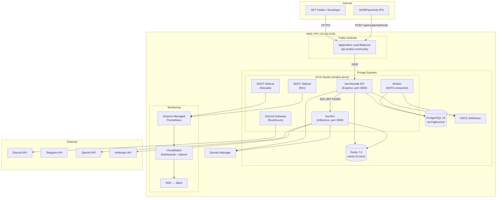
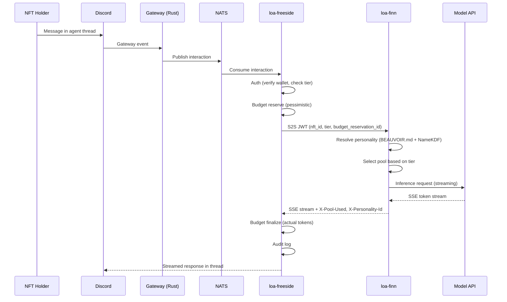
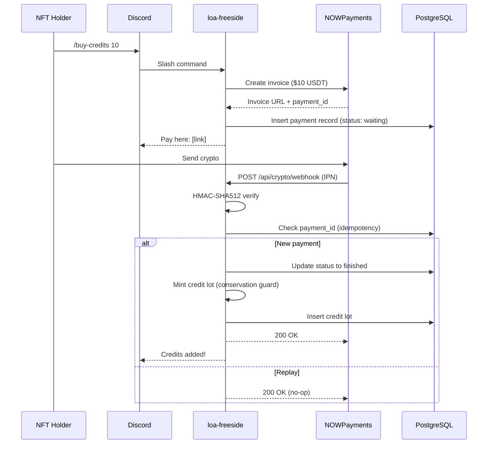
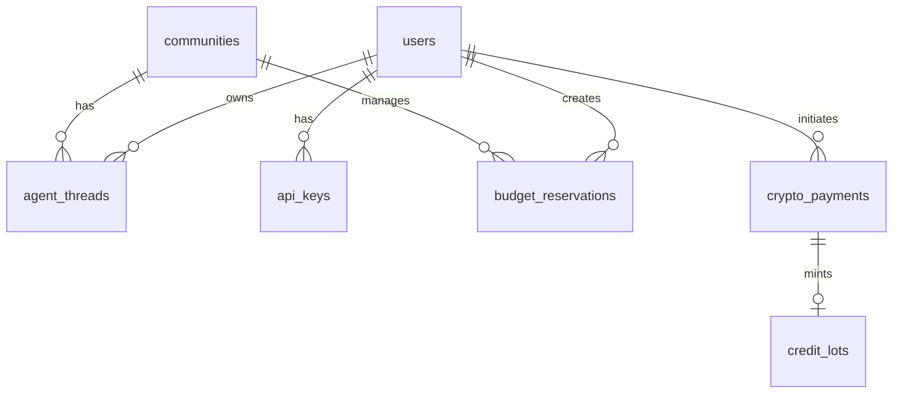

# Software Design Document: Launch Readiness — Production Stack, Payments & Agent Surfaces

**Version:** 1.0.0
**Date:** 2026-02-20
**Author:** Architecture Designer Agent
**Status:** Draft
**PRD Reference:** grimoires/loa/prd.md v1.1.0
**Cycle:** cycle-036

---

## Table of Contents

1. [Project Architecture](#1-project-architecture)
2. [Software Stack](#2-software-stack)
3. [Database Design](#3-database-design)
4. [UI Design](#4-ui-design)
5. [API Specifications](#5-api-specifications)
6. [Error Handling Strategy](#6-error-handling-strategy)
7. [Testing Strategy](#7-testing-strategy)
8. [Development Phases](#8-development-phases)
9. [Known Risks and Mitigation](#9-known-risks-and-mitigation)
10. [Open Questions](#10-open-questions)
11. [Appendix](#11-appendix)

---

## 1. Project Architecture

### 1.1 System Overview

This cycle closes the "last mile" between existing infrastructure and a revenue-generating platform. Both loa-freeside (gateway/orchestration) and loa-finn (inference engine) must be deployed to production on existing AWS ECS infrastructure, with crypto payments enabled, per-NFT personality routing operational, and user surfaces (Discord threads, web chat, admin dashboards) live.

> "The gap between 'infrastructure ready' and 'users can use it'" — prd.md §0

The system is **brownfield** — 52 global sprints across 20 cycles have produced a complete multi-model inference platform with 95 passing payment tests, budget-atomic accounting, and 22+ Discord commands. This SDD designs the integration and deployment layer, not a rebuild.

### 1.2 Architectural Pattern

**Pattern:** Hexagonal (Ports & Adapters) + Event-Driven Microservices

**Justification:**
The codebase already follows hexagonal architecture with well-defined port interfaces in `packages/core/ports/` and adapter implementations in `packages/adapters/`. This cycle extends the pattern by:
- Adding loa-finn as a new ECS service behind the existing service mesh
- Wiring the existing NOWPayments adapter (feature-flagged off) into production
- Extending the existing `AgentGateway` adapter with personality-routing enrichment
- Adding new Discord commands (`/my-agent`, `/buy-credits`) to the existing command registry

No architectural pattern change is needed. The existing pattern supports all new requirements.

### 1.3 Component Diagram



### 1.4 System Components

#### loa-freeside API (Existing — Extended)
- **Purpose:** Public-facing gateway, orchestration, billing, auth
- **Responsibilities:** HTTP API, Discord/Telegram command handling, wallet verification, budget management, NOWPayments webhook processing, S2S JWT signing, audit trail
- **Interfaces:** REST API on port 3000, WebSocket for chat streaming
- **Dependencies:** PostgreSQL (via PgBouncer), Redis, NATS, loa-finn (via service discovery), Secrets Manager
- **Changes this cycle:** Enable NOWPayments flag, add `/my-agent` + `/buy-credits` Discord commands, add `/chat/:tokenId` web route, add admin dashboard endpoints, add JWKS endpoint, add ADOT sidecar

#### loa-finn Inference Engine (New Deployment)
- **Purpose:** Multi-model inference with personality derivation
- **Responsibilities:** Model pool routing, personality selection from NFT metadata, streaming inference, anti-narration enforcement, token counting
- **Interfaces:** HTTP on port 3000 (internal only), SSE streaming
- **Dependencies:** Redis (circuit breaker, model state), OpenAI/Anthropic APIs, Secrets Manager
- **Changes this cycle:** Dockerize, deploy as ECS service, expose S2S JWT validation, return `X-Pool-Used` + `X-Personality-Id` headers, ADOT sidecar

#### Discord Gateway (Existing — No Changes)
- **Purpose:** High-throughput Discord event proxy
- **Responsibilities:** Shard management, event serialization to NATS
- **Interfaces:** Discord WebSocket, NATS publisher
- **Technology:** Rust/Axum with Twilight library

#### Worker (Existing — Extended)
- **Purpose:** Background job processing
- **Responsibilities:** NATS event consumption, reconciliation jobs, budget reaper
- **Changes this cycle:** Add payment reconciliation job (poll NOWPayments every 5 min), add verification refresh job (re-verify wallet ownership every 24h), add orphan reservation cleanup job (every 5 min)

#### PgBouncer (Existing — Configuration Update)
- **Purpose:** PostgreSQL connection pooling
- **Changes this cycle:** Add loa-finn connection pool (pool_size=20, read-only). **Enforced via dedicated DB role:**
  - Create PostgreSQL role `loa_finn_ro` with `SELECT`-only grants on required tables/views (`communities`, `nft_metadata`, `personality_configs`, `agent_threads`, `conviction_tiers`).
  - Set `default_transaction_read_only = on` for the `loa_finn_ro` role.
  - PgBouncer maps finn connections to `loa_finn_ro` — any accidental or malicious write attempt returns `ERROR: cannot execute INSERT/UPDATE/DELETE in a read-only transaction`.
  - Prefer exposing only the minimal read models finn needs; if personality routing data is fully internal to finn, consider removing DB access entirely and passing all context via S2S JWT claims.

### 1.5 Data Flow

#### Inference Request Flow



**Budget Finalization Atomicity:**

Finalization is a single DB transaction that enforces idempotency and single-finalization:

```sql
-- Finalize: only succeeds if reservation is not already finalized
UPDATE budget_reservations
  SET status = 'finalized',
      actual_cost_micro = $actual,
      tokens_used = $tokens,
      finalized_at = NOW(),
      finalization_id = $finalization_id
  WHERE budget_reservation_id = $reservation_id
    AND finalized_at IS NULL;  -- guard: prevents double-finalize

-- In same transaction: insert spend event (UNIQUE index enforces at DB level)
INSERT INTO spend_events (budget_reservation_id, credit_lot_id, amount_micro)
  VALUES ($reservation_id, $lot_id, $actual);
```

**Failure Modes:**
| Scenario | Handling |
|----------|----------|
| Client disconnect during stream | finn completes inference, reports usage via `X-Tokens-Used` header on stream end; freeside finalizes from last received usage |
| Freeside crash after reserve | Orphan cleanup job (every 5 min) releases reservations older than 5 min with status `reserved` |
| Finn completes but freeside misses finalization | **Durable usage reporting (primary):** Finn emits a signed `usage_finalized` event to NATS JetStream (`inference.usage.finalized`) with `{budget_reservation_id, prompt_tokens, completion_tokens, pool_used, personality_id, finn_idempotency_key}`. Freeside subscribes to this subject and finalizes from the event — independent of HTTP stream completion. NATS JetStream provides at-least-once delivery with replay on consumer restart. **Fallback:** Reconciliation job (every 5 min) queries finn's internal `/api/v1/usage/pending` endpoint for reservations that emitted `done` SSE events but have no corresponding NATS ack, and finalizes from that record. |
| Retry after partial finalize | `finalization_id` UNIQUE constraint + `finalized_at IS NULL` guard reject duplicate attempts (idempotent) |

#### Payment Flow



### 1.6 External Integrations

| Service | Purpose | API Type | Auth | Reference |
|---------|---------|----------|------|-----------|
| NOWPayments | Crypto payment processing | REST + IPN webhook | API key + HMAC-SHA512 | docs.nowpayments.io |
| Discord | Chat platform, slash commands | WebSocket + REST | Bot token | discord.js v14 |
| Telegram | Chat platform, bot commands | HTTP long-polling | Bot token | Grammy framework |
| OpenAI | Model inference (GPT pools) | REST + SSE | API key (Secrets Manager) | loa-finn adapter |
| Anthropic | Model inference (Claude pools) | REST + SSE | API key (Secrets Manager) | loa-finn adapter |

### 1.7 Deployment Architecture

**Environment:** AWS ECS Fargate on existing cluster (`arrakis-{env}-cluster`)
**Region:** us-east-1 (existing)
**Strategy:** Rolling update with health check gate

#### New ECS Resources for loa-finn

| Resource | Configuration |
|----------|--------------|
| ECR Repository | `arrakis-{env}-loa-finn` |
| Task Definition | CPU: 512 (prod) / 256 (staging), Memory: 1024 / 512 MB |
| ECS Service | Desired count: 1 (staging), 2 (production) |
| Service Discovery | `finn.arrakis-{env}.local:3000` (Cloud Map) |
| Security Group | Ingress: port 3000 from API SG only |
| Log Group | `/ecs/arrakis-{env}/loa-finn` (30-day retention) |
| ADOT Sidecar | Prometheus metrics scrape to AMP workspace |
| IAM Role | `ecs_execution_loa_finn`: app_config, model API keys only |

#### Modified ECS Resources

| Resource | Change |
|----------|--------|
| API Task Definition | Add ADOT sidecar container, add `FREESIDE_JWKS_URL` env var |
| API IAM Role | Add `agent-jwt-signing-key` secret access for ES256 signing |
| PgBouncer | Add `loa-finn` pool (pool_size=20, pool_mode=transaction) mapped to `loa_finn_ro` role (SELECT-only, `default_transaction_read_only=on`) |
| Worker Task Definition | Add reconciliation job config env vars |

### 1.8 Scalability Strategy

- **Horizontal Scaling:** API service auto-scales 2-10 instances (CPU target 70%). loa-finn service auto-scales 1-4 instances (CPU target 70%).
- **Vertical Scaling:** Not needed at launch. Current task sizes sufficient for expected <100 QPS.
- **Auto-scaling:** ECS target tracking on CPU utilization. Scale-out cooldown: 60s. Scale-in cooldown: 300s.
- **Load Balancing:** ALB distributes to API targets. loa-finn uses ECS service discovery (round-robin DNS) — no ALB target group needed since it's internal-only.

### 1.9 Security Architecture

- **S2S Authentication:** ES256 JWT — freeside signs (`iss: loa-freeside`, `aud: loa-finn`, TTL: 60s), finn validates via JWKS. **JWKS distribution is dual-path:** (1) Internal: finn fetches JWKS from freeside via Cloud Map service discovery (`http://api.arrakis-{env}.local:3000/.well-known/jwks.json`) — no public egress required. (2) Public: `https://api.{domain}/.well-known/jwks.json` for third-party verifiers only. **Finn MUST use the internal path** to avoid dependency on public ALB/DNS/TLS. Key rotation: ES256 keypair in Secrets Manager (single secret containing `{activeKid, keys[]}`), quarterly rotation via scheduled Lambda. **Rotation playbook (strict ordering):** (1) Generate new keypair, add to `keys[]` array in Secrets Manager with new `kid` but do NOT change `activeKid` yet. (2) Wait for JWKS propagation: freeside refreshes from SM every 60s → publishes new public key in JWKS. Finn cache TTL = 5 min. Wait ≥ `max_cache_TTL(5 min) + max_JWT_TTL(60s) + clock_skew(30s)` = **6.5 min minimum** before switching signing key. (3) Update `activeKid` to new kid in Secrets Manager. Freeside picks up within 60s and starts signing with new key. (4) Keep old key in `keys[]` for 24h overlap, then remove. **Automated rotation integration test** runs in staging before any prod rotation: signs JWT with new key, validates via finn JWKS endpoint, confirms both old and new keys verify during overlap. Freeside caches active signing key in memory (refreshed every 60s from Secrets Manager) — signing works even if DB is unavailable.
- **User Authentication:** Discord OAuth2 (existing), SIWE for web widget (new), API keys for Product B (new — two-part key design for hot-path performance):
  - **Key format:** `lf_live_{prefix}_{secret}` / `lf_test_{prefix}_{secret}` where `prefix` is 12 chars base32 (public identifier) and `secret` is 32 chars base62 (high entropy).
  - **Storage:** Store `key_prefix` (plaintext, indexed for lookup) + `key_salt` (16 bytes random, per-key) + `key_hash` = `HMAC-SHA256(PEPPER, salt || secret)` where `PEPPER` is a server-side key in Secrets Manager. Per-key salt ensures that even if DB + pepper are compromised, the attacker cannot precompute a rainbow table — each key requires individual brute-force. NOT bcrypt — HMAC-SHA256 is O(1) and safe for high-QPS auth paths.
  - **Entropy enforcement:** Secret portion must be exactly 32 chars base62 (≥190 bits entropy). Server rejects key creation if entropy check fails.
  - **Auth flow:** Extract prefix from key → lookup by `key_prefix` index → read `(key_salt, key_hash)` → compute `HMAC-SHA256(PEPPER, salt || submitted_secret)` → `crypto.timingSafeEqual(computed, stored_hash)`. On match, cache `(prefix → permissions)` in Redis (5 min TTL, explicit delete on revocation).
  - **Negative cache:** Cache failed prefix lookups (1 min TTL) to prevent enumeration. Rate-limit auth failures per IP (10/min) with exponential backoff.
  - **Breach response plan:** (1) Rotate PEPPER in Secrets Manager (new version). (2) Trigger forced re-hash job: for each active key, re-compute `HMAC-SHA256(NEW_PEPPER, salt || secret)` — this requires a one-time key re-issuance since secrets are not stored. Instead: mark all existing keys as `pending_rotation`, notify users via email/Discord to regenerate keys within 72h, revoke unrotated keys after deadline. (3) Audit alerts: flag keys with >10 failed attempts in 1h, unusual geographic access patterns, or usage outside normal hours.
- **Authorization:** Tier-based access from conviction scoring (9 tiers). Bot-enforced thread gating with layered ownership verification:
  - **Per-message check:** Cached ownership lookup (Redis key `nft_own:{wallet}:{nft_id}`, TTL 60s). On cache miss, query the existing conviction/wallet verification subsystem (indexed DB, not on-chain). **Fail-closed:** if verifier is unavailable, deny gated actions (do not fall back to cache-expired state).
  - **Event-driven invalidation:** On NFT transfer detection (monitored via existing chain event listener), immediately invalidate Redis ownership key (`DEL nft_own:{wallet}:{nft_id}`) and update DB ownership record. Previous owner's thread access revoked on next message; new owner can claim thread via `/my-agent`.
  - **Background re-verification:** Wallet re-verification job (every 24h) refreshes all cached ownership states from chain, catching any missed transfer events.
  - **Max staleness:** 60s under normal operation. On transfer event, staleness drops to 0 (immediate invalidation). On verifier outage, all gated actions denied (no stale access).
- **Data Protection:** TLS 1.2/1.3 in transit (ALB termination), AES-256 encryption at rest (RDS, Redis, Secrets Manager via KMS). BYOK keys: AES-256-GCM envelope encryption with KMS wrap.
- **Network Security:** loa-finn security group allows inbound ONLY from freeside SG on port 3000. No public ALB listener for finn. VPC endpoints for ECR/CloudWatch/S3 (no internet egress needed for AWS services). NAT gateway for external API calls only.

---

## 2. Software Stack

### 2.1 Backend Technologies (loa-freeside)

| Category | Technology | Version | Justification |
|----------|------------|---------|---------------|
| Runtime | Node.js | >=22 | Existing requirement, workspace constraint |
| Language | TypeScript | 5.x | Existing codebase |
| Framework | Express | 4.x | Existing API layer with 80+ routes |
| ORM | Drizzle | 0.30+ | Existing, 60+ migrations |
| Validation | Zod | 3.x | Existing schema validation |
| Discord | discord.js | 14.x | Existing 22+ commands |
| Telegram | Grammy | 1.x | Existing 10+ commands |
| JWT | jose | 5.x | ES256 S2S signing/validation |
| HTTP Client | undici | Built-in | Node.js native fetch for S2S calls |
| Test Runner | Vitest | 1.x | Existing test infrastructure |
| Package Manager | pnpm | 9.15.4 | Existing workspace manager |

### 2.2 Backend Technologies (loa-finn)

| Category | Technology | Version | Justification |
|----------|------------|---------|---------------|
| Runtime | Node.js | >=22 | Cross-repo consistency |
| Language | TypeScript | 5.x | Cross-repo consistency |
| Framework | Express or Fastify | TBD (loa-finn team) | loa-finn owns this decision |
| JWT Validation | jose | 5.x | JWKS fetch + ES256 verify |
| Streaming | SSE | Native | Model API streaming passthrough |

> **Note:** loa-finn's internal architecture is owned by the loa-finn repo. This SDD specifies only the S2S contract interface.

### 2.3 Gateway (Existing)

| Category | Technology | Version | Justification |
|----------|------------|---------|---------------|
| Language | Rust | stable | Existing Discord gateway proxy |
| Framework | Axum | 0.7+ | Existing HTTP/WebSocket framework |
| Discord | Twilight | 0.15+ | Existing shard management |

### 2.4 Infrastructure & DevOps

| Category | Technology | Purpose |
|----------|------------|---------|
| Cloud | AWS (us-east-1) | Existing production environment |
| Container | Docker | ECS Fargate task images |
| Orchestration | ECS Fargate | Existing cluster with 7 services |
| IaC | Terraform | Existing 20 modules, 81 .tf files |
| CI/CD | GitHub Actions | Existing workflows |
| Monitoring | AMP + ADOT | NEW: Prometheus metrics collection |
| Dashboards | CloudWatch | Existing + new panels |
| Alerting | AMP Rules to SNS to Slack | NEW: Conservation guard + health alerts |
| Logging | CloudWatch Logs | Existing, 30-day retention |
| DNS | Route53 | Existing `arrakis.community` zone |
| Secrets | AWS Secrets Manager | Existing, KMS encrypted |
| Message Broker | NATS JetStream | Existing event protocol |
| Connection Pooling | PgBouncer | Existing, extend for loa-finn |

---

## 3. Database Design

### 3.1 Database Technology

**Primary Database:** PostgreSQL 15.10 (existing RDS instance)
**Connection:** PgBouncer (port 6432) with separate pools per service
**ORM:** Drizzle (loa-freeside), TBD (loa-finn — read-only access)

### 3.2 New Schema (This Cycle)

#### Payment State Machine Extension

The existing `crypto_payments` table (migration `021_crypto_payments.ts`) needs status column extension with an explicit state machine:

**Status enum and monotonic ordering:**

| Rank | Status | Terminal? | Can Mint Credits? |
|------|--------|-----------|-------------------|
| 0 | `waiting` | No | No |
| 1 | `confirming` | No | No |
| 2 | `confirmed` | No | No |
| 3 | `sending` | No | No |
| 4 | `finished` | Yes | Yes (exactly once) |
| 5 | `partially_paid` | Yes | No |
| 6 | `failed` | Yes | No |
| 7 | `expired` | Yes | No |
| 8 | `refunded` | Yes | No (compensating debit if previously minted) |

**Transition rule:** A status update is accepted only if the new `status_rank` > current `status_rank`. Terminal-to-terminal transitions (e.g., `finished` → `refunded`) require explicit admin action via the reconcile endpoint and are logged with `reconciliation_source = 'admin'`. Refunds never reverse the original mint — they create a compensating negative credit_lot_adjustment entry.

```sql
-- Migration: 061_payment_state_machine.ts
-- Strategy: Forward-only, expand/contract

ALTER TABLE crypto_payments
  ADD COLUMN IF NOT EXISTS ipn_status TEXT NOT NULL DEFAULT 'waiting'
    CHECK (ipn_status IN ('waiting','confirming','confirmed','sending',
                          'finished','partially_paid','failed','expired','refunded')),
  ADD COLUMN IF NOT EXISTS status_rank INTEGER NOT NULL DEFAULT 0,
  ADD COLUMN IF NOT EXISTS crypto_amount NUMERIC,
  ADD COLUMN IF NOT EXISTS crypto_currency TEXT,
  ADD COLUMN IF NOT EXISTS usd_equivalent NUMERIC,
  ADD COLUMN IF NOT EXISTS last_ipn_at TIMESTAMP WITH TIME ZONE,
  ADD COLUMN IF NOT EXISTS reconciled_at TIMESTAMP WITH TIME ZONE,
  ADD COLUMN IF NOT EXISTS reconciliation_source TEXT,  -- 'ipn' | 'poll' | 'admin'
  ADD COLUMN IF NOT EXISTS credits_minted_at TIMESTAMP WITH TIME ZONE,  -- DB-level mint guard
  ADD COLUMN IF NOT EXISTS credits_mint_event_id TEXT UNIQUE;            -- idempotency key for mint

-- Idempotency (verify exists from 021)
CREATE UNIQUE INDEX IF NOT EXISTS idx_crypto_payments_payment_id
  ON crypto_payments(payment_id);

-- Stuck payment query
CREATE INDEX IF NOT EXISTS idx_crypto_payments_stuck
  ON crypto_payments(ipn_status, created_at)
  WHERE ipn_status IN ('waiting', 'confirming', 'confirmed', 'sending');

-- Credit mint idempotency: ensure only one credit lot per payment
-- (enforced BOTH on crypto_payments.credits_mint_event_id UNIQUE
--  AND credit_lots.payment_id UNIQUE — belt and suspenders)
CREATE UNIQUE INDEX IF NOT EXISTS idx_credit_lots_payment_id
  ON credit_lots(payment_id) WHERE payment_id IS NOT NULL;
```

**Credit Mint Guard (CRITICAL — all mint paths MUST use this pattern):**

All mint-triggering code paths (IPN webhook, reconciliation poll, admin reconcile endpoint) MUST use the same single-transaction mint pattern:

```sql
-- All mint paths run inside a single transaction with SERIALIZABLE or explicit row lock:
BEGIN;

-- Step 1: Lock the payment row to prevent concurrent mint races
SELECT id, ipn_status, status_rank, credits_minted_at
  FROM crypto_payments
  WHERE payment_id = :payment_id
  FOR UPDATE;  -- row-level lock; concurrent transactions block here

-- Step 2: Atomically claim the mint (only succeeds once per payment)
UPDATE crypto_payments
SET ipn_status = :new_status,
    status_rank = :new_rank,
    last_ipn_at = NOW(),
    credits_minted_at = CASE
      WHEN :new_status = 'finished' AND credits_minted_at IS NULL
      THEN NOW() ELSE credits_minted_at END,
    credits_mint_event_id = CASE
      WHEN :new_status = 'finished' AND credits_minted_at IS NULL
      THEN :mint_event_id ELSE credits_mint_event_id END
WHERE payment_id = :payment_id
  AND status_rank < :new_rank  -- monotonic guard: reject stale/out-of-order
RETURNING id, ipn_status, credits_minted_at;

-- Step 3: Only if returned credits_minted_at = NOW() (i.e., we claimed the mint)
--   INSERT INTO credit_lots (payment_id, ...) VALUES (:payment_id, ...)
-- If credits_minted_at was already set, no-op — mint already happened

-- Step 4: If no rows updated at all → stale IPN, return 200 OK (no-op)

COMMIT;
```

**Concurrency safety:** The `SELECT ... FOR UPDATE` serializes all concurrent webhook, poll, and admin reconcile attempts on the same `payment_id`. This prevents TOCTOU races where two paths both see `credits_minted_at IS NULL` and both attempt to mint. The row lock is held only for the duration of the transaction (milliseconds).

**Refund handling:** Refunds are modeled as compensating ledger entries (negative credit lot or debit event), NOT as reversal of the original mint. The `credits_minted_at` field is never cleared. A refund creates a new `credit_lot_adjustments` entry with negative amount referencing the original `credit_lot_id`. This preserves the full audit trail and prevents the original mint guard from being bypassed.

#### JWKS Public Key Registry

The **private signing key lives exclusively in Secrets Manager** (single secret: `arrakis-{env}/s2s-signing-keys`). The secret contains a JSON structure: `{"activeKid":"key-2026-02","keys":[{"kid":"...","privateKey":"PEM...","publicKey":"PEM..."}]}`. Freeside loads this on startup and refreshes every 60s — **no DB dependency for signing**.

The DB stores only **public keys** for serving the JWKS endpoint (allows DB-independent rotation visibility):

```sql
-- Migration: 062_jwks_public_keys.ts

CREATE TABLE s2s_jwks_public_keys (
  kid TEXT PRIMARY KEY,
  public_key_jwk JSONB NOT NULL,              -- JWK format (kty, crv, x, y, kid, alg, use)
  algorithm TEXT NOT NULL DEFAULT 'ES256',
  status TEXT NOT NULL DEFAULT 'active',       -- 'active' | 'rotated' | 'revoked'
  activated_at TIMESTAMP WITH TIME ZONE NOT NULL DEFAULT NOW(),
  rotated_at TIMESTAMP WITH TIME ZONE,
  expires_at TIMESTAMP WITH TIME ZONE,         -- rotated_at + 24h overlap
  created_at TIMESTAMP WITH TIME ZONE NOT NULL DEFAULT NOW()
);

CREATE INDEX idx_jwks_public_keys_status ON s2s_jwks_public_keys(status)
  WHERE status IN ('active', 'rotated');
```

**No private key material in the database.** Rotation Lambda updates Secrets Manager first, then inserts the new public key into this table and marks the old one as `rotated` with a 24h `expires_at`.

#### Discord Agent Threads

```sql
-- Migration: 063_agent_threads.ts

CREATE TABLE agent_threads (
  id UUID PRIMARY KEY DEFAULT gen_random_uuid(),
  community_id UUID NOT NULL REFERENCES communities(id),
  user_id UUID NOT NULL REFERENCES users(id),
  nft_token_id TEXT NOT NULL,
  discord_thread_id TEXT NOT NULL,
  discord_channel_id TEXT NOT NULL,
  thread_type TEXT NOT NULL DEFAULT 'public',
  personality_id TEXT,
  status TEXT NOT NULL DEFAULT 'active',
  last_verified_at TIMESTAMP WITH TIME ZONE NOT NULL DEFAULT NOW(),
  created_at TIMESTAMP WITH TIME ZONE NOT NULL DEFAULT NOW(),
  updated_at TIMESTAMP WITH TIME ZONE NOT NULL DEFAULT NOW()
);

CREATE UNIQUE INDEX idx_agent_threads_nft ON agent_threads(community_id, nft_token_id)
  WHERE status = 'active';
CREATE INDEX idx_agent_threads_user ON agent_threads(user_id, status);
CREATE INDEX idx_agent_threads_discord ON agent_threads(discord_thread_id);
CREATE INDEX idx_agent_threads_stale ON agent_threads(last_verified_at)
  WHERE status = 'active';
```

#### Budget Reservations

```sql
-- Migration: 064_budget_reservations.ts

CREATE TABLE budget_reservations (
  id UUID PRIMARY KEY DEFAULT gen_random_uuid(),
  budget_reservation_id TEXT NOT NULL UNIQUE,
  finalization_id TEXT UNIQUE,  -- idempotency key for finalize; NULL until finalized
  community_id UUID NOT NULL REFERENCES communities(id),
  user_id UUID NOT NULL REFERENCES users(id),
  pool_id TEXT NOT NULL,
  estimated_cost_micro BIGINT NOT NULL,
  actual_cost_micro BIGINT,
  tokens_used INTEGER,
  status TEXT NOT NULL DEFAULT 'reserved'
    CHECK (status IN ('reserved', 'streaming', 'finalized', 'released', 'orphan_released')),
  created_at TIMESTAMP WITH TIME ZONE NOT NULL DEFAULT NOW(),
  finalized_at TIMESTAMP WITH TIME ZONE,
  released_at TIMESTAMP WITH TIME ZONE
);

CREATE INDEX idx_reservations_status ON budget_reservations(status, created_at);
CREATE INDEX idx_reservations_community ON budget_reservations(community_id, created_at);
CREATE INDEX idx_reservations_orphan ON budget_reservations(status, created_at)
  WHERE status = 'reserved';

-- Spend ledger linking reservations to credit lot debits (conservation guard)
CREATE TABLE spend_events (
  id UUID PRIMARY KEY DEFAULT gen_random_uuid(),
  budget_reservation_id TEXT NOT NULL REFERENCES budget_reservations(budget_reservation_id),
  credit_lot_id UUID NOT NULL,
  amount_micro BIGINT NOT NULL,
  created_at TIMESTAMP WITH TIME ZONE NOT NULL DEFAULT NOW()
);

CREATE UNIQUE INDEX idx_spend_events_reservation
  ON spend_events(budget_reservation_id);  -- enforces single-finalization
```

#### API Keys (Product B)

```sql
-- Migration: 065_api_keys.ts

CREATE TABLE api_keys (
  id UUID PRIMARY KEY DEFAULT gen_random_uuid(),
  user_id UUID NOT NULL REFERENCES users(id),
  key_hash TEXT NOT NULL,       -- HMAC-SHA256(PEPPER, salt || secret) — NOT bcrypt (hot-path performance)
  key_salt TEXT NOT NULL,       -- 16 bytes random hex, per-key (prevents rainbow tables on DB+pepper compromise)
  key_prefix TEXT NOT NULL,     -- 12 chars base32, public identifier for O(1) lookup
  environment TEXT NOT NULL DEFAULT 'test',
  name TEXT,
  scopes JSONB NOT NULL DEFAULT '["inference"]',
  rate_limit_rpm INTEGER NOT NULL DEFAULT 60,
  rate_limit_tpd INTEGER NOT NULL DEFAULT 100000,
  status TEXT NOT NULL DEFAULT 'active',
  last_used_at TIMESTAMP WITH TIME ZONE,
  created_at TIMESTAMP WITH TIME ZONE NOT NULL DEFAULT NOW(),
  revoked_at TIMESTAMP WITH TIME ZONE
);

CREATE UNIQUE INDEX idx_api_keys_prefix ON api_keys(key_prefix);
CREATE INDEX idx_api_keys_user ON api_keys(user_id, status);
```

### 3.3 Entity Relationships



### 3.4 Migration Strategy

> From prd.md §8: "Forward-only migrations with expand/contract pattern"

| Rule | Implementation |
|------|---------------|
| No destructive DDL | No `DROP COLUMN`, `DROP TABLE` in Phase 1 migrations |
| Expand/contract | New columns added now; deprecated columns removed in next cycle |
| Pre-deploy execution | Migrations run as one-shot ECS task before service update |
| Backward compatibility | Old code works with new schema during rolling update |
| Ownership | loa-freeside owns all migrations; loa-finn reads via PgBouncer |
| Rollback testing | Every migration tested in staging with previous task def |

### 3.4.1 Deployment Rollback Runbook

| Failure Scenario | Rollback Action | RTO Target |
|------------------|----------------|------------|
| ECS task fails health check after deploy | ECS auto-rolls back to previous task definition (circuit breaker: 50% failure threshold) | <5 min (automatic) |
| Migration succeeds but app code fails | Roll back ECS task definition to previous version; schema is forward-compatible (expand/contract) so old code works with new schema | <10 min |
| Migration partially applied | Migrations are wrapped in transactions; partial apply = full rollback of that migration. Re-run after fix. | <15 min |
| Bad migration reaches staging | Never deploy migration to prod without staging validation. If staging breaks: fix-forward with a new migration (no manual DDL). | N/A (staging gate) |
| Payment webhook route misconfigured | ALB listener rule rollback via Terraform apply of previous state. Payments queue in NOWPayments and retry. | <15 min |
| S2S JWT signing key rotation failure | Overlap window (24h) means old key still valid. Roll back Secrets Manager to previous version. Restart freeside to reload. | <5 min |

**RTO/RPO Targets:**
- **Application rollback:** <10 min (ECS task definition revert)
- **Database:** RTO <1h (snapshot restore), RPO <5 min (WAL-based point-in-time recovery)
- **Who executes:** On-call engineer via runbook; ECS auto-rollback handles most cases automatically

### 3.5 Data Access Patterns

| Query | Frequency | Optimization |
|-------|-----------|--------------|
| Payment lookup by `payment_id` | Per-webhook (low) | UNIQUE index |
| Stuck payments scan | Every 5 min (cron) | Partial index on status + created_at |
| Active thread by NFT token | Per-message (high) | Composite unique index |
| Stale verification check | Every 24h (cron) | Partial index on `last_verified_at` |
| Budget reservation by ID | Per-inference (medium) | UNIQUE index on `budget_reservation_id` |
| Orphan reservation scan | Every 5 min (cron) | Partial index on status + created_at |
| API key auth | Per-request (high) | Index on `key_prefix` + Redis cache (5 min TTL) |
| Admin usage dashboard | On-demand (low) | Aggregate query with date range |

### 3.6 Caching Strategy

| Data | Cache | TTL | Invalidation |
|------|-------|-----|-------------|
| API key to permissions | Redis hash | 5 min | On revocation (explicit delete) |
| NFT ownership verification | Redis hash | 60s | On re-verification |
| Wallet to tier mapping | Redis hash | 5 min | On score change |
| Rate limit counters | Redis sorted set | Per-window (1 min / 1 day) | Auto-expire |
| JWKS public keys | In-memory (finn) | 5 min | Refetch on JWT validation failure |
| Thread to NFT mapping | Redis hash | 10 min | On thread creation/transfer |

**Redis maxmemory-policy:** `allkeys-lru` (per PRD §5)
**Circuit breaker:** Redis unavailability degrades to in-memory fallback for rate limiting; inference continues.

### 3.7 Backup and Recovery

| Parameter | Value |
|-----------|-------|
| RDS backup frequency | Daily (03:00-04:00 UTC) |
| Retention period | 7 days |
| RTO | <1 hour (restore from snapshot) |
| RPO | <24 hours (daily backup) + WAL for point-in-time |
| Final snapshot | Enabled before deletion |

---

## 4. UI Design

### 4.1 Discord Surfaces (Primary)

No traditional UI — Discord is the primary Product A interface. New slash commands:

| Command | Purpose | Handler Location |
|---------|---------|-----------------|
| `/my-agent` | Create dedicated thread per NFT | `themes/sietch/src/discord/commands/my-agent.ts` (NEW) |
| `/buy-credits [amount]` | NOWPayments checkout URL | `themes/sietch/src/discord/commands/buy-credits.ts` (NEW) |
| `/agent-info` | Show personality summary | `themes/sietch/src/discord/commands/agent-info.ts` (NEW) |
| `/budget` | Admin: show spend breakdown | Extend existing `admin-stats.ts` |

### 4.2 Web Chat Widget

#### Embeddable Widget (FR-3.6)

```html
<!-- Community embeds this single script tag -->
<script src="https://api.arrakis.community/widget/chat.js"
        data-token-id="42"
        data-community="0x..."
        data-theme="dark">
</script>
```

**Architecture:**
- Static JS bundle served from freeside Express static route
- WebSocket connection to `wss://api.arrakis.community/ws/chat` with lifecycle constraints:
  - **Idle timeout:** 300s (aligned with ALB idle timeout setting; client sends ping every 30s)
  - **Server heartbeat:** Ping frame every 30s; close connection if no pong within 10s
  - **Max connections per user:** 3 concurrent WebSocket connections per wallet address (enforced via Redis counter)
  - **Max message size:** 4KB inbound (chat messages); outbound unbounded (streaming responses)
  - **Graceful drain on deploy:** ECS task draining period = 120s. On SIGTERM, stop accepting new connections, send close frame with 1001 (Going Away) to active clients, allow in-flight streams to complete up to drain timeout
  - **Client reconnection:** Client JS implements exponential backoff (1s, 2s, 4s, max 30s) with jitter on disconnect. Session token re-validated on reconnect.
- Auth: SIWE wallet login per EIP-4361 to short-lived session token (JWT, 1h TTL)
  - **Nonce:** Server-generated, 16 bytes hex, stored in Redis with 5 min TTL, single-use (deleted on verification)
  - **Message fields verified:** `domain` must match `api.arrakis.community`, `uri` must match request origin, `chainId` must be supported chain (1 for Ethereum mainnet, Berachain if applicable), `issuedAt` within ±5 min clock skew, `expirationTime` if present must be future
  - **Session token:** JWT (`HS256`, signed with session secret from Secrets Manager) containing `{sub: walletAddress, iat, exp: +1h, nonce_hash}`. Rotated on each new SIWE sign-in (previous session invalidated via Redis session store delete).
  - **Origin binding:** `Referer`/`Origin` header checked against allowed widget embed domains
- Unauthenticated: read-only agent profile display
- Styling: CSS custom properties for community theming

#### Standalone Chat Page (FR-3.7)

| Route | Auth | Purpose |
|-------|------|---------|
| `GET /chat/:tokenId` | None (read-only) | Agent profile + past public interactions |
| `POST /chat/:tokenId/message` | SIWE session | Send message, receive streamed response |
| `GET /ws/chat/:tokenId` | SIWE session | WebSocket for streaming |

**Implementation:** New Express routes in `themes/sietch/src/api/routes/chat.routes.ts` (NEW). Server-side rendered landing page with minimal HTML + hydration script.

### 4.3 Admin Dashboard

| Endpoint | Purpose | UI |
|----------|---------|-----|
| `GET /api/v1/admin/community/:id/usage` | Spend breakdown by pool | JSON (frontend TBD) |
| `GET /api/v1/admin/community/:id/billing` | Billing history | JSON |
| `GET /api/v1/admin/community/:id/agents` | Agent list with thread status | JSON |
| `GET /api/v1/admin/community/:id/conservation` | Conservation guard status | JSON |
| `GET /api/v1/admin/community/:id/audit` | JSONL audit export | Stream |

Admin dashboard is **API-first** this cycle — JSON endpoints that can be consumed by Discord embeds or a future web dashboard. No custom web UI for admin in P0.

---

## 5. API Specifications

### 5.1 API Design Principles

- **Style:** REST with JSON bodies, SSE for streaming
- **Versioning:** URL path (`/api/v1/`)
- **Authentication:** Bearer token (Discord OAuth2 session, SIWE session, API key)
- **S2S:** ES256 JWT in `Authorization: Bearer` header (freeside to finn)

### 5.2 S2S Contract (loa-freeside to loa-finn)

#### Inference Request

```http
POST http://finn.arrakis-{env}.local:3000/api/v1/inference
Authorization: Bearer <S2S_JWT>
Content-Type: application/json
Accept: text/event-stream
```

```json
{
  "messages": [
    {"role": "user", "content": "Hello, agent!"}
  ],
  "stream": true,
  "max_tokens": 2048
}
```

**S2S JWT Claims:**
```json
{
  "iss": "loa-freeside",
  "aud": "loa-finn",
  "exp": 1708425600,
  "iat": 1708425540,
  "nft_id": "42",
  "tier": "diamond",
  "budget_reservation_id": "res_abc123",
  "community_id": "comm_xyz"
}
```

**Response (SSE stream):**
```
data: {"type":"token","content":"Hello"}
data: {"type":"token","content":" there"}
data: {"type":"done","usage":{"prompt_tokens":15,"completion_tokens":42}}
```

**Response Headers:**
```
X-Pool-Used: reasoning
X-Personality-Id: beauvoir-42-diamond
X-Budget-Reservation-Id: res_abc123
X-Token-Count: 42
```

#### Health Check

```http
GET http://finn.arrakis-{env}.local:3000/health
```

Response: `200 OK` with `{"status":"ok","version":"1.0.0"}`

#### Frozen S2S Contract (v1.0.0)

This contract is **frozen** — freeside and finn MUST agree on these exact semantics before integration begins. Changes require versioned negotiation.

| Aspect | Contract |
|--------|----------|
| Endpoint | `POST /api/v1/inference` |
| Auth | `Authorization: Bearer <ES256 JWT>` with claims: `iss`, `aud`, `exp`, `iat`, `nft_id`, `tier`, `budget_reservation_id`, `community_id` |
| Request body | `{"messages": [...], "stream": true, "max_tokens": N}` |
| SSE event types | `token` (content string), `done` (usage object with `prompt_tokens`, `completion_tokens`), `error` (code + message) |
| Response headers | `X-Pool-Used`, `X-Personality-Id`, `X-Budget-Reservation-Id`, `X-Token-Count` |
| Health endpoint | `GET /health` → `200 {"status":"ok","version":"..."}` |
| Docker launch profile | Dockerfile exposing port 3000, `NODE_ENV=production`, `JWKS_URL` env var for internal JWKS endpoint |
| Resource sizing | CPU: 512, Memory: 1024 (minimum for launch; scale based on load testing) |
| **Compatibility gate** | CI runs contract test suite against pinned finn Docker image before any staging deploy |

### 5.3 JWKS Endpoint (loa-freeside hosts)

```http
GET https://api.arrakis.community/.well-known/jwks.json
```

```json
{
  "keys": [
    {
      "kty": "EC",
      "crv": "P-256",
      "kid": "key-2026-02",
      "x": "...",
      "y": "...",
      "use": "sig",
      "alg": "ES256"
    }
  ]
}
```

**Implementation:** New route in `themes/sietch/src/api/routes/jwks.routes.ts` (NEW). Reads active public keys from `s2s_jwks_public_keys` table. Cached in-memory (5 min TTL). Returns both active and rotated (not-yet-expired) keys for overlap window.

### 5.4 NOWPayments Webhook

```http
POST https://api.arrakis.community/api/crypto/webhook
Content-Type: application/json
x-nowpayments-sig: <HMAC-SHA512>
```

**Raw Body Capture (CRITICAL):** The `/api/crypto/webhook` route MUST use Express `verify` callback to capture the raw request body bytes before JSON parsing. HMAC-SHA512 is computed over the exact raw bytes sent by NOWPayments — re-serializing a parsed JSON object will produce different bytes and fail verification intermittently.

```typescript
// In Express app setup — raw body capture for webhook verification
app.use('/api/crypto/webhook', express.json({
  verify: (req, _res, buf) => {
    (req as any).rawBody = buf;
  }
}));
```

**HMAC Verification Steps:**
1. Read header `x-nowpayments-sig` (lowercase)
2. Compute `HMAC-SHA512(rawBody, IPN_SECRET_KEY)` where `IPN_SECRET_KEY` is from Secrets Manager
3. Compare using `crypto.timingSafeEqual()` — constant-time comparison
4. Reject if signature missing or mismatch (return 400, log attempt)

**Replay Protection:** Store `(payment_id, ipn_status, received_at)` and reject duplicate `(payment_id, ipn_status)` pairs. The transition guard from §3.2 (status_rank monotonic ordering) provides additional protection against out-of-order replays.

**Rate Limiting & DoS Protection:**
- ALB rate limit rule: 100 requests/min per source IP on `/api/crypto/webhook` path (NOWPayments sends ≤3 retries per event; legitimate traffic is <10 req/min)
- Per-`payment_id` throttle: Redis counter, max 10 IPNs per payment_id per hour (reject with 429 after limit)
- WAF rule (if enabled): Block requests without `x-nowpayments-sig` header before reaching Express (saves compute)
- NOWPayments IP allowlist: If NOWPayments publishes webhook source IPs, restrict at ALB/SG level

**Processing:** Existing `CryptoWebhookService` at `themes/sietch/src/services/billing/CryptoWebhookService.ts` handles HMAC verification and LVVER pattern. This cycle: enable feature flag, wire to production ALB, extend status handling for full state machine, add raw body capture and replay protection.

### 5.5 Admin API Endpoints (New)

| Method | Endpoint | Auth | Response |
|--------|----------|------|----------|
| GET | `/api/v1/admin/community/:id/usage` | Admin session | `{total_spend, by_pool, by_user, projected_depletion}` |
| GET | `/api/v1/admin/community/:id/billing` | Admin session | `{transactions, total, period}` |
| GET | `/api/v1/admin/community/:id/agents` | Admin session | `{agents: [{nft_id, personality_id, thread_id, last_active}]}` |
| GET | `/api/v1/admin/community/:id/conservation` | Admin session | `{status, guards, last_check, history}` |
| GET | `/api/v1/admin/community/:id/audit` | Admin session | JSONL stream (application/x-ndjson) |
| POST | `/api/v1/admin/payments/:paymentId/reconcile` | Admin session | `{status, previous_status, credits_minted}` |
| GET | `/api/v1/admin/payments?status=stuck` | Admin session | `{payments: [{payment_id, status, age_minutes}]}` |

### 5.6 API Key Endpoints (Product B)

| Method | Endpoint | Auth | Response |
|--------|----------|------|----------|
| POST | `/api/v1/keys` | SIWE session | `{key: "lf_live_abc...", id, name}` (shown once) |
| GET | `/api/v1/keys` | SIWE session | `{keys: [{id, prefix, name, status, last_used}]}` |
| DELETE | `/api/v1/keys/:id` | SIWE session | `{revoked: true}` |
| POST | `/api/v1/keys/:id/rotate` | SIWE session | `{key: "lf_live_xyz...", old_revoked: true}` |

### 5.7 Chat Endpoints (Web Widget)

| Method | Endpoint | Auth | Response |
|--------|----------|------|----------|
| GET | `/chat/:tokenId` | None | HTML page (agent profile, read-only) |
| POST | `/api/v1/chat/:tokenId/auth` | SIWE signature | `{session_token, expires_at}` |
| WS | `/ws/chat/:tokenId` | Session token (query param) | Bidirectional WebSocket |

---

## 6. Error Handling Strategy

### 6.1 Error Categories

| Category | HTTP Status | Code | Example |
|----------|-------------|------|---------|
| Validation | 400 | `VALIDATION_ERROR` | Invalid credit amount |
| Auth | 401 | `UNAUTHORIZED` | Expired JWT, invalid API key |
| Forbidden | 403 | `FORBIDDEN` | Non-holder accessing agent thread |
| Not Found | 404 | `NOT_FOUND` | Unknown token ID |
| Conflict | 409 | `CONFLICT` | Thread already exists for NFT |
| Rate Limited | 429 | `RATE_LIMITED` | Per-key or per-user limit exceeded |
| Budget | 402 | `INSUFFICIENT_BUDGET` | No credits remaining |
| Upstream | 502 | `UPSTREAM_ERROR` | loa-finn unreachable or model API error |
| Server | 500 | `INTERNAL_ERROR` | Unexpected failure |

### 6.2 Error Response Format

```json
{
  "error": {
    "code": "INSUFFICIENT_BUDGET",
    "message": "Not enough credits. Current balance: 0.50 USD",
    "details": {
      "balance_micro": 500000,
      "required_micro": 1000000
    },
    "requestId": "req_abc123"
  }
}
```

### 6.3 Logging Strategy

- **Format:** Structured JSON (existing pattern)
- **Levels:** ERROR (alerts), WARN (monitoring), INFO (audit), DEBUG (development)
- **Correlation:** Request ID propagated through S2S JWT (`budget_reservation_id`)
- **Destination:** CloudWatch Logs (`/ecs/arrakis-{env}/{service}`, 30-day retention)
- **Sensitive data:** Wallet addresses logged (pseudonymous per FR-4.4). API keys never logged.

### 6.4 Circuit Breakers

| Component | Breaker | Threshold | Fallback |
|-----------|---------|-----------|----------|
| loa-finn | opossum | 5 failures / 30s | 502 "Inference temporarily unavailable" |
| Redis | RedisCircuitBreaker (existing) | 3 failures / 10s | In-memory rate limiting, skip cache |
| NOWPayments API | opossum | 3 failures / 60s | Queue for retry, log warning |
| Model APIs (via finn) | Per-pool breaker | 3 failures / 30s | Fallback pool or 502 |

---

## 7. Testing Strategy

### 7.1 Testing Pyramid

| Level | Coverage Target | Tools | Focus |
|-------|-----------------|-------|-------|
| Unit | 80% new code | Vitest | Payment state machine, budget lifecycle, JWT signing |
| Integration | Key flows | Vitest + testcontainers | S2S JWT exchange, webhook to credit mint, thread creation |
| E2E | Critical paths | Manual + staging | Go/no-go gate checklist (8 items from PRD §8) |

### 7.2 Critical Test Scenarios

| Scenario | Type | Pass Criteria |
|----------|------|--------------|
| NOWPayments webhook to credit mint | Integration | Credits appear, conservation guard passes |
| Webhook replay (same payment_id) | Integration | 200 OK, no duplicate credits |
| Out-of-order IPN delivery | Integration | Stale status ignored |
| S2S JWT with wrong `aud` | Unit | 401 rejection |
| S2S JWT expired | Unit | 401 rejection |
| Budget reserve to stream to finalize | Integration | Balance correct after partial stream |
| Orphan reservation cleanup | Integration | Released after 5 min |
| Thread ownership transfer | Integration | Old holder blocked, new thread created |
| API key auth + rate limiting | Integration | 429 after limit exceeded |
| Conservation guard failure to alert | E2E (staging) | Slack notification within 60s |

### 7.3 Go/No-Go Gate (Pre-Production)

Per PRD §8, all gates must pass in staging:
1. E2E payment (NOWPayments sandbox to webhook to credit mint)
2. S2S JWT exchange (real ALB/service discovery, reject expired/wrong-aud)
3. JWT rotation (old + new keys valid during overlap window)
4. Personality routing (two NFTs to different pools)
5. Webhook delivery (idempotent replay)
6. Monitoring (conservation failure to Slack within 60s)
7. Health checks (5 consecutive 200s on both services)
8. Feature flag kill switch (payments disabled in <5 min)
9. Load baseline (10 concurrent users, no 5xx)

---

## 8. Development Phases

### Phase 1: Foundation — Deploy + S2S Auth (Track 0 Core)

**Goal:** Both services running on ECS with authenticated S2S communication.

- Terraform: loa-finn ECS service, ECR repo, security group, service discovery
- Terraform: ADOT sidecar on API + finn task definitions
- Terraform: AMP workspace + alerting rules
- Docker Compose: full-stack local dev (freeside + finn + Redis + PostgreSQL)
- JWKS endpoint: `/.well-known/jwks.json` route on freeside
- S2S JWT signing service: ES256 sign with Secrets Manager key
- Database migrations: 061-065
- Health check endpoint verification on both services

### Phase 2: Revenue — Payments + Credit Mint (Track 1A)

**Goal:** Users can buy credits with crypto.

- Enable `FEATURE_CRYPTO_PAYMENTS_ENABLED=true` in staging
- Wire NOWPayments webhook to ALB route
- Extend CryptoWebhookService for full IPN state machine
- Payment reconciliation job (poll every 5 min)
- Discord `/buy-credits` command
- Telegram `/buy-credits` command
- Credit pack tier configuration:

**Pricing & Conversion (Single Source of Truth):**

| Pack | USD | Micro-credits (1 USD = 1,000,000 micro) | Bonus |
|------|-----|----------------------------------------|-------|
| Starter | $5 | 5,000,000 | 0% |
| Standard | $10 | 10,500,000 | 5% |
| Premium | $25 | 27,500,000 | 10% |

- **Rounding rule:** All micro-credit arithmetic uses `BigInt`. No floating-point. Per-token cost computed as `Math.ceil(cost_micro_per_token * tokens_used)` — always round UP against the user (conservative). Minimum charge: 1 micro-credit per inference request.
- **Partially paid handling:** If NOWPayments reports `partially_paid`, no credits are minted. Admin can manually reconcile via `/api/v1/admin/payments/:paymentId/reconcile` after verifying the actual amount. User sees "Payment incomplete — contact support" in Discord.
- **Minimum payment:** $5 (enforced in NOWPayments create-payment call). Amounts below minimum rejected at command level.
- **Currency display:** All user-facing amounts show USD equivalent. Internal accounting exclusively in micro-credits (BigInt).

- Integration tests: webhook to credit mint, replay, edge states

### Phase 3: Personality — NFT Routing Bridge (Track 2)

**Goal:** Different NFTs get different model routing.

- Inference request enrichment: add nft_id + tier + budget_reservation_id to S2S JWT
- Budget reservation lifecycle: reserve to finalize to orphan cleanup
- Parse X-Pool-Used + X-Personality-Id response headers
- Budget finalization with actual token count
- Anti-narration enforcement verification
- Integration tests: two NFTs to different pools

### Phase 4: Surfaces — Discord Threads + Dashboard (Track 3 + 4)

**Goal:** Users can chat with their agent in dedicated threads; admins see usage.

- Discord `/my-agent` command: thread creation with bot-enforced gating
- Thread message routing through personality bridge
- Ownership re-verification (per-message, cached 60s)
- Wallet re-verification job (every 24h)
- Token transfer handling (ownership change to new thread)
- Discord `/agent-info` command
- Admin API endpoints (usage, billing, agents, conservation, audit)
- JSONL audit trail export
- Pool enforcement transparency

### Phase 5: Platform — API Keys + Web Chat (Product B + Track 3)

**Goal:** Developers can self-serve API keys; web chat available.

- API key generation (two-part key: prefix + HMAC-SHA256 hashed secret)
- API key auth middleware on inference routes
- Per-key rate limiting (RPM + TPD)
- Key management endpoints (create, list, revoke, rotate)
- Web chat widget: static JS bundle + WebSocket endpoint
- Standalone chat page: `/chat/:tokenId`
- SIWE auth flow for web widget

### Phase 6: Hardening — Monitoring + Go/No-Go (Track 0 Monitor)

**Goal:** Production-ready monitoring, all go/no-go gates pass.

- CloudWatch dashboards: inference latency, error rate, billing flow, auth failures, conservation guard
- AMP alerting rules: conservation failure to SNS to Slack within 60s
- Service health check alerting
- Feature flag kill switch verification
- Load baseline test (10 concurrent users)
- Go/no-go gate checklist execution
- Production deploy (if all gates pass)

---

## 9. Known Risks and Mitigation

| Risk | Probability | Impact | Mitigation |
|------|-------------|--------|------------|
| loa-finn Dockerfile not ready | Medium | Blocks Track 0 | Can create Dockerfile from freeside if needed; escalate after 3 days |
| loa-finn personality derivation not in inference endpoint | Medium | Blocks Track 2 | Stub with static personality config (loa-finn#88) |
| Redis cache.t3.micro memory pressure | Low | Latency | maxmemory-policy allkeys-lru, TTLs enforced, upgrade to t3.small if >80% |
| PgBouncer connection exhaustion | Low | 503 errors | Separate pools per service (20 each), queue timeout 5s |
| NOWPayments IPN delivery failure | Low | Missed payments | Reconciliation job polls every 5 min, admin repair endpoint |
| ES256 key rotation failure | Low | Auth outage | 24h overlap window, test rotation in staging |
| Discord thread permission issues | Medium | Degraded UX | Bot checks permissions; posts "missing permissions" if degraded |
| Streaming budget leak (orphaned reservations) | Low | Credit loss | Orphan cleanup job (5 min), budget drift monitor alerts |

---

## 10. Open Questions

| Question | Owner | Status | Notes |
|----------|-------|--------|-------|
| loa-finn Dockerfile format and build process | loa-finn team | Open | Blocks FR-0.1 |
| loa-finn inference endpoint exact URL and contract | loa-finn team | Open | Assumed `/api/v1/inference` per RFC |
| Personality derivation mechanism (static vs dynamic) | loa-finn team | Open | loa-finn#88 vs #86 |
| Credit pack pricing (exact USD amounts) | Product | Open | Assumed $5/$10/$25 per PRD |
| NOWPayments supported currencies subset | Product | Open | Assumed all NOWPayments-supported |
| Admin dashboard: API-only or web UI? | Product | Open | SDD assumes API-only for P0 |

---

## 11. Appendix

### A. Glossary

| Term | Definition |
|------|------------|
| BEAUVOIR.md | loa-finn's personality definition file per NFT |
| BYOK | Bring Your Own Key — user-supplied model API keys |
| Conservation Guard | Formal invariant checker for budget atomicity |
| Conviction Score | On-chain activity-derived trust score (9 tiers) |
| IPN | Instant Payment Notification (NOWPayments webhook) |
| LVVER | Log-Verify-Validate-Execute-Respond pattern |
| NameKDF | Key derivation function for personality names from NFT metadata |
| Pool | Model routing category (cheap, fast-code, reviewer, reasoning, architect) |
| S2S JWT | Server-to-server JSON Web Token (ES256, freeside to finn) |
| SIWE | Sign-In with Ethereum — wallet-based web authentication |
| TBA | Token Bound Account (ERC-6551) |

### B. References

- PRD: `grimoires/loa/prd.md` v1.1.0
- loa-finn RFC: loa-finn#66
- Issues: #77 through #85
- NOWPayments API: docs.nowpayments.io
- SIWE: EIP-4361
- ES256: RFC 7518 Section 3.4

### C. File Index (New/Modified)

| File | Status | Purpose |
|------|--------|---------|
| `infrastructure/terraform/loa-finn.tf` | NEW | ECS service, ECR, SG, service discovery |
| `infrastructure/terraform/amp.tf` | NEW | AMP workspace + ADOT sidecar config |
| `infrastructure/terraform/alerting.tf` | NEW | AMP alerting rules to SNS to Slack |
| `themes/sietch/src/db/migrations/061_payment_state_machine.ts` | NEW | Payment status extension |
| `themes/sietch/src/db/migrations/062_jwks_key_store.ts` | NEW | S2S JWKS key table |
| `themes/sietch/src/db/migrations/063_agent_threads.ts` | NEW | Discord agent threads |
| `themes/sietch/src/db/migrations/064_budget_reservations.ts` | NEW | Budget reservation lifecycle |
| `themes/sietch/src/db/migrations/065_api_keys.ts` | NEW | Product B API keys |
| `themes/sietch/src/api/routes/jwks.routes.ts` | NEW | JWKS endpoint |
| `themes/sietch/src/api/routes/chat.routes.ts` | NEW | Web chat routes + WebSocket |
| `themes/sietch/src/api/routes/admin-dashboard.routes.ts` | NEW | Admin API endpoints |
| `themes/sietch/src/api/routes/api-keys.routes.ts` | NEW | API key management |
| `themes/sietch/src/discord/commands/my-agent.ts` | NEW | Thread creation command |
| `themes/sietch/src/discord/commands/buy-credits.ts` | NEW | Payment command |
| `themes/sietch/src/discord/commands/agent-info.ts` | NEW | Personality info command |
| `themes/sietch/src/services/billing/CryptoWebhookService.ts` | MODIFIED | Full IPN state machine |
| `themes/sietch/src/services/auth/JwksService.ts` | NEW | JWKS key management + rotation |
| `themes/sietch/src/services/auth/S2SJwtSigner.ts` | NEW | ES256 JWT signing for S2S |
| `packages/adapters/agent/budget-manager.ts` | MODIFIED | Reservation lifecycle |
| `packages/adapters/agent/loa-finn-client.ts` | MODIFIED | Personality enrichment headers |
| `themes/sietch/src/jobs/payment-reconciliation.ts` | NEW | Poll NOWPayments for stuck payments |
| `themes/sietch/src/jobs/verification-refresh.ts` | NEW | Re-verify wallet ownership (24h) |
| `themes/sietch/src/jobs/orphan-reservation-cleanup.ts` | NEW | Release orphaned reservations |
| `docker-compose.dev.yml` | MODIFIED | Add loa-finn service |

### D. Change Log

| Version | Date | Changes | Author |
|---------|------|---------|--------|
| 1.0.0 | 2026-02-20 | Initial version | Architecture Designer |

---

*Generated by Architecture Designer Agent*
