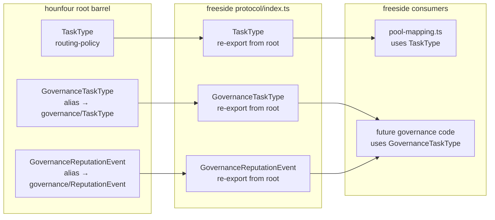

# SDD: Launch Readiness — loa-hounfour v7.11.0 Full Adoption

**Version:** 1.1.0
**Cycle:** cycle-041
**Date:** 2026-02-24
**PRD:** v1.1.0 (GPT-APPROVED, iteration 2)

---

## 1. Executive Summary

This SDD designs the schema-only adoption of loa-hounfour v7.11.0 into loa-freeside. Unlike previous cycles that introduced runtime behavior (boundary engine, event sourcing, governance), this cycle is strictly additive: new type re-exports through the protocol barrel, updated contract entrypoints, version pin migration, and utility tests. **No runtime evaluation logic changes.**

**Key architectural decisions:**
- Protocol barrel extends with governance types using `Governance*` aliases only (ADR-001 compliance) — unaliased governance `TaskType`/`ReputationEvent` are NOT re-exported at barrel level
- `computeScoringPathHash` and `SCORING_PATH_GENESIS_HASH` re-exported as utilities only — freeside does NOT build or persist `ScoringPathLog` chains this cycle
- `evaluation_geometry` type re-exported for consumer access — no constraint evaluation runtime changes
- Contract version bump to `provider_version_range: ">=7.11.0"` is deliberate — all previous entrypoints preserved (strict superset)
- Version pin migrates from commit SHA `ff8c16b` to immutable semver reference (npm registry preferred, git tag fallback)

**Scope:** ~8 files modified, primarily `protocol/index.ts` (barrel), `spec/contracts/contract.json`, `spec/contracts/vectors-bundle.sha256`, `package.json` (x2), and new conformance tests.

---

## 2. System Architecture

### 2.1 Affected Components

This cycle adds type re-exports and contract metadata to the existing three-layer integration model. No new modules, services, or runtime behavior introduced.

```
┌──────────────────────────────────────────────────────────────┐
│                    BARREL LAYER (MODIFIED)                     │
│  protocol/index.ts — Add governance type re-exports           │
│    + GovernanceTaskType, GovernanceTaskTypeSchema              │
│    + GovernanceReputationEvent, GovernanceReputationEventSchema│
│    + TaskTypeCohort, ScoringPath, ScoringPathLog types        │
│    + computeScoringPathHash, SCORING_PATH_GENESIS_HASH        │
│    + NativeEnforcement, evaluation_geometry types              │
├──────────────────────────────────────────────────────────────┤
│                    CONTRACT LAYER (MODIFIED)                   │
│  spec/contracts/                                              │
│  ├── contract.json          (new entrypoints, version bump)   │
│  ├── vectors-bundle.sha256  (recomputed hash)                 │
│  └── validate.mjs           (no change — dynamic import)      │
├──────────────────────────────────────────────────────────────┤
│                    TEST LAYER (NEW)                            │
│  tests/unit/                                                  │
│  ├── hash-chain-utility.test.ts  (FR-2: determinism tests)   │
│  └── protocol-conformance.test.ts (updated: new symbols)     │
│  themes/sietch/tests/unit/                                    │
│  └── contract-spec.test.ts       (updated: new entrypoints)  │
├──────────────────────────────────────────────────────────────┤
│                    DEPENDENCY LAYER (MODIFIED)                 │
│  package.json (root + adapters) — SHA → v7.11.0 tag/npm      │
├──────────────────────────────────────────────────────────────┤
│                    EXISTING (UNCHANGED)                        │
│  pool-mapping.ts          (TaskType import still routing-     │
│                            policy variant, zero change)       │
│  boundary-engine-shadow.ts (no evaluation geometry change)    │
│  arrakis-compat.ts        (negotiation version unchanged)     │
│  All runtime evaluation paths — UNTOUCHED                     │
└──────────────────────────────────────────────────────────────┘
```

### 2.2 Import Path Architecture

loa-hounfour v7.11.0 organizes exports across 5 subpaths. The protocol barrel selectively re-exports from each:

```
@0xhoneyjar/loa-hounfour (root)
├── Core types: AgentIdentity, TrustLevel, RoutingPolicy, TaskType (routing-policy)
├── Functions: evaluateAccessPolicy, parseMicroUsd, computeReqHash
├── NEW v7.11.0: computeScoringPathHash, SCORING_PATH_GENESIS_HASH
└── ADR-001 aliases: GovernanceTaskType, GovernanceReputationEvent (+Schema variants)

@0xhoneyjar/loa-hounfour/economy
├── Escrow, NFT, economy types
└── evaluateEconomicBoundary, TRANSFER_CHOREOGRAPHY

@0xhoneyjar/loa-hounfour/governance
├── Existing: SanctionSchema, DisputeRecordSchema, etc.
├── NEW v7.10.0: TaskTypeSchema, TaskTypeCohortSchema, ReputationEventSchema
├── NEW v7.10.0: ScoringPathSchema, ScoringPathLogSchema
└── NEW v7.10.0: QualitySignalEventSchema, TaskCompletedEventSchema, CredentialUpdateEventSchema

@0xhoneyjar/loa-hounfour/integrity
├── LivenessPropertySchema, CANONICAL_LIVENESS_PROPERTIES
└── NEW v7.10.1: detectReservedNameCollisions (already re-exported)

@0xhoneyjar/loa-hounfour/model
└── Type-only entrypoint (0 runtime symbols)
```

### 2.3 ADR-001 Aliasing Strategy

ADR-001 establishes root barrel precedence for naming collisions:

| Collision | Root Barrel Name | Direct Import Path |
|-----------|-----------------|-------------------|
| Governance `TaskType` vs routing-policy `TaskType` | `GovernanceTaskType` | `@0xhoneyjar/loa-hounfour/governance` |
| Governance `ReputationEvent` vs future core `ReputationEvent` | `GovernanceReputationEvent` | `@0xhoneyjar/loa-hounfour/governance` |

**Freeside policy**: The protocol barrel (`protocol/index.ts`) re-exports ONLY the aliased `Governance*` variants. The unaliased `TaskType` from the root barrel continues to reference the routing-policy type used by `pool-mapping.ts`. Consumers needing unaliased governance types must import directly from the `/governance` subpath.



---

## 3. Component Design

### 3.1 FR-1 + FR-3: Governance Schema Re-exports (Protocol Barrel)

**File:** `themes/sietch/src/packages/core/protocol/index.ts`

**Change type:** Additive — new export block appended after existing v7.9.x exports (after line ~372).

#### 3.1.1 New Exports Section

Add a new clearly-demarcated section for v7.10.0-7.11.0 governance types.

**CRITICAL — Export Surface Verification Gate:** Before adding ANY symbol to the barrel or `contract.json`, the implementer MUST verify it exists as a runtime export in the installed provider package. Type-only symbols (erased at runtime) must NOT appear in contract.json.

Verification procedure (run after `pnpm install` with v7.11.0 pin):

```bash
# Verify root entrypoint runtime exports
node -e "import('@0xhoneyjar/loa-hounfour').then(m => {
  const expected = ['GovernanceTaskType','GovernanceTaskTypeSchema',
    'GovernanceReputationEvent','GovernanceReputationEventSchema',
    'computeScoringPathHash','SCORING_PATH_GENESIS_HASH'];
  expected.forEach(s => console.log(s, s in m ? 'OK' : 'MISSING'));
})"

# Verify governance entrypoint runtime exports
node -e "import('@0xhoneyjar/loa-hounfour/governance').then(m => {
  const expected = ['TASK_TYPES','validateTaskCohortUniqueness',
    'TaskTypeCohortSchema','QualitySignalEventSchema',
    'TaskCompletedEventSchema','CredentialUpdateEventSchema',
    'ScoringPathSchema','ScoringPathLogSchema'];
  expected.forEach(s => console.log(s, s in m ? 'OK' : 'MISSING'));
})"
```

If any symbol reports `MISSING`:
- If it exists on a different entrypoint (e.g., `/governance` instead of root): move the barrel import and contract entry to the correct entrypoint
- If it is type-only (erased at compile): keep in barrel as `export type`, remove from `contract.json`
- If it does not exist at all in v7.11.0: remove from both barrel and contract; log as a PRD deviation in NOTES.md

**Proposed barrel code** (subject to verification gate above):

```typescript
// ═══════════════════════════════════════════════════════════════
// hounfour v7.10.0-7.11.0 — Task-Dimensional Reputation (cycle-041)
// ADR-001: Root barrel precedence — governance types use Governance* prefix
// to avoid collision with routing-policy TaskType already exported above.
// Consumers needing unaliased governance types must import directly from
// @0xhoneyjar/loa-hounfour/governance
// ═══════════════════════════════════════════════════════════════

// --- ADR-001 Aliased Root Barrel Exports ---
export {
  GovernanceTaskType,
  GovernanceTaskTypeSchema,
  GovernanceReputationEvent,
  GovernanceReputationEventSchema,
} from '@0xhoneyjar/loa-hounfour';

// --- Governance Subpath: Task-Dimensional Reputation ---
export {
  // TaskType taxonomy (v7.10.0)
  TASK_TYPES,
  validateTaskCohortUniqueness,

  // TaskTypeCohort: per-(model, task_type) reputation
  TaskTypeCohortSchema,
  type TaskTypeCohort,

  // ReputationEvent: 3-variant discriminated union
  QualitySignalEventSchema,
  type QualitySignalEvent,
  TaskCompletedEventSchema,
  type TaskCompletedEvent,
  CredentialUpdateEventSchema,
  type CredentialUpdateEvent,

  // ScoringPath: three-tier cascade (task_cohort → aggregate → tier_default)
  ScoringPathSchema,
  type ScoringPath,

  // ScoringPathLog: audit record
  ScoringPathLogSchema,
  type ScoringPathLog,
} from '@0xhoneyjar/loa-hounfour/governance';

// --- Hash Chain Utilities (v7.11.0) ---
// NOTE: Verify these are root exports; if they live under /governance or
// /integrity instead, change the import path here AND in contract.json
export {
  computeScoringPathHash,
  SCORING_PATH_GENESIS_HASH,
} from '@0xhoneyjar/loa-hounfour';

// --- Evaluation Geometry (v7.11.0) ---
export type { NativeEnforcement } from '@0xhoneyjar/loa-hounfour';
// evaluation_geometry is a literal union 'expression' | 'native' on the
// Constraint type — see §3.3 for exposure strategy
```

#### 3.1.2 Closed-World Safety Verification

Before adding re-exports, verify that governance `TaskType` does NOT enter routing code paths:

**Existing `pool-mapping.ts` import** (line 16):
```typescript
import type { RoutingPolicy, TaskType } from '@0xhoneyjar/loa-hounfour';
```

This imports the routing-policy `TaskType` from the root barrel. The `resolvePoolId()` function uses open-world dynamic dispatch (`personality.task_routing[taskType]` object indexing with `VALID_POOL_IDS.has()` validation) — no exhaustive switch/case. This is already safe for type extensions.

**Verification gate (AC-1.6):** After barrel update, grep the codebase to confirm no file imports `GovernanceTaskType` into routing/mapping/switch logic. This is a test assertion, not a runtime guard.

### 3.2 FR-2: Scoring Path Hash Chain Utilities

**File:** `themes/sietch/src/packages/core/protocol/index.ts` (re-export only)

**New test file:** `tests/unit/hash-chain-utility.test.ts`

#### 3.2.1 Utility Re-export

`computeScoringPathHash` and `SCORING_PATH_GENESIS_HASH` are re-exported from the hounfour root barrel (see §3.1.1). No freeside wrapper function needed — the canonical implementation is sufficient.

#### 3.2.2 Test Design

Three test cases verifying utility correctness (NOT chain construction):

```typescript
describe('computeScoringPathHash (utility)', () => {
  it('produces deterministic output: same input → same hash', () => {
    const input = { /* sample ScoringPathLog fields */ };
    const hash1 = computeScoringPathHash(input);
    const hash2 = computeScoringPathHash(input);
    expect(hash1).toBe(hash2);
  });

  it('produces valid SHA-256 hex string (64 characters)', () => {
    const input = { /* sample */ };
    const hash = computeScoringPathHash(input);
    expect(hash).toMatch(/^[0-9a-f]{64}$/);
  });

  it('SCORING_PATH_GENESIS_HASH is valid SHA-256 hex string', () => {
    expect(SCORING_PATH_GENESIS_HASH).toMatch(/^[0-9a-f]{64}$/);
  });
});
```

**Scope boundary:** These tests verify the utility function works correctly in isolation. Freeside does NOT build `ScoringPathLog` chains, verify chain integrity, or persist hashes this cycle.

### 3.3 FR-4: Evaluation Geometry Type Re-export

**File:** `themes/sietch/src/packages/core/protocol/index.ts`

The `evaluation_geometry` field (`'expression' | 'native'`) is part of the `Constraint` type in loa-hounfour. The `NativeEnforcement` type is a standalone interface used with `native_enforcement` metadata.

**Re-export strategy:**
- `NativeEnforcement` — type-only re-export from root barrel
- `evaluation_geometry` — this is a property on the `Constraint` type. The implementer MUST verify whether the `Constraint` type/schema is already re-exported from `protocol/index.ts`:
  - **If already exported:** No action needed — consumers already have access to `evaluation_geometry` through the existing `Constraint` re-export. Add an explicit note in the barrel JSDoc referencing the v7.11.0 `evaluation_geometry` field.
  - **If NOT exported:** Add the `Constraint` type (and `ConstraintSchema` if it's a runtime Zod/TypeBox schema) to the barrel re-exports. If `ConstraintSchema` is a runtime export, add it to `contract.json` as well.

**Verification step** (run during Sprint 1):
```bash
# Check if Constraint is already re-exported from the barrel
node -e "import('./themes/sietch/src/packages/core/protocol/index.ts')" 2>/dev/null
# Or check TS source directly for existing Constraint export
grep -n 'Constraint' themes/sietch/src/packages/core/protocol/index.ts
```

**Runtime impact:** None. Freeside's boundary engine (`boundary-engine-shadow.ts`) wraps `evaluateEconomicBoundary()` from hounfour/economy, which already handles the `evaluation_geometry` field internally. No freeside code reads `evaluation_geometry` directly.

### 3.4 FR-5: Contract and Conformance Vector Update

**File:** `spec/contracts/contract.json`

#### 3.4.1 New Entrypoints

Add governance symbols to the appropriate entrypoint specifiers:

**Root entrypoint** (`@0xhoneyjar/loa-hounfour`) — add:
```json
"GovernanceTaskType",
"GovernanceTaskTypeSchema",
"GovernanceReputationEvent",
"GovernanceReputationEventSchema",
"computeScoringPathHash",
"SCORING_PATH_GENESIS_HASH"
```

**Governance entrypoint** (`@0xhoneyjar/loa-hounfour/governance`) — add:
```json
"TASK_TYPES",
"validateTaskCohortUniqueness",
"TaskTypeCohortSchema",
"QualitySignalEventSchema",
"TaskCompletedEventSchema",
"CredentialUpdateEventSchema",
"ScoringPathSchema",
"ScoringPathLogSchema"
```

**Note:** Type-only exports (`type TaskTypeCohort`, `type ScoringPath`, etc.) are NOT listed in contract.json because they have no runtime representation. Contract testing uses dynamic `import()` which only sees runtime exports.

#### 3.4.2 Version Range Bump

```json
"provider_version_range": ">=7.11.0"
```

This is a deliberate contract version bump. The new entrypoints (`computeScoringPathHash`, governance schemas) do not exist in hounfour <7.11.0. The bump means hounfour CI must run v7.11.0+ when validating the contract.

**Backward compatibility:** All 65 previously-pinned symbols remain. The new contract is a strict superset.

#### 3.4.3 Bundle Hash Recomputation

After any changes to `spec/vectors/` (if new vector files are added for governance schemas):

```bash
find spec/vectors/ -name '*.json' -type f | sort | xargs sha256sum | sha256sum
```

Update `vectors-bundle.sha256` and `contract.json` `bundle_hash` field with new hash.

**Vector count update:** If new conformance vectors are added for governance types, update `vector_count` accordingly. If no new vector files, the count stays at 3 and only the bundle hash changes if existing vectors are modified.

#### 3.4.4 Contract Test Update

**File:** `themes/sietch/tests/unit/contract-spec.test.ts`

The existing parametrized test iterates over `contract.json` entrypoints and verifies each symbol exists via dynamic import. No test code changes needed — adding symbols to `contract.json` automatically extends coverage.

The version range test (line 78-107) will need the floor comparison updated: the installed hounfour version must satisfy `>=7.11.0` after the pin migration.

### 3.5 FR-6: Version Pin Migration

**Files:** `package.json` (root), `packages/adapters/package.json`

#### 3.5.1 Pin Format Selection

Attempt in preference order:

1. **npm registry** (preferred): `"@0xhoneyjar/loa-hounfour": "7.11.0"` — check if the package is published to npm
2. **git tag**: `"@0xhoneyjar/loa-hounfour": "github:0xHoneyJar/loa-hounfour#v7.11.0"` — check if v7.11.0 git tag exists
3. **tagged-commit SHA**: `"@0xhoneyjar/loa-hounfour": "github:0xHoneyJar/loa-hounfour#<sha>"` where `<sha>` is the commit that the v7.11.0 tag points to — only if options 1 and 2 fail

If all three options fail, this is a **blocker** — escalate, do not silently fall back to an arbitrary SHA.

#### 3.5.2 Migration Steps

1. Determine available pin format (try npm → git tag → tagged SHA)
2. Update `@0xhoneyjar/loa-hounfour` in root `package.json`
3. Update `@0xhoneyjar/loa-hounfour` in `packages/adapters/package.json`
4. Run `pnpm install` (or `npm install`) to update lockfile
5. Verify `CONTRACT_VERSION` import resolves (may change from `7.9.1` — document new value)
6. Run full test suite to verify zero regression

#### 3.5.3 Rebuild Script Impact and Supply-Chain Trust Boundary

The existing `scripts/rebuild-hounfour-dist.sh` postinstall hook will run automatically on `pnpm install`. This script clones the provider repo at the pinned ref and rebuilds the dist locally.

**Trust boundary:** The rebuilt dist is what freeside executes in both CI and production. Even though this cycle is "schema adoption only" (no freeside runtime logic changes), the provider version bump changes the provider code that freeside executes (e.g., `evaluateEconomicBoundary`, `parseMicroUsd`). This is inherent to any dependency upgrade.

**Supply-chain verification requirements:**
1. **Deterministic ref resolution:** The rebuild script must clone at the exact tag/SHA. Verify: `git -C <clone_dir> rev-parse HEAD` matches the expected v7.11.0 commit
2. **DIST_HASH verification:** The existing script computes a `DIST_HASH` (SHA-256 of built artifacts). After the v7.11.0 rebuild, record the new DIST_HASH in NOTES.md. If loa-hounfour publishes an expected dist hash for v7.11.0, compare against it
3. **Tag-based ref compatibility:** The rebuild script uses `git clone --branch <ref>`. Both tags (`v7.11.0`) and SHAs work as `--branch` arguments. Verify: `git clone --branch v7.11.0 <repo>` succeeds and resolves to the expected commit
4. **Build toolchain pin:** The rebuild script should use the same TypeScript/build tool version as hounfour CI. If not pinned, document this as a known limitation (non-deterministic builds across environments)

**If the rebuild produces unexpected output** (compilation errors, missing exports, hash mismatch): treat as a blocker — do not proceed with barrel re-exports until the provider dist is verified.

### 3.6 FR-7: Launch Readiness Documentation

**File:** `grimoires/loa/NOTES.md` (add cycle-041 section)

Document the status of each P0 gap from loa-finn issue #66 §6:

| Gap | Status | Notes |
|-----|--------|-------|
| Arrakis adopts loa-hounfour | Resolved | v7.11.0 pin (this cycle) |
| Cross-system E2E smoke test | Deferred | Requires loa-finn docker-compose; separate infra cycle |
| Production deployment | Deferred | Infrastructure concern; not code adoption |
| NativeRuntimeAdapter spike | Deferred | loa-finn scope |
| Integration test with real ES256 keys | Partial | Existing JWT vectors; full key rotation test deferred |

---

## 4. Testing Strategy

### 4.1 Test Categories

| Category | Scope | Files |
|----------|-------|-------|
| **Barrel Exports** | Verify all new types importable from `protocol/index.ts` | `protocol-conformance.test.ts` |
| **Hash Utility** | Determinism, format validation, genesis constant | `hash-chain-utility.test.ts` (NEW) |
| **Contract Entrypoints** | Dynamic import of all symbols in contract.json | `contract-spec.test.ts` |
| **Bundle Hash** | SHA-256 integrity of vector files | `contract-spec.test.ts` |
| **ADR-001 Guard** | No unaliased governance TaskType in routing paths | `protocol-conformance.test.ts` |
| **Regression** | All existing tests pass unchanged | Full suite |

### 4.2 ADR-001 Import Guard Test

The guard for AC-1.6 uses a two-layer approach to avoid false positives/negatives from naive grep:

**Layer 1 — Schema identity assertion** (in `protocol-conformance.test.ts`):

Verify that the barrel's `TaskType` schema export is the routing-policy variant, not the governance variant. This uses **runtime schema objects** (Zod/TypeBox), not TypeScript type aliases (which are erased at runtime and cannot be compared):

```typescript
// Import SCHEMAS (runtime objects), not TYPE ALIASES
import { TaskTypeSchema as BarrelTaskTypeSchema } from '../packages/core/protocol/index';
import { TaskTypeSchema as RoutingTaskTypeSchema } from '@0xhoneyjar/loa-hounfour';
import { TaskTypeSchema as GovernanceTaskTypeSchema } from '@0xhoneyjar/loa-hounfour/governance';

describe('ADR-001 barrel schema identity', () => {
  it('barrel TaskTypeSchema is the routing-policy variant (not governance)', () => {
    // Runtime reference equality: the barrel re-exports the root barrel's
    // routing-policy schema, NOT the governance subpath's schema
    expect(BarrelTaskTypeSchema).toBe(RoutingTaskTypeSchema);
  });

  it('barrel TaskTypeSchema is NOT the governance variant', () => {
    expect(BarrelTaskTypeSchema).not.toBe(GovernanceTaskTypeSchema);
  });
});
```

This catches re-export mistakes where someone accidentally exports the governance `TaskTypeSchema` under the unaliased name. If `TaskTypeSchema` is not a runtime export (type-only), fall back to Layer 2 only.

**Layer 2 — Import specifier + identifier denylist** (in `protocol-conformance.test.ts`):

Check a curated set of routing/mapping modules for both forbidden identifiers AND forbidden import paths:

```typescript
import { readFileSync } from 'fs';

const ROUTING_MODULES = [
  'packages/adapters/agent/pool-mapping.ts',
  // Add other routing/mapping modules as they emerge
];

describe('ADR-001 routing isolation', () => {
  ROUTING_MODULES.forEach(modulePath => {
    it(`${modulePath} does not reference governance types`, () => {
      const source = readFileSync(modulePath, 'utf-8');
      // Forbidden identifiers (including aliased imports)
      expect(source).not.toMatch(/GovernanceTaskType/);
      expect(source).not.toMatch(/GovernanceReputationEvent/);
    });

    it(`${modulePath} does not import from governance subpath`, () => {
      const source = readFileSync(modulePath, 'utf-8');
      // Forbidden import specifiers — governance subpath should never
      // appear in routing modules (catches aliased imports too)
      expect(source).not.toMatch(/from\s+['"]@0xhoneyjar\/loa-hounfour\/governance['"]/);
    });
  });
});
```

This uses a curated denylist of routing modules rather than a full codebase grep, avoiding false positives from test files and type-only imports elsewhere. The denylist is maintained alongside the routing module inventory. The import specifier check catches cases where governance types are imported under aliased names (e.g., `import { TaskType as GovTT } from '.../governance'`).

### 4.3 Test Execution

```bash
# Full regression + new tests
pnpm test

# Targeted contract verification
node spec/contracts/validate.mjs

# Targeted conformance vectors
pnpm vitest run spec/conformance/
```

---

## 5. Development Phases

### Sprint 1: Version Pin + Barrel Expansion

**Tasks:**
1. Determine v7.11.0 pin format (npm/tag/SHA) and update both `package.json` files
2. Run `pnpm install`, verify rebuild script succeeds
3. Add governance type re-exports to `protocol/index.ts` (§3.1.1)
4. Add hash chain utility re-exports (§3.2.1)
5. Add evaluation geometry type re-export (§3.3)
6. Add barrel JSDoc comment documenting ADR-001 rationale
7. Verify TypeScript compiles cleanly

**Dependencies:** None (foundational)

### Sprint 2: Contract + Tests + Documentation

**Tasks:**
1. Update `contract.json` with new entrypoints and version bump (§3.4.1-3.4.2)
2. Recompute `vectors-bundle.sha256` (§3.4.3)
3. Create `hash-chain-utility.test.ts` with 3 test cases (§3.2.2)
4. Add ADR-001 import guard test to `protocol-conformance.test.ts` (§4.2)
5. Update `protocol-conformance.test.ts` to verify new governance symbols
6. Run full test suite — verify zero regression
7. Update NOTES.md with launch readiness gap status (§3.6)

**Dependencies:** Sprint 1 (barrel must exist before contract/tests reference it)

---

## 6. Risks & Mitigation

| Risk | Severity | Mitigation |
|------|----------|------------|
| v7.11.0 not published to npm or git tag missing | Medium | Three-tier fallback (§3.5.1); blocker escalation if all fail |
| Rebuild script breaks with tag-based pin | Low | Script uses `git clone` with ref — tags and SHAs both work as refs |
| New governance type names conflict with local types | Low | ADR-001 aliasing prevents root-level collision; grep audit before merge |
| `computeScoringPathHash` has undocumented peer dependency | Low | loa-hounfour bundles `@noble/hashes` in dist — no new peer dep |
| `CONTRACT_VERSION` value changes in v7.11.0 | Low | Document new value; `arrakis-compat.ts` `negotiateVersion()` may need supported array update if contract version changes significantly |
| Bundle hash becomes stale if vectors are modified independently | Low | CI test computes hash at test time and compares — drift detected immediately |

---

## 7. Architecture Decision Records

### ADR-CYCLE-041-001: Schema-Only Adoption Scope

**Context:** loa-hounfour v7.11.0 introduces task-dimensional reputation, hash chains, and evaluation geometry. These could enable new runtime features (task-aware routing, tamper-evident audit, native constraint evaluation).

**Decision:** This cycle adopts types and utilities only. No runtime behavior changes.

**Rationale:** The PRD (NFR-2) explicitly constrains this cycle to schema adoption. Runtime features require separate PRDs with their own risk analysis (open-world TaskType in routing, hash chain persistence, evaluation geometry dispatch).

**Consequences:** Future cycles can build on the adopted types without re-importing them. The governance types are "loaded and ready" but not wired into any execution path.

### ADR-CYCLE-041-002: Governance* Alias-Only Barrel Re-export

**Context:** Governance `TaskType` and `ReputationEvent` collide with existing routing-policy types at the root barrel level.

**Decision:** Re-export ONLY the `Governance*` aliased variants. Unaliased governance types are NOT available through the freeside protocol barrel.

**Rationale:** ADR-001 from loa-hounfour establishes this pattern. Re-exporting both would reintroduce the collision that ADR-001 solves. Consumers needing unaliased types can import directly from the `/governance` subpath.

**Consequences:** Slightly less convenient for consumers who want unaliased names, but eliminates type identity drift and ambiguous imports.

### ADR-CYCLE-041-003: Deliberate Contract Version Bump

**Context:** Adding v7.11.0-only symbols to `contract.json` means the contract can only be satisfied by hounfour >=7.11.0.

**Decision:** Bump `provider_version_range` to `>=7.11.0`. This is a deliberate compatibility cut, not an accidental breakage.

**Rationale:** The contract tests the provider package exports what the consumer actually imports. Since we're importing symbols that only exist in v7.11.0+, the contract must reflect that. The contract only runs in CI, not at runtime.

**Consequences:** loa-hounfour CI must use v7.11.0+ when running the freeside contract. No runtime impact.
