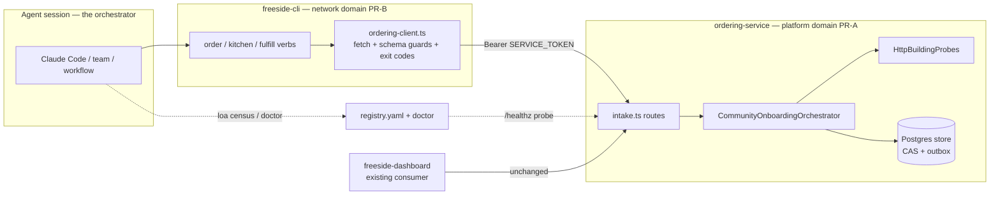

# Software Design Document — Agent-First Fulfillment Surface

> `/simstim` Phase 3 (simstim-20260701-50e41fd7). Implements the PRD (`grimoires/loa/prd.md`, Flatline-reviewed 2026-07-01: 10 integrated, 4 blockers integrated as minimal floors). Cycle: fulfillment-surface (epic #415, reframed agent-first).

## 1. Architecture Overview

No new services. Two existing components gain capabilities; one declaration is added:

```mermaid
flowchart LR
  subgraph agent [Agent session — the orchestrator]
    A[Claude Code / team / workflow]
  end
  subgraph cli [freeside-cli — network domain PR-B]
    V[order / kitchen / fulfill verbs]
    C[ordering-client.ts<br/>fetch + schema guards + exit codes]
  end
  subgraph svc [ordering-service — platform domain PR-A]
    I[intake.ts routes]
    O[CommunityOnboardingOrchestrator]
    P[HttpBuildingProbes]
    S[(Postgres store<br/>CAS + outbox)]
  end
  R[registry.yaml + doctor]
  A --> V --> C -->|"Bearer SERVICE_TOKEN"| I
  I --> O --> P
  O --> S
  A -.->|"loa census / doctor"| R -.->|"/healthz probe"| I
  D[freeside-dashboard<br/>existing consumer] -->|unchanged| I
```

The agent session IS the fulfillment orchestrator (PRD §2). The existing in-process `onPlaced` + `ReProbeWorker` remain untouched substrate. The CLI is the execution-layer seam; typed SDK / MCP layer on later (PRD §2 layering doctrine).

## 2. Design Decisions

### D1 — FR-4 probe mechanism: synchronous `POST /v1/orders/:id/reprobe`

New token-gated endpoint that invokes the orchestrator's existing probe path (`process()` → triage ports → `mergeProbedIngredients`, monotonic [CODE:src/community-onboarding-orchestrator.ts]) **synchronously** and returns the refreshed record with per-ingredient probe metadata.

- Meets the PRD freshness requirement (live probe on demand, never interval leftovers; max-staleness 60s).
- **Alternative rejected**: surfacing `ReProbeWorker` last-run state — serves stale truth, illegal per FR-4.
- **Alternative rejected**: CLI probing buildings directly — duplicates `HttpBuildingProbes`, bypasses monotonic merge, leaks building endpoints into the network domain.

**Failure semantics** [FLATLINE IMP-001, 915]: `401` bad/missing token · `404` unknown order · `409` order terminal · `429` cooldown active · `200` always when probes ran — per-ingredient probe failure/timeout is reported IN the body as `status: "ambiguous"` with the error class, never a 5xx (a building being down is a probe *result*, not a service error); `5xx` reserved for store failures.

**Load bounds** [FLATLINE SKP-001a integrated]: global request timeout 30s; probe fan-out concurrency ≤3; per-order reprobe cooldown 10s (second call within window → `429` + `retry_after`); per-probe timeout 10s with cancellation (AbortController passed to fetch). Test: a hung building endpoint cannot hold the request past the global timeout or starve other orders.

**probe_meta schema work** [FLATLINE IMP-002, 917 — "no migration" ≠ "no schema work"]: additive field on the order record JSON, exact shape `{[ingredient]: {status, probed_at_unix, source: "reprobe"|"interval"|"enqueue"}}`; typed in `@freeside/ordering-protocol`; written by BOTH the reprobe endpoint and `ReProbeWorker` (one write path — the shared merge helper); legacy rows read as `probe_meta: {}`; included in the public projection (D7).

**Concurrency semantics** [FLATLINE IMP-003, 877]: reprobe merge and agent advance can race. Rules: advance uses the existing `store.transition` CAS [CODE:src/store.ts:180-201] and wins; a reprobe whose merge loses CAS retries the merge once against the fresh record (monotonic merge cannot downgrade [CODE:mergeProbedIngredients:50], so retry is safe); a second CAS loss returns the fresh record as-is. CLI surfaces CAS-lost advances as exit 4 with the current server state in the error JSON — the agent re-reads and decides.

### D2 — CLI shape: verb modules + one client, zero new deps

`packages/freeside-cli/src/verbs/{order,kitchen,fulfill}.ts` + `src/lib/ordering-client.ts`, wired into the existing `switch(verb)` dispatch [CODE:bin/freeside-cli.ts:45]. Client uses Node ≥18 global `fetch`; config from `ORDERING_SERVICE_URL` + `ORDERING_SERVICE_TOKEN` env (NFR-1, same seam as dashboard). Hand-rolled TS types + runtime shape guards (no zod — CLI stays zero-dep); the service keeps Zod on its side.

### D3 — Server-derived evidence + actor identity (revised at Flatline SDD gate, operator-approved 2026-07-01)

**Evidence is server-derived, never client-supplied** [FLATLINE SKP-002 + IMP-004 integrated]: on advance, the server snapshots its own latest `probe_meta[ingredient]` (D1) into the `operator_audit` entry it already appends [CODE:src/community-onboarding-orchestrator.ts:180-203]. The probe→advance chain is unfakeable and deterministic — no CLI evidence flag exists. If no `probe_meta` exists for the ingredient (never probed / legacy order), the audit entry records `evidence: null` — an advance without probe grounding is visible as such (the HITL escape hatch, PRD FR-5).

**Actor identity is server-derived** [FLATLINE SKP-003/SKP-001b integrated]: the server records `token_label` resolved from which credential authenticated the request (one single-purpose token today → one label; labels multiply when tokens do, NFR-8a). `AdvanceIngredientBodySchema` [CODE:src/intake.ts:57] gains one optional field: `caller_note?: string` (≤120 chars) — untrusted display metadata, stored separately from the authoritative `token_label`, never audit authority.

Backward compatible: dashboard's existing calls stay legal (recorded with `token_label`, `caller_note: null`, `evidence` per probe_meta state).

### D4 — Fail-closed at boot: route non-mounting (FR-10a)

Deployed marker: `RAILWAY_ENVIRONMENT` set OR `NODE_ENV=production`. In `bin/http.ts` composition: if deployed AND `SERVICE_TOKEN` unset → intake receives no orchestrator dep → write routes (`advance-ingredient`, `reprobe`) never mount (mounting is already conditional [CODE:src/intake.ts:149]); `/healthz` reports `write_routes: "disabled_no_token"`; boot log is loud. Reads stay available.

- **Alternative rejected**: refuse to boot — takes reads and the dashboard down over a write-path misconfiguration.
- All POST routes are token-gated in deployed mode, including `reprobe` (it triggers outbound HTTP to buildings — abusable unauthenticated).

### D5 — Registry: `ordering` module entry

Add to `packages/freeside-registry/registry.yaml` following the existing module shape: `deployment_url` (Railway), probe path `/healthz`, HTTP 200 = healthy, non-200/timeout(5s)/refused = down (FR-9a). **Precondition (sprint task 0)**: verify the live URL — DEPLOY.md cites `kitchen-api-production-1937.up.railway.app`, unverified this session.

### D7 — Canonical public projection [FLATLINE IMP-006, 827]

One exported `toPublicOrder(record)` projection in the service is the SINGLE shape returned by `GET /v1/orders/:id`, the advance response, and the reprobe response — today intake hand-assembles similar-but-divergent field lists per route [CODE:src/intake.ts:130-145 vs :185-195]. The projection is the redaction boundary (internal fields like raw refusal causes stay out) and the thing CLI schemas + contract tests pin. Divergent per-route shapes are a defect class this eliminates.

### D8 — Auth matrix [FLATLINE IMP-005, 770]

| Env | SERVICE_TOKEN | GET routes | POST advance / reprobe | /healthz `write_routes` |
|-----|---------------|------------|------------------------|--------------------------|
| local/dev (no deployed marker) | unset | open | open (convenience, in-memory store) | `"open_dev"` |
| local/dev | set | open | Bearer required | `"token"` |
| deployed (`RAILWAY_ENVIRONMENT` or `NODE_ENV=production`) | unset | open | **not mounted** (FR-10a) | `"disabled_no_token"` |
| deployed | set | open | Bearer required | `"token"` |

Boot test matrix covers all four rows (FR-10b covers row 3).

### D6 — Contracts: schemas in the CLI package, one exit-code table

- Per-verb success/error JSON schemas as exported TS types + runtime guards in `src/lib/ordering-schemas.ts` (FR-7a). Error JSON: `{error, http_status?, order_id?, hint?}` — token never present (NFR-1 redaction test).
- One exit-code constant table (FR-7b): `0` ok/fulfilled · `1` usage · `2` unreachable/transient-exhausted · `3` HTTP/API error · `4` ambiguous/blocked/CAS-lost · `5` watch timeout · `6` order failed.
- Contract tests run against an in-repo fixture Hono server replaying recorded service responses (NFR-6) — plus one differential check of fixture vs deployed `GET /v1/orders/:id` shape to prevent fixture tautology.

## 3. Component Design

### 3.1 freeside-cli verbs (PR-B, network)

| Verb | Client call | Output (single-line JSON) | Exit |
|------|------------|---------------------------|------|
| `order place --preset 
 --inputs <@f\|json>` | `POST /v1/orders` | `{order_id, state}` | 0/1/2/3 |
| `order status <id>` | `GET /v1/orders/:id` | full record projection `{order_id, state, ingredients, fulfillment, world_slug?}` | 0/2/3 |
| `order ingredients <id>` | `GET /v1/orders/:id` | `{order_id, ingredients: {name: {status, probed_at_unix?, blocked_on?}}}` | 0/2/3 |
| `kitchen probe <id> [--ingredient <i>]` | `POST /v1/orders/:id/reprobe` | `{order_id, probes: {name: {status, probed_at_unix, source, freshness: "fresh"\|"ambiguous"}}}` | 0/2/3/**4** if any ambiguous |
| `kitchen advance <id> --ingredient <i> --status <s> [--note <text>]` | `POST /v1/orders/:id/advance-ingredient` — evidence + actor are server-derived (D3); `--note` maps to untrusted `caller_note` | `{order_id, state, ingredients, operator_audit_tail}` | 0/1/2/3/**4** CAS-lost |
| `fulfill watch <id> [--interval 15] [--timeout 1800] [--once]` | `GET /v1/orders/:id` loop | one JSON line per change; final `{order_id, state, world_slug?}` | 0 fulfilled / 5 timeout / **6** failed |

Client-side bounds (FR-5): `--status` ∈ server enum, `--ingredient` ∈ the order's ingredient set — rejected before any request. No evidence flag exists: the probe→advance evidence chain is entirely server-side (D3). The agent's flow is `kitchen probe` → read result → `kitchen advance`; the server grounds the audit trail itself.

Preset source of truth (FR-1): the CLI imports preset names/input schemas from `@freeside/ordering-protocol` — wait, that is a **platform** package; a network-domain import would cross the firewall at build time. **Resolution**: the CLI ships NO preset table; unknown-preset errors are served by the service (400 + available presets in error body), which the CLI surfaces verbatim. Client-side ingredient-set bounds come from the order record itself (`ingredients` keys), not a hardcoded list.

### 3.2 ordering-service changes (PR-A, platform)

1. `POST /v1/orders/:id/reprobe` — token-gated; body `{ingredient?: string}` (absent = all pending/in_progress); runs the probe path synchronously; 10s per-probe timeout → ingredient reported `ambiguous` on timeout/error (never coerced); returns record + `probe_meta`.
2. `AdvanceIngredientBodySchema` + `operator_audit` extension (D3).
3. Fail-closed boot (D4) + `/healthz` `write_routes` field.
4. Unknown-preset 400 body lists available presets (FR-1 support).
5. `docs/runbooks/ordering-token-rotation.md` (NFR-8c).

### 3.3 Registry (PR-B)

Ordering module entry (D5) + doctor probe test (mocked 200 → ok, mocked timeout → error) per FR-9a.

## 4. Data Model

No new tables. Additive JSON on the order record: `probe_meta` (D1). `operator_audit` entries gain server-written `token_label` + `evidence` (probe_meta snapshot or null) + optional client `caller_note` (D3). All backward-compatible with existing rows (absent = legacy).

## 5. Security

| Control | Where | Test |
|---------|-------|------|
| Fail-closed write routes (FR-10a) | `bin/http.ts` composition | Integration: boot deployed-mode env without token → POST routes 404, healthz shows disabled (FR-10b) |
| Token on all POSTs incl. reprobe | `intake.ts` | 401 without/with-wrong Bearer |
| Single-purpose token (NFR-8a) | runbook + DEPLOY.md | doc review |
| Actor identity server-derived (NFR-8b) [SKP-003] | advance handler resolves `token_label`; client `caller_note` stored as untrusted metadata | unit: audit entry carries token_label regardless of body; caller_note never substitutes |
| Evidence unfakeable (FR-5) [SKP-002] | server snapshots own probe_meta at advance; no client evidence field exists | unit: audit evidence == server probe_meta at advance time; never-probed → evidence null |
| Reprobe load bounds [SKP-001a] | global 30s timeout, fan-out ≤3, 10s/probe + abort, 10s per-order cooldown → 429 | integration: hung building endpoint cannot exceed global timeout; second reprobe within cooldown → 429 |
| Redaction (NFR-1) | CLI client error paths | unit: error JSON + thrown messages never contain token value |
| Bounded mutation (FR-5) | CLI pre-flight + server Zod | unit both sides |

## 6. Testing (NFR-6 per-PR floor)

- **PR-A (platform)**: vitest — fail-closed boot matrix (all 4 D8 rows), reprobe endpoint (fresh / timeout→ambiguous / monotonic-merge / CAS-race retry per D1 / cooldown 429 / global-timeout), advance audit entry (token_label + probe_meta snapshot + caller_note; legacy body still valid; never-probed → evidence null), projection stability (all three routes return the D7 shape), unknown-preset 400 body.
- **PR-B (network)**: vitest — contract tests per verb against fixture server (schema + exit code per row of §3.1), watch change-detection/`--once`/timeout, redaction, bounds rejection, registry doctor probe classification; one differential fixture-vs-deployed shape check (guarded by env flag, skipped in CI without network).
- **G-1 acceptance**: the PRD §9 demo script against the deployed service — operator-run, recorded in the PR body.

## 7. Delivery Plan (ADR-007)

| PR | Domain | Contents | Depends on |
|----|--------|----------|-----------|
| **PR-A** | `platform/ordering` | D1 reprobe + D3 advance extension + D4 fail-closed + runbook + tests | — (deploy after merge) |
| **PR-B** | `network/freeside-cli` | verbs + client + schemas/exit codes + registry entry + doctor test | PR-A **deployed** (reprobe verb); place/status/watch work against current service |

Sequence: task 0 (probe live deployment URL) → PR-A → Railway deploy → PR-B → G-1 demo. No cross-domain PR; no cross-domain beads dependency (the PR-B→PR-A ordering is sequencing, not a beads `blocked-by`).

## 8. Traceability

| PRD | Design | Test |
|-----|--------|------|
| FR-1..3 | §3.1 rows 1-3 + FR-1 resolution | PR-B contract tests |
| FR-4 (+SKP-002b) | D1, §3.2.1 | PR-A reprobe tests; PR-B probe verb test |
| FR-5 (+IMP-008/012, SKP-011, SDD SKP-002/003) | D3 server-derived evidence + token_label, §3.1 bounds | both sides |
| FR-6 (+IMP-007) | §3.1 watch row | PR-B watch tests |
| FR-7a/b (+IMP-001/002) | D6, D7 projection | PR-B contract tests; PR-A projection stability |
| FR-8 | verbs are pure functions over client — veve-declarable later; no loa dependency now | design review |
| FR-9/9a (+IMP-010) | D5, §3.3 | doctor probe test |
| FR-10a/b (+SKP-002a) | D4 | fail-closed boot matrix |
| NFR-1/8 (+SKP-001) | D3 actor, §5 | redaction + audit tests; runbook |
| NFR-7 (+IMP-004) | D3 backward-compat; dashboard path untouched | post-deploy smoke (PRD NFR-7) |

## 9. Open Items (SDD-resolved from PRD; none block sprint planning)

- ~~FR-4 mechanism~~ → D1. ~~Fail-closed shape~~ → D4. ~~Preset ownership vs firewall~~ → §3.1 resolution (service-served preset errors; no cross-domain import).
- Deferred (unchanged from PRD §7): #401 shadow probe, lifecycle publisher, PhaseGateRunner, typed SDK/MCP.
