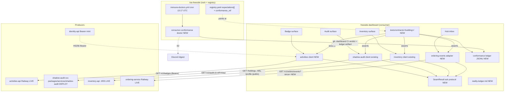
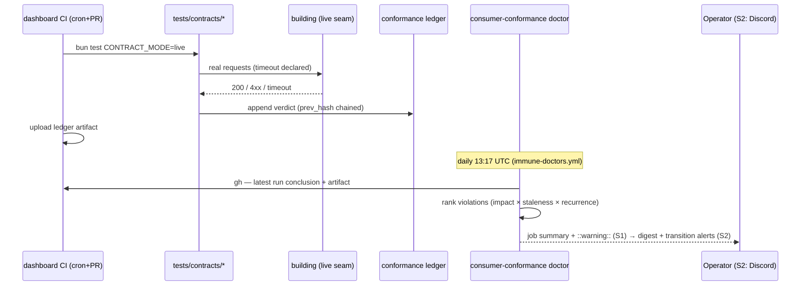
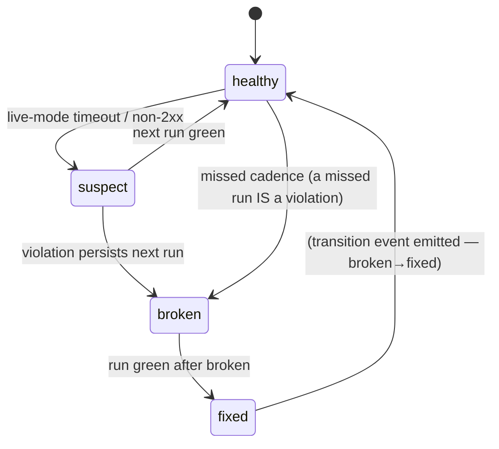

# SDD — Waggle Loop S1: Consumer Conformance + Four Real Surfaces

**Cycle**: waggle-s1
**Date**: 2026-07-09
**PRD**: `grimoires/loa/prd.md` (waggle-s1, 2026-07-09)
**Primary source brief**: `grimoires/loa/context/2026-07-09-consumer-conformance-loop.md` (operator-promoted)
**Domains**: `network/registry` (conformance_ref) · `platform/services` (ordering events read) · `platform/tools` (doctor) · external repo `freeside-dashboard` (suites + wiring). Per ADR-007, no single PR crosses platform/network — §10 slices by repo/domain.

---

## 1. System Overview

The Waggle Loop wires four dashboard surfaces to real backends, with each wire-in **born executable** as a consumer-driven contract suite, and closes the loop through the existing immune rack. One genuinely new organ (the contract harness), one new read seam (ordering event log), one additive schema field (`conformance_ref`), one new doctor. Everything else is wiring of organs that already exist.

> From prd.md:13: "Every consumer-side failure in the estate renders as a **plausible zero**." The design answer is an acknowledgment protocol at every consumed seam: every read renders `data | error | stale`, never a fabricated zero.

### 1.1 Component architecture


```mermaid
graph TD
    subgraph dashboard["freeside-dashboard (consumer)"]
        BG[Badge surface] --> AC[activities client NEW]
        AU[Audit surface] --> SAC[shadow-audit client existing]
        INV[Inventory surface] --> IC[inventory client existing]
        INB[Hub inbox] --> OC[ordering events adapter NEW]
        AC & SAC & IC & OC --> SR[SeamResult ack protocol NEW]
        CT["tests/contracts/&lt;building&gt;/ NEW"] -->|asserts| AC & SAC & IC & OC
        CT --> CL[conformance ledger JSONL NEW]
        RL[reality-ledger.md NEW]
    end

    subgraph buildings["Producers"]
        ACT[activities-api Railway LIVE]
        SA[shadow-audit svc packages/services/shadow-audit DEPLOY]
        IA[inventory-api -3f25 LIVE]
        ORD[ordering-service Railway LIVE]
        IDN[identity-api Bearer mint]
    end

    AC -->|"GET /v1/badges (Bearer)"| ACT
    IDN -.->|HS256 Bearer| AC
    SAC -->|"GET /v1/audit (X-API-Key)"| SA
    IC -->|"GET /holdings, /nfts, /profile (public)"| IA
    OC -->|"GET /v1/orders/events?since= NEW"| ORD

    subgraph loop["loa-freeside (rack + registry)"]
        REG["registry.yaml expectations[] + conformance_ref"]
        DOC[consumer-conformance doctor NEW]
        IIW[immune-doctors.yml cron 13:17 UTC]
    end

    REG -.->|points at| CT
    IIW --> DOC
    DOC -->|"gh: dashboard CI verdict + ledger artifact"| CL
    DOC -.->|S2| PULSE[Discord digest]
```

### 1.2 The cybernetic loop mapped to components

| Organ (brief §2) | Component here | New? |
|---|---|---|
| INTENT | `freeside-dashboard/tests/contracts/<building>/` + registry `conformance_ref` | 🔨 the one new organ |
| SENSE | dashboard CI workflow (net-new app-test job) + `consumer-conformance` doctor on `immune-doctors.yml` cron `17 13 * * *` | 🔨 register |
| COMPARE | `bun test` exit codes + MUST-coverage matrix ≥0.95 | ✅ by construction |
| WEIGH | SAATY-lite ranking in the doctor (impact × staleness × recurrence) — dumb first | 🔨 trivial |
| ACT | beads (`br`, domain-labeled) autonomously; PR fixes operator-pointed; DRAFT-only while merge door frozen (NFR-3) | ✅ exists |
| RECORD | append-only conformance ledger JSONL + PROVENANCE-pinned fixtures | 🔨 file format |

---

## 2. Architectural Pattern

**Consumer-driven contracts (Pact-style, Pattern 5 of `/testing-conformance-harnesses`) over a hexagonal consumer.** The dashboard already isolates every seam behind a client module (`src/lib/<building>-api/client.ts`, `src/lib/adapters/*`); the harness asserts ONLY what the dashboard consumes, per building, from OUTSIDE the app code. The registry carries a pointer to the suite (`conformance_ref`), never the suite itself — probing stays in loa-cli's lane (PRD FR-5).

Reference: consumer-driven contracts — Fowler, https://martinfowler.com/articles/consumerDrivenContracts.html. Distributed-systems vocabulary per PRD §2 (Kleppmann, https://www.cl.cam.ac.uk/teaching/2122/ConcDisSys/dist-sys-notes.pdf).

### 2.1 Kleppmann table → concrete mechanisms

| PRD §2 prescription | Design mechanism |
|---|---|
| Explicit ack, never fabricated zero | `SeamResult<T>` discriminated union (§6.1) at all four seams; render branches on it |
| Timeout + cadence declared; missed cadence IS a violation | every suite declares `cadence` + per-request timeout; doctor treats a missing daily run as FAIL |
| Failure detector, transition-only alerting | doctor computes `working→broken / broken→fixed` transitions from ledger history (S2 alert wiring) |
| Bounded staleness | suites assert `as_of`/staleness bounds where the seam exposes them (inventory `revalidate: 300`, order-feed max-age) |
| Log, not polled state | ordering event feed read via monotonic `seq` cursor over `order_outbox` (§4.5) |
| State machine replication | replay check: fold lifecycle events for an order → must equal `GET /v1/orders/:id` projection state |
| Quorum for gating verdicts | doctor is informational-never-required (rack doctrine); any gating graduation needs 2-of-3 confirmation (S2+) |
| Byzantine boundary | order events carry the Hounfour signed envelope (ed25519 + JCS + hash-chain) end-to-end; dashboard verifies via installed `@0xhoneyjar/events` |
| Cut vertices get suites FIRST | suite order: inventory (betweenness 8.0) → activities → audit → ordering |

---

## 3. Key Design Decisions

### D-1 — Harness lives in the consumer, runs under `bun test`
`freeside-dashboard/tests/contracts/<building>/*.contract.test.ts`, executed by the dashboard's existing runner (**bun**; there is no vitest/playwright in that repo — grounded: dashboard `package.json` `test` script is `bun test tests/unit/...`). Two modes per suite, selected by env:
- **`CONTRACT_MODE=fixture`** (default, CI-safe): runs against PROVENANCE-pinned recorded fixtures under `tests/contracts/<building>/fixtures/` — each fixture header cites URL + capture date + capturing command (differential-vs-real discipline; fixture self-consistency ≠ correctness).
- **`CONTRACT_MODE=live`**: same assertions against the live seam (daily cron + pre-release). Live mode is what makes quiet-vs-down decidable.

Rejected: a separate contracts repo (violates one-building-one-repo consumer symmetry; the suite IS the consumer's requirement) and vitest (net-new runner for no gain).

### D-2 — Badges wire to activities-api self-Bearer route; catalog grid stays labeled `sample` with an order filed
Grounded current state: the badge page calls `getDemoBadges(slug)` over in-file fixtures (freeside-dashboard `src/app/(freeside)/badges` data module — `getDemoBadges`, badges.ts:162, verified live); the score-api client's badge methods (`getAllBadges` → `GET /v1/badges` on score-api, client.ts:1502) are the facade path the PRD retires for this surface.

Target: new `src/lib/activities-api/client.ts` calling activities-api `GET /v1/badges` with an identity-scoped Bearer. Grounded producer truth (activities-api `apps/runtime/src/routes/reads.ts`): `/v1/badges` returns **BadgeIssued events for the AUTHENTICATED identity** (reads.ts:274-288) — identity comes from the token, never a query param; a service-token route `GET /v1/identities/:identity_id/badges` (reads.ts:335) exists for reading an arbitrary member. Auth gate: offline HS256 verify, identity-api issuer, never-falls-open 401 (`auth/require-identity.ts`).

Therefore the S1 badge surface is **the session member's earned badges** (self-Bearer), satisfying FR-1 AC1 exactly ("a Mibera member with granted badges sees them render"). The project-wide catalog grid with holder counts requires the badge-index (Envio) wire the fixture header already names — that stays `sample`-labeled and files an order (FR-5 backpressure), not silently faked. Viewing another member's badges (member/[wallet] page) uses the service-token route if pulled into S1 scope; default is out.

Bearer acquisition: dashboard server exchanges its session for an identity-api HS256 Bearer ([ASSUMPTION confirmed at PRD pre-gen gate]: "identity Bearer mintable today" — prd.md:140). The suite asserts the full auth flow including invalid/missing token → 401 → explicit error state (kills the silent-401 drift class, FR-1 AC2).

### D-3 — Audit: deploy the in-monolith shadow-audit service; delete MOCK_AUDIT
`packages/services/shadow-audit/` is already a deployable surface — `bin/http.ts` + `Dockerfile` + `railway.toml` exist, and its header says verbatim: "This is the deployable surface the freeside-dashboard's already-built dormant client (`GET ${SHADOW_AUDIT_API_URL}/v1/audit`) consumes once its env is pointed here" (bin/http.ts:3-6). Deploying it as a Railway service **from the monolith repo** (the ordering-service precedent) satisfies FR-2 AC2's "expose from monolith edge; no new service extraction" — no new repo, no code move.

Dashboard side: `SHADOW_AUDIT_API_URL` + `SHADOW_AUDIT_API_KEY` + `SHADOW_AUDIT_ENABLED` set; `MOCK_AUDIT` and the mock branch of `getAudit()` (`src/lib/freeside-worlds/access-audit/mock-audit.ts:27,67`) are **deleted** (silence rule / config-client precedent). `getAudit` becomes live-only; unreachable → LOUD error state (operator surface), never null→empty.

Producer boot config is fail-loud by design (required `OPERATED_COMMUNITIES`, `COLLECTION_REGISTRY`, `RPC_URL_<chain>`; bin/http.ts:9-16) — live correctness is operator-gated per its own header; the deploy checklist is in §10 Phase 2.

### D-4 — Inventory: canonical DNS repoint + typed errors; suite pins the ACTUALLY-consumed surface
Grounded: the dashboard is already wired to inventory-api with default host `https://inventory.0xhoneyjar.xyz` (client.ts:16) — which is dead for API reads; the live open read plane is `inventory-api-production-3f25.up.railway.app` (`/health` 200, `/holdings` + `/profile` open — registry.yaml:174-181). Beacon 404s until inventory-api#18 merges (registry.yaml:181).

Design per the operator's public-reads fork decision (prd.md FR-3): point canonical DNS `inventory.0xhoneyjar.xyz` at the -3f25 Railway deploy (operator-adjacent infra, R-2 smallest-diff); dashboard default URL stays the canonical host; `INVENTORY_API_URL` overrides until DNS lands. The bare `catch { return null }` sites in `inventoryFetch`/`fetchProfilePicture` (client.ts:40,144) convert to `SeamResult` — the dead-host-silence class becomes a pinned catch-set case.

**Grounded correction to FR-3 AC4**: the PRD names `holdings/:address, metadata/:contract/:tokenId`, but the dashboard actually consumes `GET /holdings/:wallet`, `GET /nfts/:contract/owner/:address`, and `GET /profile/:address` (client.ts:48,77,137). Consumer-driven contracts assert only what the consumer consumes — the suite pins the three real endpoints. `/metadata/:contract/:tokenId` enters the suite only if a dashboard call site appears.

### D-5 — Order events: HTTP log-read of the durable outbox, cursor = `order_outbox.seq`
Grounded: lifecycle events are appended to a durable Postgres outbox and drained to JetStream (`orders.lifecycle.{placed,routing,producing,fulfilled,failed}.v1`, Hounfour-signed envelopes — `packages/protocol/ordering/src/events.ts:7-14`); the outbox table has a monotonic `seq` (`store-postgres.ts:253`); ordering-service is DEPLOYED (`ordering-service-production.up.railway.app`, registry.yaml:247); the existing HTTP surface is `POST /v1/orders` + `GET /v1/orders/:id` only, with the design note "JetStream stays server-side — the browser polls this" (intake.ts:27-31). The dashboard has **zero** NATS plumbing (`@0xhoneyjar/events` installed, imported nowhere).

Decision: add a read-only **`GET /v1/orders/events?since=<seq>&limit=<n>`** to the ordering service, serving the lifecycle log (decoded + allowlist-projected `PublicLifecycleEvent`, see §5.1) from `order_outbox` where `published = true`, ordered by `seq`. The dashboard's new inbox adapter consumes it as a log — cursor, replay, at-least-once **dedupe by `seq`** (flatline SKP-002 CRITICAL 875: `(order_id, subject)` is NOT a unique event identity — `routing`/`producing`/`failed` legitimately repeat; `seq` is the delivery identity, and repeated same-subject events fold as distinct transitions).

Named tension with FR-4's phrasing ("from the durable JetStream feed"): the outbox IS the durable log JetStream itself drains from (`publishOutbox`, lifecycle-publisher.ts:25-35 — no dual-write); serving it over HTTP preserves the required semantic (offset/replay, PRD §2 "consumed as a log, not polled state") without the rejected alternative's costs. **Rejected**: a JetStream pull-consumer inside the dashboard — the dashboard runs partly serverless (Vercel preview detection in route-gate.ts), holds no NATS credentials, and has no streaming runtime; a NATS client in a request-scoped Next.js server would be a new failure mode, not a wire-in. `@0xhoneyjar/events` is still used — for envelope types + signature/hash-chain verification in the adapter (the Byzantine-boundary row earns its keep).

Replay check (FR-4 AC2): the suite folds an order's lifecycle events through the state machine and asserts equality with `GET /v1/orders/:id` `state` — divergence is a defect, mechanically testable. Known blocker #401 (shadow_preview stub stalls NEW orders) is honest: AC scope is replay of existing events; #401 files as an order.

The demo inbox feed (`getDemoInboxFeed`, hub-inbox.ts:107) is labeled `sample` at cutover and deleted once the suite is green against live (FR-4 AC1).

### D-6 — `conformance_ref`: one optional string on `ExpectationCommon`
Additive, decode-safe: `conformance_ref: Schema.optional(Schema.String)` added to `ExpectationCommon` (`packages/freeside-registry/src/registry.ts:63-67`), value shape `<repo>#<path>` e.g. `freeside-dashboard#tests/contracts/inventory`. It is DATA — nothing in loa-freeside dispatches on it (probing stays loa-cli's lane; NFR-1: freeside-cli + probe.mjs keep decoding because optional-additive cannot fail the union). Registry entries for the four wired buildings gain `expectations[]` blocks (where absent) carrying `conformance_ref` + cadence. Network-domain PR, isolated per ADR-007.

### D-7 — Doctor: `tools/consumer-conformance-doctor.mjs`, ground truth = live `gh` read of dashboard CI
Registered in `tools/immune-instruments.yaml` with literal ground-source tokens (the two-part lint contract, immune-instruments.yaml:9-30): it re-derives its verdict from (a) the dashboard repo's latest `consumer-conformance` workflow run conclusion and (b) the uploaded conformance-ledger artifact, both read live via `execFileSync('gh'` — never a self-declared status (the gate-freeze-sensor precedent, immune-instruments.yaml:48-49). Runs as a job in `.github/workflows/immune-doctors.yml` (inherits daily cron `17 13 * * *` = 13:17 UTC, prd.md FR-5 AC1) under the rack's soft-by-construction doctrine: **always exits 0 in CI, verdict surfaced via job summary + `::warning::`, never added to required checks** (immune-doctors.yml:8-16; a red-on-every-PR check is a numb gate). The honest 0/2/1 exit contract lives in the tool for local invocation; the workflow wrapper absorbs it.

### D-8 — Conformance ledger: append-only JSONL, hash-linked, re-derivable
Written by suite runs (CI appends + uploads as artifact; local runs append to `.run/conformance-ledger.jsonl`), digested cold to `grimoires/loa/` in the dashboard repo. Each record carries `prev_hash` (sha256 of the previous line) so any verdict tampering breaks the chain — MERKLE pattern, one line of cost. Schema in §5.2. Runtime violation events from end-user surfaces (FR-6) are structured log lines with marker `conformance.violation` in S1; materializing runtime logs into the ledger is S2 (pulse) work.

### D-9 — Silence rule: one `SeamResult<T>` type + a grep-assertable gate
A single discriminated union (§6.1) replaces `catch → []/null/0` on the four S1 surfaces. Per-surface policy: **operator/analytics surfaces (audit, conformance views) fail LOUD** — error state renders, no fallback; **end-user surfaces (badges, inventory, inbox) degrade gracefully** — explicit "Unavailable" state + violation log line, never fake data. Honesty labels reuse the existing `SourceBadge` component (`src/components/freeside/source-badge.tsx`) extended to the `Live | Sample | Unavailable` vocabulary at feature level. FR-6 AC1's "grep-assertable" becomes `scripts/check-silent-zero.ts` in dashboard CI: scans the four surfaces' data modules for catch-blocks returning `[]`/`null`/`0`/empty-object literals and fails on any hit (mechanical, matches the ~108-site fail-soft house pattern it is retiring surface-by-surface).

---

## 4. Software Stack

| Layer | Technology | Version | Justification |
|---|---|---|---|
| Dashboard framework | Next.js (App Router, RSC) | 16.1.4 | existing (dashboard package.json); no change |
| Dashboard UI | React | 19.2.3 | existing |
| Boundary decoding (dashboard) | effect + @effect/schema | ^3.10.0 / ^0.75 | existing house pattern (`decodeOrNull` → upgraded to decode-to-SeamResult); **no zod in the dashboard** |
| Test runner (dashboard) | bun test | pin ONE bun version — 1.3.11 (Docker today); resolve bun.lock vs pnpm-lock authority split in S1 (brief §6) | existing runner; contract suites must run where unit tests run |
| Event envelope verify | @0xhoneyjar/events (git pin) | installed | already a dep, currently unused; earns its keep verifying Hounfour envelopes (D-5) |
| Ordering service | Hono + @hono/node-server | ^4.7.0 / ^1.13.0 | existing (packages/services/ordering) |
| Ordering validation | zod | ^3.23.8 | existing monolith house pattern |
| Ordering store | PostgreSQL via pg | ^8.16.0 | existing (`order_outbox` already has `seq`) |
| Shadow-audit service | Hono, deployed via existing Dockerfile + railway.toml | as-committed | zero new code to deploy (D-3) |
| Registry schema | effect Schema (discriminated unions) | as-committed | additive field only (D-6) |
| Doctor | Node .mjs + `gh` CLI | Node 22 (immune-doctors.yml setup-node) | rack precedent (gate-freeze-sensor) |
| CI | GitHub Actions | n/a | net-new dashboard app-test workflow (none runs `bun test` today — grounded gap) |

No new external dependencies in the truth path (NFR-2): no SaaS, no Pact broker — the "broker" is the registry pointer + git.

---

## 5. Database Design

No new databases. One new read path and one file-format schema.

### 5.1 `order_outbox` (existing, Postgres — read path added)

Existing shape (grounded from store-postgres.ts:111,253): `seq` (monotonic, bigserial), `order_id`, `subject`, `payload` (jsonb, Hounfour-enveloped), `published` (bool).

New read (D-5), index to add if absent:

```sql
-- read model for GET /v1/orders/events (read-only; no schema change)
SELECT seq, order_id, subject, payload
FROM order_outbox
WHERE seq > $1                      -- cursor: ?since=<seq>
  AND subject LIKE 'orders.lifecycle.%'   -- public lifecycle only; orchestrator.* stays ops-private
  AND published = true              -- flatline SKP-002 (780): only events the durable stream
                                    -- acknowledged; pre-publish rows would fork consumer truth
ORDER BY seq
LIMIT $2;                           -- ?limit, default 100, max 500

CREATE INDEX IF NOT EXISTS order_outbox_seq_subject_idx
  ON order_outbox (seq) WHERE subject LIKE 'orders.lifecycle.%' AND published = true;
```

Redaction (**hardened per flatline SKP-003 CRITICAL 850**): the endpoint NEVER serves raw `payload` jsonb. It decodes the stored envelope and re-projects through a versioned **`PublicLifecycleEvent`** with a strict field ALLOWLIST (`seq, order_id, subject, event_version, occurred_at, status, public_note?`) — the same discipline as `toPublicOrder` (projection.ts:5-9), enforced by a snapshot test that fails if any non-allowlisted field escapes. Unknown event versions project as `{subject, seq, event_version, opaque: true}`, never raw. `orders.orchestrator.*.v1` stays ops-private.

### 5.2 Conformance ledger record (JSONL, append-only)

```json
{
  "ts": "2026-07-09T13:17:04Z",
  "building": "inventory",
  "suite": "tests/contracts/inventory",
  "ref": "inventory-api/holdings-read",
  "mode": "live",
  "verdict": "pass",
  "must_coverage": 0.97,
  "cases": { "pass": 14, "fail": 0, "xfail": 1 },
  "evidence_ref": "gha:1234567890",
  "prev_hash": "sha256:ab34…"
}
```

`verdict ∈ pass|fail|xfail-only|error`; `mode ∈ fixture|live`. `prev_hash` chains lines (D-8). Runtime violation events (FR-6) share the shape with `verdict: "violation"` + `surface` field.

### 5.3 Reality ledger (`freeside-dashboard/grimoires/loa/reality-ledger.md` — new)

Markdown table, one row per dashboard surface: `surface | classification (live | sample(order:<bead>) | delete-proposed) | seam | suite | last-verified`. Every fabricated community card row carries its order ref (FR-6 AC2 — they are worlds at rung 0, pre-orders).

---

## 6. API Specifications

### 6.1 `SeamResult<T>` — the ack protocol (dashboard, new `src/lib/seam/result.ts`)

```typescript
export type SeamResult<T> =
  | { status: "ok"; data: T; asOf?: string }        // fresh data
  | { status: "stale"; data: T; asOf: string }      // bounded-staleness violation, data still shown + labeled
  | { status: "error"; cause: SeamError };          // explicit failure — NEVER coerced to []/null/0

export type SeamError = {
  seam: string;                 // "activities" | "shadow-audit" | "inventory" | "ordering"
  kind: "unreachable" | "http" | "auth" | "decode" | "timeout";
  httpStatus?: number;
  detail: string;               // sanitized; never leaks tokens
};
```

### 6.2 Consumed endpoints (existing — the contract suites pin these)

| Building | Endpoint | Auth | Suite asserts |
|---|---|---|---|
| activities-api | `GET /v1/badges` | identity Bearer (HS256, identity-api issuer) | 200 shape `{items, total_count}` (reads.ts:145-150); cursor contract; missing/invalid token → 401 (never 200-empty); staleness bound |
| activities-api | `GET /v1/identities/:identity_id/badges` | service token, `read` scope | (only if member-view pulled into S1) 200 shape; scope refusal → 401/403 |
| shadow-audit | `GET /v1/audit?...` | `X-API-Key` (optional on server; dashboard always sends) | response schema (`parseAuditOutput` types); auth; unreachable → loud |
| inventory-api | `GET /holdings/:wallet` | none (public reads) | 200 shape (`InventoryHoldingsResponse`); non-2xx → explicit error (dead-host case pinned) |
| inventory-api | `GET /nfts/:contract/owner/:address?pageSize=` | none | 200 shape (`InventoryNftCollectionResponse`) |
| inventory-api | `GET /profile/:address?contract=` | none | 200 shape (`ProfilePictureResponse`) |
| ordering | `GET /v1/orders/:id` | internal | `PublicOrderSchema` (projection stability); 404 on unknown |

### 6.3 `GET /v1/orders/events` (NEW — ordering service, platform domain)

```
GET /v1/orders/events?since=<seq>&limit=<n≤500>
→ 200 {
    "events": [
      { "seq": 812,
        "subject": "orders.lifecycle.placed.v1",
        "order_id": "…",
        "envelope": { /* Hounfour signed envelope: ed25519 sig, JCS canonical payload, hash-chain */ } }
    ],
    "next_since": 812        // cursor for the next page; == since when no new events
  }
→ 400 on non-integer since/limit
```

Semantics: monotonic, replayable, at-least-once — consumers **dedupe by `seq`** (SKP-002: subject repeats are legal transitions, not duplicates). **Auth (flatline SKP-001 CRITICAL 930/920 — "internal-trust mirrors intake" was unspecified on a public Railway URL):** the route is DEFAULT-DENY behind a **service-scoped Bearer** (`ORDERS_EVENTS_READ_TOKEN`, constant-time compare) held server-side by the dashboard only; missing/invalid credential → 401, and the contract suite asserts the refusal (negative cases: no token, wrong token, rotated token). Rate-limited per client. "Already-public projection" describes the FIELD boundary (§5.1 allowlist), not an access grant — bulk enumeration of lifecycle history is not public. Member-scoped access remains the later Member-Access seam sprint.

### 6.4 Dashboard adapter surface (new)

- `src/lib/activities-api/client.ts` — `fetchEarnedBadges(bearer): Promise<SeamResult<Badge[]>>`
- `src/lib/ordering-api/client.ts` — `fetchOrderEvents(since): Promise<SeamResult<OrderEventPage>>` (verifies envelopes via `@0xhoneyjar/events`)
- `src/lib/adapters/orders-inbox-adapter.ts` — folds lifecycle events → inbox threads; registered in `resolveInboxFeedSource()` as source `"orders"` (`INBOX_SOURCE=orders` + `ORDERING_API_URL` set)

### 6.5 Sequence — a suite run reaching the operator


```mermaid
sequenceDiagram
    participant CI as dashboard CI (cron+PR)
    participant S as tests/contracts/*
    participant B as building (live seam)
    participant L as conformance ledger
    participant D as consumer-conformance doctor
    participant O as Operator (S2: Discord)

    CI->>S: bun test CONTRACT_MODE=live
    S->>B: real requests (timeout declared)
    B-->>S: 200 / 4xx / timeout
    S->>L: append verdict (prev_hash chained)
    CI->>CI: upload ledger artifact
    Note over D: daily 13:17 UTC (immune-doctors.yml)
    D->>CI: gh — latest run conclusion + artifact
    D->>D: rank violations (impact × staleness × recurrence)
    D-->>O: job summary + ::warning:: (S1) → digest + transition alerts (S2)
```

---

## 7. Error Handling Strategy

The silence rule IS the error-handling strategy (FR-6, D-9).

1. **Trust-boundary decode**: every seam response decodes through @effect/schema before use; decode failure → `SeamResult error(kind: "decode")` — never `decodeOrNull → empty state`.
2. **Per-surface policy**: operator surfaces (audit) render the error loudly and stop; end-user surfaces (badges, inventory, inbox) render an explicit labeled "Unavailable" state and emit a `conformance.violation` log line. Neither path fabricates a zero.
3. **Failure-detector states** (the suite + doctor jointly implement the eventually-perfect detector):


```mermaid
stateDiagram-v2
    [*] --> healthy
    healthy --> suspect: live-mode timeout / non-2xx
    suspect --> broken: violation persists next run
    suspect --> healthy: next run green
    broken --> fixed: run green after broken
    fixed --> healthy: (transition event emitted — broken→fixed)
    healthy --> broken: missed cadence (a missed run IS a violation)
```

4. **Producer side**: shadow-audit and ordering keep their existing fail-loud boot posture (missing env → crash, unhandledRejection → exit 1; bin/http.ts:34-39) — Railway restart policy recovers a clean crash, not a zombie.
5. **Never simplified away**: auth failures are distinct from empty results at every seam (the silent-401 class, FR-1 AC2/R-1).

---

## 8. Testing Strategy

The harness is the deliverable — the requirement is born executable (G-3).

| Tier | What | Where | Gate |
|---|---|---|---|
| Contract suites | per-building consumer contracts, fixture + live modes | `freeside-dashboard/tests/contracts/{activities,shadow-audit,inventory,ordering}/` | dashboard CI (net-new workflow) — fixture mode on PR, live mode on cron |
| Coverage matrix | every consumed endpoint/field × MUST/SHOULD, ≥95% MUST per wired building or gap in COVERAGE.md | `tests/contracts/COVERAGE.md` + generator script | FR-5 AC2 |
| Discrepancies | producer-vs-consumer divergences found while wiring | `tests/contracts/DISCREPANCIES.md` | skill Pattern 5 artifact |
| Catch-set | pinned regression cases from REAL misses — seeds: 24-vs-0 parity, Zod-cap swallow (actions.ts:1908), dead-host silence, sonar#120 zero-holders | `tests/contracts/catch-set/` | NFR-4; grows only from behavior |
| Replay check | lifecycle fold == projection state | ordering contract suite | FR-4 AC2 |
| Silent-zero gate | grep-assertable no-catch→zero on the four surfaces | `scripts/check-silent-zero.ts` in dashboard CI | FR-6 AC1 |
| Unit tests | new adapters/clients (SeamResult branches, envelope verify, cursor paging) | `tests/unit/*` (existing dirs) | Karpathy: every branch leaves a runnable check |
| Producer-side | ordering events endpoint: vitest in packages/services/ordering (cursor, redaction, limit clamp) | monolith | per-PR |
| Fixture provenance | every fixture header: source URL, capture date, capture command | fixture files | differential-vs-real discipline |

XFAIL discipline: a known-broken seam (e.g. sonar#120 poisoning holdings truth) is an `xfail` with a bead ref — visible, counted, never silently green.

---

## 9. Development Phases (sprint-ready, ADR-007-sliced)

Each PR stays inside one repo AND one domain. DRAFT PRs while the merge door is frozen (NFR-3, R-6). Beads carry `domain:*` labels.

### Phase 1 — Harness substrate + fastest suite (dashboard repo)
1. `SeamResult` type + seam module conversion for inventory client (already wired seam = fastest green).
2. `tests/contracts/` scaffold: runner conventions, fixture PROVENANCE format, ledger appender, `tests/contracts/inventory/` suite (3 endpoints, dead-host catch-set case).
3. Net-new CI workflow running `bun test tests/contracts` (fixture mode) + `scripts/check-silent-zero.ts`; live-mode cron job; ledger artifact upload.
4. `grimoires/loa/reality-ledger.md` initial classification of ALL dashboard surfaces; fabricated community cards get `sample(order:<bead>)` labels.
5. Resolve bun version pin + lockfile authority (brief §6).

### Phase 2 — Badges + Audit real (dashboard repo + infra ops)
6. `src/lib/activities-api/client.ts` + Bearer mint seam + badge surface cutover; score-api facade path retired from this surface; catalog grid labeled `sample` + order filed; `tests/contracts/activities/` (incl. 401 case).
7. [OPERATOR-ADJACENT] shadow-audit Railway deploy from monolith (existing Dockerfile/railway.toml; env checklist from bin/http.ts header; live-correctness spot-check per its warning).
8. Dashboard: set `SHADOW_AUDIT_*` env, DELETE `MOCK_AUDIT` + mock branch, loud error state; `tests/contracts/shadow-audit/`.
9. [OPERATOR-ADJACENT] inventory canonical DNS → -3f25; verify inventory-api#18 (beacon serving) state; registry `beacon_url` truth restored.

### Phase 3 — Order events + registry + doctor (monolith, two PRs by domain)
10. **PR (platform/services)**: `GET /v1/orders/events` on ordering service + index + tests; deploy.
11. **PR (network/registry)**: `conformance_ref` additive schema field + `expectations[]` blocks with pointers for the four wired buildings; freeside-cli decode conformance vectors stay green.
12. **PR (platform/tools)**: `tools/consumer-conformance-doctor.mjs` + `immune-instruments.yaml` registration (literal tokens) + `immune-doctors.yml` job (informational).
13. Dashboard: ordering client + orders-inbox adapter + replay check + `tests/contracts/ordering/`; demo feed → `sample` → delete; #401 filed as order.

### Phase 4 — Close S1 (dashboard repo)
14. Coverage matrix generator + COVERAGE.md ≥95% MUST (or documented gaps); DISCREPANCIES.md populated from wiring findings.
15. Remaining catch-set seeds pinned; silent-zero gate green across all four surfaces.
16. Ledger digest → grimoires cold copy; FR-7 pulse wiring stubbed behind webhook availability (S2 gate, not S1 blocker).

Dependency edges: 1→2→3 (substrate before suites); 7→8 (deploy before cutover); 10→13 (endpoint before adapter); 11 independent; 12 depends on 3 (needs a CI run to read).

---

## 10. Known Risks and Mitigation

| # | Risk | Mitigation (design-level) |
|---|---|---|
| R-1 | Identity Bearer secret drift → silent 401s | suite asserts auth flow explicitly incl. 401-distinct-from-empty (D-2); live-mode cron makes drift loud within a day |
| R-2 | Inventory DNS/edge change is operator-adjacent infra | smallest diff: read-path unwall only; `INVENTORY_API_URL` env keeps dashboard live pre-DNS; keyed fallback documented if public posture fails review |
| R-3 | #401 stalls NEW orders → feed shows only replayed history | AC scoped to replay (D-5); #401 filed as order; golden thread (Azuki order 6ddc06f5) remains settle target |
| R-4 | sonar#120 zero-holders poisons holdings truth | pinned as XFAIL catch-set case with bead ref; Dune-differential is S2 (inhale-only, evidence never verdict — NFR-2) |
| R-5 | inventory/score cut-vertex SPOFs | suite order puts inventory first (Phase 1); failure becomes visible + attributable |
| R-6 | Merge door frozen (--admin merges) | DRAFT PRs; doctor informational-never-required by design (D-7) so S1 adds zero new freeze surface |
| R-7 | activities event tables EMPTY (registry notes: write path not wired 2026-05-30) + B1 donation wallet list in no repo | badge READ wiring + suite don't block on data (FR-1); AC1's "member with granted badges" needs at least one grant — surfaced as an explicit Phase-2 precondition, order filed if grants absent |
| R-8 | Cross-engine drift: suites under bun, prod under node | named sensing hazard (brief §6); pin one bun version; contract suites run against LIVE seams (engine-independent assertions) |
| R-9 | Doctor reads cross-repo CI via gh token scope | read-only `gh` with default token; degraded-not-false verdict on missing scope (gate-freeze-sensor precedent) |

---

## 11. Open Questions

1. **Discord webhook URL** (FR-7/S2) — operator-provided; S2 gate, not S1 blocker (prd.md FR-7).
2. **Badge grants for AC1** — is at least one Mibera badge granted in activities-api prod today? (R-7; determines whether Phase 2 lands with a live-green or XFAIL-pending-grant suite.)
3. **"Top-20 worlds" order pin** — verify wording against the internal-team request during S1 (prd.md:140).
4. **Member-view badges** (service-token route) — in or out of S1 badge scope? Default: out (D-2).
5. **Ordering events endpoint auth posture** — RESOLVED by flatline integration (§12.0): default-deny service-scoped Bearer, negative cases in suite. Member-Access seam sprint unchanged.
6. **FR-3 AC4 endpoint naming** — SDD pins the actually-consumed surface (D-4 grounded correction); confirm no separate `/metadata/:contract/:tokenId` consumer exists.

## 12. Flatline-Integrated Design Deltas (2026-07-09 · 13 blockers, 12 improvements folded)

§12.0 records the three in-place fixes already applied above: `published = true` read filter + versioned `PublicLifecycleEvent` allowlist projection (§5.1, SKP-002/003), `seq`-based dedup identity (D-5, SKP-002 875), default-deny service-Bearer on `/v1/orders/events` (§6.3, SKP-001 930). The remaining deltas:

### 12.1 Inbox cursor durability on serverless (SKP-004 760)
`since` cursor state MUST NOT live in per-instance memory (Vercel cold start ⇒ replay from `seq=0`, duplicate fan-out). S1: persist `next_since` in the dashboard's existing durable store (config-service KV or midi-db table `orders_inbox_cursor(consumer_id, next_since, updated_at)`) with read-modify-write under a lease; replay blast radius capped by `?limit` + max 3 pages per request cycle. Contract cases: cold-start resume from persisted cursor; two concurrent instances don't double-advance.

### 12.2 Bearer mint contract is Phase-2 GATING (SKP-004 795, IMP-004 890)
Before FR-1 wiring: document the exact identity-api exchange (endpoint, `sub`/`aud`/`iss` claims, TTL, refresh, server-only storage, log redaction) in the suite's fixture notes; integration tests for wrong-audience / expired / wrong-issuer / rotation. If the session→token exchange does not exist upstream, FR-1 blocks LOUDLY and files the identity-api order — no facade fallback.

### 12.3 Shadow-audit auth fails CLOSED (SKP-005 770)
The producer's API key is MANDATORY in production config: service refuses startup when `SHADOW_AUDIT_API_KEY` is absent; constant-time verification; rotation documented. Suite asserts unauthenticated + wrong-key → 401 against the DEPLOYED configuration (not just local). The dashboard "promising to send a key" is not a boundary.

### 12.4 Envelope verification trust root (SKP-006 750)
S1 scope-pin: signature/hash-chain verification of Hounfour envelopes is EVIDENCE, not a gate, until a trust-root design exists (key distribution, key IDs, issuer binding, rotation overlap, fail-closed rules — the Legba lane). The suite treats envelope-verify failures as `violation(provenance)` in the ledger without blocking render. Full trust-root design = S2 order (links the existing Legba trust-store lane).

### 12.5 Conformance ledger durability (SKP-007 735, IMP-005 870)
CI artifacts are per-run and forkable — the ledger's SINGLE durable serialization point is the repo: the live-mode cron job commits ledger segments to a dedicated branch (`conformance-ledger`, append-only path per seam, run_id + commit provenance in each record), matching the operator's runner-state-on-dedicated-branch constraint. Per-record `sha256` + `prev_hash` computed over canonical JSON (JCS); genesis rule per seam; the doctor detects missing predecessors/forks/truncation and emits `unknown`, never silent-pass. Signing upgrade (OIDC attestation) = S2.

### 12.6 Doctor evidence selection is pinned (SKP-008 710, IMP-006 880)
The consumer-conformance doctor selects evidence deterministically: repo=freeside-dashboard, workflow ID pinned, branch=main, event∈{schedule,push}, mode=live, artifact name exact, commit provenance recorded, max evidence age = 26h. Anything else ⇒ verdict `unknown` (exit 1 INSUFFICIENT — never healthy-by-default), and persistent `unknown` (>2 cadences) surfaces in the pulse as its own transition.

### 12.7 Live smoke on merge (SKP-003 740)
Fixture-green ≠ wire-in complete. In addition to the daily live cron: a **live-mode smoke subset** (one canary MUST per wired seam, §10.1 timeouts) runs on merge-to-main post-deploy, informational-never-required per rack doctrine BUT its result lands in the ledger and a red smoke sets the seam's reality-ledger state to `violation` — the quorum rule (PRD §10.3) then prevents `live` classification. Day-long blindness window closed without creating a numb required gate.

### 12.8 Badge seed precondition (SKP-007 710)
Phase-2 badge cutover requires the live-bootstrap contract: pinned test identity returns ≥1 badge OR the suite fails loud with the documented operator seed step (grant one badge to the test identity via the B1 path). 200-empty ≠ green during bootstrap; `empty-authoritative` is only accepted after the seed exists (PRD §10.2 completeness rules apply).

### 12.9 Enforcement + fixtures hygiene (IMP-010 710, IMP-011 680)
`check-silent-zero.ts` upgrades from grep-literals to AST-aware detection (ts-morph over catch-clauses, `.catch(`, `?? []`-on-seam-results, optional-chain-with-default in seam modules) + one behavioral test per surface (inject upstream fault, assert error-state render). Fixtures gain a sidecar `PROVENANCE.json` per file: source URL, capture command, capture time, response-header subset, `sha256` — refresh procedure documented (UPDATE_FIXTURES=1 + git diff review per the conformance skill).

---

> **Traceability**: D-1↔FR-5/G-3 · D-2↔FR-1 · D-3↔FR-2 · D-4↔FR-3 · D-5↔FR-4 · D-6↔FR-5/NFR-1 · D-7↔FR-5 AC1/G-4 · D-8↔G-4/NFR-4 · D-9↔FR-6/G-1 · §12↔flatline sdd-final_consensus.json 2026-07-09. All file:line citations read live 2026-07-09 from loa-freeside @ ride-refresh-2026-07-06, freeside-dashboard main, activities-api main.
