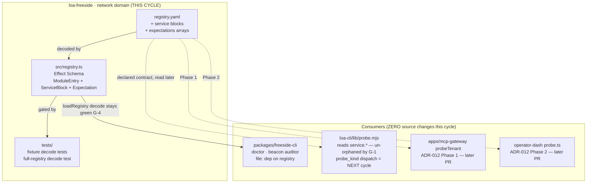

# Software Design Document — Cadence Ledger: the Liveness Expectation Record

> Cycle: **cadence-ledger**. This SDD designs the loa-freeside slice only: the
> declaration layer in `packages/freeside-registry`. ADR-012 Phase 0, extended
> with the staleness dimension (`expectations[]`).

---
status: draft
created: 2026-07-04
domain: network (packages/freeside-registry only; a CI workflow file is domain-unclassified and does not trip the ADR-007 firewall — verified against `tools/lib/domain-classify.sh:20-21`)
prd: grimoires/loa/prd.md
relates: decisions/012-unify-cluster-liveness.md (Proposed — this cycle IS its Phase 0, extended)
source_brief: grimoires/loa/context/cadence-ledger-rehomed-brief.md
---

## 1. System Overview

### 1.1 What this cycle builds

One package changes: `packages/freeside-registry`. Two additive schema blocks on
`ModuleEntry`, a populated `registry.yaml`, and validation with teeth. Nothing
else in the cluster changes behavior this cycle — the design's entire job is to
make the *declaration* correct, verifiable, and safe for every existing decoder.

> From prd.md §2: "The lane spans three repos in strict order; **this cycle
> delivers only the loa-freeside slice** — the declaration layer."

### 1.2 System context


```mermaid
graph TD
    subgraph "loa-freeside · network domain (THIS CYCLE)"
        Y[registry.yaml<br/>+ service blocks<br/>+ expectations arrays]
        S[src/registry.ts<br/>Effect Schema<br/>ModuleEntry + ServiceBlock + Expectation]
        T[tests/<br/>fixture decode tests<br/>full-registry decode test]
        Y -->|decoded by| S
        S -->|gated by| T
    end

    subgraph "Consumers (ZERO source changes this cycle)"
        CLI[packages/freeside-cli<br/>doctor · beacon auditor<br/>file: dep on registry]
        PROBE[loa-cli/lib/probe.mjs<br/>reads service.* — un-orphaned by G-1<br/>probe_kind dispatch = NEXT cycle]
        GW[apps/mcp-gateway probeTenant<br/>ADR-012 Phase 1 — later PR]
        DASH[operator-dash probe.ts<br/>ADR-012 Phase 2 — later PR]
    end

    S -->|loadRegistry decode stays green G-4| CLI
    Y -.->|declared contract, read later| PROBE
    Y -.->|Phase 1| GW
    Y -.->|Phase 2| DASH
```

Solid arrows are this cycle's verified paths; dashed arrows are declared-for
future phases and MUST NOT require changes here to land.

### 1.3 Architectural pattern

**Declarative contract in a schema-gated data file.** The registry is the
anti-corruption layer (ADR-012: "the naming IS the anti-corruption layer" —
"where is health, and what cadence is expected?" answered once). The Effect
Schema decode is the enforcement mechanism: an invalid declaration cannot load,
anywhere, in any consumer that uses `loadRegistry()`.

---

## 2. Grounding (verified 2026-07-04/05)

| Claim | Source | Verified |
|---|---|---|
| `ModuleEntry` has no `service`/`expectations`; excess yaml fields are "silently stripped on decode" (i.e. unknown fields do NOT break decode) | `packages/freeside-registry/src/registry.ts:26-54` (comment at L38-39) | read 2026-07-04 |
| probe.mjs reads exactly `service.{deployment_url, health_path, expected_status, auth_class, expected_body_marker}`; no `service.deployment_url` → verdict `scaffold` | `loa-cli/lib/probe.mjs:153-190` (L157, L160-166, L178) | read 2026-07-04 |
| probe.mjs defaults: `health_path`→`/`, `expected_status`→200, `auth_class`→`none`; `expected_body_marker` optional | `loa-cli/lib/probe.mjs:97, 161, 178` | read 2026-07-04 |
| ADR-012 appendix declares 5 cells' service values + score-api DO-NOT-TRANSCRIBE + 3 no-block cells | `decisions/012-unify-cluster-liveness.md:105-124` | read 2026-07-04 |
| score-api real health contract: `/` → **302 Location: /v1/health**; direct `GET /v1/health` → **200** `{"status":"ok",...,"service":"score-api",...}`; `/health` → 404 | live probe 2026-07-05T00:47Z (curl, read-only) | probed |
| sonar per-chain lag SLOs: ETH<50 · OP<600 · Arbitrum<2400 · Base<600 · **Berachain<300** · Zora<1800; recipe = `chain_metadata { chain_id latest_processed_block block_height }`, lag = `block_height − latest_processed_block`; SLOs are **PROPOSED, observe-only** | `~/Documents/GitHub/sonar-api/SCALE.md` Guardrail 2 (SLO table + lag-check command) | read 2026-07-04 |
| sonar GraphQL read plane = belt-gateway (`https://belt-gateway-production.up.railway.app/v1/graphql`), NOT sonar-api host; hyperindex deployment IDs rotate (blue-green) | `packages/freeside-registry/registry.yaml:258-268`; `SCALE.md` blue-green guardrail | read 2026-07-04 |
| freeside-cli consumes the registry via `"@freeside/freeside-registry": "file:../freeside-registry"`; `tests/ordering-registry.test.ts:17` calls `loadRegistry()` with the DEFAULT path → decodes the **real** registry.yaml | `packages/freeside-cli/package.json`, `tests/ordering-registry.test.ts` | read 2026-07-04 |
| No PR-time CI lane runs the freeside-registry / freeside-cli test suites today (`cluster-compliance.yml` triggers on registry.yaml paths but runs cell-compliance audits, not unit suites; `lib-tests.yml` covers `.claude/lib` only) | `.github/workflows/{cluster-compliance,lib-tests}.yml` | read 2026-07-04 |
| Test runner: `tsx --test tests/*.test.ts` (node:test), effect ^3.21.0, yaml ^2.6.0, TS ^5.4.0 — no new deps needed (NFR-4) | `packages/freeside-registry/package.json` | read 2026-07-04 |
| inventory-api appendix value (`/` 401 static-key) has likely drifted: the current deployment (`inventory-api-production-3f25`) serves open `/health 200` per registry notes 2026-07-03 | `registry.yaml:137-143` vs ADR-012 appendix | read 2026-07-04 |

[ASSUMPTION] sonar's SVM reconcile freshness projection (`svm_run_marker.updated_at`
or equivalent) — flagged in the PRD as unverified; FR-4 verifies against sonar's
live GraphQL schema before declaring. This SDD designs the shape, not the value.

---

## 3. Design Decisions

### D-1 — `service` block: ADR-012 Decision-1 verbatim, plus provenance

The struct carries **exactly** the five fields probe.mjs reads, plus two
provenance fields (NFR-5). Provenance is safe to add: probe.mjs destructures
only the fields it knows (`probe.mjs:97,160-166`) — extra keys are inert.

`service.deployment_url` is **required inside the block** (probe.mjs L157: no
`service.deployment_url` → `scaffold`, which would silently un-probe a declared
cell). The top-level `deployment_url` stays for existing consumers; a decode
filter enforces they match (see D-6), so the duplication cannot drift.

**Not chosen**: making `service.deployment_url` optional with fallback to the
entry-level field — probe.mjs is frozen this cycle (zero loa-cli changes), so a
fallback would require the exact consumer change that is out of scope.

### D-2 — `expectations[]`: discriminated union on `probe_kind`, gh-workflow excluded

`Schema.Union` of three structs, each tagged with `probe_kind:
Schema.Literal(...)`. An entry with `probe_kind: gh-workflow` (or any unknown
kind) fails the union decode loudly — the PRD's premature-use gate (FR-3) falls
out of the type system; no bespoke check needed.

### D-3 — stable ref identity

Each expectation carries `ref` (kebab-case slug, pattern-enforced). The global
identity is `<cell-slug>/<ref>` (e.g. `sonar-api/chain-lag`) — stable across
endpoint rotations, threshold tuning, and cadence changes, so future runners can
key state/alert-transition history on it. Refs are unique within a cell
(decode-time filter, D-6).

### D-4 — `graphql-lag` is generic-declared

Per FR-3, nothing sonar-specific in the schema. The kind declares: `endpoint`
(data — rotates with blue-green deploys), `query`, `rows_path` (dot-path to the
row array), `key` (per-row identity field), `minuend`/`subtrahend` (the two
numeric fields whose difference is the lag), and per-key `thresholds`
(`lag < threshold` semantics). Sonar's chain-lag check is *just data* under
this shape; a future postgres-replication-lag or queue-depth check fits the
same kind unchanged.

### D-5 — `event-max-age` shape

Declares `endpoint`, `query`, `timestamp_path` (dot-path to the freshest-event
ISO timestamp in the response) and `expect.max_age` (duration string). This is
the absence-of-expected primitive: consumer-side semantics (next cycle) are
`now() − timestamp > max_age` → stale.

### D-6 — validation with teeth = decode-time filters, not docs

Three `Schema.filter` refinements ride the schema itself so every consumer gets
them for free:
1. `service.deployment_url === entry.deployment_url` when both present (kills
   the two-fields-drift hazard D-1 creates).
2. `expectations[].ref` unique per cell.
3. `graphql-lag.expect.thresholds` non-empty.

Format constraints (path starts with `/`, status 100–599, cadence/max_age
pattern, ref pattern) are `Schema.pattern`/`Schema.between` refinements on the
fields.

### D-7 — cells without a served URL get NO block (derive-don't-type)

mint-api (routeless shell), events-api / mediums-api (libraries), ledger-api
(scaffolded, /health 404) get no `service` block. Their lifecycle derives from
absence per ADR-012 §Decision-3 — encoding a block for them would hand-type the
exact claim this lane kills. The schema keeps both blocks `Schema.optional`, so
absence is valid forever (G-4).

### D-8 — score-api FR-2 resolution (flag discharged)

Live-probed at design time (2026-07-05T00:47Z): `/` returns **302 → /v1/health**;
`GET /v1/health` directly returns **200** with the documented health JSON
(`"service":"score-api"`, `db:"connected"`, fresh `last_run_at`). `/health`
404s. The stable liveness path exists:

```yaml
service:
  deployment_url: https://score-api-production.up.railway.app
  health_path: /v1/health
  expected_status: 200
  auth_class: none            # /v1/health is open (probed unauthenticated → 200)
  expected_body_marker: '"service":"score-api"'
  probed_at: "2026-07-05"     # sprint re-verifies at populate time
  probe_source: live-probe    # FR-2 live resolution, NOT the ADR appendix
```

The 302 is never encoded. The redirect is *tolerated* by probe.mjs's same-host
manual redirect loop anyway, but declaring the direct path removes a hop and a
misclassification surface. Cell `notes` records the resolution trail.

### D-9 — sonar's two entries: values are declared data, verified at populate time

- `sonar-api/chain-lag` (`graphql-lag`): the SCALE.md Guardrail-2 recipe. All six
  chain thresholds transcribed (§5.3). **Endpoint must be live-verified at sprint
  time**: registry notes say GraphQL reads go through belt-gateway; SCALE.md's
  lag-check hits `indexer.hyperindex.xyz/<deployment-id>`. Whichever host serves
  `chain_metadata` is declared; it is data, revisable without schema change.
- `sonar-api/svm-reconcile` (`event-max-age`): shape per D-5; the projection
  field is an [ASSUMPTION] until verified against sonar's live GraphQL schema
  (FR-4). If unverifiable in-sprint, the entry is **omitted** (not guessed) and
  the gap recorded in sonar-api's cell `notes` — same discipline as FR-2's
  declare-nothing branch.

SCALE.md marks the SLO numbers PROPOSED/observe-only; the expectation record
declares them as thresholds with `owner: zerker` — alerting posture is a
runner-phase concern (out of scope), so declaring proposed values is safe: the
declaration layer records *what to measure against*, not *when to page*.

### D-10 — G-4 gate is a real CI lane, not a hope

freeside-cli's `ordering-registry.test.ts` already decodes the **real**
registry.yaml through the **shared** schema (file: dep) — the perfect G-4
sensor. But no PR-time workflow runs it. Add
`.github/workflows/registry-cli-tests.yml`: on PRs touching
`packages/freeside-registry/**` or `packages/freeside-cli/**`, fresh-install
(`npm ci` per package, standalone — mirrors cluster-compliance's "no workspace"
install; a fresh install also sidesteps the known pnpm/npm `file:` stale-copy
hazard) and run both `npm test` suites. The workflow file is domain-unclassified
(`domain-classify.sh` lists only `packages/freeside-{cli,registry}/*` as
network), so the PR stays single-domain **network**.

### D-11 — no version bump, no removals

`registry.yaml` stays `version: 1`. Every schema change is
`Schema.optional(...)` on `ModuleEntry`; no field is removed or retyped (NFR-2).
The stale `# Live-probe state` header comment is retired at ADR-012 Phase 3
(move-3), NOT here — this cycle only updates the schema documentation comment
block (`registry.yaml:8-19`) to document the new fields.

---

## 4. Data Design — the schema (Contract plane)

### 4.1 `src/registry.ts` additions (exact shape)

```typescript
// ── ADR-012 Phase 0 · cadence-ledger cycle ──────────────────────────────────

const AuthClass = Schema.Literal("none", "static-key");

/** ISO-8601 date, e.g. "2026-07-05" */
const IsoDate = Schema.String.pipe(Schema.pattern(/^\d{4}-\d{2}-\d{2}$/));

/** duration/cadence literal: "15m", "6h", "1d" */
const Duration = Schema.String.pipe(Schema.pattern(/^[1-9][0-9]*(m|h|d)$/));

/** kebab-case slug — the stable half of the <cell>/<ref> expectation identity */
const RefSlug = Schema.String.pipe(Schema.pattern(/^[a-z0-9][a-z0-9-]{0,63}$/));

// The declared health contract — field-for-field what loa-cli/lib/probe.mjs
// already reads (ADR-012 §Decision-1), plus NFR-5 provenance (inert to probe.mjs).
const ServiceBlock = Schema.Struct({
  deployment_url: Schema.String,           // required: probe.mjs L157 short-circuits to
                                           // 'scaffold' without it; must equal the
                                           // entry-level deployment_url (filter, §4.2)
  health_path: Schema.String.pipe(Schema.pattern(/^\//)),
  expected_status: Schema.Number.pipe(Schema.int(), Schema.between(100, 599)),
  auth_class: AuthClass,
  expected_body_marker: Schema.optional(Schema.String),
  // ── provenance (NFR-5): hand-typed values cite where/when they were probed ──
  probed_at: IsoDate,
  probe_source: Schema.Literal("adr-012-appendix", "live-probe"),
});

// ── expectations[] · discriminated union on probe_kind ──────────────────────
// gh-workflow is DELIBERATELY absent: premature use fails the union decode (FR-3).

const ExpectationCommon = {
  ref: RefSlug,
  cadence: Duration,
  owner: Schema.String.pipe(Schema.minLength(1)),
};

const HttpExpectation = Schema.Struct({
  probe_kind: Schema.Literal("http"),
  ...ExpectationCommon,
  // absent target ⇒ consumers probe the cell's own `service` block (documented
  // consumer semantic; dispatch lands in loa-cli NEXT cycle)
  target: Schema.optional(Schema.Struct({ url: Schema.String })),
  expect: Schema.optional(Schema.Struct({
    status: Schema.optional(Schema.Number.pipe(Schema.int(), Schema.between(100, 599))),
    body_marker: Schema.optional(Schema.String),
  })),
});

// Generic lag-between-two-numeric-fields over a GraphQL row set (never
// sonar-hardcoded): lag = row[minuend] − row[subtrahend], keyed by row[key],
// healthy iff lag < thresholds[row[key]] for every declared key.
const GraphqlLagExpectation = Schema.Struct({
  probe_kind: Schema.Literal("graphql-lag"),
  ...ExpectationCommon,
  target: Schema.Struct({
    endpoint: Schema.String,       // declared DATA — deployment ids rotate (SCALE.md blue-green)
    query: Schema.String,
    rows_path: Schema.String,      // dot-path to the row array, e.g. "data.chain_metadata"
    key: Schema.String,            // per-row identity field, e.g. "chain_id"
    minuend: Schema.String,        // e.g. "block_height"
    subtrahend: Schema.String,     // e.g. "latest_processed_block"
  }),
  expect: Schema.Struct({
    thresholds: Schema.Record({ key: Schema.String, value: Schema.Number })
      .pipe(Schema.filter((t) => Object.keys(t).length > 0
        || "graphql-lag expect.thresholds must declare at least one key")),
  }),
});

// Absence-of-expected: freshest event older than max_age ⇒ stale (consumer
// semantic, next cycle). The staleness-against-declared-cadence primitive.
const EventMaxAgeExpectation = Schema.Struct({
  probe_kind: Schema.Literal("event-max-age"),
  ...ExpectationCommon,
  target: Schema.Struct({
    endpoint: Schema.String,
    query: Schema.String,
    timestamp_path: Schema.String, // dot-path to the freshest ISO timestamp
  }),
  expect: Schema.Struct({ max_age: Duration }),
});

const Expectation = Schema.Union(
  HttpExpectation,
  GraphqlLagExpectation,
  EventMaxAgeExpectation,
);

const Expectations = Schema.Array(Expectation).pipe(
  Schema.filter((xs) => {
    const refs = xs.map((x) => x.ref);
    return new Set(refs).size === refs.length
      || "expectations[].ref must be unique within a cell";
  }),
);
```

### 4.2 `ModuleEntry` additions (additive only)

```typescript
const ModuleEntry = Schema.Struct({
  // ... existing nine fields UNCHANGED (registry.ts:26-54) ...
  service: Schema.optional(ServiceBlock).annotations({
    description:
      "ADR-012 §D-1 declared health contract, read by loa-cli/lib/probe.mjs. " +
      "Absent ⇒ lifecycle derives from absence (derive-don't-type).",
  }),
  expectations: Schema.optional(Expectations).annotations({
    description:
      "Cadence ledger: declared liveness expectations (staleness-against-declared-cadence). " +
      "Identity = <cell-slug>/<ref>. Consumers dispatch on probe_kind (loa-cli, next cycle).",
  }),
}).pipe(
  Schema.filter((e) =>
    !e.service || e.deployment_url == null || e.service.deployment_url === e.deployment_url
      || "service.deployment_url must equal the entry-level deployment_url"),
);
```

Note on the filter: it fires only when both are present, so no-URL library
cells and blockless cells decode unchanged. (If `Schema.filter` on the struct
proves awkward with the existing `Registry` composition, the equivalent check
lives in the full-registry decode test instead — the invariant is what's
load-bearing, not its host.)

### 4.3 Exports

`src/index.ts` additionally exports `type ServiceBlock`, `type Expectation`
(and the three member types) so Phase 1–3 consumers and the next-cycle loa-cli
dispatch import the contract types instead of re-declaring them.

### 4.4 New state machine? No.

This cycle introduces no runtime state. The verdict taxonomy
(`live/gated-live/live-drifted/down/scaffold/unprobed` — probe.mjs) and the
future stale/fresh transitions are consumer-side, out of scope. Deliberately no
diagram: drawing one here would imply behavior this PR ships.

---

## 5. `registry.yaml` population plan

### 5.1 Per-cell decision table

| Cell | `service` block | Values source | Notes action |
|---|---|---|---|
| activities-api | YES | ADR appendix (`/health`, 200, none, `"service":"activities-api"`) → **re-probed at sprint time** | add probe trail |
| identity-api | YES | ADR appendix (`/health`, 200, none, `"ok":true`) → re-probed | add probe trail |
| inventory-api | YES | ⚠ appendix (`/` 401 static-key) is **expected-stale** — deployment moved to `-3f25`, registry notes 2026-07-03 say open `/health` 200. Live re-probe DECIDES; do not transcribe the appendix blind | record which value won |
| sonar-api | YES | ADR appendix (`/`, 200, none, `"message":"Sonar API"`) → re-probed | + two `expectations` entries (§5.3) |
| storage-api | YES | ADR appendix (`/`, 200, none, no marker — Playground HTML) → re-probed | add probe trail |
| score-api | YES | **FR-2 live resolution** (D-8): `/v1/health`, 200, none, `"service":"score-api"` | record 302→/v1/health trail; DO-NOT-TRANSCRIBE flag discharged |
| mint-api | NO | derive-from-absence (routeless shell, /health 404) | note stays |
| events-api | NO | library, no served URL | — |
| mediums-api | NO | npm-only, no deployment | — |
| ledger-api | NO | scaffolded, /health 404 (probed 2026-06-19) | — |
| ordering | **operator call** (Open Question OQ-1) | its own registry note documents `/healthz` 200 `{"ok":true` | see §10 |

Every populated block carries `probed_at: <sprint probe date>` and
`probe_source` (NFR-5). The sprint task re-probes **all** declared cells before
populating — appendix values are 2 weeks old and one (inventory) is already
suspect; the re-probe is the risk mitigation the PRD names (§8, row 3).

### 5.2 Example — populated cell (activities-api)

```yaml
activities-api:
  git_url: https://github.com/0xHoneyJar/activities-api.git
  # ... existing fields unchanged ...
  service:
    deployment_url: https://activities-api-production.up.railway.app
    health_path: /health
    expected_status: 200
    auth_class: none
    expected_body_marker: '"service":"activities-api"'
    probed_at: "2026-07-XX"        # sprint probe date
    probe_source: adr-012-appendix # value matched appendix on re-probe
```

### 5.3 Sonar's two expectation entries (FR-4 / G-3)

```yaml
sonar-api:
  # ... existing fields + service block ...
  expectations:
    - ref: chain-lag
      probe_kind: graphql-lag
      cadence: 15m               # SLO windows are ~10-60 min; 15m gives 2 samples
      owner: zerker              # SCALE.md doc owner
      target:
        endpoint: <LIVE-VERIFIED at sprint time — belt-gateway if it serves
                   chain_metadata, else indexer.hyperindex.xyz/<current-deployment-id>>
        query: "{ chain_metadata { chain_id latest_processed_block block_height } }"
        rows_path: data.chain_metadata
        key: chain_id
        minuend: block_height
        subtrahend: latest_processed_block
      expect:
        thresholds:              # SCALE.md Guardrail 2 (PROPOSED tier — observe-only posture
          "1": 50                #   is a runner concern; declaration records the targets)
          "10": 600
          "42161": 2400
          "8453": 600
          "80094": 300           # Berachain — primary chain, strictest SLO
          "7777777": 1800
    - ref: svm-reconcile
      probe_kind: event-max-age
      cadence: 6h
      owner: zerker
      target:
        endpoint: <same live-verified endpoint>
        query: <VERIFIED against live schema — svm_run_marker.updated_at was an
                ASSUMPTION; FR-4 forbids declaring an unverified projection>
        timestamp_path: <verified dot-path>
      expect:
        max_age: 26h             # reconcile is ~daily; 26h ≈ one missed run + slack
                                 # (operator-tunable data; the 5-day Helius outage
                                 #  would have breached this ~4 days earlier)
```

The `svm-reconcile` entry ships **only if** the projection verifies against
sonar's live GraphQL schema in-sprint (D-9); otherwise omit + note.

---

## 6. API Specifications

No HTTP API changes. The package's public API grows two exported types
(§4.3); `loadRegistry()` signature is unchanged. The "API" of this cycle is the
YAML contract itself, specified in §4–5.

---

## 7. Error Handling Strategy

Single failure surface: **decode**. `Schema.decodeUnknownSync` throws
`ParseError` with a path-annotated tree — this is the designed behavior
(G-5: "fails decode loudly"), not an error to soften.

| Failure | Where caught | Behavior |
|---|---|---|
| Malformed `service` (bad status range, missing `probed_at`, unknown `auth_class`) | any `loadRegistry()` call | throw ParseError naming the field path |
| `probe_kind: gh-workflow` / unknown kind | union decode | throw — the FR-3 premature-use gate |
| Missing `cadence`, bad duration/ref pattern, empty thresholds, duplicate refs | field/array filters | throw with the filter's message |
| `service.deployment_url` ≠ entry `deployment_url` | struct filter (or registry test, §4.2 note) | throw / red test |
| Absent `service` / absent `expectations` | — | **valid** (optional; G-4) |

No fallbacks, no partial loads: a registry that fails decode is a registry that
does not exist to consumers — fail-closed is the point.

---

## 8. Testing Strategy

Runner: existing `tsx --test` / node:test (no new deps, NFR-4).

### 8.1 New tests in `packages/freeside-registry/tests/`

| File | Covers | Gate |
|---|---|---|
| `service-block.test.ts` | valid block decodes; each invalid variant (missing field, bad path/status/auth_class, missing provenance) throws; blockless entry valid; deployment_url mismatch throws | G-1, G-5, NFR-5 |
| `expectations.test.ts` | valid http / graphql-lag / event-max-age fixtures decode; **`gh-workflow` fails**; unknown kind fails; malformed cadence/ref fails; duplicate refs fail; empty thresholds fail; absent array valid | G-3, G-5, FR-3 |
| `registry-decode.test.ts` | the REAL `registry.yaml` full-decodes; every `service` block carries `probed_at`; sonar has ≥1 `expectations` entry with the six chain-lag threshold keys; score-api's `health_path` is not `/` with `expected_status: 302` (the anti-transcription tripwire) | G-1, G-2, FR-5 |

Fixtures live in `tests/fixtures/` beside the existing `sample-beacon-v3.yaml`,
as small inline-or-file YAML documents per case. Fixture tests assert against
the **shared production schema import**, never a test-local copy — the
fixture-tautology guard.

### 8.2 G-4 consumer gate

`packages/freeside-cli` suite runs **unchanged** (zero source, zero test edits
there): `ordering-registry.test.ts` decodes the real updated registry.yaml
through the shared schema, and `doctor.test.ts` exercises fixture registries
(which lack the new optional blocks — proving absence stays valid).

### 8.3 CI lane (D-10)

New `.github/workflows/registry-cli-tests.yml`:

```yaml
on:
  pull_request:
    paths:
      - 'packages/freeside-registry/**'
      - 'packages/freeside-cli/**'
      - '.github/workflows/registry-cli-tests.yml'
# job: setup-node → for pkg in freeside-registry freeside-cli:
#   npm ci (or npm install --no-package-lock, matching cluster-compliance's
#   standalone-package install) → npm test
# freeside-cli installs AFTER freeside-registry so its file: dep copies the
# UPDATED schema (fresh install defeats the file:-dep stale-copy hazard).
```

Acceptance for the lane itself: a deliberately-broken fixture branch goes red;
this branch goes green.

### 8.4 Live-probe verification (sprint tasks, not unit tests)

Probe output is ambient — never baked into unit tests. The populate task
records each probe (URL, status, body head, date) in the PR description +
`probed_at` fields; the score-api tripwire test (§8.1) guards the one
transcription hazard structurally.

---

## 9. Development Phases (sprint-shaping input)

Single sprint, one PR (all paths network-domain or unclassified):

1. **Schema** — §4 additions to `registry.ts` + `index.ts` exports + fixture
   tests (`service-block`, `expectations`). *Verify: new tests red→green;
   existing `beacon-loader.test.ts`, `worldline-score-api-registry.test.ts`
   still green.*
2. **Live probe wave** — re-probe the 6 declare-candidates (+ ordering if OQ-1
   says yes); resolve inventory's drift; confirm score-api `/v1/health` still
   200; verify sonar `chain_metadata` endpoint + SVM projection against the
   live GraphQL schema. *Verify: probe log in PR body.*
3. **Populate** — registry.yaml service blocks + sonar expectations + notes
   updates (score-api resolution trail, schema-comment block) +
   `registry-decode.test.ts`. *Verify: full-decode test green; freeside-cli
   suite green untouched.*
4. **CI lane** — `registry-cli-tests.yml`. *Verify: lane runs on the PR itself
   and is green; `tools/check-beacon-domain.sh --since main` reports
   single-domain.*

Dependency order is 1 → 2 → 3; 4 is parallel to 2–3 but must land in the same
PR so gate G-4 is enforced at merge time.

---

## 10. Open Questions

- **OQ-1 (operator)**: declare a `service` block for `ordering`? It is outside
  the ADR-012 appendix and the PRD's "8 cells" phrasing, but its health
  contract is already documented in its own registry note (`/healthz`, 200,
  `{"ok":true`) and it is deployed. **Recommendation: yes** — additive, same
  probe wave, and leaving a documented-but-undeclared health path re-creates
  the drift class this cycle kills. Costs one probe.
- **OQ-2 (sprint-resolvable)**: which host serves `chain_metadata` —
  belt-gateway or `indexer.hyperindex.xyz/<id>`? Resolved by one live query at
  populate time; declared as data either way (D-9).
- **OQ-3 (noted, not blocking)**: ADR-012 labels Phase 0 `domain:platform`,
  but `domain-classify.sh:21` and the PRD both place `packages/freeside-registry`
  in **network**. This SDD follows the classifier (it is the CI-enforced truth).
  Worth a one-line ADR-012 erratum when the ADR is ratified.

## 11. Risks & Mitigation

| Risk | Mitigation (designed-in) |
|---|---|
| Appendix values drifted (inventory already suspect) | §5.1: live re-probe decides every value; `probed_at`/`probe_source` make staleness visible forever (NFR-5) |
| score-api 302 gets transcribed by a future hand | D-8 declares the direct path; §8.1 tripwire test makes the 302-transcription a red build |
| freeside-cli decode breaks | Optional-only additions + §8.2 real-registry consumer test + §8.3 CI lane at merge time |
| gh-workflow used before a consumer exists | Excluded from the union — decode failure is mechanical (D-2) |
| SVM projection guess wrong | D-9: verify-or-omit; only yaml data changes if later corrected |
| Duplicated deployment_url drifts | D-6 filter #1 |
| Effect struct-level `Schema.filter` composition friction | §4.2 fallback: same invariant asserted in `registry-decode.test.ts` |
| ADR-012 rejected after landing | Additive schema + data — revertible in one PR (PRD §8) |

## 12. Software Stack (unchanged — for the record)

| Component | Version | Justification |
|---|---|---|
| effect (Schema) | ^3.21.0 (existing) | already the decode substrate; discriminated unions + filters native |
| yaml | ^2.6.0 (existing) | existing loader |
| TypeScript | ^5.4.0 (existing) | existing toolchain |
| tsx / node:test | ^4.20.0 (existing) | existing test runner |
| New dependencies | **none** | NFR-4 |
