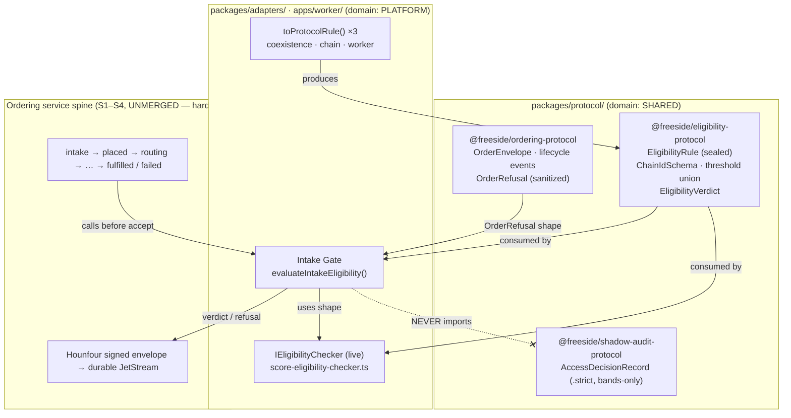
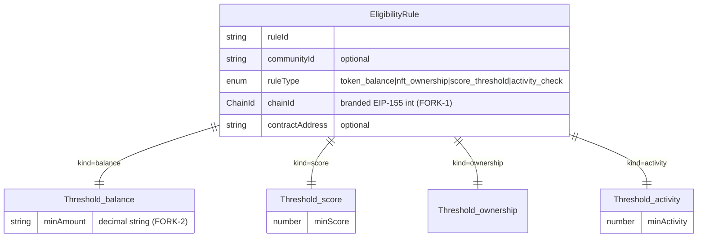
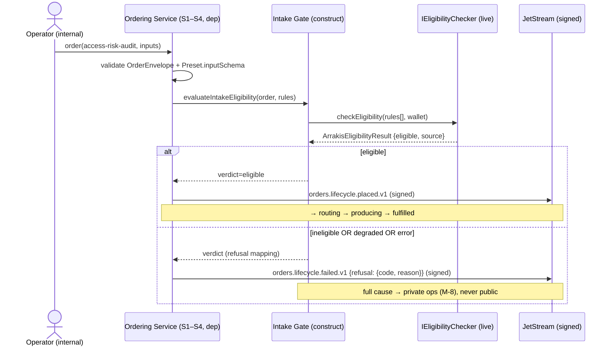
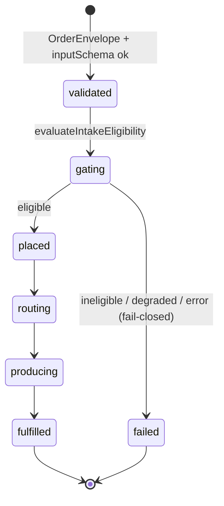

# Software Design Document — The Eligibility Seam (order intake gated on a reconciled eligibility noun)

> **Status:** candidate · **Cycle:** `cycle/shadow-audit-runtime-ordering` · **Date:** 2026-06-29
> **Traces to:** `grimoires/loa/prd.md` (The Eligibility Seam) + `proposals/eligibility-rule-reconciliation.md` (FORK-sealed) + `context/2026-06-28-audit-connections-to-eligibility-reconciliation.md`.
> **Domain (ADR-007):** `shared` (the noun + verdict schemas) **+** `platform` (the inward adapters + the intake gate). No `network/` paths. The sprint plan splits per-domain; **no single PR straddles** (CI: `.github/workflows/path-domain-check.yml`).
> **Claim tags:** `[OBSERVED]` grounded this cycle against source (file:line) · `[DESIGN]` proposed by this SDD.
> Prior SDD preserved → `sdd.prev-2026-06-29-order-system.md`.

---

## 0. Traceability (PRD → SDD)

| PRD requirement | SDD component |
|-----------------|---------------|
| **G-1 / FR-1** — sealed unified `EligibilityRule` noun | §3 the noun · §4.1 `@freeside/eligibility-protocol` |
| **G-1 / FR-2** — inward adapters for the 3 legacy sites | §5 `toProtocolRule()` anti-corruption adapters |
| **G-2 / FR-3** — order intake gates on an eligibility verdict | §6 the intake gate · §7 sequence · §9 lifecycle |
| **G-3 / NFR-4** — ordering never imports shadow-audit | §4.3 package boundary · §10 ACL test pin |
| **G-4 / NFR-2/3** — replay-safe; `AccessDecisionRecord` stays `.strict()` bands-only | §3.2 string threshold · §3.4 the verdict on JetStream |
| **G-5 / FR-4** — `activity_check` degrades like `token_balance` (no silent confident-negative) | §6.3 degrade-refuse · §8 error discipline |
| **NFR-5** — domain firewall (noun=shared, adapter=platform) | §4.4 domain split · §11 phases |
| **NFR-6** — one `chain/` touch (noun then error-discipline) | §8.2 chain/ sequencing |
| **DEP** — S1–S4 ordering spine unmerged (hard dependency) | §2 dependencies · §12 risks |

---

## 1. System Overview

This cycle cuts **one seam in two moves**: reconcile a fractured noun, then make it load-bearing at a gate.

1. **Reconcile the noun.** The tree ships **three** structurally-incompatible `EligibilityRule` types — they cannot round-trip a `chainId` or a `threshold` without a lossy cast. `[OBSERVED]` (`shadow-sync-job.ts:121`, `two-tier-provider.ts:41`, `EligibilityRepository.ts:36`). This SDD authors **one** sealed Zod `EligibilityRule` and retires the three via inward (anti-corruption) adapters.
2. **Gate intake on it.** The order-intake path (built S1→S4, unmerged) currently accepts orders with **no eligibility check**. This SDD wires an **intake gate** that evaluates eligibility through the existing `IEligibilityChecker` shape `[OBSERVED]` (`shadow-sync-job.ts:132`) **before** accepting; ineligible (or un-judgeable) → the existing **sanitized refusal envelope**, fail-closed, with the verdict on the signed JetStream spine.


```mermaid
flowchart TD
    subgraph SHARED["packages/protocol/  (domain: SHARED)"]
        N["@freeside/eligibility-protocol<br/>EligibilityRule (sealed)<br/>ChainIdSchema · threshold union<br/>EligibilityVerdict"]
        OP["@freeside/ordering-protocol<br/>OrderEnvelope · lifecycle events<br/>OrderRefusal (sanitized)"]
        SA["@freeside/shadow-audit-protocol<br/>AccessDecisionRecord (.strict, bands-only)"]
    end
    subgraph PLATFORM["packages/adapters/ · apps/worker/  (domain: PLATFORM)"]
        GATE["Intake Gate<br/>evaluateIntakeEligibility()"]
        CHK["IEligibilityChecker (live)<br/>score-eligibility-checker.ts"]
        A1["toProtocolRule() ×3<br/>coexistence · chain · worker"]
    end
    subgraph SPINE["Ordering service spine (S1–S4, UNMERGED — hard dep)"]
        INTAKE["intake → placed → routing → … → fulfilled / failed"]
        JS["Hounfour signed envelope → durable JetStream"]
    end

    A1 -->|produces| N
    N -->|consumed by| GATE
    N -->|consumed by| CHK
    GATE -->|uses shape| CHK
    INTAKE -->|calls before accept| GATE
    GATE -->|verdict / refusal| JS
    OP -->|OrderRefusal shape| GATE
    GATE -. "NEVER imports" .-x SA
```

> **The one-line invariant:** the gate consumes the **shared** eligibility noun + the ordering refusal shape; it **never** imports `shadow-audit` (`ordering-protocol.test.ts:99` stays green).

---

## 2. Dependencies & Boundaries

| Kind | Item | Status | In SDD scope? |
|------|------|--------|---------------|
| **Hard dependency** | S1–S4 ordering spine (envelope, intake, orchestrator, frontend) — `OrderEnvelopeSchema`, lifecycle events, JetStream publish | `[OBSERVED]` built, **unmerged** on this branch (commits `267c2122`…`16a8cced`) | **NO** — consumed, not built. The gate has no intake to gate without it. |
| **Migration site** | `#384` live `IEligibilityChecker` — `score-eligibility-checker.ts` (`makeScoreEligibilityChecker`, `satisfies()`, 11 fail-closed tests) | `[OBSERVED]` exists in branch history (commit `7b227749`); fail-closed sound | **YES** — `satisfies()` migrates to the union threshold; pinned by its 11 tests. |
| **Coupled surface** | `chain/` error-discipline pass (`arrakis-kskt`/`7bnk`/`zt17`) | `[OBSERVED]` spec `context/2026-06-28-chain-error-discipline-fix-spec.md` | **Sequenced** (NFR-6), not authored here. |
| **Stays as-is** | `AccessDecisionRecordSchema` — `.strict()`, bands-only | `[OBSERVED]` `access-decision-record.ts:42` | **NO change** — the gate's verdict is a *separate* noun; the record is unaffected. |

---

## 3. The Noun — `EligibilityRule` (sealed Zod, `packages/protocol/eligibility/`)

### 3.1 The three shapes being reconciled `[OBSERVED]`

| field | `coexistence/shadow-sync-job.ts:121` | `chain/two-tier-provider.ts:41` | `worker/EligibilityRepository.ts:36` |
|---|---|---|---|
| id | *(none)* | `id: string` | `ruleId: string` |
| chainId | `string` | `ChainId` (`number\|string`, lossy) | `number` |
| contractAddress | `string` | `Address` | `string` |
| threshold | `minAmount?: bigint` · `minScore?: number` | `parameters: {...}` | `minBalance: string` |
| ruleType | 3 variants | 4 variants (`+activity_check`) | *(absent — inferred)* |
| communityId | — | ✓ | — |

> `chainId` alone is `string | number | branded` across the three — "the credibility hole at the wedge center" (`proposals/eligibility-rule-reconciliation.md:22-27`).

### 3.2 The sealed schema `[DESIGN]` (FORK-sealed by operator)

```ts
// packages/protocol/eligibility/src/eligibility-rule.ts
import { z } from 'zod';

// FORK-1 (sealed): chainId is a BRANDED EIP-155 positive integer. A string "1" and a
// number 1 must never both be valid — the string/number forms are lossy serializations.
// This is a NEW branded type; the legacy core/ports ChainId (number|string) is untouched.
export const ChainIdSchema = z
  .number()
  .int()
  .positive()
  .brand<'ChainId'>();
export type ChainId = z.infer<typeof ChainIdSchema>;

export const EligibilityRuleType = z.enum([
  'token_balance',
  'nft_ownership',
  'score_threshold',
  'activity_check', // superset of all three legacy shapes
]);
export type EligibilityRuleType = z.infer<typeof EligibilityRuleType>;

export const EligibilityRuleSchema = z
  .object({
    ruleId: z.string().min(1),               // canonical id ← reconciles (none)|id|ruleId
    communityId: z.string().min(1).optional(),
    ruleType: EligibilityRuleType,
    chainId: ChainIdSchema,
    contractAddress: z.string().min(1).optional(), // score_threshold needs none
    // FORK-2 (sealed): threshold is a discriminated union; amount is STRING (decimal),
    // not bigint — JSON-/replay-safe, survives snapshot→replay. bigint is FORBIDDEN.
    threshold: z.discriminatedUnion('kind', [
      z.object({ kind: z.literal('balance'),  minAmount: z.string().min(1) }),
      z.object({ kind: z.literal('score'),    minScore: z.number() }),
      z.object({ kind: z.literal('ownership') }),
      z.object({ kind: z.literal('activity'), minActivity: z.number() }),
    ]),
  })
  .strict(); // an extra key (e.g. a smuggled bigint field) is a hard parse failure
export type EligibilityRule = z.infer<typeof EligibilityRuleSchema>;
```

### 3.3 ER view of the reconciled noun


```mermaid
erDiagram
    EligibilityRule {
        string  ruleId
        string  communityId "optional"
        enum    ruleType "token_balance|nft_ownership|score_threshold|activity_check"
        ChainId chainId "branded EIP-155 int (FORK-1)"
        string  contractAddress "optional"
    }
    Threshold_balance  { string minAmount "decimal string (FORK-2)" }
    Threshold_score    { number minScore }
    Threshold_ownership { }
    Threshold_activity { number minActivity }
    EligibilityRule ||--|| Threshold_balance  : "kind=balance"
    EligibilityRule ||--|| Threshold_score    : "kind=score"
    EligibilityRule ||--|| Threshold_ownership : "kind=ownership"
    EligibilityRule ||--|| Threshold_activity : "kind=activity"
```

### 3.4 The verdict — `EligibilityVerdict` `[DESIGN]`

The checker's output (`ArrakisEligibilityResult { eligible, tier, score, source }`, `[OBSERVED]` `coexistence.ts:169`) is the **construct-plane** result. The gate emits a small **contract-plane** verdict that rides the JetStream spine — distinct from the rule and from the audit's `AccessDecisionRecord`:

```ts
// packages/protocol/eligibility/src/eligibility-verdict.ts
export const EligibilitySourceSchema = z.enum(['native', 'score_service', 'native_degraded']);
export const EligibilityVerdictSchema = z
  .object({
    decision: z.enum(['eligible', 'ineligible', 'degraded']), // degraded = honest "can't judge"
    source: EligibilitySourceSchema,
    /** Operator-safe one-line reason; full diagnostic cause is NOT here (private ops, M-8). */
    reason: z.string().min(1).optional(),
  })
  .strict();
export type EligibilityVerdict = z.infer<typeof EligibilityVerdictSchema>;
```

> **Why a separate verdict noun (Risk hedge — PRD §7):** "who may order" (the gate) and "who passes the rule" (the checker) may diverge. Keeping the verdict distinct from the rule means a future divergence is a schema change, not a silent re-interpretation. `degraded` is a first-class outcome (FR-4 / G-5), never folded into `ineligible`.

---

## 4. Architecture & Package Topology

### 4.1 New package: `@freeside/eligibility-protocol`

`[DESIGN]` `packages/protocol/eligibility/` (parallel to `ordering` and `shadow-audit`; naming follows `[OBSERVED]` `@freeside/ordering-protocol`, `@freeside/shadow-audit-protocol`). Pure schemas + types, no I/O. Exports `EligibilityRuleSchema`, `ChainIdSchema`, `EligibilityVerdictSchema`, and the `toProtocolRule` adapter *interfaces* (impls live with each site).

### 4.2 Three planes (one repo, one seam)

| Plane | Lives in | This SDD's artifacts |
|-------|----------|----------------------|
| **Contract** | `packages/protocol/eligibility/` (shared) | the sealed noun, `ChainIdSchema`, threshold union, `EligibilityVerdict` |
| **Construct** | pure functions | `evaluateIntakeEligibility(order, rules, checker)` — maps order→rules, calls the checker, returns a verdict; no I/O |
| **Execution** | `packages/adapters/*`, `apps/worker/*` (platform) | the live `IEligibilityChecker`, the 3 `toProtocolRule()` adapters, the intake-gate wiring into the (unmerged) ordering service |

### 4.3 The ACL boundary (G-3 / NFR-4)

`@freeside/ordering-protocol` and the intake gate consume **`@freeside/eligibility-protocol`** and the ordering refusal shape only. Neither imports any `shadow-audit` module. Pinned by `[OBSERVED]` `ordering-protocol.test.ts:91-101` (`expect(body).not.toMatch(/from\s+['"][^'"]*shadow-audit/)`). The new eligibility package is **not** shadow-audit, so the gate may import it freely.

### 4.4 Domain firewall split (ADR-007 / NFR-5) `[OBSERVED]` `tools/lib/domain-classify.sh:16-39`

| Path | Classifies as | Sprint/PR |
|------|---------------|-----------|
| `packages/protocol/eligibility/*` | **shared** (no platform/network glob match) | PR-A (noun) |
| `packages/adapters/coexistence/*`, `packages/adapters/chain/*` | **platform** | PR-B (adapters + gate) |
| `apps/worker/*` | **platform** | PR-B |

A shared-only PR and a platform-only PR each pass `path-domain-check.yml` (cross-domain block triggers only when **both** platform and network paths appear). No straddle.

---

## 5. Inward Adapters — `toProtocolRule()` (FR-2, no big-bang)

Each legacy site keeps its local shape behind a **one-function** anti-corruption adapter `local → EligibilityRule`. Nothing downstream binds the local shapes.

| Site `[OBSERVED]` | Mapping `[DESIGN]` |
|---|---|
| `coexistence/shadow-sync-job.ts:121` | synthesize `ruleId` (deterministic from contract+chain+type); `chainId: string → ChainIdSchema.parse(Number(...))` (reject non-numeric, fail-closed); `minAmount: bigint → minAmount: String(bigint)` (kind=`balance`); `minScore → kind='score'`; `nft_ownership → kind='ownership'` |
| `chain/two-tier-provider.ts:41` | `id → ruleId`; `chainId` already branded-ish, `ChainIdSchema.parse(Number(chainId))`; `parameters.{minAmount\|maxRank\|...} → threshold` union by `ruleType`; `communityId` carries through |
| `worker/EligibilityRepository.ts:36` | infer `ruleType: 'token_balance'` (minBalance present); `chainId: number → ChainIdSchema.parse`; `minBalance: string → threshold{kind:'balance', minAmount}` |
| `#384 score-eligibility-checker.ts` `satisfies()` | migrate flat reads (`rule.minScore`) → union reads (`rule.threshold.kind === 'score' ? rule.threshold.minScore : …`); `ownership` gates on `nft_score > 0` (NOT tier-presence — preserve the H-1 fail-open #384 already avoids). Pinned by its **11 fail-closed tests**. |

**Acceptance meter (G-1):** a round-trip test validates a canonical sample AND round-trips each of the three legacy shapes `local → toProtocolRule() → EligibilityRuleSchema → back` **without loss on `chainId` and `threshold`** (`proposals/eligibility-rule-reconciliation.md:71-75`).

---

## 6. The Intake Gate (FR-3, the gate)

### 6.1 Where it sits

The (unmerged) ordering service accepts an `OrderEnvelope` `[OBSERVED]` (`order.ts:17-32`) and emits `orders.lifecycle.placed.v1` `[OBSERVED]` (`events.ts:16-22`). The gate runs **between accept and `placed`** — i.e. before the order is admitted to the saga.

### 6.2 The pure decision function `[DESIGN]`

```ts
// construct plane — no I/O
async function evaluateIntakeEligibility(
  order: OrderEnvelope,
  rules: EligibilityRule[],          // resolved for this product (shared noun)
  checker: IEligibilityChecker,      // OBSERVED shape: checkEligibility(rules, wallet)
): Promise<EligibilityVerdict> {
  const result = await checker.checkEligibility(rules, walletFrom(order));
  if (result.source === 'native_degraded') {
    return { decision: 'degraded', source: result.source, reason: 'eligibility_undecidable' };
  }
  return result.eligible
    ? { decision: 'eligible',   source: result.source }
    : { decision: 'ineligible', source: result.source, reason: 'ineligible' };
}
```

### 6.3 Decision → lifecycle (fail-closed) `[DESIGN]`

| Verdict | Action | Event |
|---------|--------|-------|
| `eligible` | admit to saga | proceeds to `orders.lifecycle.placed.v1` → `routing` |
| `ineligible` | refuse | `orders.lifecycle.failed.v1` with `OrderRefusal { code: 'ineligible', reason }` `[OBSERVED]` (`events.ts:80-96`) |
| `degraded` | **refuse** (honest "can't judge", FR-4 / G-5) | `failed` with `OrderRefusal { code: 'eligibility_degraded', reason }` — NOT a confident negative |
| checker throws / no rules resolved | **refuse** (NFR-1 fail-closed) | `failed` with `OrderRefusal { code: 'eligibility_error' }` |

The verdict rides the **Hounfour signed envelope** (ed25519 + JCS + hash-chain, `@0xhoneyjar/events`) on durable JetStream `[OBSERVED]` (`events.ts:4-13`). Full diagnostic cause goes to the private ops channel (M-8), never the public `failed` topic.

> **Refuse-not-approximate:** the default branch of every decision path is refusal. There is no code path that admits an order on an unverified, fabricated, or approximated grant.

---

## 7. Sequence — order intake through the gate


```mermaid
sequenceDiagram
    actor Op as Operator (internal)
    participant Svc as Ordering Service (S1–S4, dep)
    participant Gate as Intake Gate (construct)
    participant Chk as IEligibilityChecker (live)
    participant JS as JetStream (signed)

    Op->>Svc: order(access-risk-audit, inputs)
    Svc->>Svc: validate OrderEnvelope + Preset.inputSchema
    Svc->>Gate: evaluateIntakeEligibility(order, rules)
    Gate->>Chk: checkEligibility(rules[], wallet)
    Chk-->>Gate: ArrakisEligibilityResult {eligible, source}
    alt eligible
        Gate-->>Svc: verdict=eligible
        Svc->>JS: orders.lifecycle.placed.v1 (signed)
        Note over Svc,JS: → routing → producing → fulfilled
    else ineligible OR degraded OR error
        Gate-->>Svc: verdict (refusal mapping)
        Svc->>JS: orders.lifecycle.failed.v1 {refusal: {code, reason}} (signed)
        Note over Gate,JS: full cause → private ops (M-8), never public
    end
```

---

## 8. Error Handling & Degradation

### 8.1 Degrade-refuse, never default-deny (FR-4 / G-5) `[OBSERVED]` `context/...reconciliation.md:12-14`

The `#384` score-backed checker structurally cannot evaluate `token_balance` **or** `activity_check`. Today it returns `native_degraded` for `token_balance` (an honest degrade), never a confident negative. When `activity_check` lands, it MUST degrade the **same way**:

- The score-checker **owns** `score_threshold` + `nft_ownership`.
- `token_balance` **and** `activity_check` both **degrade** to the chain checker (`source: 'native_degraded'`).
- `satisfies()`'s switch MUST NOT carry a `default: return false` — that silently banks a confident "ineligible" for a rule it cannot judge. The degrade path returns the degrade marker; the gate maps it to `decision: 'degraded'` → refuse-honestly.

**Test (G-5):** an `activity_check` rule fed to the score-backed checker returns a degrade (e.g. `native_degraded`), not `false`; pinned alongside `#384`'s 11 existing fail-closed tests.

### 8.2 One `chain/` touch (NFR-6) `[OBSERVED]` spec `context/2026-06-28-chain-error-discipline-fix-spec.md`

The `chain/` eligibility path carries both the noun fork (`two-tier-provider.ts`, `score-service-client.ts`) and the error-discipline bugs (`arrakis-kskt` over-broad retry, `7bnk` unbounded metric, `zt17` swallow-as-negative). **Sequencing:** reconcile the noun (contract) **first**, then the error-discipline pass (runtime) — both in **one** `chain/` sprint so the surface is touched once. The error-discipline pass itself is its own spec, **not authored here**; this SDD only sequences it.

---

## 9. Order Lifecycle (with the gate)


```mermaid
stateDiagram-v2
    [*] --> validated: OrderEnvelope + inputSchema ok
    validated --> gating: evaluateIntakeEligibility
    gating --> placed: eligible
    gating --> failed: ineligible / degraded / error (fail-closed)
    placed --> routing
    routing --> producing
    producing --> fulfilled
    fulfilled --> [*]
    failed --> [*]
```

> Subjects `[OBSERVED]` `events.ts:16-22`: `orders.lifecycle.{placed,routing,producing,fulfilled,failed}.v1`. The gate adds no new subject — `eligible` flows into `placed`; every refusal reuses the terminal `failed` event + `OrderRefusal`.

---

## 10. Data & Persistence

- **No new persistent store.** The noun is a schema; the verdict is an event payload. The `EligibilitySnapshot`/ScyllaDB caching in `apps/worker` `[OBSERVED]` (`EligibilityRepository.ts:11`) is unchanged — only its local `EligibilityRule` adapts inward.
- **`AccessDecisionRecord` untouched** (NFR-3): `.strict()`, bands-only, no numeric score. A smuggled `score` remains a hard parse failure `[OBSERVED]` (`access-decision-record.ts:42-53`). The gate's verdict is a *separate* noun and never widens the audit record.
- **Replay-safety (NFR-2):** every rule/verdict field is JSON-serializable (FORK-2 string threshold; `bigint` forbidden). Verdicts round-trip snapshot→replay.

---

## 11. Software Stack

| Concern | Choice | Version / source | Rationale |
|---------|--------|------------------|-----------|
| Schema/validation | Zod | `[OBSERVED]` already used across `packages/protocol/*` | sealed nouns, discriminated unions, `.strict()`, `.brand()` for FORK-1 |
| Event envelope | `@0xhoneyjar/events` (Hounfour: ed25519 + JCS + hash-chain) | `[OBSERVED]` `events.ts:4-13` | signed, replay-safe spine — reused, not rebuilt |
| Transport | NATS durable JetStream | `[OBSERVED]` ordering spine | at-least-once + durable; matches existing lifecycle subjects |
| Language/runtime | TypeScript (pnpm workspace) | `[OBSERVED]` existing monorepo | one repo, typed cross-package contracts |
| Test | Vitest | `[OBSERVED]` `ordering-protocol.test.ts` | round-trip + ACL + fail-closed tests |

No new runtime dependency is introduced. (Karpathy ladder: the signed-event spine and Zod already exist — reuse, don't add.)

---

## 12. Risks & Mitigation

| Risk / Dependency | Impact | Mitigation |
|---|---|---|
| **[DEP] S1–S4 ordering spine unmerged** | No intake to gate (G-2 blocked) | Sprint plan sequences the merge as an explicit prerequisite; this SDD designs the gate against the spine's `[OBSERVED]` contracts but does not build the spine |
| **[RISK] False shared kernel** — the 3 legacy semantics secretly diverge | Silent mis-gating | Round-trip meter (G-1) + per-site adapters; **operator-check:** name a case where "who may order" says YES while "who passes the rule" says NO — if real, keep verdict and rule types distinct (already done, §3.4) |
| **[RISK] Premature gate** — external orderer doesn't exist (Mom-test) | Gate unconsumed at the order edge | Lead with the reconciliation (real credibility-hole fix); the gate's first real consumer can be the coexistence checker, not external orders |
| **[DEP] `#384` `satisfies()` migration** to the union threshold | Touches verified-sound checker | Pin with its **11 existing fail-closed tests** (§5) |
| **[RISK] `chainId` brand coercion** — legacy `string`/`number` → branded int | Parse-time failures on bad data | `ChainIdSchema.parse(Number(...))` fail-closed at the adapter edge; non-numeric chain ids are rejected, not silently coerced |
| **[RISK] AccessDecisionRecord placement** inside shadow-audit; ordering's ACL forbids importing it | G-3 red if consumed directly | The gate consumes the **shared** `EligibilityVerdict`, NOT shadow-audit's record (§3.4, §4.3) |

---

## 13. Development Phases (sprint-ready; domain-clean)

| Phase | Domain | Scope | Acceptance | Maps to |
|-------|--------|-------|------------|---------|
| **P1 — the noun** | shared (PR-A) | `@freeside/eligibility-protocol`: `EligibilityRuleSchema`, `ChainIdSchema`, threshold union, `EligibilityVerdictSchema` | round-trip test green on a canonical sample | G-1 / FR-1 |
| **P2 — inward adapters** | platform (PR-B) | 3× `toProtocolRule()` (coexistence, chain, worker) + `#384` `satisfies()` migration | each legacy shape round-trips without loss on `chainId`+`threshold`; `#384`'s 11 fail-closed tests stay green | G-1 / FR-2 |
| **P3 — degrade correctness** | platform (PR-B) | `activity_check` degrades like `token_balance` in the score-checker | `activity_check` → degrade (not `false`); no `default: return false` | G-5 / FR-4 |
| **P4 — the gate** | platform (PR-B) | `evaluateIntakeEligibility()` + wiring into intake before `placed`; refusal mapping → `failed`+`OrderRefusal` on JetStream | ineligible/degraded/error all refuse end-to-end; eligible proceeds to saga; ACL test (`:99`) green | G-2 / G-4 / FR-3 |
| **P5 — chain/ error-discipline** | platform (separate `chain/` sprint) | sequence the `arrakis-kskt/7bnk/zt17` pass **after** noun reconciliation, same sprint | per the chain error-discipline spec (not this SDD) | NFR-6 |

> P2–P4 are platform-only and may share a PR; P1 is shared-only and MUST be its own PR (firewall). P5 is the coupled `chain/` runtime pass, sequenced after the contract lands.

---

## 14. Testing Strategy

| Test | Asserts | Pin |
|------|---------|-----|
| Round-trip (G-1) | canonical sample validates; 3 legacy shapes round-trip without loss on `chainId`+`threshold` | new |
| ACL (G-3) | no `from '…shadow-audit'` in ordering/gate sources | `[OBSERVED]` `ordering-protocol.test.ts:91-101` (stays green) |
| Strictness (G-4) | smuggled extra key / numeric `score` in `AccessDecisionRecord` → hard parse failure | `[OBSERVED]` `access-decision-record.ts:42` |
| Replay (NFR-2) | verdict + rule survive JSON snapshot→replay; bigint absent | new |
| Degrade (G-5) | `activity_check` & `token_balance` → degrade, never `false`; no `default` deny | with `#384`'s 11 tests |
| Gate (G-2) | ineligible/degraded/error → `failed`+`OrderRefusal`; eligible → `placed` | new |

Every non-trivial branch (each decision path in §6.3, each adapter mapping in §5) leaves a runnable check that fails if the logic breaks (Karpathy #4).

---

## 15. Open Questions

1. **Rule resolution for `access-risk-audit`** — where does the gate get the `EligibilityRule[]` for a given product/order? (A preset-attached rule set, a community config lookup, or a fixed MVP rule?) The PRD scopes the gate to one product; the *rule source* is unspecified. `[ASSUMPTION]` MVP uses a fixed/preset-attached rule set; if wrong, P4 needs a resolution port.
2. **Wallet extraction from the order** — `OrderEnvelope.placed_by` is an internal operator/service identity `[OBSERVED]` (`order.ts:23`), not a wallet. The gate needs the *subject wallet* being judged. Likely it comes from `inputs` (e.g. the audited contract's holder context) — confirm the field. `[ASSUMPTION]` wallet is derivable from order `inputs`; if not, the envelope or preset needs a subject field.

> Both questions are **resolution-layer** details that do not change the noun, the verdict, or the firewall split — they surface at P4. Neither is a fork the PRD/proposal already resolved.

---

## 16. Post-Completion

Next: `/sprint-plan` — turn §13 phases into beads tasks (P1 shared-only PR; P2–P4 platform PR; P5 the sequenced `chain/` sprint), each carrying a `domain:` label (ADR-007 hard-rule 3) and tracing to a G-id.
