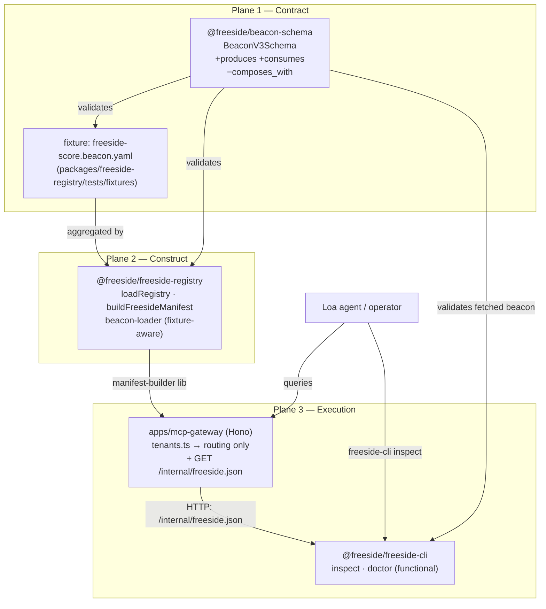
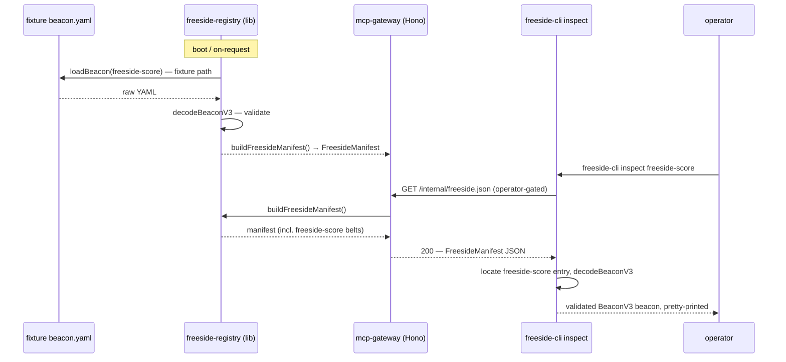

# Software Design Document: Close the Freeside Discovery Loop

**Version:** 1.0
**Date:** 2026-05-19
**Author:** Architecture Designer Agent
**Status:** Draft
**PRD Reference:** grimoires/loa/prd.md
**Cycle:** cycle-049 · codename `discovery-loop`
**Domain:** network (ADR-007 §D-3 — CI-firewalled; cycle ledger entry carries `domain: network`)
**Supersedes:** the prior `/ride` "Platform-as-Built" SDD snapshot (preserved at `grimoires/loa/sdd.md.ride-2026-05-18-bak` and in git history) — parallel to the PRD superseding its own `/ride` snapshot (prd.md:7).

---

## Table of Contents

1. [Project Architecture](#1-project-architecture)
2. [Software Stack](#2-software-stack)
3. [Data Design](#3-data-design)
4. [CLI / Interface Design](#4-cli--interface-design)
5. [API Specifications](#5-api-specifications)
6. [Error Handling Strategy](#6-error-handling-strategy)
7. [Testing Strategy](#7-testing-strategy)
8. [Development Phases](#8-development-phases)
9. [Known Risks and Mitigation](#9-known-risks-and-mitigation)
10. [Open Questions](#10-open-questions)
11. [Appendix](#11-appendix)

---

## 1. Project Architecture

### 1.1 System Overview

This cycle wires together a discovery system whose parts are already scaffolded but inert. Per PRD §1: *"the BeaconV3 schema exists, the registry has a hand-written skeleton, `freeside-cli list` works — but no building broadcasts a real beacon, no live endpoint serves the federation manifest, and the gateway is not wired to the registry"* (prd.md:15).

The cycle closes the loop **`building declares → registry aggregates → endpoint serves → agent queries`** end-to-end, proven against a `freeside-score` **fixture** beacon (the cross-repo real beacon is out of scope per PRD §6).

There are two distinct workstreams:

1. **Contract reconciliation** — BeaconV3 carries `composes_with` but ADR-008 §D-3 canonized *belts* (`produces`/`consumes`). Schema and doctrine have diverged (prd.md:17). This cycle hard-replaces `composes_with` with belt fields.
2. **Wiring** — make `freeside-registry`, `apps/mcp-gateway`, and `freeside-cli` actually run the loop instead of returning stub output.

This is a **brownfield network-domain cycle**. No platform paths are touched. All edits land in `packages/beacon-schema/`, `packages/freeside-registry/`, `packages/freeside-cli/`, `apps/mcp-gateway/` — all network-domain per ADR-007 §D-3.

### 1.2 Architectural Pattern

**Pattern:** Layered library + single HTTP gateway (no new network listener).

**Justification:**

The four resolved architecture decisions (PRD §7, "`/architect` decides") drive the pattern:

| Decision | Resolution | Rationale |
|----------|-----------|-----------|
| **AD-1: Where `/federation.json` physically lives** | `freeside-registry` owns the **manifest-builder library** (data layer + aggregation logic). `apps/mcp-gateway` owns the **HTTP route** that serves it. The registry does NOT open its own HTTP listener this cycle. | Two HTTP surfaces (a registry server + the gateway) means two deploys, two certs, two observability layers for one logical manifest. The gateway README §why already states *"data-shaped MCPs … belong behind a gateway"* and *"the gateway is a routing layer, not a substrate of its own"* (mcp-gateway/README.md:25,29). The registry is the substrate; the gateway is its one published surface. `freeside-registry`'s own `registry.ts` header confirms the split: *"The full HTTP server … is a follow-up cycle deliverable. This skeleton ships the data shape + loader"* (registry.ts:8-10) — this cycle keeps the registry a library and gives the HTTP surface to the gateway. |
| **AD-2: The mcp-gateway↔registry seam** | **Bridge, not hard-replace.** `tenants.ts` shrinks toward its documented v0.3 shape (routing + gateway policy); a new registry-fed federation route is added alongside the existing `tenants.ts`-driven routes. The two coexist this cycle. | The gateway README documents this exact transitional path: *"v0.2 transitional shape: tenants.ts encodes both … v0.3 destination: gateway fetches each upstream's federation-extended `/.well-known/mcp.json` at boot … tenants.ts shrinks to routing + gateway policy"* (mcp-gateway/README.md:42). A hard-replace of `tenants.ts` would also break the live codex proxy routing (`/codex/*`) and the health-probe loop (app.ts) — out-of-scope blast radius. The bridge respects the README's v0.2→v0.3 sequencing. |
| **AD-3: The BeaconV3 `produces`/`consumes` Effect-Schema shape** | Two new Effect `Schema.Array(Schema.Struct(...))` fields on `BeaconV3Schema`, **hard-replacing** `composes_with` (and its `ComposesWith`/`ComposesWithEntry` types). | PRD FR-1: *"Remove `composes_with` entirely (Phase-0 gap answer: hard-replace — `@freeside/beacon-schema` is v0.2.0, days old, zero external broadcasters; no migration window warranted)"* (prd.md:55). The belt fields reuse the existing `TagReference` pattern already in `beacon-v3.ts` (the `consumes` belt's `tag` field). |
| **AD-4: The fixture-beacon E2E test harness** | A YAML fixture at `packages/freeside-registry/tests/fixtures/freeside-score.beacon.yaml`, plus an in-process E2E test that imports the Hono `app`, fetches `/internal/freeside.json` (the registry-fed route), runs `inspectModule()`, and asserts the round-trip. No network, no separate process. | The gateway already has a `tsx --test` harness; Hono apps are testable via `app.request()` without a listening socket. The fixture path lives under the registry because the registry is the aggregator and owns the test that proves aggregation. |

### 1.3 Component Diagram


```mermaid
graph TD
    subgraph contract["Plane 1 — Contract"]
        BS["@freeside/beacon-schema<br/>BeaconV3Schema<br/>+produces +consumes<br/>−composes_with"]
        FX["fixture: freeside-score.beacon.yaml<br/>(packages/freeside-registry/tests/fixtures)"]
    end

    subgraph construct["Plane 2 — Construct"]
        REG["@freeside/freeside-registry<br/>loadRegistry · buildFreesideManifest<br/>beacon-loader (fixture-aware)"]
    end

    subgraph execution["Plane 3 — Execution"]
        GW["apps/mcp-gateway (Hono)<br/>tenants.ts → routing only<br/>+ GET /internal/freeside.json"]
        CLI["@freeside/freeside-cli<br/>inspect · doctor (functional)"]
    end

    BS -->|validates| FX
    BS -->|validates| REG
    FX -->|aggregated by| REG
    REG -->|manifest-builder lib| GW
    GW -->|HTTP: /internal/freeside.json| CLI
    BS -->|validates fetched beacon| CLI

    AGENT["Loa agent / operator"] -->|queries| GW
    AGENT -->|freeside-cli inspect| CLI
```

> **Plane note (ADR-008 §D-8):** The three planes (Contract / Construct / Execution) are the cognitive diagnostic, orthogonal to the platform/network domain firewall. Every component above is **network-domain**; the plane labels are for bug-source classification only.

### 1.4 System Components

#### C-1 — `@freeside/beacon-schema` (Plane 1: Contract)
- **Purpose:** The sealed Effect.Schema contract every building declares against.
- **Responsibilities this cycle:** Add `produces` + `consumes` belt fields to `BeaconV3Schema`; remove `composes_with`, `ComposesWith`, `ComposesWithEntry`; keep `TagReference` (reused by `consumes`); bump `@freeside/beacon-schema` to `0.3.0` (breaking). Regenerate `BeaconV3JsonSchema`.
- **Interfaces:** `BeaconV3Schema`, `decodeBeaconV3`, `encodeBeaconV3`, `BeaconV3JsonSchema` (all already exported from `src/index.ts`).
- **Dependencies:** `effect` (peer), `beacon-v2.ts` (base struct, unchanged).
- **Files:** `packages/beacon-schema/src/beacon-v3.ts`, `src/index.ts`, `tests/schema.test.ts`.

#### C-2 — `@freeside/freeside-registry` (Plane 2: Construct)
- **Purpose:** L1 registry loader + federation-manifest aggregator. Library only — no HTTP listener this cycle.
- **Responsibilities this cycle:** (a) extend the compact manifest shape to carry belts + capabilities + `is_not` (FR-2); (b) add a **beacon-loader** that resolves a building's beacon — fixture-aware: a registry entry MAY point at an in-repo fixture file instead of a remote URL; (c) replace the stub `buildCompactManifest` with a functional `buildFreesideManifest(registry, beaconLoader, visibilityFilter)`.
- **Interfaces:** `loadRegistry`, `buildFreesideManifest`, `loadBeacon`, types `Registry`, `FreesideManifest`, `FreesideModuleEntry`.
- **Dependencies:** `@freeside/beacon-schema` (validation), `yaml`, `effect`.
- **Files:** `packages/freeside-registry/src/registry.ts`, `src/beacon-loader.ts` (new), `src/index.ts`, `registry.yaml`.

#### C-3 — `apps/mcp-gateway` (Plane 3: Execution)
- **Purpose:** The single HTTP surface. Hono app; already hosts `/.well-known/federation.json` (MCP-tenant manifest) and codex proxy routes.
- **Responsibilities this cycle:** Add `GET /internal/freeside.json` — the **registry-driven freeside-building manifest** — served behind the existing `isAuthorizedOperator` gate. Shrink `tenants.ts` per the README v0.3 direction *to the extent the bridge requires* (no destructive rewrite of the curator-fallback fields the codex/score MCP tenants still need). The new route imports `buildFreesideManifest` from C-2.
- **Interfaces:** New route `GET /internal/freeside.json`. Existing routes unchanged.
- **Dependencies:** `@freeside/freeside-registry` (NEW workspace dep), `@0xhoneyjar/beacon-schema` (existing — see §10 OQ-1 naming reconciliation).
- **Files:** `apps/mcp-gateway/src/app.ts`, `src/freeside-manifest.ts` (new), `apps/mcp-gateway/package.json`.

#### C-4 — `@freeside/freeside-cli` (Plane 3: Execution)
- **Purpose:** Operator-facing ecosystem CLI. `list`/`inspect`/`doctor` verbs.
- **Responsibilities this cycle:** Make `inspect <slug>` functional — fetch the building's beacon **through the live manifest endpoint**, validate against `BeaconV3Schema`, pretty-print. Make `doctor` functional — audit every registered beacon, resolve `consumes` Tag references, check `cycle_state.next_review`, emit a real compliance report and exit clean on the fixture set.
- **Interfaces:** `inspectModule(slug)`, `doctor()`, `listModules()` (unchanged).
- **Dependencies:** `@freeside/freeside-registry`, `@freeside/beacon-schema`.
- **Files:** `packages/freeside-cli/src/verbs/inspect.ts`, `verbs/doctor.ts`, `bin/freeside-cli.ts`.

### 1.5 Data Flow — the discovery loop


```mermaid
sequenceDiagram
    participant FX as fixture beacon.yaml
    participant REG as freeside-registry (lib)
    participant GW as mcp-gateway (Hono)
    participant CLI as freeside-cli inspect
    participant OP as operator

    Note over REG: boot / on-request
    REG->>FX: loadBeacon(freeside-score) — fixture path
    FX-->>REG: raw YAML
    REG->>REG: decodeBeaconV3 — validate
    REG-->>GW: buildFreesideManifest() → FreesideManifest

    OP->>CLI: freeside-cli inspect freeside-score
    CLI->>GW: GET /internal/freeside.json (operator-gated)
    GW->>REG: buildFreesideManifest()
    REG-->>GW: manifest (incl. freeside-score belts)
    GW-->>CLI: 200 — FreesideManifest JSON
    CLI->>CLI: locate freeside-score entry, decodeBeaconV3
    CLI-->>OP: validated BeaconV3 beacon, pretty-printed
```

The **loop is closed** when this sequence runs green end-to-end against the fixture (PRD operator-first metric, prd.md:32).

### 1.6 External Integrations

| Service | Purpose | API Type | Notes |
|---------|---------|----------|-------|
| (none new) | — | — | This cycle adds **no external integrations**. The fixture path means zero network dependency on the real `freeside-score` repo (PRD §7 mitigation). Existing gateway codex/score upstream proxying is untouched. |

### 1.7 Deployment Architecture

No deployment changes this cycle. `apps/mcp-gateway` is the only deployable (Railway, node 22 alpine, per its README §deploy). The new `/internal/freeside.json` route ships with the gateway's normal deploy. `freeside-registry` and `freeside-cli` are libraries/CLIs — no service deploy. The fixture beacon is an in-repo test artifact, not a deployed file.

### 1.8 Scalability Strategy

Not a scaling cycle. The manifest is built from a static `registry.yaml` (6 entries today) + a small fixture set. `buildFreesideManifest` is O(n) over registered modules; n is single-digit. If a future cycle adds remote beacon fetching at scale, the gateway's existing `beacon-cache.ts` stale-while-revalidate pattern (5min TTL, 1hr stale ceiling) is the model to extend — but **out of scope here**.

### 1.9 Security Architecture

- **Authentication:** `GET /internal/freeside.json` reuses the **existing** `isAuthorizedOperator(c)` gate (`Authorization: Bearer ${OPERATOR_API_KEY}`, the `/internal/federation.json` precedent in `app.ts`). No new auth code.
- **Scope this cycle (NFR-3):** Internal-only. There is **no public `/federation.json` for freeside buildings**, no per-tenant auth tier, no D-8 redaction. The endpoint serves all registered buildings to an authenticated operator. The deferred public/tenant-auth surface (ADR-008 §D-8/§D-10) is explicitly named in PRD §6 and re-stated in §10 OQ-4 here.
- **Trust boundary (NFR-4):** Even an internal endpoint is a network surface — full implement → review → audit rigor applies. The fixture-loader path reads files inside the repo only; the manifest-builder performs no `eval`, no shell-out. Beacon YAML is decoded through `Schema.decodeUnknown` — malformed input fails the decode, never reaches the manifest (mirrors `beacon-cache.ts`'s *"Schema decode runs BEFORE cache insert"* discipline).
- **Network firewall (NFR-2):** Every changed path is network-domain. `path-domain-check.yml` (PR-level diff scope) must pass with no platform paths in the diff. Commit scopes use `network/<x>`.

---

## 2. Software Stack

### 2.1 Languages & Runtime

| Category | Technology | Version | Justification |
|----------|------------|---------|---------------|
| Language | TypeScript | `^5.4.0` (registry/cli/beacon-schema) · `^5.7.0` (gateway) | Already the stack across all four packages. No version change. |
| Runtime | Node.js | `>=20` (gateway engines) · `22` alpine (deploy) | Existing. `tsx --test` and Hono `app.request()` test paths need no runtime bump. |
| Package manager | pnpm | `8.15.9` (gateway) · workspace | Existing. New cross-package deps wire via `workspace:*` / `file:` per existing convention. |

### 2.2 Core Libraries

| Category | Technology | Version | Justification |
|----------|------------|---------|---------------|
| Schema / validation | `effect` (`Schema`, `JSONSchema`) | `^3.21.0` | BeaconV3 is already an Effect.Schema. Belt fields are `Schema.Array(Schema.Struct(...))` — same primitive family. `JSONSchema.make` regenerates the JSON-Schema export. **No new dependency.** |
| HTTP framework | `hono` | `^4.7.0` | The gateway is already Hono. The new route is one `app.get(...)`. **No new dependency.** |
| YAML | `yaml` | `^2.6.0` | Registry already parses `registry.yaml` with it; the fixture beacon loader reuses `parse`. **No new dependency.** |
| Test runner | `tsx --test` (Node built-in `node:test`) | `tsx ^4.20.0` | Every package already uses `tsx --test`. The E2E harness (FR-6) is a `node:test` file. **No new dependency.** |

> **Decision: zero new dependencies.** Every capability this cycle needs already exists in the workspace. A network-surface cycle under full audit rigor (NFR-4) should not expand the dependency attack surface. This is a deliberate constraint, not an omission.

### 2.3 Infrastructure & DevOps

| Category | Technology | Purpose |
|----------|------------|---------|
| CI | GitHub Actions | `path-domain-check.yml` (network-only firewall, PR-level diff), schema tests, package builds. All must stay green (PRD §8 AC-9). |
| Hosting | Railway (gateway only) | Unchanged. The new route ships with the gateway's existing `railway.toml` deploy. |
| Local hook | `tools/check-beacon-domain.sh` | Pre-commit mirror of the CI firewall (CLAUDE.md §Local pre-commit hook). |

---

## 3. Data Design

This cycle has **no database**. "Data design" here means the schema contracts and the on-disk fixture shape.

### 3.1 BeaconV3 belt fields (FR-1) — the contract change

**In `beacon-v3.ts`:** `TagReference` is **kept**; `ComposesWithEntry`, `ComposesWith`, and the `composes_with` field on `BeaconV3Schema` are **removed entirely**.

**Added** — two belt structs:

```typescript
// ─── produces — output belts a building emits ───
const ProducesBelt = Schema.Struct({
  belt: Schema.String.pipe(Schema.pattern(/^[a-z][a-z0-9-]*$/, {
    message: () => "produces.belt must be lowercase-kebab (e.g., wallet-scores)",
  })),
  schema: Schema.String.pipe(Schema.maxLength(500)).annotations({
    description: "Relative path (from building root) to the belt's JSON-schema",
  }),
  description: Schema.String.pipe(Schema.maxLength(200)),
}).annotations({ identifier: "ProducesBelt" });

// ─── consumes — input belts a building reads from a sibling ───
const ConsumesBelt = Schema.Struct({
  from: Schema.String.pipe(Schema.pattern(/^[a-z][a-z0-9-]*$/, {
    message: () => "consumes.from must be a lowercase-kebab sibling building slug",
  })),
  belt: Schema.String.pipe(Schema.pattern(/^[a-z][a-z0-9-]*$/, {
    message: () => "consumes.belt must be lowercase-kebab",
  })),
  tag: TagReference,   // reused — TagName@semver+hash, per ADR-007 Appendix A.2
  why: Schema.String.pipe(Schema.maxLength(200)),
}).annotations({ identifier: "ConsumesBelt" });
```

**`BeaconV3Schema` amendment:**

```typescript
export const BeaconV3Schema = Schema.extend(
  BeaconV2Schema,
  Schema.Struct({
    is: IsField,
    is_not: IsNotField,
    // composes_with REMOVED — superseded by produces/consumes per ADR-008 §D-3
    produces: Schema.optionalWith(Schema.Array(ProducesBelt), { default: () => [] }),
    consumes: Schema.optionalWith(Schema.Array(ConsumesBelt), { default: () => [] }),
    acvp_invariants: Schema.optionalWith(AcvpInvariants, { default: () => [] }),
    sealed_schemas: Schema.optionalWith(SealedSchemas, { default: () => [] }),
    cycle_state: CycleState,
  }),
);
```

**Design notes:**
- `produces`/`consumes` are **optional with `default: () => []`** — a layer-0 building (e.g. `freeside-sonar`) produces belts but consumes none; a leaf consumes but may produce none. Mirrors the existing `acvp_invariants` optionality.
- `consumes.tag` reuses the existing `TagReference` pattern (`/^[A-Z][A-Za-z0-9]*@\d+\.\d+\.\d+\+[a-f0-9]{8,16}$/`) — the fixture's `SonarPort@2.1.0+a3f2c891d4e8b7c2` (16 hex chars) validates against the `{8,16}` range; ADR-007 Appendix A.2's example uses 10. No pattern change needed.
- `composes_with` was undirected (a record of siblings + roles). `produces`/`consumes` are **directed** — this is the ADR-008 §D-3 belt-DAG made schema-real (raw publishes, meaning consumes).
- Schema-version: `@freeside/beacon-schema` bumps `0.2.0 → 0.3.0` (breaking — NFR-5). The in-YAML `schema_version: "3"` discriminator is unchanged (the *beacon format* is still V3; the *package* is the thing that semver-bumps).

### 3.2 V2 back-compat handling (NFR-1, ADR-007 Appendix A.4)

`composes_with` removal is a **V3-internal** change — it does not touch the `BeaconV2Schema` base struct. V2 beacons never had `produces`/`consumes`. Required behavior (prd.md:94): *"V2 beacons must be cleanly handled post-amendment — either still validate, or reject with an explicit migration message. No silent breakage."*

**Resolution — explicit, not silent:**
- The registry's **beacon-loader** (C-2) discriminates on the in-YAML `schema_version` field. `schema_version: "3"` → `decodeBeaconV3`. Absent or `"2"` → the loader does NOT silently coerce; it tags the module `cycle_state.status: legacy` (per the existing `beacon-v3.ts` header migration-window contract) and surfaces it.
- `freeside-cli doctor` emits a `warn` finding for any V2 beacon: `<slug>: BeaconV2 detected — migrate to V3` (ADR-007 Appendix A.4 message shape).
- `registry.yaml` today has 6 modules with remote `beacon_url`s including `score-mibera` (a V2 broadcaster). For the **fixture-driven loop**, only `freeside-score` (fixture, V3) is exercised. Remote V2 modules either fail-soft (network unreachable in CI) or surface as `legacy` — neither breaks the loop. **`doctor` must still exit clean on the fixture set** (FR-4) — V2/unreachable findings are `warn`, not `error`.

### 3.3 Registry entry — fixture-aware extension

`registry.yaml`'s `ModuleEntry` today is `{ git_url, beacon_url, visibility, owner, added }`. To let a registry entry point at an in-repo fixture (AD-4), add an **optional** `beacon_fixture` field:

```typescript
const ModuleEntry = Schema.Struct({
  git_url: Schema.String,
  beacon_url: Schema.String,
  // NEW — optional; when present, loadBeacon reads this repo-relative path
  // instead of fetching beacon_url. Used for in-repo fixture beacons (FR-5).
  beacon_fixture: Schema.optional(Schema.String),
  visibility: VisibilityLevel,
  owner: Schema.String,
  added: Schema.String,
});
```

A `freeside-score` entry is added to `registry.yaml` with `beacon_fixture: tests/fixtures/freeside-score.beacon.yaml` (path relative to `packages/freeside-registry/`). `beacon_fixture` is optional so the existing 6 remote entries are unaffected. The loader prefers `beacon_fixture` when present, falls back to `beacon_url` otherwise.

> **Path-safety:** `loadBeacon` MUST `realpath`-resolve `beacon_fixture` and reject any path that escapes `packages/freeside-registry/` (`..` traversal guard) — even though `registry.yaml` is repo-controlled, the audit rigor (NFR-4) treats it as untrusted-at-load-time. Mirrors the L7 `realpath -m` + REPO_ROOT-containment pattern.

### 3.4 `freeside-score` fixture beacon (FR-5)

Concrete artifact at `packages/freeside-registry/tests/fixtures/freeside-score.beacon.yaml`. The shape is **PRD Appendix A verbatim** (prd.md:154-193) — `produces: [wallet-scores, rank-changes, factor-metadata]`, `consumes: [freeside-sonar/chain-events]`, `capabilities.tools`, `visibility: internal`, `cycle_state.status: active`. It MUST validate against the amended `BeaconV3Schema` (AC-3).

One adjustment from the PRD draft: the fixture must satisfy the **`BeaconV2Schema` base** requirements too (`schema_version`, plus whatever V2 requires for `auth`, `upstream`, `mcp` shape) — the fixture author verifies the full `V2 ∪ V3` struct decodes, not only the V3-delta fields. The fixture as drafted in Appendix A is V3-field-complete; the V2-base completeness check is a Sprint 2 task.

### 3.5 Federation manifest shape (FR-2)

The compact `CompactModuleEntry` in `registry.ts` today carries only `{ slug, one_liner, is_not, visibility }`. FR-2 requires the manifest also carry `produces`, `consumes`, `capabilities`. The new shape:

```typescript
export interface FreesideModuleEntry {
  slug: string;
  one_liner: string;          // from beacon.is.one_liner
  is_not: ReadonlyArray<string>;
  produces: ReadonlyArray<{ belt: string; description: string }>;
  consumes: ReadonlyArray<{ from: string; belt: string }>;
  capabilities: { tools: ReadonlyArray<string> };
  visibility: VisibilityLevel;
}

export interface FreesideManifest {
  version: number;            // bump to 2 — shape changed from the skeleton's version: 1
  generated_at: string;       // ISO-8601
  scope: "internal";          // explicit — names the NFR-3 scope on the wire
  modules: ReadonlyArray<FreesideModuleEntry>;
}
```

- `scope: "internal"` is a literal on the manifest — a future cycle adding the public tier produces `scope: "public"` redacted manifests; the field makes the scope auditable on the wire today.
- `produces` omits the JSON-schema `schema` path from the manifest (internal detail; `inspect` shows the full beacon). `consumes` omits `tag`/`why` from the compact view for the same reason — the manifest is a discovery index, `inspect` is the detail view.

### 3.6 The two manifests are distinct — naming discipline

The gateway **already serves** `/.well-known/federation.json` and `/internal/federation.json` — these are the **MCP-tenant** manifest (codex, score-mibera as MCP upstreams). This cycle's freeside-**building** manifest is a **different thing**. Serving it at a colliding path would conflate two registries.

**Decision:** the new route is **`GET /internal/freeside.json`** — distinct path, distinct manifest schema (`FreesideManifest`, not the gateway's existing `FederationManifestSchema`). The §11 glossary names both. This avoids a silent semantic merge of "MCP tenant" and "freeside building."

---

## 4. CLI / Interface Design

No GUI. The interfaces are the `freeside-cli` verbs and the HTTP route.

### 4.1 `freeside-cli inspect <slug>` (FR-4)

**Flow:**
```
operator → freeside-cli inspect freeside-score
  → loadRegistry() — confirm slug registered
  → GET {gateway}/internal/freeside.json  (operator-gated)
  → locate freeside-score entry in manifest
  → resolve full beacon (fixture path via registry beacon-loader, OR beacon_url)
  → decodeBeaconV3(beacon) — validate
  → pretty-print validated BeaconV3
```

The PRD says *"fetch the building's beacon through the live manifest"* (prd.md:75). The manifest is the **compact** index; it does not carry the full beacon. So `inspect` uses the manifest to (a) confirm the building is registered/visible and (b) discover where its beacon lives, then resolves the full beacon via the registry's `loadBeacon`. For the fixture case this is the in-repo file; for a remote building it is `beacon_url`. The CLI validates with `decodeBeaconV3` before printing — an invalid beacon exits non-zero with the decode error.

**Gateway base URL:** read from `FREESIDE_GATEWAY_ORIGIN` env (default `http://localhost:3000` for local-loop testing). Operator token from `OPERATOR_API_KEY`. Both documented in the CLI README.

### 4.2 `freeside-cli doctor` (FR-4)

**Flow:** for each module in `registry.yaml` → `loadBeacon` → decode (V3 or detect V2-legacy) → resolve `consumes` Tag references → check `cycle_state.next_review` vs today → emit `DoctorFinding`. Exit `1` only if any `error` finding; `warn`/`ok` exit `0`.

**Finding severities (the fixture set must exit clean — FR-4):**
| Check | `ok` | `warn` | `error` |
|-------|------|--------|---------|
| `beacon_decode` | V3 decodes clean | V2-legacy detected | decode fails (malformed V3) |
| `belt_tag_resolve` | `consumes.tag` well-formed | sibling not in registry | tag pattern invalid |
| `cycle_state_freshness` | `next_review` in future | within 14 days | past `next_review` |

For the fixture set (`freeside-score` only, V3, fresh `cycle_state`), all checks are `ok` → `doctor` exits `0` (FR-4 gate). Remote/V2 modules surface as `warn` and do not fail the gate.

### 4.3 `GET /internal/freeside.json`

See §5.1.

---

## 5. API Specifications

### 5.1 `GET /internal/freeside.json` (FR-2, FR-3)

The single new HTTP endpoint. Hosted on `apps/mcp-gateway` (AD-1); built from the `freeside-registry` manifest-builder library.

| Property | Value |
|----------|-------|
| Method / Path | `GET /internal/freeside.json` |
| Auth | `Authorization: Bearer ${OPERATOR_API_KEY}` — reuses `isAuthorizedOperator(c)` (existing `auth.ts`) |
| Scope | Internal-only (NFR-3). No public tier this cycle. |
| Handler | `app.get("/internal/freeside.json", ...)` in `app.ts` → delegates to `buildFreesideJson()` in new `freeside-manifest.ts` |

**Request:**
```http
GET /internal/freeside.json HTTP/1.1
Host: localhost:3000
Authorization: Bearer ${OPERATOR_API_KEY}
```

**Response (200 OK):**
```json
{
  "version": 2,
  "generated_at": "2026-05-19T12:00:00.000Z",
  "scope": "internal",
  "modules": [
    {
      "slug": "freeside-score",
      "one_liner": "Wallet + community scoring — activity events become rank/factor signals",
      "is_not": [
        "Does NOT index chains — consumes freeside-sonar's event belt",
        "Does NOT store NFT metadata — that is freeside-storage",
        "Will NOT render UI — products built on score do that"
      ],
      "produces": [
        { "belt": "wallet-scores", "description": "per-wallet conviction + behavioral score" },
        { "belt": "rank-changes", "description": "rank-delta events emitted when standing shifts" },
        { "belt": "factor-metadata", "description": "the factor definitions that decompose a score" }
      ],
      "consumes": [
        { "from": "freeside-sonar", "belt": "chain-events" }
      ],
      "capabilities": {
        "tools": ["get_wallet_scorecard", "get_zone_digest", "list_factors",
                  "lookup_factor", "get_top_movers", "search_score_entities"]
      },
      "visibility": "internal"
    }
  ]
}
```

**Error responses:**
```json
// 401 — missing / wrong operator token (isAuthorizedOperator false)
{ "error": "unauthorized" }
```
```json
// 500 — manifest build failed (e.g., registry.yaml unparseable)
{ "error": "manifest_build_failed", "detail": "registry.yaml: decode failed at modules" }
```

**Behavioral contract:**
- The handler builds the manifest on each request (registry is 6+1 entries — no cache needed this cycle).
- A single building's beacon failing to decode does NOT 500 the whole endpoint by default — it is **skipped** with a server-side `console.warn` (mirrors `registry.ts`'s existing *"module registered but beacon unavailable — skip"*, line 96). The 500 path is reserved for a builder-level failure (registry unparseable). **Exception for the E2E gate:** the test asserts `freeside-score` *is present* — a skipped fixture fails the test loudly. This keeps prod resilient while keeping the test strict.
- `version: 2` because the manifest shape changed from the skeleton's `version: 1`.

### 5.2 What does NOT change

- `/.well-known/federation.json` (public MCP-tenant manifest) — untouched.
- `/internal/federation.json` (operator MCP-tenant manifest) — untouched.
- `/{slug}/mcp`, `/{slug}/.well-known/mcp.json`, `/codex/*` proxy routes — untouched.
- `/healthz`, `/status.json`, `/schema/*` — untouched.

The bridge (AD-2) is **additive**: one new route, `tenants.ts` shrinks only where the bridge needs it, no existing route's behavior changes.

---

## 6. Error Handling Strategy

### 6.1 Error Categories

| Category | Where | Handling |
|----------|-------|----------|
| Schema decode failure | beacon-loader, CLI `inspect`/`doctor` | `Schema.decodeUnknown` returns a typed `ParseError`. CLI: print the error, exit `1`. Manifest builder: skip the module + `console.warn`. NEVER coerce a malformed beacon into a partial entry. |
| V2 beacon encountered | beacon-loader | Not an error — explicit `legacy` tag + `doctor` `warn` finding (NFR-1). Silent breakage is forbidden. |
| Unauthorized request | `/internal/freeside.json` | `401 { "error": "unauthorized" }` via `isAuthorizedOperator` — existing pattern. |
| Registry unparseable | `loadRegistry` | `Schema.decodeUnknownSync` throws → `/internal/freeside.json` returns `500 manifest_build_failed`; CLI surfaces the throw, exits `1`. |
| Fixture path traversal | beacon-loader | `realpath` + REPO_ROOT containment → reject with explicit error before any file read (NFR-4). |
| Remote beacon unreachable | beacon-loader (`beacon_url` path) | Fail-soft: skip the module, `doctor` `warn`. The fixture loop never hits the network, so CI is deterministic. |

### 6.2 Error Response Format

The gateway's existing convention is a flat `{ "error": "..." }` (see `/internal/federation.json` returning `{ error: "unauthorized" }`). The new route follows it for consistency — `{ "error": "<code>", "detail"?: "<message>" }`. Not the template's nested `error.code` shape — **matching the existing gateway convention beats the template** (decision-framework: optimize for consistency with the codebase).

### 6.3 Logging

- Manifest-build skips and remote-fetch failures → `console.warn` (the gateway's established pattern — see `beacon-cache.ts` and `app.ts` boot wiring). Never to a Hono response body.
- No new structured-logging infra. This is a 4-package wiring cycle, not an observability cycle.

---

## 7. Testing Strategy

### 7.1 Test Levels

| Level | Coverage | Tool | Location |
|-------|----------|------|----------|
| Unit — schema | `produces`/`consumes` accept valid belts; reject malformed belt names + bad Tag refs; `composes_with` is gone (decode must not require it) | `tsx --test` | `packages/beacon-schema/tests/schema.test.ts` |
| Unit — fixture | `freeside-score.beacon.yaml` decodes clean against `BeaconV3Schema` (AC-3) | `tsx --test` | `beacon-schema/tests/` or `freeside-registry/tests/` |
| Unit — manifest builder | `buildFreesideManifest` aggregates the fixture; `version: 2`; `scope: "internal"`; belts present; a malformed beacon is skipped not crashed | `tsx --test` | `packages/freeside-registry/tests/manifest.test.ts` (new) |
| Unit — beacon-loader | `beacon_fixture` path preferred over `beacon_url`; `..`-traversal rejected; V2 detected → `legacy` | `tsx --test` | `packages/freeside-registry/tests/beacon-loader.test.ts` (new) |
| Unit — CLI | `inspect` validates + pretty-prints; `doctor` exits `0` on fixture set, `1` on an injected `error` finding | `tsx --test` | `packages/freeside-cli/tests/` (new) |
| Integration — gateway route | `GET /internal/freeside.json` — 401 without token, 200 + valid `FreesideManifest` with token | `tsx --test` + Hono `app.request()` | `apps/mcp-gateway/tests/freeside-manifest.test.ts` (new) |
| **E2E — the closed loop (FR-6)** | fixture beacon → registry aggregation → gateway `/internal/freeside.json` → `freeside-cli inspect freeside-score` returns the validated V3 beacon | `tsx --test`, in-process | `apps/mcp-gateway/tests/discovery-loop.e2e.test.ts` (new) |

### 7.2 The FR-6 E2E harness (AD-4)

The acceptance bar (prd.md:32) is *"the discovery loop is provably closed end-to-end against a `freeside-score` fixture beacon."* The harness:

1. Imports the Hono `app` object directly (no listening socket — Hono apps are testable via `app.request(path, init)`).
2. Sets `OPERATOR_API_KEY` in the test env so `isAuthorizedOperator` passes.
3. Calls `app.request("/internal/freeside.json", { headers: { Authorization: "Bearer test-key" } })`.
4. Asserts `200`, parses the body, asserts `freeside-score` is in `modules` with its 3 `produces` belts and 1 `consumes` belt.
5. Invokes `inspectModule("freeside-score")` (CLI verb, programmatic API) pointed at the in-process app, asserts it returns a beacon that `decodeBeaconV3` accepts.
6. The whole test runs offline, deterministic, in one process. No network, no separate gateway process, no Railway.

**Why in-process, not a spawned server:** a spawned `node dist/bin/http.js` adds port-binding flakiness, a teardown race, and a build dependency to the test. Hono's `app.request()` exercises the exact same route handlers. The `beacon-cache.ts` `setInterval` is already `.unref()`'d so it won't hang the test runner; the test should also call `stopBeaconRefresh()` in teardown for cleanliness.

### 7.3 CI Integration

- `path-domain-check.yml` must pass — every changed path is network-domain (AC-9). A reviewer confirms no `apps/{gateway,worker,ingestor}` *platform* code, no `infrastructure/`, no `packages/{core,adapters,sandbox}` in the diff. Note: `apps/mcp-gateway` is the MCP federation gateway (network-domain), distinct from the platform `apps/gateway`; confirm the firewall path map classifies it as network — see OQ-2.
- `@freeside/beacon-schema`, `@freeside/freeside-registry`, `@freeside/freeside-cli`, `apps/mcp-gateway` all build clean (`pnpm build` / `tsc -b`).
- All `tsx --test` suites green.

### 7.4 Test Data

The only fixture is `freeside-score.beacon.yaml` (FR-5). One additional **negative** fixture — a deliberately-malformed beacon (e.g. `is_not` with one entry) — proves the skip-not-crash behavior of the manifest builder and the `error` exit path of `doctor`. The negative fixture lives beside the positive one.

---

## 8. Development Phases

Four sprints. Sequenced so the **contract lands first** (everything downstream validates against it), and the **E2E loop is the final gate**.

### Sprint 1 — BeaconV3 belt fields (Plane 1: Contract)
- [ ] `beacon-v3.ts`: add `ProducesBelt`, `ConsumesBelt`; add `produces`/`consumes` to `BeaconV3Schema`; remove `ComposesWith`, `ComposesWithEntry`, `composes_with`; keep `TagReference`.
- [ ] Regenerate `BeaconV3JsonSchema` export; bump `@freeside/beacon-schema` `0.2.0 → 0.3.0` (NFR-5).
- [ ] Update `tests/schema.test.ts` for the new fields; add negative cases.
- [ ] Update **ADR-007 Appendix A** so the spec matches the shipped schema (G-4, AC-2) — `composes_with` section → `produces`/`consumes` sections. *(`decisions/` is a shared-domain path — commit scope `shared/adr-007`.)*
- **Gate:** schema tests green; ADR Appendix A reconciled.

### Sprint 2 — Registry manifest-builder + fixture (Plane 2: Construct)
- [ ] `registry.ts`: replace stub `buildCompactManifest` with `buildFreesideManifest`; new `FreesideManifest`/`FreesideModuleEntry` shapes; add optional `beacon_fixture` to `ModuleEntry`.
- [ ] New `beacon-loader.ts`: fixture-aware beacon resolution; `..`-traversal guard; V2/V3 discrimination.
- [ ] Add `freeside-score` entry to `registry.yaml` with `beacon_fixture`.
- [ ] Author `tests/fixtures/freeside-score.beacon.yaml` (PRD Appendix A shape, V2-base-complete) + negative fixture.
- [ ] Manifest-builder + beacon-loader unit tests; fixture-decode test.
- **Gate:** fixture validates against BeaconV3 (AC-3); `buildFreesideManifest` aggregates it.

### Sprint 3 — Gateway route + CLI verbs (Plane 3: Execution)
- [ ] `apps/mcp-gateway`: add `@freeside/freeside-registry` workspace dep; new `freeside-manifest.ts`; add `GET /internal/freeside.json` to `app.ts` behind `isAuthorizedOperator`.
- [ ] Resolve OQ-1 (the `@freeside/` vs `@0xhoneyjar/` package-name split) — confirm the canonical name and reconcile the gateway's `package.json` + imports.
- [ ] Shrink `tenants.ts` per the bridge (AD-2) — only the curator-fallback fields the new route makes redundant; keep everything the codex/score proxy + health probe still need.
- [ ] `freeside-cli`: make `inspect` functional (manifest fetch + `decodeBeaconV3` + pretty-print); make `doctor` functional (real findings, exit codes).
- [ ] Gateway route integration test (401/200); CLI unit tests.
- **Gate:** `/internal/freeside.json` serves live (AC-4, AC-5); `inspect`/`doctor` functional (AC-6, AC-7).

### Sprint 4 — E2E loop + CI green (Plane 3 + cross-cutting)
- [ ] `discovery-loop.e2e.test.ts` — the FR-6 closed-loop assertion (AD-4, §7.2).
- [ ] Verify `path-domain-check` network-only; all builds + test suites green (AC-9).
- [ ] Final sweep: every PRD §8 acceptance criterion checked.
- **Gate:** FR-6 E2E passes; CI fully green; loop provably closed (operator-first metric).

> **Sprint dependency:** S1 → S2 → S3 → S4 is a hard chain. S2's fixture must validate against S1's schema; S3's route consumes S2's builder; S4's E2E exercises S3's route. No parallelization across sprint boundaries.

---

## 9. Known Risks and Mitigation

| Risk | Probability | Impact | Mitigation |
|------|-------------|--------|------------|
| **R-1 — `@freeside/` vs `@0xhoneyjar/` package-name split.** `beacon-schema/package.json` declares `@freeside/beacon-schema` (v0.2.0), but `apps/mcp-gateway` imports `@0xhoneyjar/beacon-schema` (`workspace:*`) and pulls `BeaconV2JsonSchema` from it. Wiring `freeside-registry` (which uses `@freeside/beacon-schema`) into the gateway puts a two-name collision in one dependency graph. | High | Medium | **OQ-1 — must resolve before Sprint 3.** Likely the gateway's `@0xhoneyjar/beacon-schema` import is stale and should be `@freeside/beacon-schema`. A reviewer/operator confirms the canonical name; Sprint 3 reconciles the gateway's `package.json` + imports. Network-domain edit, in-scope. If left unresolved, Sprint 3's build fails. |
| **R-2 — `tenants.ts` shrink scope-creep.** The bridge (AD-2) could tempt a full v0.3 `tenants.ts` rewrite (upstream-fetch layer). | Medium | Medium | The bridge is **additive only** — one new route. `tenants.ts` shrinks ONLY where the new route makes a curator field redundant; the codex/score proxy + health-probe fields stay. v0.3's upstream-fetch layer is explicitly **out of scope** (gateway README phases: v0.3 is "next", not this). Review/audit gate on `tenants.ts` diff size. |
| **R-3 — Manifest path collision** between the existing MCP-tenant `/internal/federation.json` and the new freeside-building manifest. | Low (mitigated by design) | Medium | Distinct path `/internal/freeside.json` + distinct schema `FreesideManifest` (§3.6). The §11 glossary names both manifests so future readers don't conflate them. |
| **R-4 — `path-domain-check` may classify `apps/mcp-gateway` ambiguously.** The firewall map must treat it as network-domain. | Low | High (blocks all PRs) | **OQ-2** — confirm the `path-domain-check.yml` path map before Sprint 1's first PR. `apps/mcp-gateway` is the MCP *federation* gateway (network). If the firewall conflates it with platform `apps/gateway`, that is a one-line map fix (a network/shared change). |
| **R-5 — V2 beacon silently breaks.** NFR-1 forbids silent breakage. | Low | Medium | Explicit `legacy` tagging + `doctor` `warn` finding (§3.2). The negative fixture proves a V2/malformed beacon surfaces, never silently drops. |
| **R-6 — Cross-repo `freeside-score` temptation.** Cycle could reach for the real `freeside-score` beacon. | Low | Low | The fixture path is the deliberate acceptance choice (prd.md:128). The real beacon is in PRD §6 out-of-scope. Review gate on scope. |
| **R-7 — Breaking schema change** (`composes_with` removal). | Low | Low | Zero external broadcasters (`@freeside/beacon-schema` v0.2.0, days old); semver bump `0.3.0` (NFR-5); only test fixtures consume it. |

---

## 10. Open Questions

| ID | Question | Owner | Resolve by | Status |
|----|----------|-------|-----------|--------|
| **OQ-1** | Is `@freeside/beacon-schema` or `@0xhoneyjar/beacon-schema` the canonical package name? The gateway imports the latter; the registry/cli use the former. (See R-1.) | Operator / Jani | Before Sprint 3 | **Open — blocks Sprint 3 build.** |
| **OQ-2** | Does `path-domain-check.yml`'s path map classify `apps/mcp-gateway` as network-domain? (See R-4.) | Operator | Before Sprint 1 PR | **Open — blocks all PRs if mis-mapped.** |
| **OQ-3** | Should the route live under `/internal/freeside.json` (operator-gated, matches existing `/internal/federation.json`) or `/.well-known/`? SDD chose `/internal/` for auth-gate symmetry + NFR-3 internal scope. Confirm. | Operator | Before Sprint 3 | Resolved-by-default (`/internal/`) — flag for review. |
| **OQ-4** | The public-tier + per-tenant-auth federation surface (ADR-008 §D-8/§D-10 — `/federation/{tenant}.json`, redaction) is **explicitly deferred** (PRD §6, NFR-3). A future network cycle picks it up. Recorded here so it is not lost. | — | Future cycle | Deferred (not a blocker). |
| **OQ-5** | The Loa freeside-navigation skill (the `/browsing-constructs` equivalent) is deferred until the loop is live (PRD §6). | — | Future cycle | Deferred. |

---

## 11. Appendix

### A. Glossary

| Term | Definition |
|------|------------|
| **Belt** | A directed data channel between buildings. `produces` = output belts; `consumes` = input belts. Per ADR-008 §D-3, belts run one direction (raw publishes, meaning consumes). This cycle makes them first-class BeaconV3 fields. |
| **Building** | A `freeside-*` capability — one repo: schema + runtime + docs. `freeside-score` is a building. |
| **Discovery loop** | `building declares → registry aggregates → endpoint serves → agent queries`. This cycle wires it. |
| **Fixture beacon** | An in-repo `beacon.yaml` used as the test target. `freeside-score`'s real beacon lives in its own repo (out of scope); the fixture stands in for it. |
| **Freeside manifest** (`FreesideManifest`, served at `/internal/freeside.json`) | The aggregated index of `freeside-*` **buildings** with their belts + capabilities. NEW this cycle. |
| **MCP-tenant manifest** (`FederationManifest`, served at `/.well-known/federation.json` + `/internal/federation.json`) | The gateway's EXISTING manifest of MCP **upstream tenants** (codex, score-mibera). Distinct from the freeside manifest — see §3.6. |
| **`composes_with`** | The REMOVED BeaconV3 field — an undirected sibling record. Superseded by directed `produces`/`consumes` (G-4). |
| **Tag reference** | `TagName@semver+hash` — a fully-qualified port-ABI reference (ADR-007 Appendix A.2). Reused by `consumes.tag`. |

### B. References

- PRD: `grimoires/loa/prd.md` (cycle-049)
- `decisions/007-loa-freeside-absorption.md` — §D-3 (network firewall), §D-4 + Appendix A (BeaconV3 normative spec), Appendix A.4 (V2→V3 migration)
- `decisions/008-freeside-as-factory.md` — §D-3 (belt DAG), §D-5 (marketplace/products), §D-8 (plane orthogonality), §D-9/§D-10 (deferred tiers)
- `apps/mcp-gateway/README.md` — gateway-as-registry doctrine; v0.2→v0.3 `tenants.ts` transitional shape (lines 42, 119-123)
- Brownfield code: `packages/beacon-schema/src/beacon-v3.ts`, `packages/freeside-registry/src/registry.ts`, `packages/freeside-cli/src/verbs/{inspect,doctor,list}.ts`, `apps/mcp-gateway/src/{app,tenants,beacon-cache}.ts`
- Predecessor: `grimoires/loa/sdd.md.ride-2026-05-18-bak` (the `/ride` as-built snapshot this SDD supersedes)
- Effect Schema: https://effect.website/docs/schema/introduction/
- Hono: https://hono.dev/docs/

### C. Change Log

| Version | Date | Changes | Author |
|---------|------|---------|--------|
| 1.0 | 2026-05-19 | Initial SDD — resolves the 4 PRD §7 architecture decisions (AD-1..AD-4); 4-sprint sequence. Supersedes the `/ride` as-built snapshot. | Architecture Designer Agent |

---

*Generated by Architecture Designer Agent — cycle-049 `discovery-loop`, domain: network*
