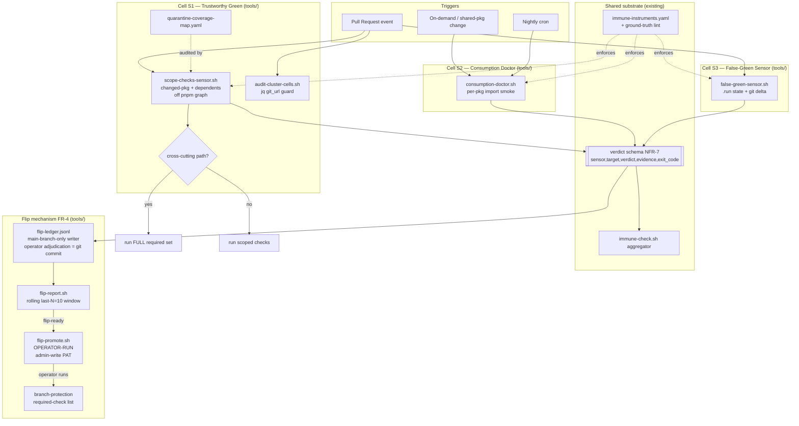
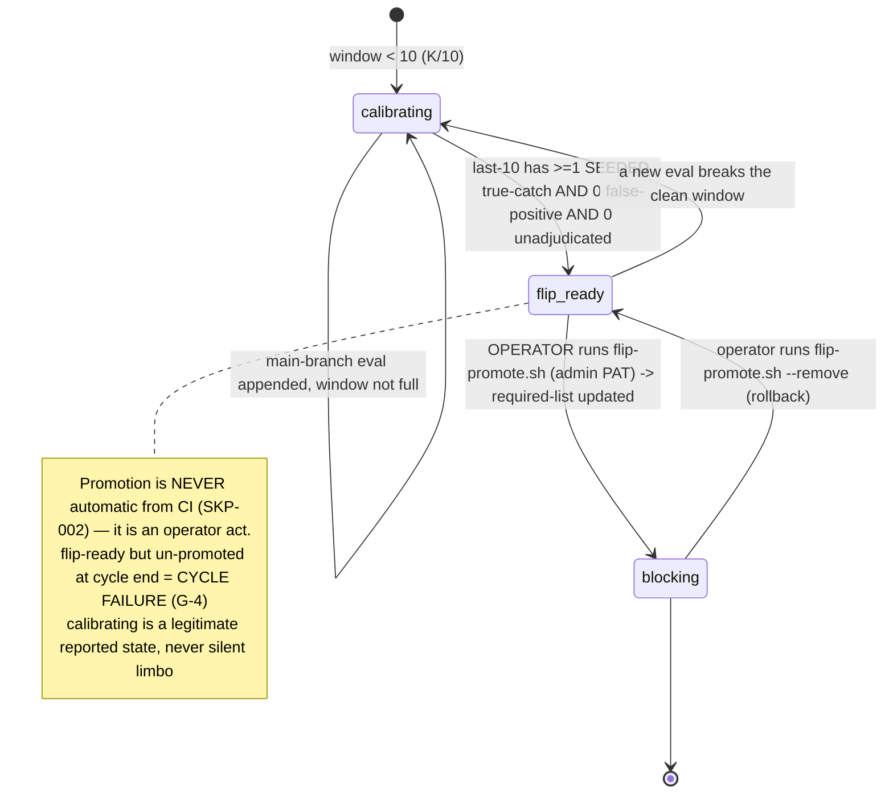

# Software Design Document: Autopoiesis — Immune Cells for the Factory

**Version:** 1.1
**Date:** 2026-07-03
**Author:** Architecture Designer Agent
**Status:** Draft (Flatline-SDD-hardened, 2026-07-03)
**PRD Reference:** grimoires/loa/prd.md (flatline-hardened, 2026-07-03)

---

## 0. Grounding & Key Architectural Decision

This SDD is grounded in the live tree, not the template's web-app assumptions. Every path
below was read during design.

**The load-bearing decision: build on the existing estate-immune framework, do not greenfield.**
loa-freeside already ships an immune-system substrate that the PRD's four FRs map onto exactly:

| Existing asset (read during design) | What it already provides |
|---|---|
| `tools/immune-check.sh` (`:1-40`) | Aggregator + **shared verdict/exit contract**: `exit 0=HEALTHY / 2=PROBLEM / 1=INSUFFICIENT`, `--probe` one-line STATUS tile, `--json` → `{verdict, exit, doctors[]}`, `IMMUNE_*_PROBE_CMD` test seams |
| `tools/immune-instruments.yaml` | Ground-truth **registry**: every `*-sensor.*` / `*-doctor.*` / `gate-*.*` file MUST register a literal ground-source token, or the lint fails |
| `tools/check-instrument-ground-truth.sh` (`:102`) | The **teeth**: name-glob `*-sensor.*\|*-doctor.*\|gate-*.*` auto-catches new instruments; forces registration in the same PR |
| `tools/gate-freeze-sensor.mjs`, `tools/instrument-truth-sensor.mjs` | Two **precedent sensors** already following the `--probe`/exit-code-is-verdict convention (NFR-4) |
| `.github/workflows/immune-doctors.yml` | Existing **CI wiring** for the read-only doctors |
| `tools/lib/domain-classify.sh` | ADR-007 path→domain classifier; **CI tooling classifies as `shared`** (default case) — this is why the whole cycle is domain-pure |

> Consequence: NFR-7's shared verdict schema is **already half-built** in `immune-check.sh`.
> The three new sensors extend it, register in `immune-instruments.yaml` (auto-forced by the
> name-glob lint), and are aggregated by `immune-check.sh`. This is the single most important
> design choice; the alternative (three ad-hoc scripts) would violate NFR-7 and re-invent the
> proven exit-code discipline.

**Resolved targets (G-2 corpus)** — real consumer per package is now probed (see the resolved-blockers table below for provenance):

| Package | Path | Ships | Real consumer (FR-2) | Smoke method (FR-2a) |
|---|---|---|---|---|
| `@freeside/adapters` | `packages/adapters` | `dist/` (`main: dist/index.js`) | `packages/services/shadow-audit` | **build** then import — known-**broken** (must FLAG) |
| `@freeside/cluster-fp` | `packages/cluster-fp` | `src/` (`main: src/index.ts`) | `packages/services/ordering` | resolve+import — known-**good** (must PASS) |
| `@freeside/ordering-protocol` | `packages/protocol/ordering` | `src/` (`main: src/index.ts`) | `packages/services/ordering` | resolve+import — known-**good** (must PASS) |

**Resolved CI surfaces:**
- `Integration Tests` numb check → `ci.yml:232` job `integration-tests`, runs `npm run test:integration` whole-repo (bead `arrakis-integration-tests-numb-gate-0is2`).
- `agent-ci.yml:109` → `npx vitest run tests/integration/`.
- `Cluster Compliance` → `.github/workflows/cluster-compliance.yml` + vendored `.github/scripts/audit-cluster-cells.sh` (bead `arrakis-cluster-compliance-audit-crash-88ah`).
- pnpm graph source: **per-package `pnpm-lock.yaml`** (confirmed under `packages/*/`) + `file:`/`@freeside/*` edges in each `package.json`. No root `pnpm-workspace.yaml` exists → the scoping engine builds edges from package.json specifiers, not a workspace manifest.

**Resolved blockers (probed live tree, 2026-07-03 — folded into the design below):**

| Blocker(s) | Probed fact (grounded) | Design consequence |
|---|---|---|
| SKP-001 ×2 + IMP-001 (branch-protection token) | The default `github.token` **cannot** read/write branch protection — `administration` is not a grantable `GITHUB_TOKEN` permission scope (confirmed `.github/workflows/immune-doctors.yml:33-38`). The existing safe pattern uses a fine-grained PAT `IMMUNE_DOCTOR_GH_TOKEN` (`Administration:read`) gated on `github.event_name != 'pull_request' && github.ref == 'refs/heads/main'` to defeat pwn-request PAT exfiltration (`immune-doctors.yml:75-82`). | FR-1d required-check migration + FR-4 promotion are **NOT PR-time CI actions**. Promotion is an **operator-run command** (`tools/flip-promote.sh`, admin-**write** PAT the operator holds) OR a gated main-branch-only job mirroring the immune-doctors PAT-gating. See §1.6, §3.7, §5.4. This also resolves SKP-002's "flip can auto-promote with only 1 catch" — **promotion is never automatic from CI; it is an operator act.** |
| IMP-002 (real consumers for S2 smoke) | Probed dependents: `@freeside/cluster-fp` ← `packages/services/ordering`; `@freeside/adapters` ← `packages/services/shadow-audit` (the **known-broken** import path — exactly how the dist break bites a real consumer); `@freeside/ordering-protocol` ← `packages/services/ordering`. | The consumption doctor (FR-2) exercises these **actual** consumers, not a synthetic harness. See §3.5. OQ-2 resolved. |

---

## Table of Contents

1. [System Architecture](#1-system-architecture)
2. [Software Stack](#2-software-stack)
3. [State & Artifact Design](#3-state--artifact-design) *(replaces "Database Design" — no DB)*
4. [Sensor Interface Contracts](#4-sensor-interface-contracts) *(replaces "UI/API")*
5. [Error Handling & Exit-Code Strategy](#5-error-handling--exit-code-strategy)
6. [Testing Strategy](#6-testing-strategy)
7. [Development Phases](#7-development-phases)
8. [Known Risks and Mitigation](#8-known-risks-and-mitigation)
9. [Open Questions](#9-open-questions)
10. [Appendix](#10-appendix)

---

## 1. System Architecture

### 1.1 System Overview

Three **immune cells** (sensor + aligner + teeth), each grounded in a filed bug, plus a
cross-cutting **flip mechanism** that governs when advisory sensors earn blocking authority.
All three cells emit one **shared verdict record** (NFR-7) and are aggregated by the existing
`tools/immune-check.sh`. Nothing here is a service or a UI — the deliverables are CLI sensors,
CI-workflow wiring, JSON/YAML state artifacts, and one upstream issue.

### 1.2 Architectural Pattern

**Pattern:** Filter/sensor pipeline over Git + CI state (event-driven by PR + on-demand),
following the established estate-immune "doctor → aligner → teeth" triad.

**Justification (from PRD):**
> "every substrate has two failure modes — silence … and no-teeth … The cure is the same triad:
> doctor → aligner → teeth" (prd.md:39-42).

Each sensor is a stateless, read-only script whose **exit code IS its verdict** (NFR-4). Blocking
authority is layered **outside** the sensor (branch-protection required-list + flip-ledger),
never by mutating the sensor's output — this is how NFR-1 (advisory-first) and NFR-4
(exit-code integrity) coexist without contradiction.

### 1.3 Component Diagram


```mermaid
graph TD
    subgraph Triggers
        PR[Pull Request event]
        OD[On-demand / shared-pkg change]
        CRON[Nightly cron]
    end

    subgraph "Cell S1 — Trustworthy Green (tools/)"
        SCOPE[scope-checks-sensor.sh<br/>changed-pkg + dependents<br/>off pnpm graph]
        FALLBACK{cross-cutting path?}
        QMAP[quarantine-coverage-map.yaml]
        CCFIX[audit-cluster-cells.sh<br/>jq git_url guard]
    end

    subgraph "Cell S2 — Consumption Doctor (tools/)"
        CONS[consumption-doctor.sh<br/>per-pkg import smoke]
    end

    subgraph "Cell S3 — False-Green Sensor (tools/)"
        FG[false-green-sensor.sh<br/>.run state + git delta]
    end

    subgraph "Shared substrate (existing)"
        SCHEMA[[verdict schema NFR-7<br/>sensor,target,verdict,evidence,exit_code]]
        REG[immune-instruments.yaml<br/>+ ground-truth lint]
        AGG[immune-check.sh aggregator]
    end

    subgraph "Flip mechanism FR-4 (tools/)"
        LEDGER[flip-ledger.jsonl<br/>main-branch-only writer<br/>operator adjudication = git commit]
        FLIP[flip-report.sh<br/>rolling last-N=10 window]
        PROMOTE[flip-promote.sh<br/>OPERATOR-RUN<br/>admin-write PAT]
        BP[branch-protection<br/>required-check list]
    end

    PR --> SCOPE
    SCOPE --> FALLBACK
    FALLBACK -- yes --> FULL[run FULL required set]
    FALLBACK -- no --> SCOPED[run scoped checks]
    PR --> CCFIX
    OD --> CONS
    PR --> FG
    CRON --> CONS

    SCOPE --> SCHEMA
    CONS --> SCHEMA
    FG --> SCHEMA
    SCHEMA --> AGG
    SCHEMA --> LEDGER
    REG -.enforces.-> SCOPE
    REG -.enforces.-> CONS
    REG -.enforces.-> FG
    LEDGER --> FLIP
    FLIP -- flip-ready --> PROMOTE
    PROMOTE -- operator runs --> BP
    QMAP -.audited by.-> SCOPE
```

### 1.4 System Components

#### S1 — Trustworthy Green (`tools/scope-checks-sensor.sh` + support) — FR-1
- **Purpose:** make a per-PR required-check green mean a real *this-PR* signal.
- **Responsibilities:**
  - **FR-1a** Build the changed-package set from `git diff --name-only <base>...<head>`, classify each path to its owning `packages/<pkg>`, then expand to **transitive dependents** by reverse-walking the dependency edges parsed from every `packages/*/package.json`.
  - **Graph completeness (SKP-002 + IMP-006):** the reverse-walk MUST include **`dependencies` + `peerDependencies` + `devDependencies`** edges (`file:`/`@freeside/*` specifiers), not runtime deps alone — a dev-time or peer edge is still a way a change breaks a dependent's build/test. The analytical scope result must then map each in-scope package to a **concrete runnable command** (e.g. `pnpm --filter <pkg> test`, `pnpm --filter <pkg> build`) so CI actually executes the scoped set rather than an abstract package list. A package that resolves to no runnable check is reported, not silently dropped.
  - **Fallback-to-full (SKP-002 + IMP-006):** if any changed path is cross-cutting — root `pnpm-lock.yaml`, root `package.json`/`tsconfig*`, `.github/workflows/**`, a schema/contract file, shared env/config, **generated-code paths (codegen output, `*.gen.*`), or dev-tooling/build-config the graph can't attribute to one package** — emit `verdict=full` and run the entire required set. Reuses the classification shape of `tools/lib/domain-classify.sh` (a new sibling `tools/lib/scope-classify.sh`).
  - **FR-1c** Fix the `Cluster Compliance` jq crash in vendored `.github/scripts/audit-cluster-cells.sh`: guard in-monolith cells (`git_url=loa-freeside`, e.g. `events-api`) so the per-cell record is **valid JSON** and the aggregate `jq` never aborts.
  - **FR-1b** Quarantine `integration-tests` (`ci.yml:232`) + `agent-ci` into a non-required lane — gated on an **objective per-package equivalence proof** (SKP-003 + IMP-007), not a subjective "demonstrably covers": the scoped replacement (FR-1a) MUST execute the **same test files** the quarantined suite would have run for the changed packages, and a **coverage-diff proves equivalence per-package** before that suite is dropped from required. Rollback trigger: if a post-quarantine escape is found that the old suite *would* have caught, un-quarantine (recorded in `tools/quarantine-coverage-map.yaml`, §3.4). Quarantine is gated on this proof, not merely "conditional".
  - **FR-1d** Update the **branch-protection required-check list** in lockstep (drop numb, add scoped-green) — but this is an **operator-run migration, NOT a PR-time CI action** (probed: `github.token` cannot write branch protection; §0, §3.7). The scoped-green check *runs* in `pr-validation.yml`; adding/removing it from the *required-list* is `tools/flip-promote.sh`, executed by the operator with an admin-write PAT (or a gated main-branch-only job mirroring the `immune-doctors.yml` PAT-gating). Audit trail = the flip-ledger entry + git history; rollback = re-run the tool to remove a check from required; failure mode (PAT absent) = print the exact operator command, **never silently skip** (§5.4).
- **Interfaces:** CLI `--probe`, `--json` (verdict schema), exit code. Consumed by a new/edited `.github/workflows/pr-validation.yml` gating job.
- **Dependencies:** pnpm per-package lockfiles; `tools/lib/domain-classify.sh` precedent; operator-held admin-write PAT for the branch-protection migration (FR-1d — NOT the default CI token).

#### S2 — Consumption Doctor (`tools/consumption-doctor.sh`) — FR-2
- **Purpose:** a shared package cannot be "healthy" if no consumer can import it.
- **Responsibilities:** for each shared/published `@freeside/*` package, resolve ≥1 real consumer and run an **import smoke** under the consumer's actual resolution — **build-then-import** if the package ships `dist` (adapters), **resolve+import** if it ships `src` (cluster-fp, ordering-protocol). Emit verdict `consumable | unconsumable | no-consumer` (FR-2b; `no-consumer` is a distinct honest state, not a pass).
- **Interfaces:** CLI + verdict schema; wired to run on `packages/**` shared-package changes and nightly (NFR-6: not every PR).
- **Dependencies:** package `exports`/`main` fields; a real consumer per package (design detail 3.5).

#### S3 — False-Green Sensor (`tools/false-green-sensor.sh`) — FR-3
- **Purpose:** a run/bridge that did nothing cannot report success.
- **Responsibilities:** read `.run/*state.json` (`bridge-state.json`, `sprint-plan-state.json`) + git delta; a `JACKED_OUT`/completed run with **0 sprints AND 0 findings AND 0 commits** → verdict `suspect`. FR-3b: file the **upstream** `loa` issue with a reproduction (the 2026-07-03 no-op state); the loa-freeside sensor stands alone (R-5).
- **Interfaces:** CLI + verdict schema; runnable in the Stop-hook path / post-run, and manually.
- **Dependencies:** `.run` state shapes; git; `gh issue create` against the `loa` repo (FR-3b, one-time).

#### Shared substrate (existing, extended)
- **`tools/immune-instruments.yaml`** — register all three new instruments + ground-source tokens (auto-forced by the name-glob lint; naming the files `*-sensor.sh`/`*-doctor.sh` triggers it).
- **`tools/immune-check.sh`** — extend `doctors[]` aggregation to include the three; verdict/exit contract reused verbatim.

#### Flip mechanism (`tools/flip-report.sh` + `tools/flip-ledger.jsonl` + `tools/flip-promote.sh`) — FR-4
- **Purpose:** advisory that cannot rot into a new numb gate — and cannot cheaply earn authority over ALL future PRs.
- **Write authority (SKP-003 + SKP-004):** the ledger is appended **only from main-branch runs** — a **single writer**, so there are no PR-parallel writes and no merge conflicts. **Operator adjudication IS an operator git commit** (provenance = git authorship, mirroring the collections-sot "git commit is the ratify" force-chain). Tamper-resistance = git history is the audit trail; a rewrite is visible. Schema + write-authority: §3.2.
- **Flip criterion (tightened — SKP-002):** `flip-report.sh` promotes to `flip-ready` only when ALL hold: (a) **≥1 seeded-qualifier true-catch** (FR-4c), (b) a clean **rolling window of the last N=10 evaluations with 0 false-positives** (N≥10, not 5 — 1 catch in last-5 is too weak to earn authority over every future PR), and (c) **explicit operator promotion** — the flip to `blocking` is **never automatic from CI**. `flip-promote.sh` is the **operator-run** tool that adds the sensor's check to the branch-protection required-list with an admin-write PAT (§3.7). Seeded qualifier (FR-4c) = a deliberately-broken-then-reverted fixture the sensor must catch, guaranteeing the true-catch is reachable regardless of organic PR volume.

### 1.5 Data Flow

1. PR opens → CI invokes S1 (`scope-checks-sensor.sh`) + `audit-cluster-cells.sh` (fixed) + S3 (if a run completed). On a PR, each sensor writes only its ephemeral verdict record (§3.1) to `.run/immune/<sensor>-<sha>.json` — **it does NOT append to the git-tracked ledger** (no PR-parallel writers).
2. On the **main-branch run** (post-merge), the single-writer job appends one evaluation entry per sensor to `tools/flip-ledger.jsonl` (§3.2).
3. `immune-check.sh` aggregates the per-run records for the banner/`--json`.
4. Operator adjudicates flagged entries **by committing** the `class` change to the ledger (git authorship = provenance) → `flip-report.sh` recomputes the rolling-N=10 window state.
5. When a sensor reaches `flip-ready`, the **operator runs `tools/flip-promote.sh`** (admin-write PAT) to add its check to branch protection (FR-1d/FR-4) — CI never auto-promotes.

### 1.6 External Integrations

| Service | Purpose | API Type | Docs |
|---|---|---|---|
| GitHub branch protection | required-check list read/update (FR-1d, FR-4) — **read** may use the `immune-doctors.yml` PAT-gating pattern on main; **write/promotion is operator-run** (`tools/flip-promote.sh`, admin-write PAT), never the default `github.token` (probed: `administration` is not a grantable `GITHUB_TOKEN` scope) | `gh api /repos/{o}/{r}/branches/{b}/protection` | https://docs.github.com/rest/branches/branch-protection |
| GitHub Issues (`loa` repo) | upstream bridge-noop issue (FR-3b) | `gh issue create` | https://cli.github.com/manual/gh_issue_create |
| pnpm 9.15.4 | build/resolve for import smoke (FR-2) | CLI | https://pnpm.io |

### 1.7 Deployment Architecture

No deployment. Artifacts land as: scripts under `tools/`, workflow edits under `.github/workflows/`,
a vendored-script fix under `.github/scripts/`, state under `.run/immune/` + `grimoires/loa/`.
Runs on GitHub-hosted `ubuntu-latest` runners and on the operator's machine (local banner via
`immune-check.sh`).

### 1.8 Scalability Strategy

Not a scaling problem. **NFR-6 cost**: S1 is scoped (fewer packages than whole-repo) → a scoped PR's
required checks finish in *less* wall-clock than today's whole-repo suite. S2 runs on shared-package
changes + nightly, not every PR. Concrete per-sensor budgets deferred to sprint (Open Question OQ-3).

### 1.9 Security / Zone Architecture

- **NFR-5 / ADR-007 zone discipline:** all sensor logic lives in `tools/`, CI wiring in
  `.github/workflows/`, the jq fix in `.github/scripts/`. **`.claude/` (System Zone) is NOT touched**
  — the framework bridge fix goes upstream (FR-3b).
- **Domain purity (ADR-007 firewall):** every path this cycle touches classifies as **`shared`**
  under `tools/lib/domain-classify.sh` (default case). The packages S2 reads (adapters=platform,
  cluster-fp/ordering-protocol=shared/network) are **read-only inputs**, not modified — so no commit
  crosses platform↔network. **Design rule for every commit: scope `shared/<x>`; a sensor commit
  never edits a package's source.** This keeps `path-domain-check.yml` green by construction.
- **NFR-4 exit-code integrity:** sensor exit codes are never piped through `tail`/`|| true`
  (rule `stash-safety.md`, memory `Gate output never piped`). Advisory-ness is expressed with
  GitHub-native `continue-on-error: true` at the workflow-step level or by absence from the
  required-list — **never** by masking the script's exit code.

---

## 2. Software Stack

### 2.1 Languages & Runtimes

| Category | Technology | Version | Justification |
|---|---|---|---|
| Sensor scripts | Bash | POSIX/bash 5 | Matches existing `tools/*-sensor.sh` / `immune-check.sh`; `shell-compat-lint.yml` already governs it |
| Structured sensors (optional) | Node.js (ESM `.mjs`) | Node ≥22 (root `engines`) | Precedent: `gate-freeze-sensor.mjs`, `instrument-truth-sensor.mjs` — use `.mjs` only where JSON/graph logic is unwieldy in bash |
| JSON tooling | `jq` | system | Verdict-record assembly with `--arg`/`--argjson` (the very tool whose misuse caused the FR-1c crash — use `--arg` for strings, validate with `jq empty`) |
| Package manager | pnpm | 9.15.4 (root `packageManager`) | Ground truth for FR-1a graph + FR-2 smoke |
| Test framework | bats + vitest | bats (existing `*.test.sh`), vitest 3.2.4 | bats for shell sensors (precedent `immune-check.test.sh`); vitest already present |

**Key existing libraries/assets reused:**
- `tools/lib/domain-classify.sh` — path-classification precedent for the new `scope-classify.sh`.
- `tools/immune-check.sh` test seams (`IMMUNE_*_PROBE_CMD`) — copy the fixture-driven test pattern.

### 2.2 Infrastructure & DevOps

| Category | Technology | Purpose |
|---|---|---|
| CI | GitHub Actions | Sensor execution + gating (extend `immune-doctors.yml`, `pr-validation.yml`, `cluster-compliance.yml`) |
| Gate control | GitHub branch protection | Required-check list (FR-1d, FR-4 promotion) |
| State | Git-tracked JSON/YAML + `.run/` | Verdict records, flip-ledger, coverage map |

No cloud provider, container, IaC, or monitoring changes — this cycle is CI-tooling only.

---

## 3. State & Artifact Design

*(No database. State is file-based JSON/YAML, git-tracked where it must survive across runs.)*

### 3.1 Shared Verdict Schema (NFR-7 — the contract every sensor emits)

Reconciles the PRD's `{sensor, target, verdict, evidence, exit_code}` with the **existing**
`immune-check.sh` exit convention (`0=HEALTHY/clean`, `2=PROBLEM`, `1=INSUFFICIENT`).

```json
{
  "$schema": "grimoires/loa/schemas/immune-verdict.schema.json",
  "schema_version": "1.0.0",
  "sensor": "scope-checks | consumption-doctor | false-green | cluster-compliance",
  "target": "pkg:@freeside/adapters | pr:434 | run:bridge-2026-07-03",
  "verdict": "pass | flag | suspect | full | no-consumer",
  "evidence": {
    "source": "file:line or command re-run to reproduce",
    "detail": "human-readable one line",
    "artifacts": [".run/immune/consumption-doctor-<sha>.json"]
  },
  "exit_code": 0,
  "generated_at": "2026-07-03T00:00:00Z"
}
```

**Verdict → exit-code mapping (binds NFR-7 to NFR-4 and the existing aggregator):**

| verdict | meaning | exit_code | advisory-phase gate effect |
|---|---|---|---|
| `pass` | sensor ran, target clean | 0 | none |
| `full` (S1) | fallback-to-full triggered | 0 | runs full required set (safe) |
| `no-consumer` (S2) | honest distinct state (FR-2b) | 0 | surfaced, not a failure |
| `flag` (S2) / `suspect` (S3) | real problem detected | 2 | **advisory**: recorded + surfaced, NOT blocking until flipped |
| — insufficient (no ground) | could not resolve inputs | 1 | surfaced as INSUFFICIENT, never a false "pass" |

> Advisory-first means: a `flag`/`suspect` sensor **still returns exit 2** (NFR-4 honesty). The CI
> step uses `continue-on-error: true` and the check is absent from the required-list until FR-4
> promotes it. The exit code is never rewritten.

**Validator:** `grimoires/loa/schemas/immune-verdict.schema.json` (JSON Schema, ajv 8.18 already a
root dep). A sensor whose output fails this schema does not ship (NFR-7).

**Schema evolution & backward-compat (IMP-005).** The new shared verdict MUST stay compatible with
the records the existing `immune-check.sh` doctors already emit — the aggregator (`doctors[]`) must
keep consuming both old doctor records and new sensor records without a flag day. Rules:
- **`schema_version`** (semver) is required on every new-sensor record. Existing doctor records that
  predate it are treated as `1.0.0` by the aggregator (absent ⇒ baseline), so no existing doctor
  needs a same-PR edit.
- **Additive-only within a major:** new **optional** fields are a minor bump; a consumer MUST ignore
  unknown fields. **Removing/renaming a field or changing the verdict/exit-code semantics is a MAJOR
  bump** and requires updating `immune-check.sh` + all sensors in the same PR (the ground-truth lint
  forces co-location).
- The `verdict → exit_code` mapping table below is the **frozen** compat surface: `0/1/2` semantics
  are inherited verbatim from the existing aggregator and MUST NOT be redefined under a minor bump.

### 3.2 Flip-Ledger (`tools/flip-ledger.jsonl`) — FR-4

Append-only JSONL, git-tracked (survives across PRs — the rolling window needs history).

**Write authority (SKP-003 + SKP-004 — the concurrency/trust resolution):**
- **Single writer: main-branch runs only.** Evaluation entries are appended **exclusively** by the
  post-merge / main-branch job, never by a PR-time run. This eliminates parallel-PR writes and
  merge conflicts by construction (no two PRs ever touch the ledger concurrently — the file is only
  mutated on the linear main history).
- **Adjudication = an operator git commit.** The `adjudication.class` transition
  (`unadjudicated → true-catch|false-positive`) is made by the **operator editing the ledger and
  committing** it. Provenance is **git authorship** (`git log` / signed commit), mirroring the
  collections-sot "git commit is the ratify" force-chain — the sensor can NEVER self-adjudicate.
- **Tamper-resistance = git history.** The ledger's audit trail is the commit history; any rewrite
  (force-push, amend) is visible in the reflog/PR history. No separate signing layer is added — the
  branch-protected main history IS the tamper-evidence.

**Record schema (explicit):**

```json
{"schema_version":"1.0.0","ts":"2026-07-03T00:00:00Z","sensor":"consumption-doctor",
 "eval_id":"cd-main-<sha>-1","source_ref":"main@<merge-sha>","verdict":"flag",
 "target":"pkg:@freeside/adapters","seeded":false,
 "adjudication":{"by":"operator","commit":"<git-sha-of-adjudication-commit>",
   "class":"unadjudicated|true-catch|false-positive","note":"","at":null}}
```

- `source_ref` is a **main merge-sha** (not a PR number) — it records that the entry was written by
  the single main-branch writer.
- `adjudication.commit` is populated when the operator commits the class change; `null`/absent while
  `unadjudicated`.

- **FR-4a rolling window (tightened — SKP-002):** `flip-report.sh` reads the **last N=10** entries
  for a sensor; `flip-ready` requires **≥1 seeded-qualifier true-catch AND 0 false-positives AND 0
  unadjudicated** across that window. (N raised from 5 → 10: one catch in the last-5 is too weak to
  earn authority to block every future PR.)
- **FR-4b adjudication:** `class` starts `unadjudicated`; only an **operator commit** (or a
  corroborating second signal recorded by the operator) promotes it to `true-catch`/`false-positive`.
  An `unadjudicated` entry in the window **blocks** promotion.
- **FR-4c seeded qualifier:** `seeded:true` marks the deliberate break-then-revert fixture that
  guarantees a reachable true-catch. Promotion **requires** at least one `seeded:true` +
  `class:true-catch` entry in the window — an organic flag alone cannot flip a sensor.

**Retention / evidence policy (IMP-004):** the flip-ledger is **git-tracked and never truncated** —
it is the permanent evidence trail for every flip (its history IS the audit). `flip-report.sh` only
*reads* the last N=10 for the window computation; older entries stay in the file for provenance. The
per-run verdict records under `.run/immune/*.json` are **ephemeral CI-artifact cache** (retained as
GitHub Actions artifacts for the standard 90-day window, safe to delete locally); the *durable*
evidence a flip relies on is the git-tracked ledger entry it points to, not the ephemeral cache.

### 3.3 Flip-State Machine (FR-4d)


```mermaid
stateDiagram-v2
    [*] --> calibrating: window < 10 (K/10)
    calibrating --> calibrating: main-branch eval appended, window not full
    calibrating --> flip_ready: last-10 has >=1 SEEDED true-catch AND 0 false-positive AND 0 unadjudicated
    flip_ready --> blocking: OPERATOR runs flip-promote.sh (admin PAT) -> required-list updated
    flip_ready --> calibrating: a new eval breaks the clean window
    blocking --> flip_ready: operator runs flip-promote.sh --remove (rollback)
    blocking --> [*]
    note right of flip_ready
      Promotion is NEVER automatic from CI (SKP-002) — it is an operator act.
      flip-ready but un-promoted at cycle end = CYCLE FAILURE (G-4)
      calibrating is a legitimate reported state, never silent limbo
    end note
```

### 3.4 Quarantine → Coverage Map (`tools/quarantine-coverage-map.yaml`) — FR-1b/IMP-007/SKP-003

**Objective equivalence gate (SKP-003 + IMP-007).** A suite is quarantined out of the required-list
ONLY after the scoped replacement (FR-1a) is proven — mechanically, not by prose — to run **the same
test files** the quarantined suite would have run for the changed packages. The proof is a
**per-package coverage-diff**: `set(scoped test files for pkg) ⊇ set(quarantined-suite test files
attributable to pkg)`. Any file the old suite ran that the scoped set does NOT run is an
`uncovered_file` and **blocks quarantine** for that package until it is either scoped in or logged as
explicit accepted-risk. **Rollback trigger:** if a post-quarantine escape is later found that the old
suite *would* have caught, the offending check is **un-quarantined** and the escape recorded in
`rollback_log` (the map is the durable record of that decision).

```yaml
# Every quarantined check maps to a scoped replacement with a per-package equivalence PROOF,
# OR an explicit accepted-risk entry. No silent loss of protection. Audited by scope-checks-sensor.sh.
quarantined:
  integration-tests:              # ci.yml:232, npm run test:integration (whole-repo)
    replaced_by: [scoped:integration-per-package]
    equivalence:                  # per-package coverage-diff proof (SKP-003) — required to quarantine
      "@freeside/adapters":
        scoped_test_files: [packages/adapters/**/*.integration.test.ts]
        old_suite_files:   [packages/adapters/**/*.integration.test.ts]
        uncovered_file:    []     # MUST be empty (or accepted-risk) before drop-from-required
        scoped_command:    "pnpm --filter @freeside/adapters test:integration"
    rollback_log: []              # {date, escape, old_suite_would_have_caught: true} on un-quarantine
  agent-ci:                       # agent-ci.yml:109
    replaced_by: [scoped:agent-integration]
    equivalence: {}               # populated at S1 impl from the coverage-diff run
    accepted_risk: null
    rollback_log: []
```

### 3.5 Consumer Resolution Table (FR-2 design input — probed, IMP-002)

Real consumers probed against the live tree (2026-07-03). The doctor exercises these **actual**
consumers, not a synthetic harness — the adapters row is precisely the import path that hid the break.

| Package | Real consumer (probed) | Smoke |
|---|---|---|
| `@freeside/adapters` | `packages/services/shadow-audit` (imports `@freeside/adapters` — the **known-broken** dist path) | build dist, then `node -e "import('@freeside/adapters')"` under `shadow-audit`'s resolution → must **flag** |
| `@freeside/cluster-fp` | `packages/services/ordering` (imports `@freeside/cluster-fp`) | resolve + `tsx`/`node --import` the `src` entry under `ordering`'s resolution → must **pass** |
| `@freeside/ordering-protocol` | `packages/services/ordering` (imports `@freeside/ordering-protocol`) | resolve + import `src` entry under `ordering`'s resolution → must **pass** |

> OQ-2 **resolved** by the live probe. `no-consumer` verdict (FR-2b) remains the honest fallback for
> any *other* shared package the doctor is later pointed at that has zero real consumers.

### 3.6 Backup / Recovery

N/A — all state is git-tracked; recovery is `git checkout`. `.run/immune/*` is ephemeral per-run
cache, safe to delete.

### 3.7 Promotion tool (`tools/flip-promote.sh`) — FR-1d/FR-4, operator-run (SKP-001 ×2 + IMP-001)

Promotion (adding/removing a check from the branch-protection required-list) is the **one operator
act** in this cycle — it is **never a PR-time CI action** (probed: the default `github.token` cannot
write branch protection; `administration` is not a grantable `GITHUB_TOKEN` scope — §0).

```
tools/flip-promote.sh <sensor-check> [--remove]
  Preconditions (verified before any API call):
    - flip-report.sh reports the sensor as `flip-ready` (§3.3) — refuse otherwise
    - an admin-WRITE PAT is present in env (operator-held, e.g. FLIP_PROMOTE_GH_TOKEN)
  Action : gh api PUT /repos/{o}/{r}/branches/main/protection  (add/remove required check)
  Audit  : writes the promotion event + acting operator to the flip-ledger; git history is the trail
  Rollback (--remove): re-run to drop the check from required (blocking -> flip_ready)
  Failure mode (PAT ABSENT / auth fails): print the EXACT operator command to run + the missing
     scope, exit 1 (INSUFFICIENT) — NEVER silently skip, NEVER report success (IMP-008)
```

Alternative deployment: a **gated main-branch-only job** mirroring the `immune-doctors.yml`
PAT-gating (`github.event_name != 'pull_request' && github.ref == 'refs/heads/main'`) may run the
same tool with the org PAT — but the flip decision it acts on is still an operator-committed ledger
adjudication (§3.2), so authority never originates in CI.

---

## 4. Sensor Interface Contracts

*(No HTTP API / UI. The "interface" is the CLI + verdict schema + exit code — the estate-immune
convention.)*

### 4.1 Common CLI Contract (every sensor)

```
tools/<name>-sensor.sh [--json] [--probe] [<target>]
  (no flag)  human summary; exit code = verdict (0/1/2 per §3.1)
  --probe    one-line banner STATUS tile (mirrors gate-freeze-sensor.mjs --probe)
  --json     emit the NFR-7 verdict record to stdout
  exit code  IS the verdict (NFR-4) — capture $? BEFORE any pipe; never `| tail`, never `|| true`
Test seam: <SENSOR>_PROBE_CMD overrides the ground-source read for fixture-driven bats tests
```

### 4.2 S1 — `tools/scope-checks-sensor.sh`

```
Input : git diff <base>...<head> (changed files)
Steps : classify → owning packages → expand transitive dependents by reverse-walking
        dependencies + peerDependencies + devDependencies edges (file:/@freeside/* specifiers)
        → cross-cutting/generated/dev-tooling? → verdict=full
        → else map each in-scope pkg to a concrete command (pnpm --filter <pkg> test|build)
Output: {sensor:"scope-checks", target:"pr:N", verdict:"pass|full",
         evidence:{packages:[...], commands:["pnpm --filter <pkg> test", ...]}}
Note  : the `commands[]` array is what CI executes — an analytical package list that does not
        resolve to a runnable command is reported, never silently dropped (IMP-006).
```

### 4.3 S2 — `tools/consumption-doctor.sh`

```
Input : @freeside/<pkg> (or --all)
Steps : read exports/main → dist? build+import : src? resolve+import → under consumer resolution
Output: {sensor:"consumption-doctor", target:"pkg:@freeside/adapters",
         verdict:"consumable→pass | unconsumable→flag | no-consumer", evidence:{consumer,cmd}}
```

### 4.4 S3 — `tools/false-green-sensor.sh`

```
Input : .run/bridge-state.json + .run/sprint-plan-state.json + git rev-range
Steps : state==JACKED_OUT/complete AND sprints==0 AND findings==0 AND commits==0 → suspect
Output: {sensor:"false-green", target:"run:bridge-<id>", verdict:"pass|suspect|insufficient", evidence:{...}}
```

**Malformed / partial / absent state contracts (IMP-009 — a corrupt state file must never false-pass).**
The sensor's whole job is to reject a false green, so its own degraded-input handling must fail
*conservatively*, never emit `pass`:

| `.run` state condition | verdict | exit | rationale |
|---|---|---|---|
| Well-formed + JACKED_OUT + 0/0/0 | `suspect` | 2 | the target no-op detection |
| Well-formed + real work (≥1 commit/finding/sprint) | `pass` | 0 | genuine completion |
| **Absent** (no `.run/*state.json` for a completion being evaluated) | `insufficient` | 1 | cannot prove work happened ⇒ cannot pass |
| **Partial** (state present but missing `sprints`/`findings`/`commits` keys) | `insufficient` | 1 | missing counters ≠ zero counters — never infer 0 to pass |
| **Malformed** (invalid JSON / unparseable) | `insufficient` | 1 | a corrupt file is `insufficient`, never a false `pass` |
| Non-terminal state (RUNNING/HALTED) | `pass` (n/a) | 0 | not a completion — nothing to assert yet |

> Rule: the sensor NEVER treats "missing" or "unreadable" as "zero work, but okay". Absent counters
> and a corrupt file both resolve to **INSUFFICIENT (exit 1)**, surfaced, never collapsed into `pass`.

### 4.5 FR-1c — `.github/scripts/audit-cluster-cells.sh` (fix, not new interface)

Guard the per-cell JSON assembly: for in-monolith cells (`git_url == loa-freeside`), emit a valid
JSON record (never feed a bare/empty value to `jq --argjson`). Validate each record with
`jq empty` before aggregation so one bad cell can never abort the whole audit.

---

## 5. Error Handling & Exit-Code Strategy

### 5.1 Exit-Code Contract (aligned with `immune-check.sh`)

| exit | class | meaning |
|---|---|---|
| 0 | clean | `pass` / `full` / `no-consumer` — sensor ran, no real problem |
| 1 | INSUFFICIENT | could not ground (absent/partial/**malformed** `.run` state per §4.4, no consumer resolvable, `gh`/PAT unauth per §5.4) — **never** reported as pass |
| 2 | PROBLEM | `flag` / `suspect` — a real detection |

### 5.2 Failure-Mode Rules

- **Never mask:** no `| tail`, no `|| true`, no `2>/dev/null` on the verdict path (NFR-4, rule
  `stash-safety.md`). `find`/`jq` stderr stays visible (precedent: ground-truth lint `:242`).
- **Fail conservative (R-4):** S1 ambiguous graph → `full`, not scoped. A missed dependent is worse
  than extra CI.
- **Honest distinct states:** S2 `no-consumer` (FR-2b) and INSUFFICIENT are never collapsed into
  `pass`.
- **Grounding before assertion:** each sensor's evidence field cites a re-runnable source
  (memory `verify-the-mechanism-not-the-symptom`).

### 5.3 Logging

Verdict records to `.run/immune/<sensor>-<sha>.json`; ledger to `tools/flip-ledger.jsonl`; the
CI job surfaces `--probe` tiles in the step summary. No secrets in any record (cluster-compliance
already forbids secrets in cell configs).

### 5.4 Auth-failure behavior — differentiated by operation (IMP-008)

Auth failure must NOT be handled uniformly — a read-only sensor and a promotion have opposite
correct responses:

| Operation | On auth failure (e.g. `gh` unauth, PAT absent/insufficient scope) | Why |
|---|---|---|
| **Read-only sensor** (S1 scope walk, S2 import smoke, S3 state read, cluster-compliance read of protection) | verdict `insufficient`, **exit 1**, surfaced — **must NOT overblock**: a sensor that can't ground its inputs is INSUFFICIENT, never a `flag`/`suspect` that would gate a PR on a missing token | over-blocking on a transient auth gap turns a read-only advisory into a numb *red* gate (NFR-2) — the disease inverted |
| **Promotion** (`tools/flip-promote.sh` writing the required-list) | print the **exact operator command** to run + the missing scope, **exit 1**, **never silently skip** and never report success | a silently-skipped promotion leaves the operator believing the gate flipped when it did not (§3.7) |

This is the concrete split the PRD's IMP-008 asks for: the same `exit 1 / INSUFFICIENT` code, but a
read failure *surfaces and steps aside* while a write failure *surfaces and hands the operator the
command*.

---

## 6. Testing Strategy

**NFR-3 — the 4 filed beads ARE the regression corpus.** A sensor with no failing-case test is
incomplete.

### 6.1 Per-Sensor Acceptance (fixtures, not manual proof — IMP-003)

| Sensor | Fixture (repeatable) | Expected |
|---|---|---|
| S1 FR-1a | PR touching only pkg X | runs only X + X-dependents' checks, each a concrete `pnpm --filter` command |
| S1 FR-1a (IMP-006) | PR touching a **peer/dev-dep-only** dependent of X | that dependent IS in scope (peer+dev edges walked, not runtime-only) |
| S1 FR-1a | PR touching shared `tsconfig`/workflow/lockfile/**generated-code/dev-tooling** | **fallback-to-full** |
| S1 FR-1a | seeded failure in X | caught by X's PR; **NOT** reported by unrelated Y's PR |
| S1 FR-1b (SKP-003) | coverage-diff of scoped vs quarantined suite per package | `uncovered_file == []` (or accepted-risk) **before** the suite leaves the required-list; else quarantine blocked |
| S1 FR-1c | registry-touching PR incl. `events-api` (`git_url=loa-freeside`) | cluster-compliance completes, **no jq crash** |
| S1 FR-1d (IMP-001) | `flip-promote.sh` with PAT absent | prints the exact operator command + missing scope, **exit 1**, never silently skips |
| S2 (G-2, IMP-002) | run over current tree against **probed real consumers** (§3.5) | `@freeside/adapters` (via `shadow-audit`)→**flag**; `cluster-fp`+`ordering-protocol` (via `ordering`)→**pass** |
| S3 (G-3) | replay 2026-07-03 no-op state (0/0/0 → JACKED_OUT) | **suspect**; a run with ≥1 commit → **pass** |
| S3 (IMP-009) | absent / partial (missing counters) / malformed-JSON `.run` state | **insufficient (exit 1)** for each — never a false `pass` |
| FR-4 (G-4, SKP-002) | seeded break-then-revert per sensor + rolling last-N=10 window | sensor catches the **seeded** break; ledger records an operator-adjudicated true-catch; window has 0 false-positives + 0 unadjudicated; ≥1 sensor reaches `flip-ready`; operator promotion (`flip-promote.sh`) reaches `blocking` |

### 6.2 Test Tooling

- **bats** for shell sensors (precedent `immune-check.test.sh`, `check-instrument-ground-truth`),
  using `*_PROBE_CMD` fixture seams so tests need no live `gh`/CI.
- **vitest** where a sensor is `.mjs`.
- **Schema conformance:** ajv validates every sensor's `--json` against
  `immune-verdict.schema.json` in CI (NFR-7 enforcement).
- **Self-registration test:** the ground-truth lint (`check-instrument-ground-truth.sh`) must pass
  — proves all three new instruments are registered in `immune-instruments.yaml`.

### 6.3 CI Integration

- New sensors wired into `.github/workflows/immune-doctors.yml` (advisory: `continue-on-error`).
- S1 gating job in `pr-validation.yml`; FR-1c fix validated by `cluster-compliance.yml`.
- **NFR-2:** every added check must be green on an unrelated diff — a check red regardless of the
  diff is rejected in review (it is the disease).

---

## 7. Development Phases

Mirrors the PRD vertical-slice discipline: **S1 alone = "a PR's green means something again."**
Each sprint is domain-pure `shared/` scope.

### Sprint S1 — Trustworthy Green (settle gate) — FR-1 + FR-4 mechanism
- [ ] `tools/lib/scope-classify.sh` (changed-pkg + transitive dependents off **deps + peerDeps + devDeps** `file:`/`@freeside/*` edges; generated-code/dev-tooling → full)
- [ ] `tools/scope-checks-sensor.sh` (+ fallback-to-full, **package→concrete-command map**, verdict schema, `--probe`/`--json`)
- [ ] FR-1c: fix `jq` crash in `.github/scripts/audit-cluster-cells.sh` (guard `git_url=loa-freeside`)
- [ ] `grimoires/loa/schemas/immune-verdict.schema.json` (NFR-7) incl. `schema_version` + additive-only compat rule (IMP-005) + ajv CI check
- [ ] `tools/flip-ledger.jsonl` + `tools/flip-report.sh` (**main-branch-only writer**, rolling last-N=10, git-commit adjudication, seeded-qualifier gate, states)
- [ ] `tools/flip-promote.sh` — **operator-run** required-list migration (admin PAT; PAT-absent → prints command, exit 1; `--remove` rollback)
- [ ] `tools/quarantine-coverage-map.yaml` + FR-1b quarantine gated on the **per-package coverage-diff equivalence proof** (SKP-003), with `rollback_log`
- [ ] FR-1d: register all instruments in `immune-instruments.yaml`; run `flip-promote.sh` for the migration once a check is `flip-ready`
- [ ] bats fixtures for all §6.1 FR-1 acceptance rows incl. peer/dev-dep dependent, coverage-diff, PAT-absent promotion; seeded qualifier for the flip

### Sprint S2 — Consumption Doctor — FR-2
- [ ] `tools/consumption-doctor.sh` (build-vs-resolve smoke, consumer resolution, verdict schema)
- [ ] G-2 acceptance: adapters→flag, cluster-fp + ordering-protocol→pass
- [ ] register in `immune-instruments.yaml`; wire on shared-package-change + nightly (NFR-6)

### Sprint S3 — False-Green Sensor — FR-3
- [ ] `tools/false-green-sensor.sh` (`.run` state + git delta → suspect)
- [ ] G-3 acceptance: replay 2026-07-03 no-op → suspect; real run → pass
- [ ] FR-3b: file upstream `loa` issue **with reproduction** (does not block S3 — R-5)
- [ ] register in `immune-instruments.yaml`; extend `immune-check.sh` `doctors[]`

> If S2/S3 slip, the cycle report states so explicitly; S1 landing alone is a real win (PRD §7).

---

## 8. Known Risks and Mitigation

| Risk | Prob | Impact | Mitigation |
|---|---|---|---|
| R-1: quarantine hides a real failure the numb suite caught | Med | High | FR-1b: quarantine **only after** FR-1a proven to cover the surface; coverage map audited |
| R-4: scoping misses a cross-package dependent | Med | High | FR-1a expands to transitive dependents; **fallback-to-full** on any ambiguity (conservative) |
| R-2: advisory rots into a new numb gate | High | High | FR-4 rolling-window flip + seeded qualifier; **G-4: ≥1 flip within cycle is a hard exit condition** |
| R-3: consumption doctor false-positives on dist-only/no-consumer | Med | Med | FR-2b `no-consumer` is its own honest state; asks "can a real consumer import it" not "must src-ship" |
| R-5: upstream bridge fix may not land soon | High | Low | FR-3a sensor stands alone in loa-freeside; FR-3b acceptance = issue filed, not fix landed |
| **R-6 (new): NFR-7 schema drift vs existing `immune-check.sh` exit contract** | Med | Med | §3.1 explicitly maps verdict→exit onto the existing 0/1/2 convention; ajv-enforced; one schema file is SoT |
| **R-7 (new): domain-firewall trip if a sensor commit edits a package's source** | Med | Med | Design rule §1.9: sensors READ packages, never edit; all commits `shared/` scope; `path-domain-check.yml` green by construction |
| **R-8 (new): pnpm graph built from per-package lockfiles (no root workspace file)** | Med | Med | S1 builds edges from `packages/*/package.json` `file:`/`@freeside/*` specifiers, not a workspace manifest; fallback-to-full on parse ambiguity |
| **R-9 (new): flip-ledger concurrency / merge-conflict / tamper (SKP-003/004)** | Low | Med | Ledger is **main-branch-single-writer** (no PR-parallel writes → no conflicts); adjudication is an operator git commit (provenance = authorship); git history is the tamper trail (§3.2) |
| **R-10 (new): scoped walk misses a peer/dev-dep dependent (IMP-006)** | Med | High | Reverse-walk includes peerDeps + devDeps; generated-code/dev-tooling paths force fallback-to-full (§1.4, §4.2) |
| **R-11 (new): quarantine drops protection the scoped set doesn't truly replace** | Med | High | FR-1b gated on an **objective per-package coverage-diff** (`uncovered_file==[]`), plus a rollback trigger + `rollback_log` (§3.4) — not a subjective judgment |
| **R-12 (new): promotion never happens because the operator PAT step is forgotten** | Med | Med | `flip-ready` un-promoted at cycle end is a **hard G-4 cycle failure**; `flip-promote.sh` PAT-absent path prints the exact command (§3.7); state machine surfaces `flip-ready` explicitly (§3.3) |

---

## 9. Open Questions

| # | Question | Owner | Status |
|---|---|---|---|
| OQ-1 | Branch-protection token permission for the required-list update (FR-1d/FR-4) | operator | **RESOLVED** — the default `github.token` **cannot** (probed: `administration` is not a grantable `GITHUB_TOKEN` scope); promotion is **operator-run** (`tools/flip-promote.sh`, admin-write PAT) or a gated main-only job mirroring `immune-doctors.yml` (§0, §3.7) |
| OQ-2 | Exact real consumer per shared package for the S2 smoke (§3.5) | S2 impl | **RESOLVED** — probed: adapters←`services/shadow-audit`, cluster-fp←`services/ordering`, ordering-protocol←`services/ordering` (§3.5) |
| OQ-3 | Concrete per-sensor wall-clock budgets (NFR-6) — set once S1 has implementation data | S1 impl | Open |
| OQ-4 | Should the three sensors be bash (convention) or `.mjs` where graph/JSON logic dominates (S1 dependents walk)? | S1 impl | Open — lean bash + `jq`; `.mjs` only if the graph walk is unwieldy |
| OQ-5 | Which `loa` upstream repo/path owns `bridge-orchestrator.sh` for the FR-3b issue? | S3 impl | Open |
| OQ-6 (new) | Where does `flip-promote.sh` write its promotion event when it runs **locally** (operator machine) vs the ledger that is otherwise main-branch-only? The write is on `main` by the operator, but the promotion may be run out-of-band — confirm the commit-and-push discipline so the audit entry isn't orphaned. | S1 impl | Open — lean: `flip-promote.sh` refuses unless on an up-to-date `main` checkout, then commits the event |
| OQ-7 (new) | The coverage-diff equivalence (§3.4) needs a per-package "which test files did the whole-repo suite attribute to this package" mapping — is that derivable from vitest's file→package resolution, or must it be declared in the coverage map? | S1 impl | Open — lean: derive from `vitest --coverage` file list filtered by `packages/<pkg>/` path |

---

## 10. Appendix

### A. Glossary

| Term | Definition |
|---|---|
| Immune cell | sensor (doctor) + truth-alignment (aligner) + consequence (teeth) — PRD's unit |
| Advisory-first | sensor reports its true verdict/exit but is absent from the required-list until flipped (NFR-1) |
| Flip | promotion of an advisory sensor to blocking via a seeded-qualifier catch + clean rolling last-N=10 window + operator adjudication, executed by an **operator-run** `flip-promote.sh` — never auto from CI (FR-4) |
| Seeded qualifier | deliberate break-then-revert fixture guaranteeing a reachable true-catch (FR-4c) |
| Fallback-to-full | S1 runs the entire required set when a change is cross-cutting/ambiguous (FR-1a, SKP-002) |
| Numb gate | a check red regardless of the diff — the disease this cycle removes (NFR-2) |

### B. References

- PRD: `grimoires/loa/prd.md` (flatline-hardened 2026-07-03)
- Existing immune substrate: `tools/immune-check.sh`, `tools/immune-instruments.yaml`, `tools/check-instrument-ground-truth.sh`, `.github/workflows/immune-doctors.yml`
- Scoping precedent: `tools/lib/domain-classify.sh` (ADR-007 §D-3)
- Failing surfaces: `.github/workflows/ci.yml:232` (Integration Tests), `.github/workflows/cluster-compliance.yml` + `.github/scripts/audit-cluster-cells.sh`
- Beads: `arrakis-integration-tests-numb-gate-0is2`, `arrakis-cluster-compliance-audit-crash-88ah`, `arrakis-adapters-dist-unconsumable-d0tv`, `arrakis-run-bridge-resume-silent-noop-flzl`
- ADR-007 (domain firewall), ADR-008 (factory model)
- Rules: `.claude/rules/zone-system.md`, `.claude/rules/stash-safety.md`
- GitHub branch protection API: https://docs.github.com/rest/branches/branch-protection

### C. Change Log

| Version | Date | Changes | Author |
|---|---|---|---|
| 1.0 | 2026-07-03 | Initial SDD — grounded on existing estate-immune framework | Architecture Designer Agent |
| 1.1 | 2026-07-03 | Flatline SDD review integration (7 BLOCKERS + 9 HIGH_CONSENSUS) — see note below | Architecture Designer Agent |

---

### D. Flatline SDD review integration (2026-07-03)

Hardened against a Flatline multi-model review of the SDD. **Envelope was DEGRADED** — the
grok-headless voice failed; **gpt-5.2 + codex-headless carried at 100% agreement**. Treated as a
strong **2-voice** pass, integrated in full; **no "3-model APPROVED" claim is made.**

**Two blockers resolved by live-tree probes (grounded, folded into the design):**
- **SKP-001 ×2 + IMP-001 (branch-protection):** the default `github.token` cannot write branch
  protection (`administration` is not a grantable scope; `immune-doctors.yml:33-38`). FR-1d migration
  + FR-4 promotion are **operator-run** (`tools/flip-promote.sh`, admin-write PAT) or a gated
  main-only job — **never PR-time CI**, with audit trail, rollback (`--remove`), and a PAT-absent
  failure mode that prints the operator command. Also resolves SKP-002's "auto-promote on 1 catch"
  (§0, §1.4, §1.6, §3.7, §5.4, §9 OQ-1). **RESOLVES OQ-1.**
- **IMP-002 (real S2 consumers):** probed adapters←`services/shadow-audit` (the known-broken path),
  cluster-fp/ordering-protocol←`services/ordering`; the consumption doctor exercises actual consumers
  (§0, §3.5). **RESOLVES OQ-2.**

**Remaining blockers designed with grounded defaults:**
- **SKP-003 + SKP-004 + IMP-003 (flip-ledger concurrency/trust):** ledger is **main-branch
  single-writer** (no PR-parallel writes/conflicts); adjudication = an **operator git commit**
  (provenance = authorship); git history = tamper trail; explicit record schema + write-authority
  (§1.4, §1.5, §3.2, §8 R-9).
- **SKP-002 (flip criterion too weak):** tightened to **≥1 seeded-qualifier catch AND clean rolling
  last-N=10 with 0 false-positives AND explicit operator promotion** (never auto); state machine
  updated (§1.4, §3.2, §3.3, §6.1).
- **SKP-003 + IMP-007 (quarantine equivalence + rollback):** objective **per-package coverage-diff**
  proof (`uncovered_file==[]`) gates quarantine; rollback trigger + `rollback_log` (§1.4 FR-1b, §3.4,
  §6.1, §8 R-11).
- **SKP-002 + IMP-006 (scoped-graph completeness):** reverse-walk now includes **peerDeps +
  devDeps**; generated-code/dev-tooling → fallback-to-full; each in-scope package maps to a
  **concrete `pnpm --filter` command** (§1.4 FR-1a, §4.2, §8 R-10).

**HIGH_CONSENSUS clarifications integrated:**
- **IMP-004** retention/evidence policy — ledger git-tracked & never truncated; `.run/immune/*`
  ephemeral (90-day CI artifact) (§3.2).
- **IMP-005** verdict-schema evolution/compat — `schema_version`, additive-only within a major,
  frozen `verdict→exit` surface, stays compatible with existing `immune-check.sh` doctor records
  (§3.1).
- **IMP-008** auth-failure differentiated by operation — read-only sensor → `insufficient`/exit 1
  (must NOT overblock); promotion → prints operator command, never silent-skip (§5.4, §6.1).
- **IMP-009** S3 false-green contracts — absent/partial/malformed `.run` state each →
  **INSUFFICIENT (exit 1)**, never a false `pass` (§4.4, §5.1, §6.1).

**Deliberately NOT integrated:** none of the 7 blockers / 9 HIGH_CONSENSUS were dropped. No fake
"3-model APPROVED" verdict was added (the envelope was 2-voice degraded).

**New open questions surfaced by the hardening:** OQ-6 (`flip-promote.sh` local-run commit-and-push
discipline so the audit entry isn't orphaned) and OQ-7 (deriving the per-package test-file attribution
for the coverage-diff equivalence) — both §9, defaulted lean, owned by S1 impl.

---

*Generated by Architecture Designer Agent · Flatline-SDD-hardened 2026-07-03*
