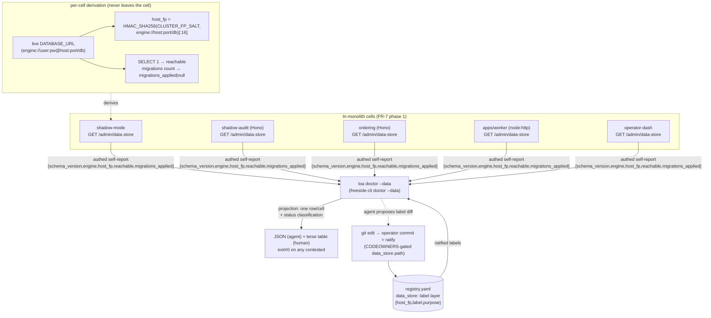
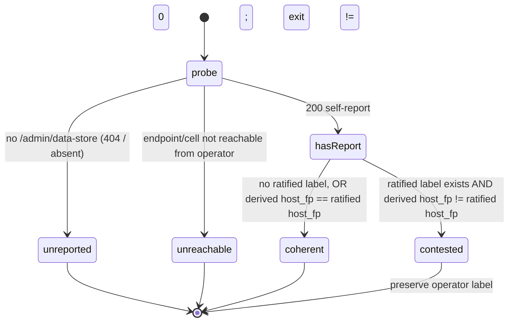

# Software Design Document — Legible Data-Store Topology (runtime-as-SoT projection)

**Version:** 1.0
**Date:** 2026-07-03
**Author:** Architecture Designer Agent
**Status:** Draft
**PRD Reference:** grimoires/loa/prd.md (cycle `datastore-legibility`, flatline-cured)

> The collections-sot architecture (runtime = source of truth; registry = re-derived
> projection + operator-ratified labels; drift = loud) applied one layer down: to the
> cluster's database topology. This SDD reuses the shape shipped in #430
> (`packages/services/shadow-mode/src/collections/drift.ts`) — projection, `contested`
> fold, fail-loud — and grounds every extension point in a real surface.
> Previous SDD archived: sdd.prev-2026-07-03-collections-sot.md.

---

## Table of Contents

1. [Project Architecture](#1-project-architecture)
2. [Software Stack](#2-software-stack)
3. [Data Design (the label layer, not a live store)](#3-data-design-the-label-layer-not-a-live-store)
4. [CLI / Output Surface](#4-cli--output-surface)
5. [API Specifications (the cell self-report)](#5-api-specifications-the-cell-self-report)
6. [Error Handling & Status Precedence](#6-error-handling--status-precedence)
7. [Testing Strategy](#7-testing-strategy)
8. [Development Phases](#8-development-phases)
9. [Known Risks and Mitigation](#9-known-risks-and-mitigation)
10. [Open Questions](#10-open-questions)
11. [Appendix](#11-appendix)

---

## 1. Project Architecture

### 1.1 System Overview

The operator cannot see which database each cell is wired to. Railway injects the real
connection at boot from the dashboard, not from code, so `registry.yaml` tracks HTTP
liveness (`deployment_url`, `runtime_state`) but **has no data-store field** (grounded:
`packages/freeside-registry/registry.yaml:8-19` schema header — the field set is
`git_url, beacon_url, deployment_url, visibility, owner, added, runtime_state, notes`;
no DB field).

> From prd.md:9-16 — *"registry.yaml tracks HTTP liveness … but has no data-store field."*

The keystone insight (prd.md:17-20): *"what happens if this goes stale? Ideally it's the
SoT."* A hand-authored `data_store` field IS the thing that goes stale. So the registry
must become a **re-derived projection over runtime truth + operator-ratified labels**, not
a hand cache — the identical disease + cure as the `COLLECTION_REGISTRY` env retired in the
collections-sot cycle (#430).

**Two layers, one for each source of truth** (prd.md:26-33):

| Layer | Source of truth | Author | Staleness |
|-------|-----------------|--------|-----------|
| **Derivable** (engine, host_fp, reachable, migrations) | the cell's live DB binding | NOBODY — re-derived every `loa doctor --data` run from the cell's sanitized self-report | structurally impossible (never stored) |
| **Ratified** (`host_fp → "shadow pg, the worldline ledger"`) | `registry.yaml` (git) | the operator (one git commit) | only on a real re-point → caught as `contested`, fails loud |

### 1.2 Architectural Pattern

**Pattern:** Derive-don't-ask projection over a membrane self-report (the same
runtime-as-SoT pattern as collections-sot #430, member-graph, and the beacon doctor).

**Justification:** The runtime already holds the truth (each cell has its own live
`DATABASE_URL`). Any typed registry value is a drifting cache. Re-deriving each run makes
the derivable layer un-stale-able by construction; a thin git-committed label layer carries
only the durable *human meaning*, and a hash mismatch between derived and ratified fails
loud instead of silently lying. This is a deliberate **non-migration**: the pattern is
proven, the cost is a new endpoint per cell + one CLI sub-verb, not a new datastore.

### 1.3 Component Diagram


```mermaid
flowchart TD
    subgraph Cells["In-monolith cells (FR-7 phase 1)"]
        SM["shadow-mode<br/>GET /admin/data-store"]
        SA["shadow-audit (Hono)<br/>GET /admin/data-store"]
        OR["ordering (Hono)<br/>GET /admin/data-store"]
        WK["apps/worker (node:http)<br/>GET /admin/data-store"]
        OD["operator-dash<br/>GET /admin/data-store"]
    end

    subgraph Cell_internals["per-cell derivation (never leaves the cell)"]
        DBURL["live DATABASE_URL<br/>(engine://user:pw@host:port/db)"]
        FP["host_fp = HMAC_SHA256(CLUSTER_FP_SALT,<br/>engine://host:port/db)[:16]"]
        PROBE["SELECT 1 → reachable<br/>migrations count → migrations_applied|null"]
        DBURL --> FP
        DBURL --> PROBE
    end

    CLI["loa doctor --data<br/>(freeside-cli doctor --data)"]
    REG[("registry.yaml<br/>data_store: label layer<br/>{host_fp,label,purpose}")]

    SM & SA & OR & WK & OD -->|"authed self-report<br/>{schema_version,engine,host_fp,reachable,migrations_applied}"| CLI
    Cell_internals -. derives .-> SM
    REG -->|ratified labels| CLI
    CLI -->|"projection: one row/cell<br/>+ status classification"| OUT["JSON (agent) + terse table (human)<br/>exit≠0 on any contested"]
    CLI -.->|"agent proposes label diff"| PR["git edit → operator commit = ratify<br/>(CODEOWNERS-gated data_store path)"]
    PR --> REG
```

### 1.4 System Components

#### C-1 — Cell self-report endpoint (`GET /admin/data-store`) — FR-1
- **Purpose:** each cell exposes its own sanitized DB facts, derived at request time from
  its live `DATABASE_URL`.
- **Responsibilities:** parse its connection string → `{engine, host, port, db}`; compute
  `host_fp`; probe `reachable` (`SELECT 1`); count applied migrations (nullable).
- **Interfaces:** one authed GET behind the cell's **existing** auth (shadow-audit already
  gates on `X-API-Key`, grounded `packages/services/shadow-audit/src/server.ts:92-105`).
- **Dependencies:** the cell's existing `pg` Pool + `packages/adapters/storage/pool-config.ts`
  (connection-URL source, grounded `:118-127`), plus a new shared `host-fp` helper.
- **NEVER:** the connection string, user, password, host, port, or db-name leaves the
  process. Only `host_fp` + non-secret facts (NFR-1, prd.md:74).

#### C-2 — `host_fp` derivation helper (shared) — FR-1 / flatline SKP-001
- **Purpose:** the salted correlation id. `host_fp = HMAC_SHA256(CLUSTER_FP_SALT,
  lower("${engine}://${host}:${port}/${db}"))[:16]` (prd.md:118-124). Credentials are NOT
  in the preimage; the preimage is normalized (lowercase, default ports elided).
- **Home:** `packages/adapters/storage/host-fp.ts` (new) — colocated with `pool-config.ts`
  so both the cell runtime (which imports storage adapters) and any Node consumer share ONE
  implementation. Reuses `node:crypto` `createHmac`.
- **Dependencies:** `CLUSTER_FP_SALT` env (a single non-secret-rotating cluster constant,
  shared so fps are comparable across cells).

#### C-3 — `loa doctor --data` aggregator/projector — FR-2
- **Purpose:** probe every in-scope cell's self-report, join with the registry's ratified
  `data_store` labels, classify each row, print JSON + a terse table, exit non-zero on any
  `contested`.
- **Home:** `packages/freeside-cli/src/verbs/doctor.ts` gains a `--data` mode (new
  `doctorData()` function + a `DataStoreReport` type), wired in
  `packages/freeside-cli/bin/freeside-cli.ts:86-98`. It reuses the SAME hardened, injectable
  fetch path `freeside-cli doctor --remote` already uses (`hardenedBeaconFetcher`, grounded
  `packages/freeside-cli/src/verbs/doctor.ts:193-199`) — SSRF-safe, IP-pinned, injectable for
  tests. G-3 holds: no Railway API, no new secret; it carries the operator's existing per-cell
  credentials (prd.md:133-138).

#### C-4 — Registry `data_store` label layer — FR-3
- **Purpose:** the durable human meaning, git-owned. Extends `ModuleEntry` in
  `packages/freeside-registry/src/registry.ts:26-54` with an optional `data_store` block.
- **Ratification:** the agent PROPOSES a label diff; the operator RATIFIES by committing it
  (flatline SKP-003, prd.md:140-146). A CODEOWNERS rule gates the `data_store:` path. This
  **drops** the collections-sot `consumeCockpitGrant` reuse — git ownership is the gate, not
  a live-ledger cockpit grant.

#### C-5 — Status classifier (the drift fold) — FR-5 / FR-6
- **Purpose:** per cell, compare derived `host_fp` to the ratified label and classify. Pure
  function (unit-testable without fs/network), mirroring the pure-helper discipline in
  `doctor.ts:252-375`.
- **Precedence (deterministic, prd.md:148-150):** `contested` > `unreachable` >
  `unreported` > `coherent`.

### 1.5 Data Flow

```mermaid
sequenceDiagram
    participant Op as Operator
    participant CLI as loa doctor --data
    participant Cell as cell /admin/data-store
    participant DB as cell's Postgres
    participant Reg as registry.yaml

    CLI->>Reg: load data_store label layer (host_fp → {label,purpose})
    loop each in-scope cell
        CLI->>Cell: GET /admin/data-store (X-API-Key / cell cred, 5s timeout)
        alt cell reachable & has endpoint
            Cell->>DB: SELECT 1 ; count migrations
            Cell->>Cell: host_fp = HMAC(salt, engine://host:port/db)[:16]
            Cell-->>CLI: {schema_version,engine,host_fp,reachable,migrations_applied|null}
            CLI->>CLI: classify(derived host_fp vs ratified label)
        else 404 / no endpoint
            CLI->>CLI: status = unreported (NEVER guessed)
        else unreachable from operator
            CLI->>CLI: status = unreachable
        end
    end
    CLI-->>Op: JSON + terse table ; exit 1 if any contested
    Op->>Reg: (later) git commit a data_store label = ratify
```

### 1.6 External Integrations

| Service | Purpose | API Type | Notes |
|---------|---------|----------|-------|
| Railway | hosts the cells; injects `DATABASE_URL` at boot | (none — NOT called) | NFR-2: zero Railway API dependency. Legibility is derived from each cell's self-report, not the Railway dashboard. |
| AWS/terraform cells | same self-report path | HTTP | A cell reports its own DB regardless of substrate (prd.md:76-77). No terraform change this cycle (Scope §6 Out). |

### 1.7 Deployment Architecture

No new deployable service. The change is: (a) a new route on each existing cell runtime, (b)
a new CLI sub-verb, (c) new registry fields + CODEOWNERS. Phase 1 targets the in-monolith
cells the platform controls (prd.md:68-70). `CLUSTER_FP_SALT` is added to each cell's env and
the operator's `loa`/CLI env (a single shared non-secret constant).

> **Registry-membership design note (load-bearing):** `loa doctor --data` iterates
> `registry.modules` (grounded `doctor.ts:619`). Today the registry lists only the external
> `*-api` cells + `ordering` (grounded `registry.yaml` slugs: activities-api, events-api,
> identity-api, inventory-api, ledger-api, mediums-api, mint-api, **ordering**, score-api,
> sonar-api, storage-api). The Phase-1 in-monolith cells `shadow-mode`, `shadow-audit`,
> `worker`, `operator-dash` are **not registry modules**. Two options (see Open Questions
> Q-1): (a) add them as registry modules with `deployment_url` + `data_store`; or (b) give
> `doctor --data` a small in-repo scope list of phase-1 cells. This SDD recommends **(a)** —
> a cell that is legible for its DB should be a first-class registered cell — but scopes the
> decision to sprint planning.

### 1.8 Scalability Strategy

Not a scaling concern — a read/derive verb over ~10 cells run on the operator's laptop. The
per-cell self-report is O(1) (one `SELECT 1` + one count query, 5s timeout). No caching, no
persistence of the derived layer (that is the whole point).

### 1.9 Security Architecture

- **Authentication:** the self-report is on an **authenticated surface, not the public
  beacon** (flatline SKP-002, prd.md:126-131). It reuses the cell's existing auth — e.g.
  shadow-audit's `X-API-Key` timing-safe gate (`server.ts:99-102`), activities HS256, score
  static key. It is NOT added to `/.well-known/beacon.json` (engine + reachability +
  migration-count is topology, not public).
- **Secret hygiene (NFR-1):** the credential and connection string are forbidden from the
  registry, beacon, logs, and `loa` output. `host_fp` is a one-way salted HMAC over a preimage
  that contains NO credentials; reversal is not possible; the salt raises the bar against a
  public viewer brute-forcing a low-entropy internal hostname.
- **Authorization for ratify (NFR-4):** read/derive verbs need no credentials; only the
  operator's ratify needs authority — and that authority is a git commit to a CODEOWNERS-gated
  path, not a runtime grant.
- **Trust boundary:** the self-report is *trusted* for the fingerprint but `reachable` is
  *proven* by an actual probe (R-2, prd.md:104-105). A compromised cell that misreports its
  fingerprint is a documented ceiling (full attestation out of scope).

---

## 2. Software Stack

### 2.1 Cell runtime (self-report endpoint)

| Category | Technology | Version | Justification |
|----------|------------|---------|---------------|
| Language | TypeScript / Node.js | 22.x (`@types/node@22`) | matches existing cell runtimes |
| HTTP (shadow-audit, ordering, shadow-mode, operator-dash) | Hono | as vendored (`hono` in each service) | all four are Hono with a `/healthz` route (grounded `shadow-audit/src/server.ts:23,106`; `shadow-mode/src/http/shadow-router.ts`; `operator-dash/src/app.ts`); add one `app.get('/admin/data-store', …)` |
| HTTP (apps/worker) | `node:http` | stdlib | worker's health server is raw `node:http` (grounded `apps/worker/src/health.ts:37`); add a route + an auth gate (worker's health server is currently **unauthenticated** — see Risks R-4) |
| DB client | `pg` | as vendored | reuse the cell's existing `Pool`; connection URL via `getConnectionUrl()` |
| Hash | `node:crypto` `createHmac` | stdlib | `host_fp` — no new dependency (ladder rung 2: stdlib) |

**Ladder note (Karpathy §2, simplicity):** `host_fp` is stdlib `createHmac('sha256', salt)`
— NOT a new crypto dependency. The existing `sha256Hex` in
`packages/freeside-cli/src/lib/jcs.ts:42` is a plain SHA-256 (no salt/HMAC), so it is not
reused for the salted fp; a small dedicated `host-fp.ts` is the minimum correct code.

### 2.2 CLI (aggregator)

| Category | Technology | Version | Justification |
|----------|------------|---------|---------------|
| Language | TypeScript / Node.js | as `packages/freeside-cli` | extend the existing `doctor` verb |
| Fetch | `hardenedBeaconFetcher` | existing (`src/lib/harden-beacon-fetch.js`) | SSRF-safe, IP-pinned, injectable — the SAME path `doctor --remote` uses (`doctor.ts:199`) |
| YAML | `yaml` | existing (`registry.ts:17`) | registry load/extend |
| Schema | `effect` `Schema` | existing (`registry.ts:18`) | extend `ModuleEntry` decode (`registry.ts:26`) |

### 2.3 Infrastructure & DevOps

| Category | Technology | Purpose |
|----------|------------|---------|
| Env | `CLUSTER_FP_SALT` | shared non-secret salt, present in every cell + the CLI env |
| Ownership | GitHub CODEOWNERS | gate the `data_store:` path in `registry.yaml` — the ratify authority (FR-4) |
| CI | existing gates | `loa doctor --data` is CI-usable (exits non-zero on `contested`) |

---

## 3. Data Design (the label layer, not a live store)

**No new database, no new table.** The derivable layer is never stored (that is the design).
The only persisted artifact is the git-committed label layer in `registry.yaml`.

### 3.1 Registry `data_store` label layer (FR-3)

Extend `ModuleEntry` (`packages/freeside-registry/src/registry.ts:26-54`):

```typescript
// packages/freeside-registry/src/registry.ts — additive, backward-compatible
const DataStoreLabel = Schema.Struct({
  host_fp: Schema.String,                 // the 16-hex correlation id this label ratifies
  label:   Schema.String,                 // human meaning, e.g. "shadow pg, the worldline ledger"
  purpose: Schema.optional(Schema.String),
});

const ModuleEntry = Schema.Struct({
  // …existing fields (git_url, beacon_url, visibility, owner, added,
  //   beacon_fixture?, deployment_url?, runtime_state?, notes?)…
  data_store: Schema.optional(DataStoreLabel).annotations({
    description:
      "FR-3: operator-RATIFIED label for this cell's DB (git = SoT). host_fp is the " +
      "correlation id; label/purpose are the durable human meaning. The LIVE state " +
      "(reachable/migrations) is NEVER stored here — it is projected fresh by doctor --data.",
  }),
});
```

Registry YAML shape (one cell):

```yaml
  shadow-audit:
    git_url: ...
    deployment_url: https://shadow-audit-...up.railway.app
    runtime_state: deployed
    # ── ratified data-store label (operator commits this; CODEOWNERS-gated) ──
    data_store:
      host_fp: "a1b2c3d4e5f60718"          # 16 hex chars
      label: "shadow pg — the worldline ledger"
      purpose: "hash-chained member-graph + collections SoT"
```

> **Invariant:** `data_store.host_fp` is a 16-lowercase-hex string (validated at decode). The
> live `reachable`/`migrations_applied`/`engine` are absent here by construction (FR-3,
> prd.md:55-57).

### 3.2 The derived projection row (in-memory only, FR-2)

```typescript
// packages/freeside-cli/src/verbs/doctor.ts (new)
export type DataStoreStatus = "coherent" | "contested" | "unreachable" | "unreported";

export interface DataStoreRow {
  readonly slug: string;
  readonly engine: string | null;          // e.g. "postgres"; null when unreported/unreachable
  readonly host_fp: string | null;         // DERIVED from the cell's self-report
  readonly reachable: boolean;             // the cell's OWN report of its DB reachability
  readonly migrations_applied: number | null; // nullable (IMP-008)
  readonly ratified_label: string | null;  // from registry data_store.label, if any
  readonly ratified_host_fp: string | null; // from registry data_store.host_fp, if any
  readonly status: DataStoreStatus;
  readonly detail?: string;                // e.g. "derived a1b2… ≠ ratified 9f8e…"
}

export interface DataStoreReport {
  readonly checked_at: string;
  readonly cells_checked: number;
  readonly rows: ReadonlyArray<DataStoreRow>;
  readonly summary: { coherent: number; contested: number; unreachable: number; unreported: number };
}
```

### 3.3 The cell self-report contract (FR-1, over the wire)

```typescript
// shared shape (define in a small protocol module, e.g. packages/core or per-cell)
export interface DataStoreSelfReport {
  readonly schema_version: 1;              // additive versioning (flatline IMP-003)
  readonly engine: "postgres";             // the only engine this cycle (NFR-3)
  readonly host_fp: string;                // HMAC_SHA256(CLUSTER_FP_SALT, engine://host:port/db)[:16]
  readonly reachable: boolean;             // proven by SELECT 1, not merely claimed
  readonly migrations_applied: number | null; // null when the framework can't cheaply count (IMP-008)
}
```

### 3.4 Migration-count derivation (per cell)

`migrations_applied` is derived, never stored. Each cell counts rows in its own migration
ledger table; when the framework can't cheaply report it, return `null` — never fabricate
(prd.md:152-154). Grounded per-cell mechanisms to confirm during implementation:
- **ordering** — `PostgresOrderStore.connect(url, { migrate })` (grounded
  `packages/services/ordering/src/store-factory.ts:8`); count its migration table.
- **shadow-mode** — the hash-chained `PostgresLedgerStore` (its own migration path).
- **adapters/storage** — drizzle adapter (`packages/adapters/storage/drizzle-storage-adapter.ts`);
  drizzle keeps a `__drizzle_migrations` table.

`loa:shortcut: migrations_applied returns null when no single cheap COUNT exists; add a
per-framework counter if a cell's migration table proves load-bearing for a decision.`

---

## 4. CLI / Output Surface

(The PRD ships no human dashboard — the surface is agent-native + a terse human table,
prd.md:52-54.)

### 4.1 Invocation

```
loa doctor --data            # via the loa launcher → freeside-cli doctor --data
freeside-cli doctor --data   # in-repo
freeside-cli doctor --data --json    # JSON only (agent)
```

Wire in `packages/freeside-cli/bin/freeside-cli.ts:86-98` `case "doctor"`: when `--data` is
present, dispatch to `doctorData()` and render; else the existing beacon `doctor()` path is
unchanged.

### 4.2 Human table (terse)

```
CELL            ENGINE    HOST_FP           REACH  MIG   STATUS      LABEL
shadow-audit    postgres  a1b2c3d4e5f60718  ✓      42    coherent    shadow pg — worldline ledger
ordering        postgres  a1b2c3d4e5f60718  ✓      17    coherent    shadow pg — worldline ledger
shadow-mode     postgres  9f8e7d6c5b4a3021  ✓      8     CONTESTED   ← derived≠ratified (re-point?)
worker          postgres  —                 ✗      —     unreachable
operator-dash   —         —                 —      —     unreported  (no /admin/data-store yet)

4 cells · 2 coherent · 1 contested · 1 unreachable · 1 unreported   → exit 1
```

Note the **host_fp fan-out is a feature** (R-1, prd.md:100-102): `shadow-audit` and
`ordering` sharing `a1b2c3d4e5f60718` surfaces that they share one DB.

### 4.3 JSON (agent) — `DataStoreReport` (see §3.2), single object, stable keys.

### 4.4 Exit codes

Mirror the existing doctor contract (`bin/freeside-cli.ts:97`): non-zero on any `contested`
row. `1` = at least one contested (fails loud, G-2). `0` = no contested (unreachable /
unreported are honest gaps, not failures — they do NOT fail the doctor, matching the
`unknown_standard`-doesn't-fail precedent in `drift.ts:96-99` and prd.md:152-154).

---

## 5. API Specifications (the cell self-report)

### 5.1 `GET /admin/data-store` (FR-1)

**Auth:** the cell's existing auth. Example (shadow-audit, `X-API-Key`):

**Request:**
```http
GET /admin/data-store
X-API-Key: {the cell's existing shared secret}
```

**Response (200 OK):**
```json
{
  "schema_version": 1,
  "engine": "postgres",
  "host_fp": "a1b2c3d4e5f60718",
  "reachable": true,
  "migrations_applied": 42
}
```

**Response (200 OK, DB down but endpoint alive):**
```json
{ "schema_version": 1, "engine": "postgres", "host_fp": "a1b2c3d4e5f60718", "reachable": false, "migrations_applied": null }
```

**Response (401):** when the cell's auth rejects the request (constant-time compare, per
`server.ts:99-102`).

**Timeout:** the *aggregator* enforces a 5s timeout per cell (flatline IMP-003); a slow/absent
endpoint → `unreported`/`unreachable`, never a hang.

### 5.2 Route registration (Hono cells)

```typescript
// e.g. packages/services/shadow-audit/src/server.ts (inside buildAuditApp)
// The X-API-Key middleware at :92-105 already guards non-/healthz routes, so this route
// is authed by construction. Do NOT add /admin/data-store to the beacon or /healthz allowlist.
app.get('/admin/data-store', async (c) => {
  const report = await deriveDataStoreReport(pool, process.env.CLUSTER_FP_SALT);
  return c.json(report);
});
```

### 5.3 Route registration (worker, `node:http`)

Worker's health server (`apps/worker/src/health.ts:37-55`) only serves `/` and `/health` and
is **unauthenticated**. Adding `/admin/data-store` there requires an auth gate (a shared-secret
header check). See R-4.

### 5.4 The derivation helper (shared, FR-1)

```typescript
// packages/adapters/storage/host-fp.ts (new)
import { createHmac } from "node:crypto";

/** Normalize the preimage: lowercase, elide default ports (5432 pg / 6432 pgbouncer).
 *  Credentials (user, password) are NEVER included. */
export function hostFpPreimage(engine: string, host: string, port: number, db: string): string {
  const defaultPort = port === 5432 || port === 6432;
  return `${engine.toLowerCase()}://${host.toLowerCase()}${defaultPort ? "" : ":" + port}/${db.toLowerCase()}`;
}

export function hostFp(salt: string, engine: string, host: string, port: number, db: string): string {
  return createHmac("sha256", salt)
    .update(hostFpPreimage(engine, host, port, db))
    .digest("hex")
    .slice(0, 16);
}
```

The connection parts come from parsing `getConnectionUrl()`
(`packages/adapters/storage/pool-config.ts:118-127`) with `new URL(...)`; `user`/`password`
on the URL are discarded before hashing.

---

## 6. Error Handling & Status Precedence

### 6.1 Status classification (FR-5 / FR-6) — the drift fold

Pure function `classifyDataStore(derived, ratified) → DataStoreStatus`, mirroring the
collections-sot fold (`drift.ts:16-135`) but simpler (host_fp is a single derived value):


```mermaid
stateDiagram-v2
    [*] --> probe
    probe --> unreported: no /admin/data-store (404 / absent)
    probe --> unreachable: endpoint/cell not reachable from operator
    probe --> hasReport: 200 self-report
    hasReport --> coherent: no ratified label, OR derived host_fp == ratified host_fp
    hasReport --> contested: ratified label exists AND derived host_fp != ratified host_fp
    contested --> [*]: preserve operator label; exit != 0
    unreachable --> [*]
    unreported --> [*]
    coherent --> [*]
```

**Precedence (deterministic, prd.md:148-150):** `contested` > `unreachable` > `unreported` >
`coherent`. A cell that is both unreachable AND has a stale-looking label is reported
`unreachable` (we cannot prove `contested` without a fresh derive).

### 6.2 Fail-closed legibility (FR-6)

A cell without the FR-1 endpoint → `unreported`, **never guessed or inferred** (prd.md:65-67,
the money/ops floor — legibility that lies is worse than a gap). A cell unreachable from the
operator's context → `unreachable`, honest (prd.md:136-138). Neither is ever silently
back-filled from a prior run.

### 6.3 Contested never overwrites operator truth (FR-5)

When derived `host_fp` ≠ ratified label, the row is `contested`, the operator's label is
**preserved** (the projection is in-memory; the git label is untouched), and the doctor exits
non-zero. This is the exact `contested`-preserves-operator-value semantics of
`drift.ts:120-132`.

### 6.4 Error categories

| Category | Handling |
|----------|----------|
| Cell 404 / no endpoint | `unreported` (fail-closed) |
| Cell 401 (bad cred) | `unreachable` + detail `"auth rejected"` (never guessed as coherent) |
| Cell timeout (>5s) | `unreachable` |
| Cell DB down (`reachable:false`) | still a valid report; status from host_fp match; `reachable:false` shown |
| Missing `CLUSTER_FP_SALT` on a cell | the cell FAILS LOUD at the endpoint (500 with a clear message), never emits an unsalted fp that would mismatch every other cell |
| Missing `CLUSTER_FP_SALT` on the CLI | CLI cannot compare — but it never derives host_fp itself (cells do); it only reads them. No salt needed CLI-side. |

### 6.5 Logging

The endpoint and CLI log `host_fp` + status only — NEVER the connection string, host, port,
db-name, or credential (NFR-1). Structured JSON, correlation id = `host_fp`.

---

## 7. Testing Strategy

Test-first per the Karpathy §4 floor: every branch (the fold, the fp normalization, the
fail-closed classes) gets a runnable check.

| Level | Coverage | Tools |
|-------|----------|-------|
| Unit | `hostFp`/`hostFpPreimage` (normalization: default-port elision, case, NO creds in preimage); `classifyDataStore` (all 4 statuses + precedence) | vitest (existing per-package) |
| Unit | registry decode: `data_store` optional + 16-hex validation; **existing modules still decode** (backward-compat regression) | vitest |
| Integration | each cell's `GET /admin/data-store` returns the contract shape; auth rejects without the cred; `reachable:false` when DB is down | per-service test (shadow-audit uses a fake OwnershipSource today — same injection discipline) |
| Integration | `doctorData()` with an **injected fetcher** (no live network, per `doctor.ts:91` `fetchBeacon` precedent): coherent, contested (exit≠0), unreachable, unreported rows | vitest |
| Security | preimage NEVER contains user/password (assert on a URL with creds); host_fp is stable + salted (different salt ⇒ different fp) | vitest |

**Key acceptance tests (sprint ACs):**
- AC-1: a URL `postgres://u:p@h:5432/db` and `postgres://u:p@h/db` yield the SAME `host_fp`
  (default-port elision) and a preimage containing neither `u` nor `p`.
- AC-2: two cells with the same DB report the same `host_fp` (fan-out surfaces sharing).
- AC-3: `doctor --data` exits `1` when any row is `contested`, `0` when only
  unreachable/unreported.
- AC-4: a cell with no `/admin/data-store` is `unreported`, never inferred.
- AC-5: adding `data_store` to one module leaves all other modules decoding unchanged.

---

## 8. Development Phases

Sequenced so the settle gate (one legible cell end-to-end) lands first, then breadth.

### Phase 1 — the shared primitives + one cell (settle gate)
- [ ] `packages/adapters/storage/host-fp.ts` — `hostFp` + `hostFpPreimage` + unit tests (AC-1).
- [ ] `DataStoreSelfReport` contract type (shared).
- [ ] `GET /admin/data-store` on **shadow-audit** (Hono; auth by the existing `X-API-Key`
      gate) — derive from its Pool + salt.
- [ ] `CLUSTER_FP_SALT` env wired for shadow-audit + documented.

### Phase 2 — the aggregator + projection
- [ ] `doctorData()` + `DataStoreReport`/`DataStoreRow`/`classifyDataStore` in `doctor.ts`
      (pure classifier + injected fetcher).
- [ ] `--data` (+ `--json`) dispatch in `bin/freeside-cli.ts`; terse table renderer; exit
      codes (AC-3).
- [ ] Registry `data_store` label layer in `registry.ts` + decode tests (AC-5).

### Phase 3 — the label layer + ratify path + drift
- [ ] Populate `data_store` labels for the covered cells (operator commits; CODEOWNERS rule
      on the `data_store:` path).
- [ ] Contested classification wired + fail-loud (AC-3 contested case, FR-5).
- [ ] `unreported`/`unreachable` fail-closed paths (AC-4, FR-6).

### Phase 4 — breadth across the remaining in-monolith cells (FR-7 phase 1)
- [ ] `GET /admin/data-store` on **ordering** (Hono), **shadow-mode**, **operator-dash**.
- [ ] **worker**: add the route to its `node:http` health server **with an auth gate** (R-4).
- [ ] Registry-membership decision executed (Q-1) so `doctor --data` iterates all phase-1 cells.

Out (deferred, prd.md:89-96): external `*-api` cells' self-report; any DB
consolidation/migration; per-DB SLOs / pool metrics; AWS terraform changes.

---

## 9. Known Risks and Mitigation

| Risk | Prob | Impact | Mitigation |
|------|------|--------|------------|
| **R-1 host_fp collision / shared-DB ambiguity** | Low | Low | preimage = `engine://host:port/db` (16-hex HMAC); a shared fp is a *feature* — doctor shows the fan-out (prd.md:100-102). |
| **R-2 a cell lies about its fingerprint** | Low | Med | `reachable` is *proven* by an actual probe; the fp is advisory. Full attestation is a documented ceiling, out of scope (prd.md:104-105). |
| **R-3 external-repo cells never adopt FR-1** | High | Low | they stay `unreported` forever — accepted; the honest gap is the trigger to push adoption (prd.md:106-107). |
| **R-4 worker health server is unauthenticated** | Med | Med | worker's `node:http` server (`health.ts`) has no auth on `/health`. Adding `/admin/data-store` there needs a shared-secret gate, OR expose it only on an internal port. Do NOT expose engine/migration facts unauthenticated. |
| **R-5 registry-membership gap** | High | Med | phase-1 in-monolith cells aren't registry modules; `doctor --data` won't see them until Q-1 is resolved. Sequenced into Phase 4. |
| **R-6 `CLUSTER_FP_SALT` drift across cells** | Med | High | if two cells run different salts, their fps never match and every shared-DB row looks divergent. Mitigation: ONE cluster constant, set identically; document it as a deploy invariant; a mismatched salt surfaces as universal non-coherence (loud, not silent). |
| **R-7 migration-count unavailable** | Med | Low | `migrations_applied: null` (never fabricated); does not fail the doctor (prd.md:152-154). |

---

## 10. Open Questions

| Question | Owner | Status |
|----------|-------|--------|
| **Q-1** Do phase-1 in-monolith cells (`shadow-mode`, `shadow-audit`, `worker`, `operator-dash`) become **registry modules** (recommended), or does `doctor --data` carry a small in-repo scope list? | Operator + sprint plan | Open — this SDD recommends registry modules (a DB-legible cell should be a registered cell). |
| **Q-2** Where does the `DataStoreSelfReport` contract type live — `packages/core`, a new tiny protocol package, or duplicated per cell? Prefer one shared type (queryable-not-copied ethos), but per-cell repos will need it too when FR-7 phase 2 lands. | Sprint plan | Open. |
| **Q-3** Exact per-cell migration-count query (drizzle `__drizzle_migrations` vs shadow-mode's ledger vs ordering's table). Confirm each during Phase 4; `null` is the honest fallback. | Implementer | Open (non-blocking). |
| **Q-4** CODEOWNERS granularity — can we gate a YAML *sub-path* (`data_store:`) or only the whole `registry.yaml`? If only the file, the ratify gate is "any registry commit," which is coarser than intended. | Operator | Open. |

---

## 11. Appendix

### A. Glossary

| Term | Definition |
|------|------------|
| `host_fp` | `HMAC_SHA256(CLUSTER_FP_SALT, lower("engine://host:port/db"))[:16]` — a salted correlation id, NOT a secrecy measure and NOT a credential (flatline SKP-001). |
| Derivable layer | engine/host_fp/reachable/migrations — re-derived every run from the cell's self-report; never stored. |
| Ratified layer | the git-committed `data_store` label (`host_fp → human meaning`); the operator's durable truth. |
| `contested` | derived host_fp ≠ ratified label — the DB was re-pointed; fails loud, operator label preserved. |
| `unreported` | a cell with no `/admin/data-store` endpoint — an honest gap, never guessed. |
| `unreachable` | a cell the operator can't reach — honest, never guessed. |
| Fan-out | one `host_fp` mapping to multiple cells — surfaces DB sharing (a feature). |

### B. Grounded source references

- PRD: `grimoires/loa/prd.md` (this cycle).
- Registry type to extend: `packages/freeside-registry/src/registry.ts:26-54` (`ModuleEntry`).
- Registry data + module list + header: `packages/freeside-registry/registry.yaml:8-19`.
- CLI verb to extend: `packages/freeside-cli/src/verbs/doctor.ts` (dispatch `bin/freeside-cli.ts:86-98`; exit `:97`; hardened fetch `:193-199`; pure-helper discipline `:252-375`).
- Cell auth + health pattern: `packages/services/shadow-audit/src/server.ts:89-108` (Hono, `X-API-Key` timing-safe, `/healthz` open).
- Worker health server: `apps/worker/src/health.ts:37-62` (`node:http`, unauthenticated).
- Connection URL source: `packages/adapters/storage/pool-config.ts:118-172`.
- Ordering pg store: `packages/services/ordering/src/store-factory.ts:5-11`.
- Reused drift/contested shape (#430): `packages/services/shadow-mode/src/collections/drift.ts:16-135`.
- Existing hash helper (SHA-256, not HMAC): `packages/freeside-cli/src/lib/jcs.ts:42`.
- Architecture reframe + flatline cures: prd.md §2, §7.5.

### C. Change Log

| Version | Date | Changes | Author |
|---------|------|---------|--------|
| 1.0 | 2026-07-03 | Initial SDD — datastore-legibility (runtime-as-SoT projection) | Architecture Designer |

---

*Generated by Architecture Designer Agent*
