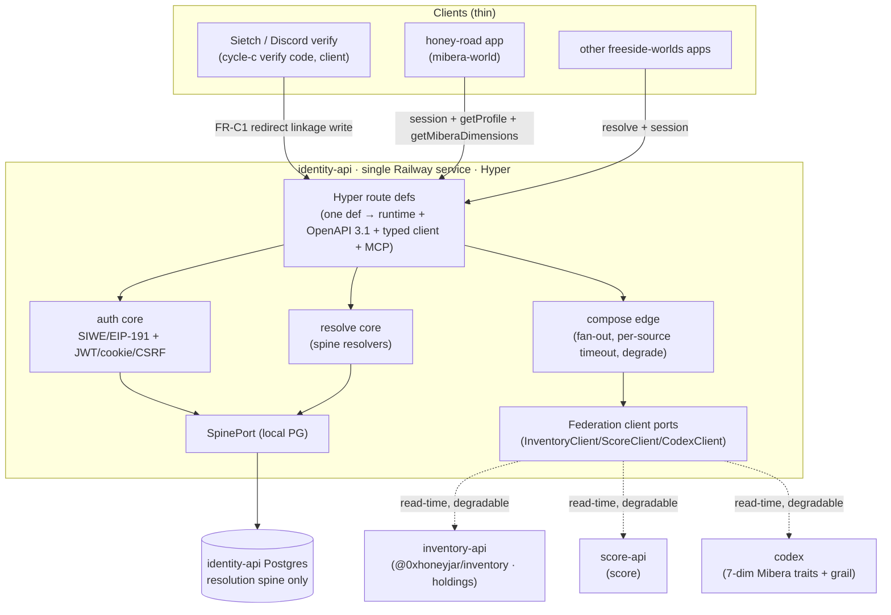
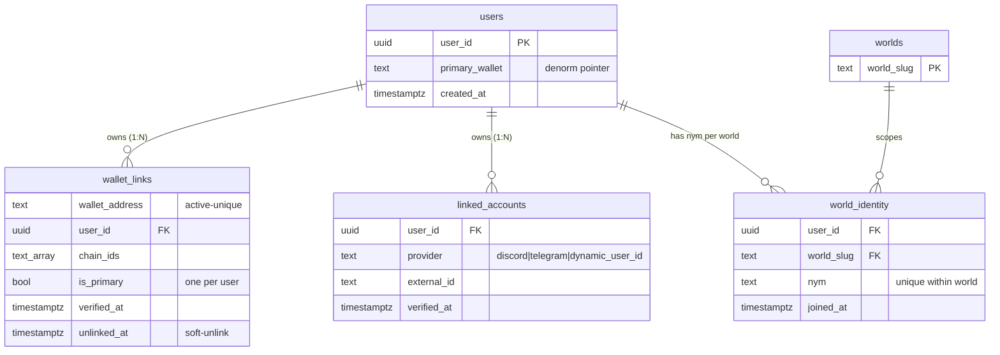
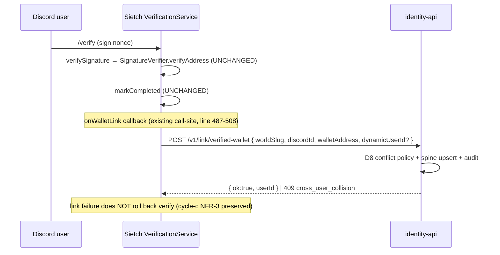

# Software Design Document: identity-api

**Version:** 1.0
**Date:** 2026-05-24
**Author:** Architecture Designer Agent (ARCH mode)
**Status:** Draft
**PRD Reference:** `grimoires/loa/cycles/cycle-566603cf31/prd.md`

> **Decision discipline.** The eight operator decisions D1–D8 (PRD §3) are **locked**. This SDD designs *within* them — it does not re-open them. The five PRD §9 open questions are carried forward as **§13 Decisions-to-Confirm** with swappable design seams so they do not block delivery.

> **Grounding posture.** Every concrete file/symbol/contract reference is grounded in a source read during authoring (PRD §Sources block). The wallet-link migration `046_wallet_links.ts` was read and found to be **SQLite** (`better-sqlite3`); the identity-api spine is **Postgres** (D4) — so what is reused is the *nonce-challenge shape and lifecycle*, translated to Postgres, NOT the SQLite DDL verbatim. The `midi_profiles` table and the inventory/codex/score typed SDKs are **cross-repo** (external `mibera-honeyroad` / `inventory-api` repos) — they are designed against their PRD-cited surfaces, not against in-monolith source. Vault world-model is orientation only (`background_only`), never cited as authority.

---

## Table of Contents

1. [Project Architecture](#1-project-architecture)
2. [Software Stack](#2-software-stack)
3. [Database Design — the resolution spine](#3-database-design--the-resolution-spine)
4. [Federation Surface — BeaconV3, registry, SDK, MCP gateway](#4-federation-surface)
5. [API Specifications — Hyper route/handler shapes](#5-api-specifications)
6. [Compose Fan-Out Design](#6-compose-fan-out-design)
7. [Reuse Map](#7-reuse-map)
8. [cycle-c Redirect + midi_profiles Backfill](#8-cycle-c-redirect--midi_profiles-backfill)
9. [Error Handling Strategy](#9-error-handling-strategy)
10. [Testing Strategy](#10-testing-strategy)
11. [Development Phases (sequenced)](#11-development-phases-sequenced)
12. [Known Risks and Mitigation](#12-known-risks-and-mitigation)
13. [Decisions to Confirm (PRD §9 carried forward)](#13-decisions-to-confirm)
14. [Appendix](#14-appendix)

---

## 1. Project Architecture

### 1.1 System Overview

identity-api is **one freeside building** (one repo = schema + runtime + docs, per ADR-008 §D-11.2) deployed as a **single Railway service** (D4) that owns its own Postgres. It converges the three seams the PRD §0 separates:

| Seam | identity-api owns | PRD goal |
|------|-------------------|----------|
| ① Authenticate | SIWE (EIP-4361) + legacy EIP-191 verify → Hyper JWT + encrypted-cookie session + CSRF | G-3 |
| ② Resolve | the central 5-table resolution spine (the SoR + writer) | G-2 |
| ③ Serve profile | read-time fan-out compose over inventory-api + score-api + codex | G-5 / G-6 |

It is **not** a node in the data-depth DAG (raw → derived → integrated → presented). Per **D6** and ADR-008 §D-8 (plane ≠ domain), it is an **orthogonal credential/identity plane** that guards and enriches the DAG buildings. The architectural consequence is the **isolation invariant** (NFR-2): a downstream building (inventory/score/codex) outage degrades *profile content* only — it can never fail the auth or resolve paths.

### 1.2 Architectural Pattern

**Pattern:** Single-service Hyper application (one-definition-emits-everything) with a hexagonal interior — a small port layer separating the **spine** (local Postgres, the SoR) from the **federation clients** (downstream typed SDKs, composed on read).

**Justification (traces to D4 + D6):**
- D4 mandates **Hyper** (hyperjs.ai): one route definition emits runtime + OpenAPI 3.1 + typed RPC client + MCP server, with built-in JWT (EdDSA/RS256/HS256) + encrypted-cookie sessions + CSRF. This collapses NFR-6 (two-organ parity) and the auth primitives into one definition — no separate OpenAPI hand-authoring, no separate MCP server build.
- D4 mandates **single Railway service** — not the loa-vps AWS coordination cluster, not per-world ECS (PRD §2.3 non-goal: "Make identity-api a per-world ECS task").
- The hexagonal split is what makes D6 enforceable: the **auth + resolve** core depends only on the local spine port (always available); the **compose** edge depends on federation client ports (degradable). The dependency direction is the isolation guarantee.

### 1.3 Component Diagram


```mermaid
graph TD
    subgraph clients["Clients (thin)"]
        SIETCH["Sietch / Discord verify<br/>(cycle-c verify code, client)"]
        HR["honey-road app<br/>(mibera-world)"]
        APPS["other freeside-worlds apps"]
    end

    subgraph idapi["identity-api · single Railway service · Hyper"]
        ROUTES["Hyper route defs<br/>(one def → runtime + OpenAPI 3.1 + typed client + MCP)"]
        AUTH["auth core<br/>SIWE/EIP-191 + JWT/cookie/CSRF"]
        RESOLVE["resolve core<br/>(spine resolvers)"]
        COMPOSE["compose edge<br/>(fan-out, per-source timeout, degrade)"]
        SPINEPORT["SpinePort (local PG)"]
        FEDPORTS["Federation client ports<br/>(InventoryClient/ScoreClient/CodexClient)"]
    end

    PG[("identity-api Postgres<br/>resolution spine only")]
    INV["inventory-api<br/>(@0xhoneyjar/inventory · holdings)"]
    SCORE["score-api<br/>(score)"]
    CODEX["codex<br/>(7-dim Mibera traits + grail)"]

    SIETCH -->|FR-C1 redirect linkage write| ROUTES
    HR -->|session + getProfile + getMiberaDimensions| ROUTES
    APPS -->|resolve + session| ROUTES
    ROUTES --> AUTH
    ROUTES --> RESOLVE
    ROUTES --> COMPOSE
    AUTH --> SPINEPORT
    RESOLVE --> SPINEPORT
    SPINEPORT --> PG
    COMPOSE --> FEDPORTS
    FEDPORTS -.->|read-time, degradable| INV
    FEDPORTS -.->|read-time, degradable| SCORE
    FEDPORTS -.->|read-time, degradable| CODEX
```

The solid edges into the spine are the always-available paths (auth + resolve). The **dotted** edges to downstream buildings are the degradable compose paths — D6 isolation drawn structurally.

### 1.4 System Components

#### Hyper route layer (`src/api/`)
- **Purpose:** the one-definition surface. Each route emits runtime handler + OpenAPI 3.1 fragment + typed-client method + MCP tool.
- **Responsibilities:** request decode, session/CSRF middleware, dispatch to auth/resolve/compose cores, response encode against sealed schemas.
- **Interfaces:** HTTP (REST) + MCP (federation). Both derived from one def (NFR-6).
- **Dependencies:** auth core, resolve core, compose edge, sealed schemas in `packages/protocol/`.

#### Auth core
- **Purpose:** wallet-first authentication (G-3). Challenge issue, signature verify (SIWE + legacy EIP-191), session mint.
- **Responsibilities:** nonce lifecycle (translated from `wallet_link_nonces` shape), `SignatureVerifier` reuse, resolve-or-create user, JWT + encrypted-cookie issue, CSRF double-submit.
- **Interfaces:** `POST /auth/challenge`, `POST /auth/verify`, session-validation middleware (FR-A3).
- **Dependencies:** SpinePort (write user + wallet_link + session-nonce), `SignatureVerifier` (reused).

#### Resolve core
- **Purpose:** the SoR resolvers (G-2). Bidirectional dot-connection.
- **Responsibilities:** `resolveByWallet`, `resolveByAccount`, `resolveByNym`, `getIdentity`, primary-wallet selection/enforcement, idempotent linking.
- **Interfaces:** FR-R1..R6.
- **Dependencies:** SpinePort only (local PG — never downstream; this is why resolve is non-degradable).

#### Compose edge
- **Purpose:** profile serving (G-5) + Mibera dimensions (G-6).
- **Responsibilities:** fan-out to InventoryClient/ScoreClient/CodexClient with per-source timeout, assemble partial-tolerant profile, set `degraded[]` flag.
- **Interfaces:** `getProfile`, `getMiberaDimensions`.
- **Dependencies:** resolve core (to get user_id + nym + wallets) + federation client ports.

#### IdentityLink ingress (FR-C1)
- **Purpose:** receive the redirected cycle-c linkage write.
- **Responsibilities:** accept `{world_slug, discord_id, wallet_address, dynamic_user_id?}`, apply D8 conflict policy server-side, upsert spine, audit.
- **Interfaces:** `POST /link/verified-wallet`.
- **Dependencies:** SpinePort + audit hook.

### 1.5 Data Flow — the Mibera survey (G-6 acceptance)

```mermaid
sequenceDiagram
    participant HR as honey-road
    participant ID as identity-api
    participant INV as inventory-api
    participant CX as codex
    participant SC as score-api
    HR->>ID: GET /mibera/dimensions?wallet=0x.. (session-authed)
    ID->>ID: resolveByWallet → user_id; nym in mibera-world (spine, local)
    par fan-out (per-source timeout, degradable)
        ID->>INV: holdings(wallet) → Mibera tokenIds
        ID->>SC: score(wallet) → score
    end
    ID->>CX: traits(tokenIds) → 7-dim + grail (depends on INV result)
    ID-->>HR: composed Mibera dimensions profile (+ degraded[] if any source missed)
    HR->>HR: render the survey (self-view default — OQ-1)
```

Note the dependency edge: codex traits are keyed by tokenIds, which come from inventory holdings. So inventory + score fan out in parallel; codex is sequenced after inventory resolves tokenIds. If inventory degrades, the dimensions are empty-but-flagged, never a 5xx (NFR-2).

### 1.6 External Integrations

| Service | Purpose | Transport | State (PRD §10) | Grounded ref |
|---------|---------|-----------|-----------------|--------------|
| inventory-api | holdings (compose) | typed SDK `@0xhoneyjar/inventory` | exists (GOLD baseline) | PRD §10; registry.yaml `inventory-api` |
| score-api | score (compose) | typed facade (verify in Phase 2) | building exists | PRD §10; registry.yaml `score-api`; tenants.ts `score` |
| codex | 7-dim Mibera traits + grail (compose) | MCP/HTTP read | exists, read-only | tenants.ts `codex` (live, public, free) |
| Sietch verify substrate | reused verify lifecycle + redirect call-site | in-process (reuse) + HTTP (redirect target) | production-grade, exists | `VerificationService.ts`; `SignatureVerifier.ts` |
| midi_profiles (mibera-honeyroad) | backfill source (FR-C4) | one-time PG read | schema exists, cross-repo | PRD §10 (`lib/db/schema/index.ts:441-481`) |
| mcp-gateway | federation/discovery | tenant route | live at `mcp.0xhoneyjar.xyz` | `apps/mcp-gateway/src/{app.ts,tenants.ts}` |

### 1.7 Deployment Architecture

- **Single Railway service** (D4 / NFR-3). identity-api + its Postgres are the only two Railway resources for this building. No ECS, no per-world tasks.
- **Hyper is distributed as source** (Risk in PRD §8). Mitigation: vendor Hyper source in-repo, pin a commit, spike the JWT/cookie/CSRF auth plugins early in Phase 1 (§11.1).
- **Federation reachability:** identity-api becomes reachable through `mcp.0xhoneyjar.xyz/identity/mcp` once it is added as a gateway tenant (§4.4). Its beacon is served at `/.well-known/beacon.json` and resolved by `apps/mcp-gateway/src/beacon-resolver.ts`.

### 1.8 Scalability Strategy

- **Resolve/auth** are spine-local PG reads/writes — scale vertically on the single Railway instance; PG connection pool bounded (mirror cycle-c NFR-4 pool-cap posture, tuned for a service-not-bot workload).
- **Compose** is the latency-variable path; bounded by the slowest per-source timeout (NFR-1: profile < 800ms p95). Horizontal scaling is deferred — single service is the D4 directive; revisit only if compose throughput becomes a bottleneck.
- **Caching (deferred):** spine reads are fast (< 100ms p95, NFR-1) and need no cache for v1. Compose-result caching is a future optimization, NOT in v1 (avoids cache-invalidation complexity against live downstream state).

### 1.9 Security Architecture

- **Authentication:** wallet-first. SIWE (EIP-4361) primary, legacy EIP-191 (`personal_sign`) supported. Sessions = Hyper JWT (EdDSA preferred; RS256/HS256 available) + encrypted cookie. CSRF double-submit on state-changing routes (D4 / FR-A2).
- **Sovereignty (NFR-4):** no third-party auth dependency (Dynamic removed, D3) in the critical path. JWT signing key ≥ 32 bytes, self-hosted (Railway secret). `dynamic_user_id` survives only as a `linked_accounts` provider row.
- **Authorization:** session-validation middleware (FR-A3) exposes the verified `user_id` + primary wallet to client apps. Compose reads are session-gated.
- **Data protection:** spine holds resolution data only (wallets, account ids, nyms) — no bios, no PII-heavy content (D2 federates content). TLS in transit (Railway). Audit on every link/unlink/primary-change/conflict (NFR-5).
- **Injection posture:** the redirect ingress (`POST /link/verified-wallet`) and the backfill both treat external strings (discord_id, wallet_address) as untrusted — validated (address format via viem `isAddress`, provider enum) before spine write.

---

## 2. Software Stack

### 2.1 Runtime & Framework

| Category | Technology | Version | Justification |
|----------|------------|---------|---------------|
| Runtime | Bun | latest stable (pin at Phase 1) | Hyper is a Bun framework (PRD §Sources) |
| Framework | Hyper (hyperjs.ai) | pin commit (vendored source) | D4 directive — one def → runtime + OpenAPI 3.1 + typed client + MCP + JWT/cookie/CSRF |
| Language | TypeScript | 5.x | repo standard; sealed schemas are typed |
| Hosting | Railway | single service | D4 directive (NFR-3) |

**Pin discipline:** Hyper "distributed as source / young" is a tracked risk (PRD §8). Vendor it in-repo, pin a commit, and spike the auth plugins in Phase 1 sprint-0 before committing the auth design to it. If a Hyper auth plugin gap is found, the fallback is a thin in-repo JWT/cookie/CSRF layer over Hyper's HTTP primitives (the route-def-emits-everything property is the load-bearing part; the auth primitives are replaceable).

### 2.2 Persistence

| Category | Technology | Version | Justification |
|----------|------------|---------|---------------|
| Spine DB | PostgreSQL | 15+ (Railway managed) | D2/D4 — identity-api owns its Postgres for the spine; UUID + `text[]` + partial-unique-index features required (§3) |
| Migrations | drizzle-kit (or Hyper-native if available) | pin at Phase 1 | matches the Sietch/cycle-c drizzle posture; reversible up/down |
| Driver | `postgres` (postgres-js) | pin | matches `VerificationService.ts` driver (`drizzle-orm/postgres-js`) |

> **DB engine clarification (grounding note):** `046_wallet_links.ts` is SQLite (`better-sqlite3`, `strftime`, `TEXT` PKs). The identity-api spine is **Postgres** (D4: "owns its own Postgres for the spine"). The reuse is the *nonce-challenge lifecycle shape* (id, account/user ref, nonce UNIQUE, wallet_address, expires_at, used_at, created_at), re-expressed in Postgres DDL (§3.2). Do not port the SQLite DDL verbatim.

### 2.3 Crypto / Wallet

| Category | Technology | Version | Justification |
|----------|------------|---------|---------------|
| Signature recovery | viem | match Sietch (`recoverMessageAddress`, `isAddress`) | reuse `SignatureVerifier` (EIP-191) verbatim; add SIWE on top |
| SIWE | `siwe` (EIP-4361) | pin at Phase 1 | FR-A1 SIWE primary; legacy EIP-191 fallback |

### 2.4 Federation client SDKs (consume — code-mode organ)

| Dependency | npm | Role | Note |
|------------|-----|------|------|
| inventory client | `@0xhoneyjar/inventory` | holdings | exists (GOLD baseline); consumed verbatim |
| score client | score-api typed facade | score | facade to verify in Phase 2 (PRD §10 "typed facade to verify") |
| codex client | codex MCP/HTTP read | 7-dim traits + grail | `codex` tenant is live (tenants.ts) |

**npm scope is `@0xhoneyjar`, NOT `@freeside`** (FR-B4; memory `project_freeside-npm-scope-and-consume`). The published SDK is `@0xhoneyjar/identity` (§4.3).

### 2.5 Infrastructure & DevOps

| Category | Technology | Purpose |
|----------|------------|---------|
| Hosting | Railway | single service + managed Postgres (D4) |
| Discovery | mcp-gateway (`apps/mcp-gateway/`) | federation manifest + tenant routing (`mcp.0xhoneyjar.xyz`) |
| Registry | `packages/freeside-registry/registry.yaml` | building registration (FR-B3) |
| Beacon | `/.well-known/beacon.json` (BeaconV3) | building-identity declaration (FR-B2) |
| Secrets | Railway secrets | JWT signing key (≥32B), `MIDI_DATABASE_URL` (backfill only), downstream API keys |

---

## 3. Database Design — the resolution spine

### 3.1 Database Technology

**Primary Database:** PostgreSQL 15+ (Railway-managed), owned by identity-api (D2/D4/NFR-3).

**Justification:** the spine needs UUID PKs (`gen_random_uuid()`), `text[]` columns (`chain_ids`, per cycle-c D6 multi-chain `IChainProvider` posture), partial unique indexes (`WHERE unlinked_at IS NULL`), and transactional upserts (`ON CONFLICT ... DO UPDATE`) for idempotent linking (NFR-7). All are Postgres-native. The spine stores **only resolution data** (D2) — bios/dimensions/holdings are federated, never stored here.

### 3.2 Schema Design (full spine DDL)

The PRD §4.2 sketch is the contract; the DDL below is its Postgres realization with explicit types, constraints, and indexes. **Ordering is FK-safe** (`users` first; `worlds` before `world_identity`).

```sql
-- ============================================================================
-- Migration 0001_identity_spine.up.sql
-- The central resolution spine (D2). Resolution data ONLY; content federated.
-- ============================================================================
BEGIN;

CREATE EXTENSION IF NOT EXISTS pgcrypto;  -- gen_random_uuid()

-- ── users: the anchor — one human = one user_id ────────────────────────────
CREATE TABLE users (
    user_id         UUID PRIMARY KEY DEFAULT gen_random_uuid(),
    -- primary_wallet is a denormalized convenience pointer; the authoritative
    -- primary flag lives on wallet_links.is_primary (FR-R5). Nullable until the
    -- first wallet links. Consistency held by the trigger in migration 0002.
    primary_wallet  TEXT,
    created_at      TIMESTAMPTZ NOT NULL DEFAULT NOW(),
    updated_at      TIMESTAMPTZ NOT NULL DEFAULT NOW()
);

-- ── wallet_links: verified wallet → user (multi-chain, primary-aware) ───────
CREATE TABLE wallet_links (
    wallet_address  TEXT NOT NULL,             -- store canonical lowercase
    user_id         UUID NOT NULL REFERENCES users(user_id) ON DELETE CASCADE,
    chain_ids       TEXT[] NOT NULL DEFAULT '{}',  -- multi-chain (cycle-c D6)
    is_primary      BOOLEAN NOT NULL DEFAULT FALSE,
    verified_at     TIMESTAMPTZ NOT NULL DEFAULT NOW(),
    unlinked_at     TIMESTAMPTZ                 -- soft-unlink; NULL = active
);

-- One ACTIVE link per wallet address (a wallet belongs to at most one user).
-- Models PRD §4.2 `unique(wallet_address) where unlinked_at is null`.
CREATE UNIQUE INDEX uq_wallet_links_active_address
    ON wallet_links(wallet_address)
    WHERE unlinked_at IS NULL;

-- Exactly one primary per user among ACTIVE links (FR-R5 enforcement).
CREATE UNIQUE INDEX uq_wallet_links_one_primary_per_user
    ON wallet_links(user_id)
    WHERE is_primary = TRUE AND unlinked_at IS NULL;

CREATE INDEX idx_wallet_links_user
    ON wallet_links(user_id)
    WHERE unlinked_at IS NULL;

-- ── linked_accounts: off-chain providers (discord / telegram / dynamic) ─────
CREATE TABLE linked_accounts (
    user_id         UUID NOT NULL REFERENCES users(user_id) ON DELETE CASCADE,
    provider        TEXT NOT NULL CHECK (provider IN ('discord','telegram','dynamic_user_id')),
    external_id     TEXT NOT NULL,
    verified_at     TIMESTAMPTZ NOT NULL DEFAULT NOW(),
    unlinked_at     TIMESTAMPTZ,
    PRIMARY KEY (provider, external_id)
);
-- PRD §4.2: unique(provider, external_id). Using it as the PK gives FR-R2
-- (resolveByAccount) a covering lookup. dynamic_user_id is just a provider
-- row here (D3) — no Dynamic SDK is ever called.

CREATE INDEX idx_linked_accounts_user ON linked_accounts(user_id);

-- ── worlds: the per-world registry anchor (SoT seam — see §13 OQ-5) ─────────
CREATE TABLE worlds (
    world_slug      TEXT PRIMARY KEY,          -- references freeside-worlds registry
    display_name    TEXT,
    created_at      TIMESTAMPTZ NOT NULL DEFAULT NOW()
);
-- v1 wires only THJ + mibera-world (PRD §2.2). Seeded at deploy (OQ-5 default).

-- ── world_identity: per-world nym (one human, different names per app) ──────
CREATE TABLE world_identity (
    user_id         UUID NOT NULL REFERENCES users(user_id) ON DELETE CASCADE,
    world_slug      TEXT NOT NULL REFERENCES worlds(world_slug) ON DELETE CASCADE,
    nym             TEXT NOT NULL,
    joined_at       TIMESTAMPTZ NOT NULL DEFAULT NOW(),
    PRIMARY KEY (user_id, world_slug),         -- one nym per (user, world)
    UNIQUE (world_slug, nym)                   -- a nym is unique within a world (FR-R3)
);

CREATE INDEX idx_world_identity_user ON world_identity(user_id);

-- ── audit_events: append-only link/unlink/primary/conflict trail (NFR-5) ────
CREATE TABLE audit_events (
    id              UUID PRIMARY KEY DEFAULT gen_random_uuid(),
    event_type      TEXT NOT NULL,             -- 'wallet_linked'|'wallet_unlinked'|'primary_changed'|'account_linked'|'conflict_rejected'|...
    user_id         UUID,                      -- may be null on a pre-resolution conflict
    actor           TEXT,                      -- 'self' | 'sietch-redirect' | 'backfill' | world_slug
    payload         JSONB NOT NULL,            -- structured context (tenant/world, addresses, conflict_kind)
    created_at      TIMESTAMPTZ NOT NULL DEFAULT NOW()
);
CREATE INDEX idx_audit_events_user ON audit_events(user_id);
CREATE INDEX idx_audit_events_type_time ON audit_events(event_type, created_at);

-- ── auth_nonces: challenge/response lifecycle ───────────────────────────────
--   REUSE shape of wallet_link_nonces (migration 046, SQLite) re-expressed in
--   Postgres, keyed for pre-user (wallet-first) auth.
CREATE TABLE auth_nonces (
    id              UUID PRIMARY KEY DEFAULT gen_random_uuid(),
    nonce           TEXT NOT NULL UNIQUE,      -- 32-byte hex (NONCE_BYTES=32, per wallet-verification.ts)
    wallet_address  TEXT,                      -- claimed wallet (may be null until verify for SIWE flows)
    scheme          TEXT NOT NULL CHECK (scheme IN ('siwe','eip191')),
    message         TEXT NOT NULL,             -- the exact string presented for signing
    expires_at      TIMESTAMPTZ NOT NULL,      -- 5-min default (DEFAULT_CHALLENGE_EXPIRATION_SECONDS=300)
    used_at         TIMESTAMPTZ,               -- single-use: set on successful verify
    created_at      TIMESTAMPTZ NOT NULL DEFAULT NOW()
);
CREATE INDEX idx_auth_nonces_expires ON auth_nonces(expires_at) WHERE used_at IS NULL;

COMMIT;
```

#### Primary-wallet integrity trigger (FR-R5)

`users.primary_wallet` is a denormalized pointer; the authoritative source is `wallet_links.is_primary`. A trigger keeps them consistent so resolvers can read either cheaply:

```sql
-- Migration 0002_primary_wallet_trigger.up.sql
BEGIN;

CREATE OR REPLACE FUNCTION sync_primary_wallet() RETURNS TRIGGER AS $$
BEGIN
    -- After a wallet_links insert/update that sets is_primary=TRUE, mirror it
    -- onto users.primary_wallet and clear any prior primary for the same user.
    IF (NEW.is_primary = TRUE AND NEW.unlinked_at IS NULL) THEN
        UPDATE wallet_links
           SET is_primary = FALSE
         WHERE user_id = NEW.user_id
           AND wallet_address <> NEW.wallet_address
           AND is_primary = TRUE
           AND unlinked_at IS NULL;
        UPDATE users
           SET primary_wallet = NEW.wallet_address, updated_at = NOW()
         WHERE user_id = NEW.user_id;
    END IF;
    RETURN NEW;
END;
$$ LANGUAGE plpgsql;

CREATE TRIGGER trg_sync_primary_wallet
    AFTER INSERT OR UPDATE OF is_primary ON wallet_links
    FOR EACH ROW EXECUTE FUNCTION sync_primary_wallet();

COMMIT;
```

> **Note:** the `uq_wallet_links_one_primary_per_user` partial index is the hard guarantee (FR-R5 "exactly one primary"); the trigger is the convenience that makes "setting a new primary clears the prior" atomic and keeps `users.primary_wallet` mirrored. Both ship together. Rollback files (`*.down.sql`) drop trigger → indexes → tables in reverse FK order.

### 3.3 Entity Relationships


```mermaid
erDiagram
    users ||--o{ wallet_links : "owns (1:N)"
    users ||--o{ linked_accounts : "owns (1:N)"
    users ||--o{ world_identity : "has nym per world"
    worlds ||--o{ world_identity : "scopes"

    users {
        uuid user_id PK
        text primary_wallet "denorm pointer"
        timestamptz created_at
    }
    wallet_links {
        text wallet_address "active-unique"
        uuid user_id FK
        text_array chain_ids
        bool is_primary "one per user"
        timestamptz verified_at
        timestamptz unlinked_at "soft-unlink"
    }
    linked_accounts {
        uuid user_id FK
        text provider "discord|telegram|dynamic_user_id"
        text external_id
        timestamptz verified_at
    }
    worlds {
        text world_slug PK
    }
    world_identity {
        uuid user_id FK
        text world_slug FK
        text nym "unique within world"
        timestamptz joined_at
    }
```

### 3.4 Migration Strategy

- **Up/down pairs**, drizzle-kit-managed, applied at deploy on the single Railway service. FK-safe ordering on up; reverse on down.
- **0001** = spine + audit + auth_nonces. **0002** = primary-wallet trigger. **0003** = `midi_profiles` backfill (§8.3 — idempotent, reversible, row-count-verified per NFR-8).
- **Seed**: `worlds` rows for THJ + mibera-world seeded at deploy (OQ-5 default = seed-at-deploy; swappable to runtime-query — see §13).

### 3.5 Data Access Patterns

| Query | Frequency | Path | Optimization |
|-------|-----------|------|--------------|
| resolveByWallet (FR-R1) | High | `wallet_links` active partial-unique index | < 100ms p95 (NFR-1) |
| resolveByAccount (FR-R2) | High | `linked_accounts` PK `(provider, external_id)` | covering PK lookup |
| resolveByNym (FR-R3) | Med | `world_identity` `UNIQUE(world_slug, nym)` | index seek |
| getIdentity (FR-R4) | Med | join across all four spine tables on `user_id` | indexed FKs |
| getProfile / getMiberaDimensions | Med | resolve (local) + fan-out (downstream) | per-source timeout (§6) |
| link upsert (FR-R6 / FR-C1) | Low | `ON CONFLICT` upsert + conflict policy | txn + audit |

### 3.6 Caching Strategy

**v1: none for the spine** (NFR-1 local-PG latency is already < 100ms p95). Compose results are NOT cached in v1 to avoid invalidation complexity against live downstream state. (Deferred optimization, not a v1 deliverable.)

### 3.7 Backup and Recovery

- Railway managed Postgres automated backups. RPO ≤ 24h (managed default); the spine is reconstructable from cycle-c verify history + a re-run of the idempotent backfill if catastrophic (NFR-8 makes the backfill safe to re-run).

---

## 4. Federation Surface

> **D7: reuse the inventory-api federation pattern verbatim.** Every shape below mirrors the grounded inventory baseline (`packages/beacon-schema/tests/fixtures/freeside-inventory-v3.yaml`, `packages/freeside-registry/registry.yaml`, `apps/mcp-gateway/src/tenants.ts`). No new discovery/consume mechanism is invented.

### 4.1 BeaconV3 doc shape (FR-B2)

Authored at `packages/protocol/beacon.yaml` (built to `/.well-known/beacon.json`). Validated against `packages/beacon-schema/src/beacon-v3.ts` (`BeaconV3Schema`). Constraints honored from the schema read: `slug` MUST match `^[a-z][a-z0-9-]*-api$`; `is.one_liner` ≤120 chars; `is.scope` 2–7 entries; `is_not` ≥2 entries each starting `Does NOT|Will NOT|Refuses to`; `composes_with.<sibling>.tag` MUST be `TagName@semver+hash`; `sealed_schemas.hash` 64 hex (recomputed by doctor); `cycle_state.next_review` ≤ +180d.

```yaml
# packages/protocol/beacon.yaml  →  /.well-known/beacon.json
schema_version: "3"
slug: "identity-api"
publisher: "0xHoneyJar"

is:
  one_liner: "Central identity SoR: resolve one human across wallets/accounts/worlds; serve composed per-world profiles"
  scope:
    - "Wallet-first authentication (SIWE + legacy EIP-191) issuing JWT/cookie sessions"
    - "Central resolution spine: user, wallets(+primary), linked_accounts, world_identity"
    - "Compose per-world profiles from holdings + score + dimensions on read"

is_not:
  - "Does NOT index chains or compute score — composes inventory-api / score-api / codex"
  - "Will NOT store per-world content (bios, dimensions, holdings) — the spine is resolution-only"
  - "Refuses to call any third-party auth provider (Dynamic) in the auth path"

composes_with:
  inventory-api:
    role: "Holdings source for profile composition (read-time)"
    tag: "InventoryPort@1.0.0+0000000000000000"   # PLACEHOLDER — doctor (T2a) recomputes
    required: false
  score-api:
    role: "Score source for profile composition (read-time)"
    tag: "ScorePort@1.0.0+0000000000000000"        # PLACEHOLDER — doctor recomputes
    required: false
  codex:
    role: "7-dimension Mibera trait + grail source (read-time)"
    tag: "CodexPort@1.0.0+0000000000000000"        # PLACEHOLDER — doctor recomputes

acvp_invariants:
  - id: idempotency
    scope: "Re-linking the same (wallet,user) or (account,user) is a no-op upsert (NFR-7)"
    proof_artifact: "tests/acvp/idempotency.test.ts"
  - id: audit_replay
    scope: "Every link/unlink/primary-change/conflict emits an append-only audit event (NFR-5)"
    proof_artifact: "tests/acvp/audit_replay.test.ts"

sealed_schemas:
  - path: "packages/protocol/identity-resolution.schema.json"
    hash: "0000000000000000000000000000000000000000000000000000000000000000"  # PLACEHOLDER — doctor recomputes
    consumers:
      - "honey-road"
      - "sietch"
  - path: "packages/protocol/profile-shape.schema.json"
    hash: "0000000000000000000000000000000000000000000000000000000000000000"  # PLACEHOLDER — doctor recomputes
    consumers:
      - "honey-road"

capabilities:
  - resolveByWallet
  - resolveByAccount
  - resolveByNym
  - getIdentity
  - authChallenge
  - authVerify
  - getProfile
  - getMiberaDimensions
  - linkVerifiedWallet

cycle_state:
  status: candidate
  since: "2026-05-24"
  next_review: "2026-08-24"   # +92d, within the +180d doctor cap

# ── transport (optional V2 McpBlock — present once the building deploys MCP) ──
mcp:
  shape: data
  paths:
    - remote-http
  remote:
    transport: streamable-http
    endpoint: ${MCP_REMOTE_ENDPOINT}
  auth:
    kind: api-key
    header: X-MCP-Key
    credentials_ref:
      type: railway-secret
      key: MCP_IDENTITY_UPSTREAM_KEY
  capabilities:
    - tools
  tools:
    - resolveByWallet
    - getProfile
    - getMiberaDimensions
  source_of_truth:
    type: database
  pricing:
    model: free
    description: First-party tenant — free during initial rollout
  publisher: "0xHoneyJar"
```

> The `tag` hashes and `sealed_schemas.hash` are PLACEHOLDERS satisfying the format regex (exactly as the inventory fixture comments them: "`doctor` (T2a) must recompute them"). Do not hand-fabricate real hashes; they are computed from the sealed port/schema content at build.

### 4.2 Registry entry (FR-B3)

Added to `packages/freeside-registry/registry.yaml` under `modules:` (mirrors the existing `inventory-api` entry shape exactly):

```yaml
  identity-api:
    git_url: https://github.com/0xHoneyJar/identity-api.git   # placement is OQ-4 (§13) — external shown; in-monolith variant uses a loa-freeside path
    beacon_url: https://identity.0xhoneyjar.xyz/.well-known/beacon.json
    visibility: public
    owner: 0xHoneyJar
    added: "2026-05-24"
    rename: done   # slug leads; born `*-api` so the GitHub rename is a no-op
```

### 4.3 Typed SDK `@0xhoneyjar/identity` (FR-B4) — the consume / code-mode organ

Emitted from the Hyper route definitions (D4: one def → typed RPC client). npm scope `@0xhoneyjar` (NOT `@freeside`).

```typescript
// @0xhoneyjar/identity — public SDK surface
import type { Address } from 'viem';

export interface IdentityClient {
  // ── resolve (FR-R1..R4) ──
  resolveByWallet(address: Address): Promise<{ userId: string } | null>;
  resolveByAccount(provider: 'discord' | 'telegram' | 'dynamic_user_id', externalId: string)
    : Promise<{ userId: string } | null>;
  resolveByNym(worldSlug: string, nym: string): Promise<{ userId: string } | null>;
  getIdentity(userId: string): Promise<Identity>;

  // ── auth (FR-A1..A3) — client apps consume sessions ──
  authChallenge(input: { walletAddress?: Address; scheme: 'siwe' | 'eip191' })
    : Promise<{ nonce: string; message: string; expiresAt: string }>;
  authVerify(input: { nonce: string; signature: `0x${string}`; walletAddress: Address })
    : Promise<{ userId: string; session: SessionToken }>;
  validateSession(token: string): Promise<{ userId: string; primaryWallet: Address | null } | null>;

  // ── serve (FR-P1, FR-M1) ──
  getProfile(input: { userId?: string; wallet?: Address; worldSlug: string }): Promise<Profile>;
  getMiberaDimensions(input: { userId?: string; wallet?: Address }): Promise<MiberaDimensionsProfile>;

  // ── link (FR-C1) — the redirect ingress, consumed by Sietch ──
  linkVerifiedWallet(input: LinkVerifiedWalletInput): Promise<LinkResult>;
}

export interface Identity {                       // FR-R4
  userId: string;
  primaryWallet: Address | null;
  wallets: { address: Address; chainIds: string[]; isPrimary: boolean; verifiedAt: string }[];
  accounts: { provider: string; externalId: string; verifiedAt: string }[];
  worldIdentities: { worldSlug: string; nym: string; joinedAt: string }[];
}

export interface Profile {                        // FR-P1, FR-P4 (sealed: profile-shape.schema.json)
  userId: string;
  worldSlug: string;
  nym: string | null;
  wallets: Address[];
  accounts: { provider: string; externalId: string }[];
  holdings: Holding[] | null;                     // from inventory-api; null if degraded
  score: number | null;                           // from score-api; null if degraded
  content: Record<string, unknown> | null;        // world-specific (codex for mibera-world)
  degraded: ('inventory' | 'score' | 'codex')[];  // FR-P2 — which sources missed
}

export interface MiberaDimensionsProfile {        // FR-M1
  userId: string;
  wallet: Address;
  tokens: {
    tokenId: string;
    archetype: string; ancestor: string; element: string; tarot: string;
    era: string; molecule: string; swagRank: string;                 // 7-dim
    grail: boolean;                                                   // FR-M3: codex-authoritative, verbatim
  }[];
  score: number | null;
  degraded: ('inventory' | 'score' | 'codex')[];
}

export interface LinkVerifiedWalletInput {        // FR-C1 — mirrors cycle-c FR-L1 port shape
  worldSlug: string;                              // (cycle-c `tenant_slug`) — see §8.1 vocab map
  discordId: string;
  walletAddress: Address;
  dynamicUserId?: string;                         // cycle-c :319 V2-TODO — now a linked_accounts row
}

export type LinkResult =
  | { ok: true; userId: string; conflictResolved?: 'wallet_updated' | 'discord_updated' }
  | { ok: false; conflict: 'cross_user_collision' };   // D8 / cycle-c FR-L3 hard-fail

export interface SessionToken { token: string; expiresAt: string; }
export interface Holding { collection: Address; tokenIds: string[]; chainId: string; }
```

### 4.4 mcp-gateway tenant config (FR-B5) — the discovery organ

Added to `RAW_TENANTS` in `apps/mcp-gateway/src/tenants.ts` (decode-at-boot validated by `TenantSchema`). Mirrors the `score` tenant entry (internal, api-key) since identity surfaces session-bearing reads:

```typescript
  {
    slug: "identity",
    name: "Identity API",
    description:
      "Central identity SoR — resolve one human across wallets/accounts/worlds, wallet-first auth, composed per-world profiles + Mibera dimensions.",
    publisher: "0xHoneyJar",
    upstream: "https://identity-api-production.up.railway.app",
    auth: "api-key",
    authHeader: "X-MCP-Key",
    documentation: "https://identity.0xhoneyjar.xyz",
    status: "live",
    visibility: "internal",        // session-bearing — gated, like `score` (tenants.ts)
    access: "api-key",
    capabilities: ["tools"],
    pricing: { model: "free", description: "first-party tenant — free during rollout" },
    owner: { handle: "0xHoneyJar", contact: "https://github.com/0xHoneyJar" },
  },
```

> The gateway is a registry, not a vault (per the `[[gateway-as-registry]]` doc cited in tenants.ts): identity-api **announces** its own auth requirement; the gateway transcribes it into the manifest and forwards the header — it never holds identity-api's secrets. Caller supplies its own `X-MCP-Key`.

---

## 5. API Specifications — Hyper route/handler shapes

### 5.1 Design principles

- **One Hyper route definition per endpoint** → runtime handler + OpenAPI 3.1 fragment + typed-client method + MCP tool (D4 / NFR-6). The shapes below are the route definitions; OpenAPI + SDK + MCP are derived, not hand-authored.
- **Versioning:** path-prefixed `/v1`. **Auth:** encrypted-cookie session + CSRF on mutations; `X-MCP-Key` on the gateway-fronted MCP surface.
- All request/response bodies validate against **sealed schemas** in `packages/protocol/` (FR-P4).

### 5.2 Auth endpoints (G-3 / FR-A1..A5)

#### `POST /v1/auth/challenge` (FR-A1)

```
Request:  { walletAddress?: "0x..", scheme: "siwe" | "eip191" }
Handler:
  1. nonce = randomHex(32)                       // NONCE_BYTES=32 (wallet-verification.ts)
  2. message = scheme === 'siwe'
        ? buildSiweMessage(walletAddress, nonce, domain, expiresAt)   // EIP-4361
        : buildEip191Message(nonce, walletAddress?)                   // reuse MessageBuilder shape
  3. INSERT auth_nonces(nonce, wallet_address, scheme, message, expires_at = now()+300s)
  4. return { nonce, message, expiresAt }
Response 200: { nonce, message, expiresAt }
```

#### `POST /v1/auth/verify` (FR-A2)

```
Request:  { nonce, signature: "0x..", walletAddress: "0x.." }
Handler:
  1. row = SELECT auth_nonces WHERE nonce=$1 AND used_at IS NULL AND expires_at > now()
        → 401 CHALLENGE_EXPIRED | CHALLENGE_USED if absent
  2. verify = SignatureVerifier.verifyAddress(row.message, signature, walletAddress)   // REUSED verbatim
        → 401 INVALID_SIGNATURE on !valid (covers EIP-191; SIWE recovers via the same viem path)
  3. UPDATE auth_nonces SET used_at = now() WHERE nonce=$1                              // single-use
  4. userId = resolveByWallet(walletAddress) ?? createUserAndLink(walletAddress)       // resolve-or-create (FR-R6)
  5. session = mintJwt({ sub: userId, wallet: walletAddress }) + Set-Cookie (encrypted, httpOnly, SameSite=Lax)
  6. emit audit_event('wallet_linked' | 'session_issued', actor='self')                // NFR-5
  7. return { userId, session }
Response 200: { userId, session: { token, expiresAt } }  + Set-Cookie
```

#### Session-validation middleware (FR-A3)
Exposed both as Hyper middleware and as `validateSession(token)` on the SDK. Client apps (honey-road, Sietch) authorize requests against identity-api sessions. Returns `{ userId, primaryWallet }` or null. No Dynamic SDK anywhere in this path (FR-A4 / NFR-4).

### 5.3 Resolve endpoints (G-2 / FR-R1..R6)

| Method | Path | FR | Returns |
|--------|------|----|---------|
| GET | `/v1/resolve/wallet/:address` | FR-R1 | `{ userId } \| null` |
| GET | `/v1/resolve/account/:provider/:externalId` | FR-R2 | `{ userId } \| null` |
| GET | `/v1/resolve/nym/:worldSlug/:nym` | FR-R3 | `{ userId } \| null` |
| GET | `/v1/identity/:userId` | FR-R4 | `Identity` (wallets[], primary, accounts[], worldIdentities[]) |
| POST | `/v1/wallet/:userId/primary` | FR-R5 | `{ ok }` — sets is_primary (trigger clears prior, §3.2) |

All resolve reads are **spine-local** — they never touch a downstream building, which is exactly why a downstream outage cannot fail them (NFR-2).

### 5.4 Profile endpoints (G-5/G-6 / FR-P1, FR-M1)

#### `GET /v1/profile?world=:worldSlug&{userId|wallet}` (FR-P1)

```
Handler:
  1. userId = input.userId ?? resolveByWallet(input.wallet)    // spine, local
  2. { nym, wallets, accounts } = getIdentity(userId) scoped to worldSlug    // spine, local
  3. compose() fan-out (see §6):  holdings(inventory) ∥ score(score-api) ∥ content(codex if mibera-world)
  4. return Profile { ...spine, holdings|null, score|null, content|null, degraded[] }
Response 200: Profile   (NEVER 5xx on downstream miss — degraded[] carries the signal, FR-P2)
```

#### `GET /v1/mibera/dimensions?{userId|wallet}` (FR-M1, headline G-6)

```
Handler:
  1. wallet  = input.wallet ?? primaryWallet(resolve(input.userId))
  2. holdings = InventoryClient.holdings(wallet)            // → Mibera tokenIds  (degradable)
  3. score    = ScoreClient.score(wallet)                   // ∥ with holdings    (degradable)
  4. traits   = CodexClient.traits(holdings.miberaTokenIds) // 7-dim + grail (FR-M3 verbatim, degradable)
  5. return MiberaDimensionsProfile { tokens[7-dim+grail], score|null, degraded[] }
Response 200: MiberaDimensionsProfile
```

The honey-road app swaps its `lib/alchemy.ts` profile read for `@0xhoneyjar/identity`.`getMiberaDimensions` (FR-M2). Survey semantics default to **self-view** (OQ-1 / §13) — the endpoint is single-subject; an aggregate `queryHolders` variant is a swappable addition if OQ-1 resolves to (b)/(c).

### 5.5 Linkage ingress (G-4 / FR-C1)

#### `POST /v1/link/verified-wallet` (FR-C1, FR-C3)

```
Request:  { worldSlug, discordId, walletAddress, dynamicUserId? }
Auth:     service-to-service (Sietch) — bearer/api-key (NOT a user session)
Handler:
  1. validate walletAddress (viem isAddress), provider enum, worldSlug ∈ worlds
  2. apply D8 / cycle-c FR-L3 conflict policy SERVER-SIDE (§8.2):
       - same discord + new wallet       → UPDATE wallet (latest-wins, audit)
       - same wallet + new discord        → UPDATE discord (latest-wins, audit)
       - third-party already-claimed pair → return { ok:false, conflict:'cross_user_collision' } (hard-fail)
  3. upsert spine: resolve-or-create user, link wallet + discord linked_account
        + dynamic_user_id linked_account if present (D3)
  4. emit audit_event('wallet_linked'|'conflict_rejected', actor='sietch-redirect', payload includes worldSlug)
  5. return LinkResult
Response 200: { ok:true, userId, conflictResolved? }  |  409 { ok:false, conflict:'cross_user_collision' }
```

### 5.6 Error response format

```json
{ "error": { "code": "CHALLENGE_EXPIRED", "message": "Auth challenge expired or already used", "requestId": "uuid" } }
```

---

## 6. Compose Fan-Out Design

> Realizes **D6** (cross-cutting credential plane) + **FR-P2 / NFR-1 / NFR-2**. The compose edge is the ONLY place identity-api depends on another building, and it is structurally isolated from auth + resolve.

### 6.1 Topology

```mermaid
graph LR
    R["resolve core (spine, local)<br/>userId + nym + wallets"] --> C{compose orchestrator}
    C -->|timeout T_inv| INV["InventoryClient.holdings(wallet)"]
    C -->|timeout T_score| SC["ScoreClient.score(wallet)"]
    INV -->|tokenIds| CX["CodexClient.traits(tokenIds)<br/>timeout T_codex"]
    INV --> A["assemble Profile"]
    SC --> A
    CX --> A
    A -->|degraded[] = sources that timed out / errored| OUT["Profile / MiberaDimensionsProfile"]
```

### 6.2 Per-source timeout budget (NFR-1: profile < 800ms p95)

| Source | Timeout | Parallelism | On miss |
|--------|---------|-------------|---------|
| inventory-api (holdings) | `T_inv` = 500ms | parallel with score | `holdings = null`, push `'inventory'` (and codex skipped — no tokenIds) |
| score-api (score) | `T_score` = 300ms | parallel with inventory | `score = null`, push `'score'` |
| codex (traits) | `T_codex` = 400ms | sequenced after inventory (needs tokenIds) | `content/tokens = []`, push `'codex'` |

Total worst case ≈ `max(T_inv, T_score) + T_codex` = 500 + 400 = 900ms ceiling; the p95 target of 800ms assumes typical sub-timeout latency. Timeouts are config (env), tunable without code change.

### 6.3 Degradation contract (the heart of D6 / NFR-2)

```
compose(world, userId):
  spine   = resolveLocal(userId)              # NEVER fails on downstream — pure PG
  results = await Promise.allSettled([
      withTimeout(InventoryClient.holdings(wallet), T_inv),
      withTimeout(ScoreClient.score(wallet),        T_score),
  ])
  holdings = settled(results[0]) ?? (degraded.push('inventory'), null)
  score    = settled(results[1]) ?? (degraded.push('score'),     null)
  content  = holdings && isMiberaWorld(world)
               ? await withTimeout(CodexClient.traits(holdings.miberaTokenIds), T_codex)
                   .catch(() => (degraded.push('codex'), null))
               : null
  return Profile{ ...spine, holdings, score, content, degraded }   # ALWAYS 200
```

**Invariants enforced:**
- A downstream error/timeout NEVER propagates as a 5xx from a profile read (FR-P2). It becomes a `degraded[]` entry on an otherwise-200 response.
- Auth + resolve have ZERO downstream dependency, so a total downstream blackout still serves login and dot-connection (NFR-2). Tested by §10's "downstream blackout" integration test.
- Holdings/score/dimensions are NEVER re-indexed or re-computed here (FR-P3 / PRD §2.3 non-goal) — identity-api only fans out and joins.

### 6.4 Circuit-breaker (lightweight, v1)

Per-source consecutive-failure counter → if a source trips N consecutive timeouts, short-circuit it to `degraded` for a cooldown window (avoids paying the full timeout on a known-down source). Keeps the p95 honest during a sustained outage. Implementation is a simple in-memory counter on the single Railway instance (NFR-3 single-service makes shared state trivial — no Redis needed in v1).

---

## 7. Reuse Map

> PRD §6.4: "Reused" vs "New". This section is the precise, grounded reuse map — what is reused verbatim, what is reused-as-shape (translated), and what is genuinely new.

### 7.1 Reused verbatim (in-monolith, importable)

| Asset | Source (grounded) | How reused |
|-------|-------------------|------------|
| `SignatureVerifier` (EIP-191 recover + address match) | `themes/sietch/src/packages/verification/SignatureVerifier.ts` (read) | imported/vendored into auth core; `verifyAddress(message, signature, expected)` is the verify primitive (FR-A1/A2). SIWE layers on top via the `siwe` lib but recovers through the same viem path. |
| Nonce generation (32-byte secure hex) | `packages/adapters/security/wallet-verification.ts` (`NONCE_BYTES=32`, `crypto.getRandomValues`) | `randomHex(32)` for `auth_nonces.nonce`. |
| Challenge expiry default (300s) | `wallet-verification.ts` (`DEFAULT_CHALLENGE_EXPIRATION_SECONDS=300`) | `auth_nonces.expires_at = now()+300s`. |
| Audit-hook shape | `VerificationService.ts` `AuditEventCallback` type (lines 154-164, read) | `audit_events` table + emit on every link/unlink/primary/conflict (NFR-5). Same `{type, sessionId?, discordUserId?, walletAddress?, metadata}` envelope, adapted to identity-api event types. |
| The verify call-site to redirect | `VerificationService.verifySignature` `onWalletLink` callback (lines 487-508, read) | FR-C2: Sietch's existing `onWalletLink` becomes the `IdentityLinkPort` call to `POST /v1/link/verified-wallet`. Failure isolation already exists ("Don't fail the verification" comment, line 506) → preserves cycle-c NFR-3. |

### 7.2 Reused as shape (translated — NOT verbatim DDL)

| Asset | Source (grounded) | Translation |
|-------|-------------------|-------------|
| `wallet_link_nonces` table shape | `themes/sietch/src/db/migrations/046_wallet_links.ts` (read — **SQLite**: `id, account_id, nonce UNIQUE, wallet_address, expires_at, used_at, created_at`, partial index `WHERE used_at IS NULL`) | re-expressed as Postgres `auth_nonces` (§3.2): `account_id` dropped (wallet-first pre-user flow); add `scheme` + `message`; same single-use `used_at` + expiry-partial-index discipline. |
| `wallet_links` table shape | `046_wallet_links.ts` (read — SQLite `wallet_address, account_id, chain_id INT, unlinked_at`, partial unique on active) | re-expressed as Postgres `wallet_links` (§3.2): `account_id` → `user_id UUID`; `chain_id INT` → `chain_ids TEXT[]` (cycle-c D6 multi-chain); add `is_primary` + one-primary-per-user partial unique (FR-R5). |
| D8 conflict policy | cycle-c PRD FR-L3 + D12 (read) | implemented **server-side** in identity-api `/v1/link/verified-wallet` (§8.2) instead of in Sietch's `MidiPgIdentityLink`. Same semantics: latest-wins single-axis, hard-fail `cross_user_collision`. |
| Pool/timeout posture | cycle-c NFR-4 (read — pool cap 3, 20s idle, 10s connect) | identity-api PG pool tuned for a service (not a 3-cap bot pool); the *discipline* (bounded pool, explicit timeouts) carries; numbers re-tuned for service workload. |

### 7.3 Reused federation pattern (D7 — verbatim shape)

| Asset | Baseline (grounded) | identity-api mirror |
|-------|---------------------|---------------------|
| BeaconV3 doc | `freeside-inventory-v3.yaml` fixture (read) | §4.1 — same field order, same placeholder-hash discipline |
| Registry entry | `registry.yaml` `inventory-api` block (read) | §4.2 — same keys (git_url/beacon_url/visibility/owner/added/rename) |
| Typed SDK | `@0xhoneyjar/inventory` (PRD GOLD baseline) | `@0xhoneyjar/identity` §4.3 |
| Gateway tenant | `tenants.ts` `score` entry (read — internal/api-key) | §4.4 — identity is internal/api-key (session-bearing) |

### 7.4 Genuinely new

The spine schema (§3.2), the Hyper runtime + JWT/cookie/CSRF sessions, the compose fan-out (§6), the codex dimensions resolver, the `IdentityLinkPort` redirect *impl* (the port interface exists in cycle-c; the identity-api-targeting impl is new — §8.1), the `@0xhoneyjar/identity` SDK, the `midi_profiles` backfill (§8.3).

---

## 8. cycle-c Redirect + midi_profiles Backfill

> **D1: redirect, do not absorb.** cycle-c's verify lifecycle stays in Sietch and becomes a *client*. Only its linkage *write* redirects from direct-PG-to-`midi_profiles` (cycle-c D3 `MidiPgIdentityLink`) to an identity-api client call.

### 8.1 The redirect (FR-C1, FR-C2) — sequencing is OQ-3 (§13)


```mermaid
sequenceDiagram
    participant U as Discord user
    participant S as Sietch VerificationService
    participant ID as identity-api
    U->>S: /verify (sign nonce)
    S->>S: verifySignature → SignatureVerifier.verifyAddress (UNCHANGED)
    S->>S: markCompleted (UNCHANGED)
    Note over S: onWalletLink callback (existing call-site, line 487-508)
    S->>ID: POST /v1/link/verified-wallet { worldSlug, discordId, walletAddress, dynamicUserId? }
    ID->>ID: D8 conflict policy + spine upsert + audit
    ID-->>S: { ok:true, userId } | 409 cross_user_collision
    Note over S: link failure does NOT roll back verify (cycle-c NFR-3 preserved)
```

**Vocab map (grounding the seam):** cycle-c speaks `tenant_slug`; identity-api speaks `world_slug`. The `IdentityLinkPort` impl maps cycle-c's `tenant_slug` → identity-api's `world_slug` at the call boundary. (`linked_accounts.provider='dynamic_user_id'` carries cycle-c's `dynamic_user_id`, resolving the cycle-c :319 V2-TODO into a first-class spine row, per D3.)

**Implementation:** a new `IdentityApiIdentityLink` class implementing cycle-c's existing `IdentityLinkPort` interface (cycle-c FR-L1: `linkVerifiedWallet({tenant_slug, discord_id, wallet_address, dynamic_user_id?}) → Promise<{ok:true} | {ok:false, conflict}>`). It calls `@0xhoneyjar/identity`.`linkVerifiedWallet` (or raw HTTP) instead of opening `MIDI_DATABASE_URL`. Sietch swaps its port binding from `MidiPgIdentityLink` → `IdentityApiIdentityLink`.

### 8.2 Conflict policy server-side (FR-C3 / D8 / cycle-c FR-L3)

Moved INTO identity-api (was in Sietch's `MidiPgIdentityLink`). Logic at `POST /v1/link/verified-wallet`:

```
linkVerifiedWallet(worldSlug, discordId, walletAddress, dynamicUserId?):
  walletUser  = resolveByWallet(walletAddress)
  discordUser = resolveByAccount('discord', discordId)

  case both null:                  create user; link wallet + discord (+dynamic)        → ok
  case walletUser == discordUser:  no-op upsert (idempotent, NFR-7)                      → ok
  case discordUser set, wallet null:  link walletAddress to discordUser                  → ok
       (also: same discord, different *primary*? latest-wins UPDATE, audit)
  case walletUser set, discord null:  link discordId to walletUser                       → ok
  case walletUser != discordUser (both set, different users):
       → HARD FAIL { ok:false, conflict:'cross_user_collision' }   (audit conflict_rejected)
```

This is the cycle-c FR-L3 semantics verbatim, relocated. OQ-2 (first-claim-wins alternative) is a **swappable strategy object** — the conflict resolver is a single injected function, so switching policy is a one-file change, not a redesign (§13).

### 8.3 midi_profiles backfill (FR-C4 / NFR-8) — idempotent + reversible

Source: `midi_profiles` in the external **mibera-honeyroad** repo (`lib/db/schema/index.ts:441-481`, per PRD §10 — columns `discord_id`, `discord_username`, `dynamic_user_id`, `wallet_address` with UNIQUE constraints, per cycle-c §0). One-time read via `MIDI_DATABASE_URL` (read-only credential).

```sql
-- Migration 0003_backfill_midi_profiles.up.sql  (idempotent, reversible — NFR-8)
-- Run ONCE; safe to re-run (every write is an upsert / no-op on conflict).
-- Pre-flight:  SELECT count(*) FROM <midi_profiles snapshot> → expected_rows
-- Post-flight: assert users/wallet_links/linked_accounts deltas reconcile to expected_rows.
BEGIN;

-- Staging: load the midi snapshot (foreign read or imported dump) into a temp table.
CREATE TEMP TABLE midi_import (
    discord_id        TEXT,
    discord_username  TEXT,
    dynamic_user_id   TEXT,
    wallet_address    TEXT
);
-- \copy midi_import FROM '<snapshot>' ...   (operator-run; OR postgres_fdw foreign read)

-- Resolve-or-create user per midi row, keyed on a deterministic wallet→user mapping
-- so re-runs reuse the same user_id (idempotency). Implemented as a transactional
-- loop / CTE in the migration runner; conceptual SQL below.

-- Wallet links (idempotent — ON CONFLICT on active-unique index = no-op)
INSERT INTO wallet_links (wallet_address, user_id, is_primary, verified_at)
SELECT lower(m.wallet_address), resolved.user_id, TRUE, NOW()
FROM midi_import m
JOIN resolved_user resolved ON resolved.wallet_address = lower(m.wallet_address)
WHERE m.wallet_address IS NOT NULL
ON CONFLICT (wallet_address) WHERE unlinked_at IS NULL DO NOTHING;

-- Discord linked_accounts (idempotent on (provider, external_id) PK)
INSERT INTO linked_accounts (user_id, provider, external_id, verified_at)
SELECT resolved.user_id, 'discord', m.discord_id, NOW()
FROM midi_import m
JOIN resolved_user resolved ON resolved.wallet_address = lower(m.wallet_address)
WHERE m.discord_id IS NOT NULL
ON CONFLICT (provider, external_id) DO NOTHING;

-- dynamic_user_id linked_accounts (D3 — backfill/continuity)
INSERT INTO linked_accounts (user_id, provider, external_id, verified_at)
SELECT resolved.user_id, 'dynamic_user_id', m.dynamic_user_id, NOW()
FROM midi_import m
JOIN resolved_user resolved ON resolved.wallet_address = lower(m.wallet_address)
WHERE m.dynamic_user_id IS NOT NULL
ON CONFLICT (provider, external_id) DO NOTHING;

-- Row-count verification (NFR-8): the migration runner FAILS the transaction if
-- the linked-account + wallet-link counts do not reconcile against expected_rows.
COMMIT;
```

```sql
-- Migration 0003_backfill_midi_profiles.down.sql  (reversible — NFR-8)
-- Reverses ONLY backfill-tagged rows. Backfilled rows carry actor='backfill' in
-- their audit_events; the down migration unlinks wallets/accounts whose audit
-- actor marks them backfill-origin, and removes orphaned users.
BEGIN;
DELETE FROM linked_accounts la
 USING audit_events ae
 WHERE ae.actor='backfill' AND ae.event_type='account_linked'
   AND (ae.payload->>'provider')=la.provider AND (ae.payload->>'external_id')=la.external_id;
UPDATE wallet_links wl SET unlinked_at = NOW()
 FROM audit_events ae
 WHERE ae.actor='backfill' AND ae.event_type='wallet_linked'
   AND (ae.payload->>'wallet_address')=wl.wallet_address;
DELETE FROM users u
 WHERE NOT EXISTS (SELECT 1 FROM wallet_links wl WHERE wl.user_id=u.user_id AND wl.unlinked_at IS NULL)
   AND NOT EXISTS (SELECT 1 FROM linked_accounts la WHERE la.user_id=u.user_id);
COMMIT;
```

> **Reversibility design:** every backfilled write emits an `audit_event` with `actor='backfill'`. The down migration keys off that marker so it reverses ONLY backfill-origin rows — never a row a live verify created after the backfill ran. This makes the backfill safe to roll back even after the redirect (G-4) goes live.

---

## 9. Error Handling Strategy

### 9.1 Error categories

| Category | HTTP | Path | Example code | Degrades? |
|----------|------|------|--------------|-----------|
| Validation | 400 | all | `INVALID_ADDRESS`, `INVALID_PROVIDER` | no |
| Auth challenge | 401 | verify | `CHALLENGE_EXPIRED`, `CHALLENGE_USED`, `INVALID_SIGNATURE`, `ADDRESS_MISMATCH` | no |
| Session | 401 | gated reads | `SESSION_INVALID`, `CSRF_FAILED` | no |
| Conflict | 409 | link | `CROSS_USER_COLLISION` (D8 hard-fail) | no |
| Not found | 404 | resolve/identity | `USER_NOT_FOUND` | no |
| **Downstream miss** | **200** | profile/dimensions | n/a — surfaced as `degraded[]` | **YES (D6/FR-P2)** |
| Server error | 500 | spine fault only | `INTERNAL_ERROR` | no |

**The load-bearing row:** a downstream building outage is NEVER a 5xx on a profile read — it is a `degraded[]` entry on a 200 (FR-P2 / NFR-2). A 5xx on profile is reserved for a *spine* fault (the local PG itself), which is the same fault class that would fail resolve/auth anyway.

### 9.2 Error response format

```json
{ "error": { "code": "CROSS_USER_COLLISION", "message": "wallet 0x.. is claimed by a different user", "requestId": "uuid", "details": { "conflict": "cross_user_collision" } } }
```

### 9.3 Logging

- Structured JSON (matches Sietch pino posture). Levels ERROR/WARN/INFO/DEBUG.
- Correlation/requestId on every request; carried into audit_events payload.
- Wallet addresses masked in logs (`maskAddress` pattern from `wallet-verification.ts` — `0x1234...abcd`).

---

## 10. Testing Strategy

### 10.1 Pyramid

| Level | Target | Tools |
|-------|--------|-------|
| Unit | 80% | bun test / vitest |
| Integration | all FRs + isolation invariants | bun test + ephemeral Postgres (testcontainers or Railway preview DB) |
| Contract | sealed schemas + SDK round-trip | schema validation + typed-client compile check |
| ACVP | idempotency + audit_replay invariants (beacon) | `tests/acvp/*.test.ts` (declared in §4.1 beacon) |

### 10.2 Critical tests (the ones that protect the locked decisions)

| Test | Protects | Asserts |
|------|----------|---------|
| `spine-resolution.test.ts` | G-2 / FR-R6 | one human, 2 wallets, 2 nyms → single `user_id` from wallet OR discord OR (world,nym) |
| `one-primary-per-user.test.ts` | FR-R5 | partial-unique index + trigger: setting new primary clears prior; never 2 primaries |
| `auth-wallet-first.test.ts` | G-3 / NFR-4 | SIWE + EIP-191 verify issue session; **zero Dynamic SDK import** in the auth path (grep assertion) |
| `nonce-single-use.test.ts` | FR-A1 | a used/expired nonce is rejected on verify |
| `downstream-blackout.test.ts` | **NFR-2 / D6** | with inventory+score+codex ALL down: auth succeeds, resolve succeeds, profile returns 200 with `degraded:['inventory','score','codex']` |
| `compose-timeout.test.ts` | FR-P2 / NFR-1 | a slow source past its timeout → `degraded[]` entry, total < ceiling |
| `conflict-policy.test.ts` | D8 / FR-C3 | latest-wins single-axis; third-party claimed pair → `cross_user_collision` 409 |
| `redirect-isolation.test.ts` | FR-C2 / cycle-c NFR-3 | identity-api link failure does NOT roll back Sietch verify (call-site contract) |
| `backfill-idempotent.test.ts` | NFR-8 | run backfill twice → identical row counts; down migration reverses only backfill rows |
| `beacon-valid.test.ts` | FR-B2 | `validateBeaconV3(beacon.yaml)` returns `{ok:true}` (slug `*-api`, is_not ≥2 with required prefixes, etc.) |
| `sdk-roundtrip.test.ts` | FR-B4 / NFR-6 | `import { resolveByWallet } from '@0xhoneyjar/identity'` type-checks; client method ↔ route parity |

### 10.3 CI

Tests on every PR. Beacon validation + sealed-schema-hash recompute run as gates (the doctor T2a wiring is the eventual home; until then, the unit tests in §10.2 are the enforcement, mirroring the inventory fixture's "exercised by unit tests" note).

---

## 11. Development Phases (sequenced)

> Delivery sequence is **locked** by the PRD: **Phase 1 (G-1/G-2/G-3) → Phase 2 (G-5) → Phase 3 (G-6) → Phase 4 (G-4)**. The cycle-c redirect lands last because it couples to a separate in-flight cycle.

### Phase 1 · Spine + Auth (G-1, G-2, G-3)
- [ ] Sprint 1.0 (spike): vendor + pin Hyper; spike JWT/cookie/CSRF auth plugins; confirm one-def → runtime+OpenAPI+client+MCP (de-risks PRD §8 "Hyper is young").
- [ ] Building skeleton: `packages/protocol/` (sealed schemas) ↔ `src/api/` (Hyper runtime) per ADR-008 §D-11.2.
- [ ] Spine migrations 0001 + 0002 (DDL + primary-wallet trigger, §3.2).
- [ ] Resolve core: FR-R1..R6 + resolve endpoints (§5.3).
- [ ] Auth core: challenge/verify reusing `SignatureVerifier`; SIWE + EIP-191; JWT/cookie/CSRF; session middleware (§5.2).
- [ ] Dynamic removal: `dynamic_user_id` as `linked_accounts` row only (FR-A4); zero Dynamic SDK in auth path.
- [ ] Federation: BeaconV3 doc (§4.1) + registry entry (§4.2) + `@0xhoneyjar/identity` SDK stub (§4.3) + mcp-gateway tenant (§4.4).
- [ ] Tests: spine-resolution, one-primary, auth-wallet-first, nonce-single-use, beacon-valid, sdk-roundtrip.

### Phase 2 · Serve (G-5)
- [ ] Federation client ports: InventoryClient (`@0xhoneyjar/inventory`), ScoreClient (verify score-api facade), CodexClient.
- [ ] Compose fan-out orchestrator (§6) with per-source timeouts + `degraded[]` + lightweight circuit-breaker.
- [ ] `getProfile` endpoint (§5.4) + sealed `profile-shape.schema.json` (FR-P4).
- [ ] Tests: downstream-blackout, compose-timeout.

### Phase 3 · Mibera (G-6, headline)
- [ ] Codex 7-dim resolver: tokenIds (inventory) → traits + grail (codex, verbatim FR-M3).
- [ ] `getMiberaDimensions` endpoint (§5.4).
- [ ] honey-road swap: `lib/alchemy.ts` profile read → `@0xhoneyjar/identity`.`getMiberaDimensions` (FR-M2); render survey (self-view default, OQ-1).

### Phase 4 · Redirect (G-4) — couples to cycle-c
- [ ] `IdentityApiIdentityLink` impl of cycle-c `IdentityLinkPort` (§8.1); tenant_slug→world_slug map.
- [ ] `POST /v1/link/verified-wallet` server-side conflict policy (§8.2).
- [ ] Sietch port-binding swap `MidiPgIdentityLink` → `IdentityApiIdentityLink`; preserve verify isolation (cycle-c NFR-3).
- [ ] `midi_profiles` backfill migration 0003 (§8.3) — idempotent, reversible, row-count-verified.
- [ ] Tests: conflict-policy, redirect-isolation, backfill-idempotent.

---

## 12. Known Risks and Mitigation

| Risk | Prob | Impact | Mitigation (traces to) |
|------|------|--------|------------------------|
| Hyper young / source-distributed | Med | High | Vendor + pin; Phase-1 sprint-0 auth-plugin spike; in-repo JWT/cookie/CSRF fallback over Hyper HTTP primitives (PRD §8; §2.1) |
| Compose fan-out latency / outage | Med | Med | Per-source timeout + `degraded[]` + circuit-breaker; never blocks auth/resolve (NFR-1/NFR-2; §6) |
| Cross-user collision policy wrong | Low | High | D8 cycle-c FR-L3 verbatim; conflict resolver is a swappable strategy (OQ-2); negative tests before Phase 4 (§8.2; §13) |
| `midi_profiles` backfill data loss | Low | High | Idempotent + reversible + row-count-verified; backfill-actor audit marker scopes the down migration (NFR-8; §8.3) |
| Dynamic removal regresses honey-road UX | Med | Med | D3 accepted by operator; wallet-first explicit; passkey/email later via Hyper plugins (PRD §8) |
| Redirect couples two cycles → deadlock | Med | Med | Sequence redirect LAST (Phase 4); keep cycle-c direct-write as cutover fallback (cycle-c D3 V2 pattern); OQ-3 (§13) |
| midi schema (cross-repo) drifts | Low | Med | Backfill reads a snapshot (not a live coupling); validate columns against PRD-cited `lib/db/schema/index.ts:441-481` at backfill time |
| ADR-007 firewall: building commit-scope | — | — | OQ-4 (§13): platform/network/shared scope + in-monolith-vs-external resolved at sprint plan |

---

## 13. Decisions to Confirm

> The five PRD §9 open questions, carried forward as explicit confirm-points. **Each is designed as a swappable seam** so it does NOT block delivery. Defaults shown are the PRD's; the design absorbs the alternative with the named local change.

| # | Question | v1 default (designed) | Swappable seam (if operator picks the alternative) | Blocks? |
|---|----------|-----------------------|---------------------------------------------------|---------|
| **OQ-1** | "Survey" semantics (G-6) | **(a) self-view** — `getMiberaDimensions` is single-subject (§5.4) | Add an aggregate `GET /v1/mibera/holders` route (b/c). The single-subject handler is reused as the per-row builder; only the aggregation wrapper is new. No spine/schema change. | No — Phase 3 ships self-view; aggregate is additive. |
| **OQ-2** | Cross-user collision policy (D8) | **latest-wins + hard-fail cross_user_collision** (cycle-c FR-L3, §8.2) | The conflict resolver is a single injected strategy function. first-claim-wins = swap the function; tests parametrize on the strategy. One-file change. | No — but confirm BEFORE Phase 4 (audited semantics must be right). |
| **OQ-3** | Redirect sequencing (G-4) | **identity-api lands first; cycle-c targets it from the start** (cycle-c never ships the direct-PG write) — implied by Phase-4-last + "keep direct-write as cutover fallback" | If cycle-c ships-then-redirects: the `IdentityApiIdentityLink` impl + backfill cover the cutover; direct-write stays as fallback during the window. Either path uses the same §8 design. | No — Phase 4 design works either way; sequencing is an ops choice. |
| **OQ-4** | Repo placement (ADR-007 scope) | **External `0xHoneyJar/identity-api` repo** (registry §4.2 shows external git_url) | In-monolith variant: `git_url` → loa-freeside path; building lives under a network/shared commit-scope; the firewall (`path-domain-check.yml`) classifies it. Beacon/registry/SDK shapes are identical either way. | No — resolve at sprint plan; does not change any schema/API design. |
| **OQ-5** | `worlds` source-of-truth | **seed `worlds` at deploy** from freeside-worlds registry (§3.4) | Runtime-query variant: replace the seed with a cached read of the freeside-worlds registry; `worlds` becomes a TTL cache, not a SoT table. `world_identity` FK target unchanged. | No — v1 wires only THJ + mibera-world; seed is sufficient. |

---

## 14. Appendix

### A. Glossary

| Term | Definition |
|------|------------|
| Spine | The 5-table central resolution schema (users, wallet_links, linked_accounts, worlds, world_identity) — the SoR, resolution data ONLY (D2). |
| Content | Bios, Mibera dimensions, holdings — federated, composed on read, NEVER stored in the spine (D2). |
| Compose / fan-out | Read-time parallel calls to inventory-api + score-api + codex, per-source timeout, partial-tolerant (§6). |
| degraded[] | The array on a profile response naming downstream sources that timed out/errored — the visible form of D6 isolation. |
| nym | A per-world name; one human has different nyms across worlds (`world_identity.nym`). |
| Two-organ consume | typed SDK (`@0xhoneyjar/identity`, code-mode) + MCP (discovery) — both from one Hyper def (NFR-6). |
| Credential plane | identity-api's role: orthogonal to the data-depth DAG (D6); guards + enriches, is not a DAG node. |
| Redirect | cycle-c's linkage write moving from direct-PG-to-midi_profiles → an identity-api client call (D1/FR-C1). |

### B. References (grounded — read during authoring)

- PRD — `grimoires/loa/cycles/cycle-566603cf31/prd.md` (= symlink `grimoires/loa/prd.md`)
- cycle-c PRD — `grimoires/loa/cycles/cycle-c-freeside-auth-substrate-2026-05-05/prd.md` (FR-L1/L3 conflict, D3 midi-write, dynamic_user_id :319, midi_profiles columns)
- BeaconV3 schema — `packages/beacon-schema/src/beacon-v3.ts`
- Inventory beacon fixture — `packages/beacon-schema/tests/fixtures/freeside-inventory-v3.yaml`
- Registry — `packages/freeside-registry/registry.yaml`
- Gateway tenants — `apps/mcp-gateway/src/tenants.ts` (+ `app.ts` federation.json route)
- Sietch verify — `themes/sietch/src/packages/verification/VerificationService.ts` (audit hook + onWalletLink call-site), `SignatureVerifier.ts` (EIP-191)
- Wallet challenge — `packages/adapters/security/wallet-verification.ts` (NONCE_BYTES=32, 300s expiry)
- Wallet-link migration (shape, SQLite→PG translation) — `themes/sietch/src/db/migrations/046_wallet_links.ts`
- ADR-008 §D-11 (*-api convention) + §D-8 (plane≠domain) — `decisions/008-freeside-as-factory.md`
- Hyper — hyperjs.ai (Bun; one-def → runtime+OpenAPI 3.1+typed client+MCP; JWT EdDSA/RS256/HS256 + encrypted-cookie + CSRF)
- npm scope `@0xhoneyjar` — memory `project_freeside-npm-scope-and-consume`
- External (cross-repo, designed against PRD-cited surface): `@0xhoneyjar/inventory`, score-api facade, codex MCP, `mibera-honeyroad/lib/db/schema/index.ts:441-481`
- Vault world-model — ORIENTATION ONLY (`background_only`); not cited as authority

### C. Change Log

| Version | Date | Changes | Author |
|---------|------|---------|--------|
| 1.0 | 2026-05-24 | Initial SDD — honors locked D1–D8; spine DDL + Hyper shapes + federation surface + compose fan-out + reuse map + cycle-c redirect + backfill; §9 open questions carried as §13 swappable seams | Architecture Designer (ARCH) |

---

*Generated by Architecture Designer Agent. Locked operator decisions D1–D8 honored verbatim. Every concrete reference grounded in the PRD §Sources files. Ready for /sprint-plan at operator approval.*
