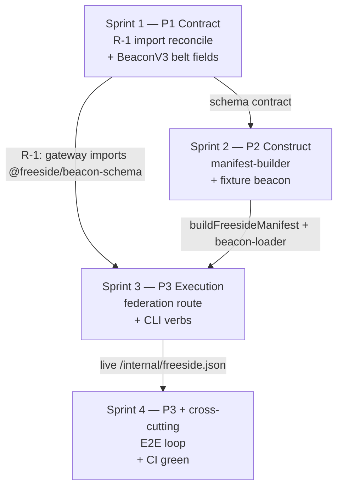

# Sprint Plan: Close the Freeside Discovery Loop

**Version:** 1.0
**Date:** 2026-05-19
**Author:** Sprint Planner Agent
**PRD Reference:** grimoires/loa/prd.md
**SDD Reference:** grimoires/loa/sdd.md
**Cycle:** cycle-049 · codename `discovery-loop`
**Domain:** network — every sprint + the cycle ledger entry carry `domain: network` (ADR-007 §D-3, CI-firewalled via `path-domain-check.yml`)

---

## Executive Summary

This cycle wires together a discovery system whose parts are already scaffolded but inert. The loop `building declares → registry aggregates → endpoint serves → agent queries` has every part except the wiring that runs it. Four sprints close it, proven end-to-end against a `freeside-score` **fixture** beacon (the cross-repo real beacon is out of scope).

The SDD locks four architecture decisions (AD-1..AD-4) and a **hard sprint chain** — *"S1 → S2 → S3 → S4 is a hard chain … No parallelization across sprint boundaries"* (sdd.md:546). The plan honors that chain. It also front-loads **R-1** (SDD §9 / OQ-1 — the `@0xhoneyjar/` vs `@freeside/` package-name split) into Sprint 1, ahead of the SDD's original Sprint-3 placement, because R-1 is the precondition for FR-3: the gateway cannot consume `@freeside/freeside-registry` (which depends on `@freeside/beacon-schema`) while it still imports `@0xhoneyjar/beacon-schema` — a two-name collision in one dependency graph would fail Sprint 3's build.

**Total Sprints:** 4
**Sprint Duration:** 2.5 days each
**Estimated Completion:** 2026-05-29
**Global Sprint IDs:** 396 (S1), 397 (S2), 398 (S3), 399 (S4) — Sprint Ledger `cycle-049`

### Acceptance bar (the binding metric)

> From `prd.md:32`: *"the discovery loop is provably closed end-to-end against a `freeside-score` fixture beacon — registry aggregates the fixture → `/federation.json` serves it → `freeside-cli inspect` returns it validated."*

The cycle is **done** only when the Sprint 4 FR-6 E2E test passes against the fixture beacon and all 9 PRD §8 acceptance criteria are green.

### Locked architecture decisions (SDD §1.2 — not re-litigated here)

| ID | Decision | Sprint that lands it |
|----|----------|----------------------|
| **AD-1** | `freeside-registry` owns the manifest-builder **library**; `apps/mcp-gateway` owns the **HTTP route**. The registry opens no HTTP listener this cycle. | S2 (lib) + S3 (route) |
| **AD-2** | mcp-gateway↔registry seam is a **bridge, not hard-replace**. `tenants.ts` shrinks toward its v0.3 shape; a new registry-fed route is added alongside it. Both coexist. | S3 |
| **AD-3** | `produces`/`consumes` are two new Effect `Schema.Array(Schema.Struct(...))` fields, **hard-replacing** `composes_with` (and `ComposesWith`/`ComposesWithEntry`). `TagReference` is kept. | S1 |
| **AD-4** | The FR-6 harness is an **in-process** test — imports the Hono `app`, calls `app.request()`, no listening socket, no spawned process. | S4 |

---

## Sprint Overview

| Sprint | Theme | Plane | Key Deliverables | Dependencies |
|--------|-------|-------|------------------|--------------|
| 1 | Import Reconciliation + BeaconV3 Belt Fields | P1 Contract | R-1 import reconcile; `produces`/`consumes` fields; `composes_with` removed; schema-version bump; ADR-007 Appendix A reconciled | None |
| 2 | Registry Manifest-Builder + Fixture Beacon | P2 Construct | `buildFreesideManifest`; fixture-aware `beacon-loader`; `freeside-score` fixture beacon; negative fixture | Sprint 1 (schema) |
| 3 | Gateway Federation Route + CLI Verbs | P3 Execution | Live `GET /internal/freeside.json`; gateway↔registry wiring; `inspect`/`doctor` functional | Sprint 2 (manifest-builder) |
| 4 | E2E Discovery Loop + CI Green | P3 + cross-cutting | FR-6 in-process E2E test; E2E goal validation; CI green | Sprint 3 (live route) |

> **Plane note (ADR-008 §D-8):** the Contract/Construct/Execution planes are the cognitive diagnostic, **orthogonal** to the platform/network domain firewall. Every component this cycle is network-domain; the plane labels classify bug source, not domain.

---

## Sprint 1: Import Reconciliation + BeaconV3 Belt Fields

**Duration:** 2.5 days
**Dates:** 2026-05-20 - 2026-05-22
**Scope:** MEDIUM (6 tasks)
**Plane:** P1 — Contract
**Global Sprint ID:** 396 · Sprint Ledger `cycle-049`

### Sprint Goal

Reconcile the stale `@0xhoneyjar/beacon-schema` imports to `@freeside/beacon-schema` (the FR-3 precondition), then land the BeaconV3 belt-field contract — `produces`/`consumes` in, `composes_with` out — so everything downstream validates against the corrected schema.

### Deliverables

- [ ] All `@0xhoneyjar/beacon-schema` references in `apps/mcp-gateway` rewritten to `@freeside/beacon-schema` — gateway builds clean against the canonical name (R-1).
- [ ] `BeaconV3Schema` carries first-class `produces` + `consumes` belt fields; `composes_with`, `ComposesWith`, `ComposesWithEntry` removed entirely.
- [ ] `@freeside/beacon-schema` semver-bumped `0.2.0 → 0.3.0` (breaking).
- [ ] `BeaconV3JsonSchema` export regenerated to match the amended schema.
- [ ] ADR-007 Appendix A spec reconciled with the shipped schema — `composes_with` section replaced by `produces`/`consumes` sections.
- [ ] Schema test suite green, including negative cases for malformed belt names and bad Tag references.

### Acceptance Criteria

- [ ] `grep -r "0xhoneyjar/beacon-schema" apps/mcp-gateway/` returns zero matches in `src/`, `package.json`, `Dockerfile`, `tests/`, and lockfile (R-1 complete).
- [ ] `pnpm build` / `tsc -b` on `apps/mcp-gateway` succeeds with the reconciled import (no two-name collision).
- [ ] `decodeBeaconV3` accepts a beacon with `produces`/`consumes` and accepts a beacon with neither (both default to `[]`).
- [ ] `decodeBeaconV3` does **not** require `composes_with` — a beacon omitting it decodes clean.
- [ ] `decodeBeaconV3` rejects a malformed `produces.belt` (non-kebab) with the SDD's explicit message; rejects a malformed `consumes.tag` failing the `TagReference` pattern.
- [ ] `@freeside/beacon-schema` `package.json` version reads `0.3.0`.
- [ ] ADR-007 Appendix A no longer documents `composes_with`; documents `produces`/`consumes` matching `beacon-v3.ts`.
- [ ] All `tsx --test` cases in `packages/beacon-schema/tests/schema.test.ts` pass.

### Technical Tasks

<!-- R-1 leads — it is the FR-3 precondition. Then FR-1 (the contract). -->

- [x] **Task 1.1 (R-1): Reconcile stale beacon-schema imports.** Rewrite `@0xhoneyjar/beacon-schema` → `@freeside/beacon-schema` across the 4 grounded locations: `apps/mcp-gateway/package.json` (the `workspace:*` dependency entry) and 3 src files — `src/beacon-cache.ts` (1 import), `src/app.ts` (2 imports), `src/beacon-resolver.ts` (1 import). Also update `apps/mcp-gateway/Dockerfile`, `tests/beacon-resolver.test.ts`, and regenerate `pnpm-lock.yaml`. Verify `BeaconV2JsonSchema` (the symbol the gateway pulls) is exported from `@freeside/beacon-schema`. → **[G-4]**
- [x] **Task 1.2 (FR-1): Add belt structs.** In `packages/beacon-schema/src/beacon-v3.ts`, add `ProducesBelt` (`belt` lowercase-kebab pattern, `schema` maxLength 500, `description` maxLength 200) and `ConsumesBelt` (`from` kebab-slug, `belt` kebab, `tag: TagReference` reused, `why` maxLength 200) per SDD §3.1. → **[G-2]**
- [x] **Task 1.3 (FR-1): Amend `BeaconV3Schema`; remove `composes_with`.** Add `produces` / `consumes` as `Schema.optionalWith(Schema.Array(...), { default: () => [] })`. Delete `ComposesWith`, `ComposesWithEntry`, and the `composes_with` field. Keep `TagReference` (now consumed by `ConsumesBelt`). → **[G-2, G-4]**
- [x] **Task 1.4 (FR-1, NFR-5): Bump version + regenerate JSON-schema.** Bump `@freeside/beacon-schema` `0.2.0 → 0.3.0` in `package.json` (breaking change — `composes_with` removal). Regenerate `BeaconV3JsonSchema` via `JSONSchema.make`; confirm `src/index.ts` re-exports it. → **[G-4]**
- [x] **Task 1.5 (FR-1, G-4): Reconcile ADR-007 Appendix A.** Update `decisions/007-loa-freeside-absorption.md` Appendix A — replace the `composes_with` spec with `produces`/`consumes` so the doctrine matches the shipped schema. *(`decisions/` is a shared-domain path — commit scope `shared/adr-007`, not `network/`.)* → **[G-4]**
- [x] **Task 1.6 (FR-1): Schema tests.** Update `tests/schema.test.ts`: positive cases (`produces`/`consumes` accepted; both-absent decodes), negative cases (bad belt name, bad Tag ref), and a regression case asserting `composes_with` is no longer required. → **[G-2]**

### Dependencies

- None — first sprint. Sprint 1 is the contract that S2/S3/S4 all build against.

### Security Considerations

- **Trust boundaries:** No runtime surface in this sprint — schema definitions and a package-name rewrite only. Schema input validation tightens (belt-name + Tag-ref patterns) — a defense the downstream loader relies on.
- **External dependencies:** **Zero new dependencies** (SDD §2.2 — a network-surface cycle under audit rigor must not expand the dependency attack surface). The R-1 rewrite *removes* a phantom package name; it does not add one.
- **Sensitive data:** None.

### Risks & Mitigation

| Risk | Probability | Impact | Mitigation |
|------|-------------|--------|------------|
| R-1: `@0xhoneyjar/` import is not merely stale but a *different* schema shape | Low | Med | The grounded check confirmed `@freeside/beacon-schema` exports the symbols the gateway needs (`BeaconV2JsonSchema`); `@freeside/freeside-registry` already uses `@freeside/`. If a real divergence surfaces, halt and escalate — do not paper over it. |
| OQ-2: `path-domain-check.yml` mis-classifies `apps/mcp-gateway` as platform-domain | Low | High (blocks all PRs) | Confirm the firewall path map treats `apps/mcp-gateway` as network **before** the first Sprint-1 PR. If mis-mapped, a one-line map fix is a `network/`-scope change. |
| `decisions/` cross-domain mismatch — ADR edit + network code in one PR | Med | Med | Task 1.5 uses commit scope `shared/adr-007`. If `path-domain-check` flags the mix, split the ADR edit into its own `shared/`-scoped commit/PR. |

### Success Metrics

- Zero `0xhoneyjar/beacon-schema` references remain in `apps/mcp-gateway`.
- `@freeside/beacon-schema` builds at `0.3.0`; gateway builds clean against the reconciled import.
- 100% of schema test cases pass (positive + negative + `composes_with`-removal regression).

---

## Sprint 2: Registry Manifest-Builder + Fixture Beacon

**Duration:** 2.5 days
**Dates:** 2026-05-22 - 2026-05-25
**Scope:** MEDIUM (5 tasks)
**Plane:** P2 — Construct
**Global Sprint ID:** 397 · Sprint Ledger `cycle-049`

### Sprint Goal

Make `freeside-registry` actually aggregate — replace the stub manifest-builder with a functional one, add a fixture-aware beacon-loader, and author the `freeside-score` fixture beacon that the end-to-end loop runs against.

### Deliverables

- [ ] `buildFreesideManifest(registry, beaconLoader, visibilityFilter)` — functional, replacing the stub `buildCompactManifest`.
- [ ] `FreesideManifest` / `FreesideModuleEntry` types carrying belts + capabilities + `is_not` (SDD §3.5).
- [ ] New `beacon-loader.ts` — fixture-aware beacon resolution with a `..`-traversal guard and V2/V3 discrimination.
- [ ] `freeside-score` fixture beacon at `packages/freeside-registry/tests/fixtures/freeside-score.beacon.yaml`, validating against the amended `BeaconV3Schema`.
- [ ] A deliberately-malformed negative fixture beside it, proving skip-not-crash and the `doctor` `error` path.
- [ ] `registry.yaml` carries a `freeside-score` entry with the optional `beacon_fixture` field.

### Acceptance Criteria

- [ ] `freeside-score.beacon.yaml` decodes clean against `BeaconV3Schema` — both the V3-delta belt fields **and** the `BeaconV2Schema` base struct (`schema_version`, `auth`, `upstream`, `mcp` shape) validate (AC-3).
- [ ] `buildFreesideManifest` aggregates the fixture into a `FreesideManifest` with `version: 2`, `scope: "internal"`, and `freeside-score`'s 3 `produces` belts + 1 `consumes` belt present.
- [ ] `beacon-loader` prefers `beacon_fixture` over `beacon_url` when both are present on a `ModuleEntry`.
- [ ] `beacon-loader` rejects a `beacon_fixture` path that `..`-traverses outside `packages/freeside-registry/` — `realpath` + REPO_ROOT containment, rejection before any file read.
- [ ] A V2 beacon is detected and tagged `legacy` (not silently coerced, not crashed) — NFR-1.
- [ ] The malformed negative fixture is **skipped** by `buildFreesideManifest` with a `console.warn`, not crashed; the rest of the manifest still builds.
- [ ] All `tsx --test` cases in the new `manifest.test.ts` and `beacon-loader.test.ts` pass.

### Technical Tasks

- [x] **Task 2.1 (FR-2): Manifest-builder.** In `packages/freeside-registry/src/registry.ts`, define `FreesideManifest` (`version: 2`, `generated_at`, `scope: "internal"`, `modules`) and `FreesideModuleEntry` (`slug`, `one_liner`, `is_not`, `produces`, `consumes`, `capabilities`, `visibility`) per SDD §3.5. Replace stub `buildCompactManifest` with `buildFreesideManifest`. A beacon that fails decode is skipped + `console.warn`, never coerced. → **[G-1, G-2]**
- [x] **Task 2.2 (FR-2, AD-4): Fixture-aware `ModuleEntry`.** Add the optional `beacon_fixture` field to `ModuleEntry` (SDD §3.3). Add a `freeside-score` entry to `registry.yaml` with `beacon_fixture: tests/fixtures/freeside-score.beacon.yaml` (registry-package-relative). The existing 6 remote entries are unaffected (`beacon_fixture` optional). → **[G-1, G-3]**
- [x] **Task 2.3 (FR-2, NFR-4): Beacon-loader.** New `src/beacon-loader.ts` — `loadBeacon` prefers `beacon_fixture`, falls back to `beacon_url`. `realpath`-resolve + REPO_ROOT-containment + `..`-substring rejection on the fixture path (SDD §3.3 path-safety, mirrors the L7 pattern). Discriminate on in-YAML `schema_version`: `"3"` → `decodeBeaconV3`; absent/`"2"` → tag `legacy`, surface, no silent coerce. → **[G-1]**
- [x] **Task 2.4 (FR-5): Author the fixture beacon.** Write `tests/fixtures/freeside-score.beacon.yaml` to PRD Appendix A shape (`prd.md:154-193`) — `produces: [wallet-scores, rank-changes, factor-metadata]`, `consumes: [freeside-sonar/chain-events]`, `capabilities.tools`, `visibility: internal`, `cycle_state.status: active`. Verify the full `V2 ∪ V3` struct decodes (SDD §3.4 — the V2-base completeness check). Author the malformed negative fixture beside it. → **[G-2, G-3]**
- [x] **Task 2.5 (FR-2, FR-5): Unit tests.** New `tests/manifest.test.ts` (aggregation, `version: 2`, `scope`, belts present, malformed-skip) and `tests/beacon-loader.test.ts` (`beacon_fixture` preferred, `..`-traversal rejected, V2 → `legacy`). Add a fixture-decode test asserting AC-3. → **[G-2]**

### Dependencies

- **Sprint 1** — the fixture beacon must validate against S1's amended `BeaconV3Schema`; `beacon-loader` calls S1's `decodeBeaconV3`. Hard dependency (SDD §8).

### Security Considerations

- **Trust boundaries:** `registry.yaml` is repo-controlled but treated as **untrusted-at-load-time** (NFR-4 audit rigor) — the `beacon_fixture` path gets the `realpath` + containment guard before any file read. Beacon YAML is decoded through `Schema.decodeUnknown`; malformed input fails the decode and never reaches the manifest.
- **External dependencies:** Zero new dependencies — `yaml` and `effect` are already in the workspace.
- **Sensitive data:** None. The fixture loop reads in-repo files only; no network access.

### Risks & Mitigation

| Risk | Probability | Impact | Mitigation |
|------|-------------|--------|------------|
| R-5: V2 beacon silently breaks (NFR-1 forbids it) | Low | Med | Explicit `legacy` tagging + the negative fixture proves a V2/malformed beacon surfaces, never silently drops. |
| Fixture not V2-base-complete — decodes V3 fields but fails the base struct | Med | Med | Task 2.4 explicitly verifies the full `V2 ∪ V3` decode (SDD §3.4), not only the belt-delta fields. |
| `beacon_fixture` path traversal | Low | High | `realpath` + REPO_ROOT containment + `..` rejection, exercised by a beacon-loader test case. |

### Success Metrics

- Fixture beacon decodes clean against `BeaconV3Schema` (V2 base + V3 delta).
- `buildFreesideManifest` produces a `version: 2`, `scope: "internal"` manifest aggregating the fixture's 3+1 belts.
- 100% of `manifest.test.ts` + `beacon-loader.test.ts` cases pass.

---

## Sprint 3: Gateway Federation Route + CLI Verbs

**Duration:** 2.5 days
**Dates:** 2026-05-25 - 2026-05-27
**Scope:** MEDIUM (6 tasks)
**Plane:** P3 — Execution
**Global Sprint ID:** 398 · Sprint Ledger `cycle-049`

### Sprint Goal

Give the manifest a live HTTP surface — wire `apps/mcp-gateway` to the registry and serve `GET /internal/freeside.json` — and make `freeside-cli inspect`/`doctor` functional against it.

### Deliverables

- [ ] `GET /internal/freeside.json` — live, internal-scope, operator-gated, serving the registry-driven `FreesideManifest`.
- [ ] `apps/mcp-gateway` consumes `@freeside/freeside-registry` as a `workspace:*` dependency.
- [ ] `tenants.ts` shrunk per the AD-2 bridge — additive only, no destructive rewrite.
- [ ] `freeside-cli inspect <slug>` functional — fetches the beacon through the live manifest, validates against `BeaconV3Schema`, pretty-prints.
- [ ] `freeside-cli doctor` functional — real `DoctorFinding`s, correct exit codes, exits clean on the fixture set.

### Acceptance Criteria

- [ ] `GET /internal/freeside.json` returns `401 { "error": "unauthorized" }` without a valid operator token; returns `200` + a valid `FreesideManifest` with the token (AC-4).
- [ ] The 200 response aggregates the `freeside-score` fixture with its belts + capabilities + `is_not` (AC-5).
- [ ] A single building's beacon failing to decode does not 500 the endpoint — it is skipped with a `console.warn`; a builder-level failure (registry unparseable) returns `500 manifest_build_failed`.
- [ ] The route reuses the **existing** `isAuthorizedOperator(c)` gate — no new auth code (SDD §1.9).
- [ ] `tenants.ts` diff is additive/shrink-only — the `/codex/*` proxy routes and the health-probe loop are untouched and still pass their existing tests.
- [ ] `freeside-cli inspect freeside-score` returns the validated V3 beacon fetched through the live manifest, pretty-printed; an invalid beacon exits non-zero with the decode error (AC-6).
- [ ] `freeside-cli doctor` runs against the fixture set, emits `ok`/`warn`/`error` findings, and **exits `0`** on the fixture set (`freeside-score` only) — `1` only on an injected `error` finding (AC-7).
- [ ] The gateway-route integration test (`tsx --test` + Hono `app.request()`) and CLI unit tests pass.

### Technical Tasks

- [x] **Task 3.1 (FR-3, AD-1): Wire registry into the gateway.** Add `@freeside/freeside-registry` as a `workspace:*` dependency in `apps/mcp-gateway/package.json`. Create `src/freeside-manifest.ts` with `buildFreesideJson()` delegating to the registry's `buildFreesideManifest`. *(R-1 already resolved in Sprint 1 — the gateway now imports `@freeside/beacon-schema`, so adding `@freeside/freeside-registry` introduces no name collision.)* → **[G-1]**
- [x] **Task 3.2 (FR-2, FR-3, NFR-3, NFR-4): Add the federation route.** In `src/app.ts`, add `app.get("/internal/freeside.json", ...)` behind `isAuthorizedOperator`, delegating to `buildFreesideJson()`. Distinct path from the existing `/internal/federation.json` (MCP-tenant manifest) — distinct schema, no semantic merge (SDD §3.6). Error responses follow the gateway's flat `{ "error": "..." }` convention. → **[G-1]**
- [x] **Task 3.3 (FR-3, AD-2): Bridge `tenants.ts`.** Shrink `tenants.ts` per the README v0.3 direction — **only** the curator-fallback fields the new route makes redundant. Keep every field the codex/score MCP proxy + health-probe still need. Additive bridge, no full v0.3 rewrite (R-2 scope gate). → **[G-1]**
- [x] **Task 3.4 (FR-4): `inspect` functional.** In `packages/freeside-cli/src/verbs/inspect.ts`, implement `inspectModule(slug)` — `loadRegistry` confirms the slug; `GET {gateway}/internal/freeside.json` (operator-gated) locates the entry; resolve the full beacon via the registry `beacon-loader`; `decodeBeaconV3`; pretty-print. Gateway base URL from `FREESIDE_GATEWAY_ORIGIN`, token from `OPERATOR_API_KEY` (SDD §4.1). → **[G-3]**
- [x] **Task 3.5 (FR-4): `doctor` functional.** In `verbs/doctor.ts`, implement `doctor()` — per module: `loadBeacon` → decode (V3 or detect V2-legacy) → resolve `consumes.tag` references → check `cycle_state.next_review` → emit `DoctorFinding` with the SDD §4.2 severity matrix. Exit `1` only on an `error` finding; `warn`/`ok` exit `0`. → **[G-3]**
- [x] **Task 3.6 (FR-2, FR-4): Route + CLI tests.** New `apps/mcp-gateway/tests/freeside-manifest.test.ts` (401 without token, 200 + valid `FreesideManifest`, malformed-skip). CLI unit tests — `inspect` validates + pretty-prints; `doctor` exits `0` on the fixture set, `1` on an injected `error` finding. → **[G-1, G-3]**

### Dependencies

- **Sprint 2** — the route consumes S2's `buildFreesideManifest`; `inspect`/`doctor` consume S2's `beacon-loader`. Hard dependency (SDD §8).
- **Sprint 1 (R-1)** — the gateway must already import `@freeside/beacon-schema`; without R-1, Task 3.1 introduces a two-name collision and the build fails.

### Security Considerations

- **Trust boundaries (NFR-4):** `GET /internal/freeside.json` is a network surface — full implement → review → audit rigor applies even though it is internal-scope. The handler performs no `eval`, no shell-out; beacon YAML is decoded through `Schema.decodeUnknown` before it reaches the manifest. Inputs are operator-supplied registry data + the operator's Bearer token.
- **External dependencies:** One new **workspace** dependency (`@freeside/freeside-registry` via `workspace:*`) — in-repo, not an external package. Zero new external packages.
- **Sensitive data:** `OPERATOR_API_KEY` gates the route via the existing `isAuthorizedOperator`. No new credential handling — the route reuses the `/internal/federation.json` auth precedent. The endpoint is internal-only (NFR-3): no public tier, no per-tenant auth, no D-8 redaction this cycle.

### Risks & Mitigation

| Risk | Probability | Impact | Mitigation |
|------|-------------|--------|------------|
| R-2: `tenants.ts` shrink scope-creep into a full v0.3 rewrite | Med | Med | Bridge is **additive only** — one new route. `tenants.ts` shrinks ONLY where the new route makes a curator field redundant. v0.3's upstream-fetch layer is explicitly out of scope. Review/audit gate on `tenants.ts` diff size. |
| R-3: manifest path collision with `/internal/federation.json` | Low | Med | Distinct path `/internal/freeside.json` + distinct schema `FreesideManifest`. The §11 glossary names both manifests. |
| Federation endpoint security surface (NFR-4) | Med | Med | Internal-only scope; reuse the existing operator gate (no new auth code); full review + audit rigor; public/auth tiers deferred with the surface explicitly named (OQ-4). |

### Success Metrics

- `/internal/freeside.json` serves live: `401` without token, `200` + valid manifest with token.
- `freeside-cli inspect freeside-score` returns the validated V3 beacon through the live manifest.
- `freeside-cli doctor` exits `0` on the fixture set.
- `tenants.ts` diff is shrink/additive-only — no existing route behavior changes.

---

## Sprint 4 (Final): E2E Discovery Loop + CI Green

**Duration:** 2.5 days
**Dates:** 2026-05-27 - 2026-05-29
**Scope:** SMALL (3 tasks)
**Plane:** P3 Execution + cross-cutting
**Global Sprint ID:** 399 · Sprint Ledger `cycle-049`

### Sprint Goal

Complete implementation and prove all PRD goals are achieved end-to-end — the FR-6 in-process E2E test asserts the closed discovery loop against the fixture beacon, and CI goes fully green.

### Deliverables

- [ ] `apps/mcp-gateway/tests/discovery-loop.e2e.test.ts` — the FR-6 closed-loop assertion (AD-4, in-process).
- [ ] `path-domain-check` confirmed network-only; all package builds + every `tsx --test` suite green.
- [ ] Every PRD §8 acceptance criterion (AC-1..AC-9) verified and checked off.

### Acceptance Criteria

- [ ] The FR-6 E2E test runs offline, deterministic, in one process — no network, no spawned gateway, no Railway.
- [ ] The E2E test asserts: fixture beacon → registry aggregation → gateway `/internal/freeside.json` (`200`, fixture present with 3 `produces` + 1 `consumes` belt) → `inspectModule("freeside-score")` returns a beacon `decodeBeaconV3` accepts.
- [ ] The test fails **loudly** if `freeside-score` is skipped from the manifest (the E2E gate is strict even though prod skip-not-crash stays resilient).
- [ ] `path-domain-check.yml` passes — no platform paths (`apps/{gateway,worker,ingestor}`, `infrastructure/`, `packages/{core,adapters,sandbox}`) in any cycle diff.
- [ ] `@freeside/beacon-schema`, `@freeside/freeside-registry`, `@freeside/freeside-cli`, `apps/mcp-gateway` all build clean.
- [ ] All 9 PRD §8 acceptance criteria are verified.

### Technical Tasks

- [x] **Task 4.1 (FR-6, AD-4): Author the E2E harness.** Write `apps/mcp-gateway/tests/discovery-loop.e2e.test.ts` per SDD §7.2 — import the Hono `app`, set `OPERATOR_API_KEY` in test env, `app.request("/internal/freeside.json", { headers: { Authorization: "Bearer test-key" } })`, assert `200` + `freeside-score` present with its belts, invoke `inspectModule("freeside-score")` pointed at the in-process app, assert `decodeBeaconV3` accepts the result. Call `stopBeaconRefresh()` in teardown. → **[G-1, G-2, G-3, G-4]**
- [x] **Task 4.2: CI green sweep.** Confirm `path-domain-check` is network-only across all cycle diffs (no platform paths). Run `pnpm build` / `tsc -b` on all four packages and every `tsx --test` suite; resolve any breakage. → **[G-1, G-2, G-3, G-4]**
- [x] **Task 4.E2E: End-to-End Goal Validation.** See dedicated section below. → **[G-1, G-2, G-3, G-4]**

### Task 4.E2E: End-to-End Goal Validation

**Priority:** P0 (Must Complete)
**Goal Contribution:** All goals (G-1, G-2, G-3, G-4)

**Description:**
Validate that every PRD goal is achieved through the complete implementation, against the `freeside-score` fixture beacon — the binding acceptance bar (`prd.md:32`).

**Validation Steps:**

| Goal ID | Goal (from PRD) | Validation Action | Expected Result |
|---------|-----------------|-------------------|-----------------|
| G-1 | A Loa agent can discover a `freeside-*` building by querying a live federation manifest | `GET /internal/freeside.json` against the running gateway with the operator token | Returns `200`; `modules` contains `freeside-score` with its belts + capabilities |
| G-2 | A building can declare what it *produces* — capability-addressable discovery | Decode `freeside-score.beacon.yaml` against `BeaconV3Schema`; inspect `produces`/`consumes` | Fixture validates; `produces` has 3 belts (`wallet-scores`, `rank-changes`, `factor-metadata`); `composes_with` absent |
| G-3 | The operator can inspect any registered building's beacon against live data | `freeside-cli inspect freeside-score` through the live manifest | Returns the validated BeaconV3 beacon, pretty-printed, exit `0` |
| G-4 | BeaconV3 schema and ADR-008 §D-3 belt doctrine reconciled | Diff `beacon-v3.ts` against ADR-007 Appendix A; check `@freeside/beacon-schema` version | `composes_with` removed; `produces`/`consumes` present; version `0.3.0`; ADR Appendix A matches the schema |

**Acceptance Criteria:**

- [ ] Each goal validated with documented evidence.
- [ ] Integration points verified — data flows fixture → registry → gateway → CLI end-to-end.
- [ ] The FR-6 E2E test passes (the operator-first metric, `prd.md:32`).
- [ ] No goal marked "not achieved" without explicit justification.

### Dependencies

- **Sprint 3** — the E2E test exercises S3's live `/internal/freeside.json` route and the functional `inspect` verb. Hard dependency (SDD §8).

### Security Considerations

- **Trust boundaries:** The E2E test runs in-process with a test `OPERATOR_API_KEY` — no production credentials, no real network surface exposed. The test reads the in-repo fixture only.
- **External dependencies:** Zero new dependencies — `tsx --test` is the existing harness; Hono `app.request()` needs no addition.
- **Sensitive data:** None. The test `OPERATOR_API_KEY` is a throwaway value set in the test env.

### Risks & Mitigation

| Risk | Probability | Impact | Mitigation |
|------|-------------|--------|------------|
| R-6: cross-repo `freeside-score` temptation | Low | Low | The fixture path is the deliberate acceptance choice (`prd.md:128`). The real beacon is PRD §6 out-of-scope. Review gate on scope. |
| `beacon-cache.ts` `setInterval` hangs the test runner | Low | Low | The interval is already `.unref()`'d; the test additionally calls `stopBeaconRefresh()` in teardown (SDD §7.2). |
| Cycle sprawls into deferred ADR-008 §D-8 tiers | Low | Low | §6 out-of-scope table is explicit; review/audit gate on scope creep. |

### Success Metrics

- The FR-6 E2E test passes — the discovery loop is provably closed against the fixture beacon.
- All 9 PRD §8 acceptance criteria green.
- CI fully green: `path-domain-check` (network-only), schema tests, all package builds.

---

## Risk Register (cycle-wide)

| ID | Risk | Severity | Owner sprint | Mitigation |
|----|------|----------|--------------|------------|
| R-1 | `@freeside/` vs `@0xhoneyjar/` package-name split — collision in one dependency graph | High / Med | S1 (Task 1.1) | **Front-loaded to Sprint 1** — resolved before S3 consumes the registry into the gateway. Grounded check confirms canonical name is `@freeside/beacon-schema`. |
| R-2 | `tenants.ts` shrink scope-creep into a v0.3 rewrite | Med / Med | S3 | Additive bridge only; review/audit gate on diff size. |
| R-3 | Manifest path collision (`/internal/freeside.json` vs `/internal/federation.json`) | Low / Med | S3 | Distinct path + distinct schema by design; glossary names both. |
| R-4 / OQ-2 | `path-domain-check` mis-classifies `apps/mcp-gateway` as platform | Low / High | S1 (pre-PR) + S4 | Confirm the firewall path map before the first PR; one-line `network/`-scope map fix if needed. |
| R-5 | V2 beacon silently breaks (NFR-1) | Low / Med | S2 | Explicit `legacy` tagging + negative fixture proves surfacing. |
| R-6 | Cross-repo `freeside-score` temptation | Low / Low | S4 | Fixture path is the deliberate choice; real beacon out-of-scope. |
| R-7 | Breaking schema change (`composes_with` removal) | Low / Low | S1 | Zero external broadcasters; semver bump `0.3.0`; only fixtures consume it. |

### Open questions carried from the SDD

| ID | Status | Resolution gate |
|----|--------|-----------------|
| OQ-1 | **Resolved into R-1 (Sprint 1, Task 1.1)** — canonical name `@freeside/beacon-schema` confirmed by grounded check | Sprint 1 |
| OQ-2 | Open — confirm `path-domain-check.yml` path map classifies `apps/mcp-gateway` as network | Before Sprint 1's first PR |
| OQ-3 | Resolved-by-default — route at `/internal/freeside.json` for auth-gate symmetry; flag for review | Sprint 3 review |
| OQ-4 | Deferred — public-tier + per-tenant-auth federation surface (ADR-008 §D-8/§D-10) | Future network cycle |
| OQ-5 | Deferred — Loa freeside-navigation skill | Future cycle |

---

## Out of Scope (do NOT plan tasks for these)

Per PRD §6 and the cycle arguments — explicit exclusions:

| Deferred item | Why | Where it goes |
|---------------|-----|---------------|
| `freeside-score`'s real `beacon.yaml` | Cross-repo — lives in the `freeside-score` repo | Follow-up cross-repo session |
| Score-API → `freeside-score` consolidation | Cross-repo | Follow-up cross-repo session |
| Public-tier + per-tenant-auth federation (`/federation/{tenant}.json`, D-8 redaction) | Operator-first — internal serves the operator now | Future network cycle (ADR-008 §D-8) |
| The Loa freeside-navigation skill | Premature until the loop is live | Future cycle |
| gaib + `freeside-cli` merge | Cross-owner coordination | Issue #216 → operator-clarity session |

---

## Process Notes

- **Domain:** Every sprint, every commit, and the `cycle-049` ledger entry carry `domain: network` (ADR-007 §D-3, CI-firewalled). Commit scopes use `network/<x>` — **except Task 1.5** (ADR-007 Appendix A edit), which uses `shared/adr-007` because `decisions/` is a shared-domain path. No cross-domain PRs.
- **NFR-4 rigor:** `GET /internal/freeside.json` is runtime code with a security surface — Sprints 3 and 4 get full `/implement → /review-sprint → /audit-sprint` rigor. No micro-fix latitude on the federation route, auth wiring, or the schema contract.
- **Hard sprint chain:** S1 → S2 → S3 → S4 (SDD §8). No parallelization across sprint boundaries — S2's fixture validates against S1's schema, S3's route consumes S2's builder, S4's E2E exercises S3's route.
- **Beads:** Create one epic per sprint and tasks under it; label tasks `domain:network` and `sprint:<n>`. Serialize `br` operations through the team lead if Agent Teams is active.

---

## Appendix A: Sprint Dependency Graph

> Hard chain — no parallelization across sprint boundaries (SDD §8). R-1 (Sprint 1) is a second precondition edge into Sprint 3: the gateway must import `@freeside/beacon-schema` before it can consume `@freeside/freeside-registry`.

## Appendix B: Task Goal Annotations (quick index)

| Task | Goals | Task | Goals |
|------|-------|------|-------|
| 1.1 (R-1) | G-4 | 3.1 | G-1 |
| 1.2 | G-2 | 3.2 | G-1 |
| 1.3 | G-2, G-4 | 3.3 | G-1 |
| 1.4 | G-4 | 3.4 | G-3 |
| 1.5 | G-4 | 3.5 | G-3 |
| 1.6 | G-2 | 3.6 | G-1, G-3 |
| 2.1 | G-1, G-2 | 4.1 | G-1, G-2, G-3, G-4 |
| 2.2 | G-1, G-3 | 4.2 | G-1, G-2, G-3, G-4 |
| 2.3 | G-1 | 4.E2E | G-1, G-2, G-3, G-4 |
| 2.4 | G-2, G-3 | | |
| 2.5 | G-2 | | |

## Appendix C: Goal Traceability Matrix

PRD goals (`prd.md:25-30`) mapped to the tasks that deliver them. Every goal has ≥1 contributing task; every goal is validated by Task 4.E2E.

| Goal ID | Goal (from PRD) | Success Metric | Contributing Tasks | Validated By |
|---------|-----------------|----------------|--------------------|--------------|
| **G-1** | A Loa agent can discover a `freeside-*` building by querying a live federation manifest, not by hardcoded knowledge | `/federation.json` served live, returns ≥1 registered building with belts + capabilities | 2.1, 2.2, 2.3, 3.1, 3.2, 3.3, 3.6, 4.1, 4.2 | Task 4.E2E (G-1 row) + FR-6 E2E test |
| **G-2** | A building can declare what it *produces* — discovery becomes capability-addressable, not name-addressable | BeaconV3 has first-class `produces`/`consumes`; a fixture beacon validates against the amended schema | 1.2, 1.3, 1.6, 2.1, 2.4, 2.5, 4.1, 4.2 | Task 4.E2E (G-2 row) + schema + fixture-decode tests |
| **G-3** | The operator can inspect any registered building's beacon against live data | `freeside-cli inspect freeside-score` returns the validated BeaconV3 beacon through the live manifest | 2.2, 2.4, 3.4, 3.5, 3.6, 4.1, 4.2 | Task 4.E2E (G-3 row) + CLI tests |
| **G-4** | BeaconV3 schema and ADR-008 §D-3 belt doctrine reconciled — no divergence | `composes_with` removed; `produces`/`consumes` present; schema-version bumped; ADR-007 Appendix A matches the shipped schema | 1.1, 1.3, 1.4, 1.5, 4.1, 4.2 | Task 4.E2E (G-4 row) + ADR/schema diff check |

**Coverage check:** All 4 goals (G-1..G-4) have contributing tasks. The final sprint (Sprint 4) includes the E2E goal-validation task (Task 4.E2E, P0). No warnings.

---

*Generated by Sprint Planner Agent — cycle-049 `discovery-loop`, domain: network. Sprint Ledger global IDs 396-399.*
