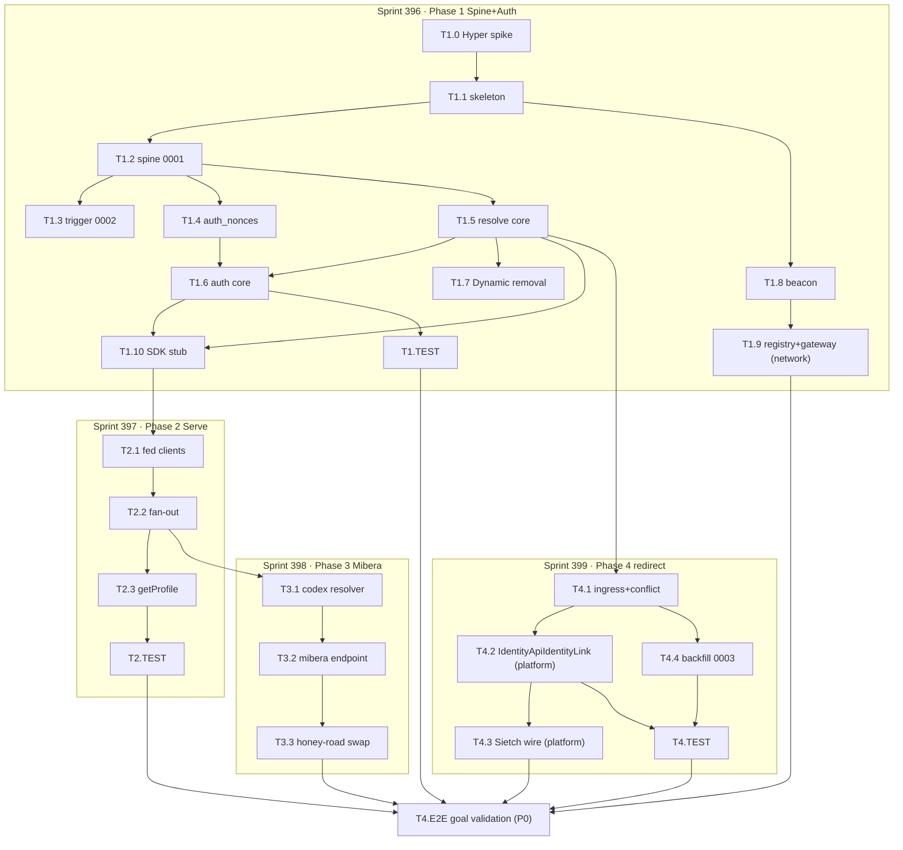

# Sprint Plan — identity-api

## Executive Summary

This plan delivers **identity-api v1** — the single central organ that knows *who a human is* across every freeside world, and serves a composed per-world profile. Scope is **full v1**, delivered in the **locked 4-phase sequence** (PRD §7, SDD §11). The eight operator decisions **D1–D8 are locked** (PRD §3); this plan executes *within* them. The five open questions (PRD §9 / SDD §13) are carried as **named one-file swappable seams**, never as blockers.

| Phase / Sprint | Global ID | Epic (bead) | Goals | Scope | Lands |
|----------------|-----------|-------------|-------|-------|-------|
| **Phase 1 · Spine + Auth** | 396 | `arrakis-zhq2` | G-1, G-2, G-3 | LARGE (12 tasks) | building skeleton + beacon/registry/SDK/MCP + 6-table spine + SIWE/EIP-191 + Hyper sessions + Dynamic removed |
| **Phase 2 · Serve** | 397 | `arrakis-pgoo` | G-5 | SMALL (4 tasks) | compose endpoint (inventory+score+codex) + degraded[] + sealed profile schema |
| **Phase 3 · Mibera** | 398 | `arrakis-eul7` | G-6 (headline) | SMALL (3 tasks) | codex 7-dim resolver + honey-road survey read swap (Alchemy → @0xhoneyjar/identity) |
| **Phase 4 · cycle-c redirect** | 399 | `arrakis-oujo` | G-4 | MEDIUM (6 tasks, incl. E2E) | IdentityLinkPort → identity-api + Sietch wire + midi_profiles backfill + E2E goal validation |

**Headline acceptance bar (G-6):** honey-road renders a holder's 7-dimension Mibera profile (archetype/ancestor/element/tarot/era/molecule/swag + grail-ness) sourced from `@0xhoneyjar/identity`, **not** Alchemy/Dynamic.

> **Grounding posture honored (SDD §0).** (a) `046_wallet_links.ts` is **SQLite** — reused as the *nonce-challenge SHAPE re-expressed as Postgres DDL*, never verbatim (T1.4). (b) inventory SDK / codex / score / midi_profiles are **cross-repo** — tasks are designed against the PRD-cited surfaces, not in-monolith source (T2.1, T3.1, T3.3, T4.4).

---

## Multi-Repo Map (the cross-repo wiring goal)

Tasks span **three repos**. Each bead title carries a `[repo:...]` marker. loa-freeside beads carry the **required `domain:` label** (CLAUDE.md Hard Rule 3, CI-enforced).

| Repo | What lands here | Firewall posture |
|------|-----------------|------------------|
| **identity-api** (NEW) | spine · auth · resolve · serve · Mibera resolver · `@0xhoneyjar/identity` SDK · BeaconV3 · ingress · backfill migration | OUTSIDE loa-freeside's platform/network firewall (it is its own repo / OQ-4). No `domain:` label needed. |
| **loa-freeside** | T1.9 registry entry + mcp-gateway tenant → **`domain:network`** (`arrakis-ll70`). T4.2 IdentityApiIdentityLink + T4.3 Sietch wire → **`domain:platform`** (`arrakis-zedx`, `arrakis-vjjz`) | Domain-labeled. `themes/sietch/*` classifies as **platform** (verified via `tools/lib/domain-classify.sh`); `packages/freeside-registry/*` + `apps/mcp-gateway/*` classify as **network**. **No cross-domain dependency** wired between the network task and the platform tasks (Hard Rule 5). |
| **mibera-honeyroad** (external) | T3.3 honey-road survey swap (`arrakis-cdwx`) · T4.4 backfill *reads* its `midi_profiles` snapshot | external repo; no loa-freeside firewall. |

### Repo-placement decision flag (OQ-4 / PRD §9 Q4 — surface to operator)

**This decision affects where Phase-1 tasks physically land, but changes NO schema/API design** (SDD §13 OQ-4). The plan is authored **placement-agnostic**:

- **Default designed = external `0xHoneyJar/identity-api` from day one** (registry §4.2 shows external `git_url`; cycle-c never ships its direct-PG write — OQ-3 default). Under this, **only T1.9** (registry + gateway tenant, `domain:network`) and the Phase-4 Sietch tasks land in loa-freeside. Everything else lands in the new repo.
- **In-monolith-first variant**: identity-api code lands under a loa-freeside `network`/`shared` commit-scope; `git_url` → loa-freeside path; the firewall (`path-domain-check.yml`) classifies it. Beacon/registry/SDK shapes are identical either way.

> **Operator check:** confirm OQ-4 **before T1.1 (skeleton)**. It does not block planning, but it determines the target repo for ~9 Phase-1 tasks.

---

## Goal → Metric → Acceptance traceability (PRD §1)

Every acceptance criterion below ties to a PRD G-N success metric.

| Goal | PRD success metric (verbatim anchor) | Validated by |
|------|--------------------------------------|--------------|
| **G-1** | "beacon broadcasts a valid V3 doc; building registered in `registry.yaml`; `import { resolveUser } from '@0xhoneyjar/identity'` type-checks; reachable through the mcp-gateway federation manifest" | T1.8, T1.9, T1.10, T1.TEST (`beacon-valid`, `sdk-roundtrip`) · T4.E2E |
| **G-2** | "one human with 2 verified wallets and 2 distinct per-world nyms resolves to a single `user_id` from any of: wallet address, discord id, or (world_slug, nym)" | T1.2, T1.3, T1.5, T1.TEST (`spine-resolution`, `one-primary-per-user`) · T4.E2E |
| **G-3** | "zero Dynamic SDK calls in the auth path; an honey-road session is issued and validated by identity-api; no `NEXT_PUBLIC_DYNAMIC_*` dependency in the login flow" | T1.4, T1.6, T1.7, T1.TEST (`auth-wallet-first` zero-Dynamic grep, `nonce-single-use`) · T4.E2E |
| **G-4** | "a Discord `/verify` completion produces/updates a row in identity-api's spine; the direct `MidiPgIdentityLink` write path is replaced by an identity-api client call" | T4.1, T4.2, T4.3, T4.TEST (`conflict-policy`, `redirect-isolation`, `backfill-idempotent`), T4.4 · T4.E2E |
| **G-5** | "a profile read returns spine fields + composed content; when a downstream building is unreachable the response degrades gracefully (partial, flagged) rather than failing" | T2.2, T2.3, T2.TEST (`downstream-blackout`, `compose-timeout`) · T4.E2E |
| **G-6** | "honey-road renders a holder's 7-dimension Mibera profile … sourced from `@0xhoneyjar/identity`, not Alchemy" | T3.1, T3.2, T3.3 · T4.E2E |

---

## Sprint 396 · Phase 1 — Spine + Auth  (LARGE · 12 tasks)
**Epic:** `arrakis-zhq2` · **Goals:** G-1, G-2, G-3 · **Sequence:** FIRST (locked)

**Sprint Goal:** Stand up identity-api as a freeside building with the central resolution spine and wallet-first auth, fully removing Dynamic from the auth path.

### Deliverables
- [ ] identity-api building exists: `packages/protocol/` (sealed schemas) ↔ `src/api/` (Hyper runtime) per ADR-008 §D-11.2 → **[G-1]**
- [ ] 6-table Postgres spine + primary-wallet trigger live → **[G-2]**
- [ ] SIWE + legacy EIP-191 verify → Hyper JWT/encrypted-cookie sessions + CSRF → **[G-3]**
- [ ] `dynamic_user_id` demoted to a `linked_accounts` row; zero Dynamic SDK in auth path → **[G-3]**
- [ ] BeaconV3 doc + registry entry + `@0xhoneyjar/identity` SDK stub + mcp-gateway tenant → **[G-1]**

### Technical Tasks
| Task | Bead | Repo | Goal | Notes |
|------|------|------|------|-------|
| T1.0 SPIKE: vendor+pin Hyper; prove one-def → runtime+OpenAPI3.1+typed-client+MCP; spike JWT/cookie/CSRF plugins | `arrakis-7n9f` | identity-api | G-1/G-3 | de-risks PRD §8 "Hyper is young" (SDD §2.1, §11.1). **Only unblocked task — the ready frontier.** |
| T1.1 Building skeleton (FR-B1) | `arrakis-zbsr` | identity-api | G-1 | ⟵ T1.0. **Confirm OQ-4 placement here.** |
| T1.2 Spine migration 0001 — 6-table DDL, FK-safe, partial-unique indexes (FR-R*) | `arrakis-vmo4` | identity-api | G-2 | ⟵ T1.1 (SDD §3.2) |
| T1.3 Spine migration 0002 — primary-wallet trigger + one-primary partial unique (FR-R5) | `arrakis-ca51` | identity-api | G-2 | ⟵ T1.2 |
| T1.4 auth_nonces lifecycle — reuse `wallet_link_nonces` **SHAPE** as Postgres DDL (NOT verbatim SQLite) (FR-A1) | `arrakis-91aj` | identity-api | G-3 | ⟵ T1.2. Grounding finding (a): 046 is SQLite. |
| T1.5 Resolve core — resolveByWallet/Account/Nym + getIdentity + setPrimary + endpoints (FR-R1..R6) | `arrakis-232n` | identity-api | G-2 | ⟵ T1.2 (SDD §5.3) |
| T1.6 Auth core — challenge/verify reusing Sietch `SignatureVerifier` (EIP-191) + SIWE; JWT/cookie/CSRF; session middleware (FR-A1..A3) | `arrakis-tptr` | identity-api | G-3 | ⟵ T1.4, T1.5 (SDD §5.2) |
| T1.7 Dynamic removal — `dynamic_user_id` = `linked_accounts` row only; zero Dynamic SDK (FR-A4, NFR-4) | `arrakis-1ma8` | identity-api | G-3 | ⟵ T1.5 |
| T1.8 BeaconV3 doc at `packages/protocol/beacon.yaml`, validated vs `beacon-v3.ts` (FR-B2) | `arrakis-8wlt` | identity-api | G-1 | ⟵ T1.1 (SDD §4.1) |
| T1.9 Registry entry + mcp-gateway tenant | `arrakis-ll70` | **loa-freeside `domain:network`** | G-1 | ⟵ T1.8 (SDD §4.2, §4.4; FR-B3, FR-B5) |
| T1.10 `@0xhoneyjar/identity` SDK stub from Hyper route defs (NOT `@freeside`) (FR-B4, NFR-6) | `arrakis-bhcs` | identity-api | G-1 | ⟵ T1.6, T1.5 (SDD §4.3) |
| T1.TEST spine-resolution · one-primary · auth-wallet-first (zero-Dynamic grep) · nonce-single-use · beacon-valid · sdk-roundtrip | `arrakis-kng6` | identity-api | G-1/2/3 | ⟵ T1.6, T1.5, T1.3 (SDD §10.2) |

### Acceptance Criteria (tied to G-1/G-2/G-3 metrics)
- [ ] `validateBeaconV3(beacon.yaml)` → `{ok:true}`; identity-api appears in `registry.yaml` and `/.well-known/federation.json` **(G-1)**
- [ ] `import { resolveByWallet } from '@0xhoneyjar/identity'` type-checks; client method ↔ route parity **(G-1, NFR-6)**
- [ ] One human, 2 verified wallets + 2 distinct per-world nyms → single `user_id` resolvable from wallet OR discord OR (world, nym) **(G-2, FR-R6)**
- [ ] Exactly one `is_primary=true` per user; setting a new primary clears the prior (partial-unique index + trigger) **(G-2, FR-R5)**
- [ ] SIWE + EIP-191 verify issues a session; `auth-wallet-first` grep assertion finds **zero Dynamic SDK imports** in the auth path **(G-3, NFR-4)**
- [ ] A used/expired nonce is rejected on verify **(FR-A1)**

### Dependencies
- External: Hyper (hyperjs.ai) — spiked T1.0. Sietch `SignatureVerifier` (in-monolith, reused).
- **Blocks:** all later phases gate on this spine + SDK.

### Risks & Mitigation
- **Hyper young / source-distributed** (Med/High): T1.0 sprint-0 spike; vendor+pin; fallback = thin in-repo JWT/cookie/CSRF over Hyper HTTP primitives (SDD §2.1, §12).
- **OQ-4 placement unresolved**: surfaces at T1.1; placement-agnostic design means a wrong default costs only a `git_url` + commit-scope change, no redesign.

### Success Metrics
- Resolve endpoints < 100ms p95 (NFR-1, spine-local PG).
- Zero `NEXT_PUBLIC_DYNAMIC_*` in the login flow (NFR-4).

---

## Sprint 397 · Phase 2 — Serve  (SMALL · 4 tasks)
**Epic:** `arrakis-pgoo` · **Goal:** G-5 · **Sequence:** after Phase 1

**Sprint Goal:** Compose a per-world profile from inventory-api + score-api + codex on read, with the degradation invariant that a downstream outage never fails the read.

### Deliverables
- [ ] `getProfile(user|wallet, world)` composes spine + holdings + score + content, returns `degraded[]` on any miss → **[G-5]**
- [ ] Sealed `profile-shape.schema.json` in `packages/protocol/` consumed by `@0xhoneyjar/identity` → **[G-5]**

### Technical Tasks
| Task | Bead | Repo | Goal | Notes |
|------|------|------|------|-------|
| T2.1 Federation client ports — InventoryClient (`@0xhoneyjar/inventory`) · ScoreClient (verify score-api typed facade per PRD §10) · CodexClient (FR-P3) | `arrakis-ok93` | identity-api | G-5 | ⟵ T1.10. Designed vs cross-repo cited surfaces (grounding finding b). |
| T2.2 Compose fan-out — `Promise.allSettled` + per-source timeouts (T_inv 500/T_score 300/T_codex 400) + `degraded[]` invariant + lightweight circuit-breaker (FR-P2, NFR-1/2, D6) | `arrakis-l06n` | identity-api | G-5 | ⟵ T2.1 (SDD §6) |
| T2.3 `GET /v1/profile` + sealed `profile-shape.schema.json` (FR-P1, FR-P4) | `arrakis-eqxj` | identity-api | G-5 | ⟵ T2.2, T1.5 (SDD §5.4) |
| T2.TEST downstream-blackout · compose-timeout (NFR-2) | `arrakis-wqzd` | identity-api | G-5 | ⟵ T2.3 (SDD §10.2) |

### Acceptance Criteria (tied to G-5 metric)
- [ ] A profile read returns spine fields + composed content **(G-5, FR-P1)**
- [ ] With inventory+score+codex **ALL down**: auth succeeds, resolve succeeds, `getProfile` returns **200** with `degraded:['inventory','score','codex']` — never a 5xx **(G-5, FR-P2, NFR-2, D6)**
- [ ] A slow source past its timeout → `degraded[]` entry; total under the ~900ms ceiling **(NFR-1)**
- [ ] Holdings/score/dimensions are NEVER re-indexed or re-computed here **(FR-P3, PRD §2.3 non-goal)**

### Dependencies
- External cross-repo surfaces: `@0xhoneyjar/inventory` (GOLD baseline), score-api typed facade (verify in this phase), codex MCP/HTTP read.
- Gates on Phase 1 SDK (T1.10).

### Risks & Mitigation
- **Compose fan-out latency / outage** (Med/Med): per-source timeout + `degraded[]` + circuit-breaker; never blocks auth/resolve (SDD §6).
- **score-api facade may not exist as typed SDK** (PRD §10 "typed facade to verify"): T2.1 includes verification; HTTP fallback if no typed client.

### Success Metrics
- Compose profile < 800ms p95 (NFR-1, fan-out bounded by slowest timeout).

---

## Sprint 398 · Phase 3 — Mibera  (SMALL · 3 tasks)
**Epic:** `arrakis-eul7` · **Goal:** G-6 (headline) · **Sequence:** after Phase 2

**Sprint Goal:** Serve a holder's 7-dimension Mibera profile and survey it on the honey road, sourced from identity-api instead of Alchemy.

### Deliverables
- [ ] `getMiberaDimensions(user|wallet)` returns per-token 7-dim + grail (codex-authoritative, verbatim) → **[G-6]**
- [ ] honey-road `lib/alchemy.ts` profile read swapped → `@0xhoneyjar/identity`.`getMiberaDimensions`; survey renders → **[G-6]**

### Technical Tasks
| Task | Bead | Repo | Goal | Notes |
|------|------|------|------|-------|
| T3.1 Codex 7-dim resolver — holdings → Mibera tokenIds → codex traits (archetype/ancestor/element/tarot/era/molecule/swag + grail) verbatim, no re-derive (FR-M1, FR-M3) | `arrakis-8qpm` | identity-api | G-6 | ⟵ T2.2, T2.1 (SDD §5.4) |
| T3.2 `GET /v1/mibera/dimensions` — **single-subject self-view default (OQ-1 / §9 Q1)**; aggregate `queryHolders` is a swappable additive route, NOT a blocker (FR-M1) | `arrakis-g407` | identity-api | G-6 | ⟵ T3.1 (SDD §5.4, §13). **Seam: OQ-1.** |
| T3.3 honey-road survey read swap — `lib/alchemy.ts` → `@0xhoneyjar/identity`.`getMiberaDimensions`; render self-view survey (FR-M2) | `arrakis-cdwx` | **mibera-honeyroad** | G-6 | ⟵ T3.2, T1.10 (SDD §11.3) |

### Acceptance Criteria (tied to G-6 metric)
- [ ] honey-road renders a holder's **7-dimension Mibera profile** (archetype/ancestor/element/tarot/era/molecule/swag + grail-ness) **(G-6, FR-M1)**
- [ ] The data is sourced from `@0xhoneyjar/identity`, **NOT Alchemy** — the `lib/alchemy.ts` profile path is removed/replaced **(G-6, FR-M2)**
- [ ] Grail-ness is surfaced verbatim from codex, never re-derived **(FR-M3)**
- [ ] Survey defaults to **self-view** (OQ-1 (a)) **(§9 Q1)**

### Dependencies
- Gates on Phase 2 compose path (T2.1, T2.2) and Phase 1 SDK (T1.10).
- External: codex (read-only, live `codex` gateway tenant).

### Risks & Mitigation
- **OQ-1 survey semantics**: designed as self-view; aggregate is an additive route reusing the single-subject handler as the per-row builder — one swappable seam, no spine/schema change (SDD §13).

### Success Metrics
- G-6 headline acceptance bar met: the Mibera dimensions profile surveyed on the honey road, identity-api-sourced.

---

## Sprint 399 · Phase 4 — cycle-c redirect  (MEDIUM · 6 tasks incl. E2E)
**Epic:** `arrakis-oujo` · **Goal:** G-4 · **Sequence:** LAST (locked — couples to in-flight cycle-c)

**Sprint Goal:** Redirect cycle-c's verify-completion linkage write from direct-PG-to-`midi_profiles` into an identity-api client call, wire Sietch, and backfill existing `midi_profiles` rows — preserving cycle-c's failure isolation throughout.

### Deliverables
- [ ] `POST /v1/link/verified-wallet` ingress with server-side D8 conflict policy → **[G-4]**
- [ ] `IdentityApiIdentityLink` impl of cycle-c `IdentityLinkPort` replaces `MidiPgIdentityLink` → **[G-4]**
- [ ] Sietch `VerificationService` call-site rebound; verify failure isolation preserved → **[G-4]**
- [ ] `midi_profiles` backfill migration 0003 — idempotent, reversible, row-count-verified → **[G-4]**

### Technical Tasks
| Task | Bead | Repo | Goal | Notes |
|------|------|------|------|-------|
| T4.1 `POST /v1/link/verified-wallet` ingress + **server-side D8/cycle-c FR-L3 conflict policy as a swappable injected strategy** (latest-wins single-axis; hard-fail `cross_user_collision`) — **OQ-2 one-file seam** (FR-C1, FR-C3) | `arrakis-hyde` | identity-api | G-4 | ⟵ T1.5, T1.2 (SDD §5.5, §8.2). **Seam: OQ-2.** |
| T4.2 `IdentityApiIdentityLink` impl of cycle-c `IdentityLinkPort` (tenant_slug→world_slug map) replacing `MidiPgIdentityLink` direct PG write (FR-C1) | `arrakis-zedx` | **loa-freeside `domain:platform`** | G-4 | ⟵ T4.1, T1.10. Couples cycle-c bead `bd-79w9`. |
| T4.3 Wire Sietch `VerificationService` `completeSession` call-site → `IdentityApiIdentityLink` binding; **PRESERVE failure isolation** (link fail ≠ verify rollback, cycle-c NFR-3) (FR-C2) | `arrakis-vjjz` | **loa-freeside `domain:platform`** | G-4 | ⟵ T4.2 (SDD §7.1, §8.1) |
| T4.4 `midi_profiles` backfill migration 0003 (up+down) — idempotent `ON CONFLICT`, reversible via `actor='backfill'` audit marker, row-count-verified vs `mibera-honeyroad/lib/db/schema/index.ts:441-481` (FR-C4, NFR-8) | `arrakis-494b` | identity-api | G-4 | ⟵ T4.1, T1.2 (SDD §8.3). Reads cross-repo snapshot (grounding finding b). |
| T4.TEST conflict-policy · redirect-isolation · backfill-idempotent (SDD §10.2) | `arrakis-ljjq` | identity-api | G-4 | ⟵ T4.2, T4.4 |
| **T4.E2E END-TO-END GOAL VALIDATION (P0)** — all six PRD goals | `arrakis-hito` | identity-api | G-1..G-6 | ⟵ T1.TEST, T1.9, T2.TEST, T3.3, T4.3, T4.TEST |

### Acceptance Criteria (tied to G-4 metric)
- [ ] A Discord `/verify` completion produces/updates a row in identity-api's spine **(G-4, FR-C2)**
- [ ] The direct `MidiPgIdentityLink` write path is replaced by an identity-api client call **(G-4, FR-C1)**
- [ ] Link failure does **NOT** roll back the Sietch verify (failure isolation, cycle-c NFR-3) **(FR-C2)**
- [ ] Conflict: latest-wins on single-axis change; third-party already-claimed pair → `cross_user_collision` 409 **(D8, FR-C3)**
- [ ] Backfill run twice = identical row counts; down migration reverses only `actor='backfill'` rows **(NFR-8)**

### E2E Goal Validation (T4.E2E, P0 — `arrakis-hito`)
| Goal | E2E validation step |
|------|---------------------|
| G-1 | beacon valid + registered + SDK type-checks + reachable through mcp-gateway federation manifest |
| G-2 | one human, 2 wallets, 2 nyms → single `user_id` from wallet OR discord OR (world, nym) |
| G-3 | session issued + validated by identity-api; zero Dynamic SDK in auth path; no `NEXT_PUBLIC_DYNAMIC_*` in login |
| G-4 | `/verify` completion writes a spine row; `MidiPgIdentityLink` direct write replaced |
| G-5 | profile read degrades (200 + `degraded[]`) under downstream outage, never 5xx |
| G-6 | honey-road renders 7-dim Mibera profile from `@0xhoneyjar/identity`, not Alchemy |

### Dependencies
- **Couples to in-flight cycle-c** (existing open beads `bd-79w9` IdentityLinkPort/MidiPgIdentityLink, `bd-sz4u` VerificationService wire-in). Sequenced LAST by design (PRD §7, risk mitigation §8).
- Cross-repo (non-firewall): T4.2/T4.3 (loa-freeside platform) depend on T4.1 (identity-api) — a cross-*repo* dep, NOT a cross-*domain* loa-freeside dep, so Hard Rule 5 is satisfied. No dependency wired between T1.9 (network) and T4.2/T4.3 (platform).

### Risks & Mitigation
- **Redirect couples two cycles → deadlock** (Med/Med): sequence LAST; keep cycle-c direct-write as cutover fallback (cycle-c D3 V2). **OQ-3** (sequencing) is an ops choice — the §8 design works either way (SDD §13).
- **`midi_profiles` backfill data loss** (Low/High): idempotent + reversible + row-count-verified; `actor='backfill'` audit marker scopes the down migration so it never reverses a live-verify row (NFR-8).
- **midi schema cross-repo drift** (Low/Med): backfill reads a *snapshot* (not a live coupling); validate columns vs the PRD-cited `lib/db/schema/index.ts:441-481` at backfill time.

### Success Metrics
- Idempotency: re-linking the same (wallet,user)/(account,user) is a no-op (NFR-7).
- Auditability: every link/unlink/primary-change/conflict emits an audit event (NFR-5).

---

## Swappable Seams (PRD §9 / SDD §13 — confirm-points, not blockers)

Each open question is a **named one-file seam**. None blocks delivery; defaults shipped, alternative absorbed by the named change.

| # | Question | Default shipped | Named one-file seam | Confirm by |
|---|----------|-----------------|---------------------|-----------|
| **OQ-1** | "Survey" semantics (G-6) | self-view — `getMiberaDimensions` single-subject (T3.2) | add aggregate `GET /v1/mibera/holders` reusing the single-subject handler as per-row builder; no spine/schema change | Phase 3 (additive after) |
| **OQ-2** | Cross-user collision policy (D8) | latest-wins + hard-fail `cross_user_collision` (T4.1) | swap the single injected conflict-resolver strategy function; tests parametrize on strategy | **before Phase 4** |
| **OQ-3** | Redirect sequencing (G-4) | identity-api lands first; cycle-c targets it from start | ships-then-redirects path uses the same §8 design; direct-write stays as cutover fallback | ops choice (either path) |
| **OQ-4** | Repo placement (ADR-007 scope) | external `0xHoneyJar/identity-api` from day one | in-monolith variant: `git_url` → loa-freeside path + network/shared commit-scope; firewall classifies; shapes identical | **before T1.1 skeleton** |
| **OQ-5** | `worlds` source-of-truth | seed `worlds` at deploy (THJ + mibera-world) | runtime-query variant: `worlds` becomes a TTL cache of freeside-worlds registry; FK target unchanged | Phase 1 (v1 seed sufficient) |

---

## Appendix A · Beads Task Graph

- **Cycle:** `cycle-046` · **ledger sprints:** 396–399 (global) · **bead prefix:** `arrakis-` · **cycle label:** `cycle:identity-api`
- **29 issues:** 4 epics + 24 tasks + 1 E2E (P0). Domain labels applied to the 3 loa-freeside beads.
- **Ready frontier:** only **T1.0 (`arrakis-7n9f`, Hyper spike)** is unblocked — everything else gates behind it. Walk the graph forward as tasks close (`br ready --limit 200`).
- Query: `br list --json | jq '.issues[] | select(.labels[]? == "cycle:identity-api")'`

## Appendix B · Self-Review Checklist
- [x] All MVP features from PRD §2.1 accounted for (spine, auth, Dynamic removal, serve, Mibera, redirect)
- [x] Sprints build logically (spine+SDK → serve → Mibera → redirect); sequence locked per PRD §7 / SDD §11
- [x] Each sprint feasible as one iteration (LARGE 12 / SMALL 4 / SMALL 3 / MEDIUM 6)
- [x] Deliverables + acceptance criteria are checkboxed and testable
- [x] Technical approach aligns with SDD (every task cites an SDD §)
- [x] Risks identified with mitigation per sprint (traced to PRD §8 / SDD §12)
- [x] Dependencies explicit; cross-repo vs cross-domain distinction honored (Hard Rule 5)
- [x] All six PRD goals mapped to tasks (traceability table + per-task `[G-N]`)
- [x] E2E validation task in the final sprint (T4.E2E, P0)
- [x] Two grounding findings honored: (a) 046 SQLite→Postgres shape-reuse (T1.4); (b) cross-repo surfaces designed-against (T2.1, T3.1, T3.3, T4.4)
- [x] §9/§13 open questions kept as named swappable seams, not blockers
- [x] Sprints registered in the Sprint Ledger (cycle-046, 396–399)
- [x] loa-freeside beads carry required `domain:` labels (CI Hard Rule 3)
