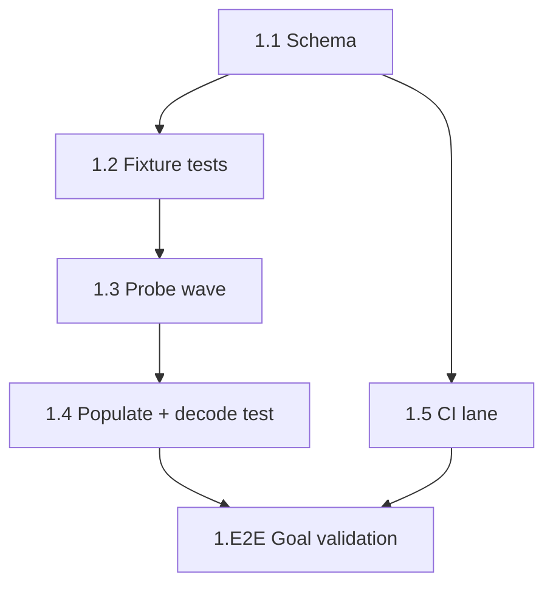

# Sprint Plan — Cadence Ledger: the Liveness Expectation Record

> Cycle: **cadence-ledger** · Domain: **network** (`packages/freeside-registry` +
> one domain-unclassified CI workflow file) · One sprint, ONE PR (SDD §9).
> Previous cycle archived: `sprint.prev-2026-07-04-autopoiesis.md` (merged #437).

---
status: planned
created: 2026-07-04
prd: grimoires/loa/prd.md
sdd: grimoires/loa/sdd.md
cycle: cycle-cadence-ledger
sprints: [410]
---

## Executive Summary

Deliver ADR-012 Phase 0, extended with the staleness dimension: two additive
optional blocks (`service`, `expectations[]`) on `ModuleEntry` in
`packages/freeside-registry`, a live-probe-verified `registry.yaml` population
(7 service blocks incl. `ordering` per operator-resolved OQ-1; sonar's two
expectation entries), decode-time validation with teeth, and a real PR-time CI
lane running both the registry and freeside-cli suites.

> From sdd.md §9: "Single sprint, one PR (all paths network-domain or
> unclassified)" — phases ordered schema → probe wave → populate → CI lane.

**Total: 1 sprint (global #410), MEDIUM scope (6 tasks), one network-domain PR.**

Operator-resolved decisions carried in:
- **OQ-1 = YES**: `ordering` gets a `service` block (`/healthz`, 200, `{"ok":true` per its own registry note), joining the probe wave.
- gh-workflow `probe_kind` deliberately excluded from the union (FR-3).
- Consumers frozen: zero `packages/freeside-cli` source changes, zero loa-cli changes.

---

## Sprint 410 (local: S1) — Declare the Liveness Contract

**Scope**: MEDIUM (6 tasks)
**Domain**: network (single PR; `registry-cli-tests.yml` is domain-unclassified per `tools/lib/domain-classify.sh:20-21`, verified in SDD frontmatter)
**Sprint Goal**: The registry declares, validates, and CI-gates the cluster's health + cadence expectations — additively, with every hand-typed value carrying live-probe provenance.

### Deliverables

- [x] `ServiceBlock` + `Expectation` discriminated union (+ filters) added to `packages/freeside-registry/src/registry.ts`; types exported from `src/index.ts`
- [x] Fixture test suites: `tests/service-block.test.ts`, `tests/expectations.test.ts`
- [x] Probe log for all 7 declare-candidates + sonar endpoint/projection verification (in PR body)
- [x] `registry.yaml` populated: 7 `service` blocks, sonar `expectations` (chain-lag + svm-reconcile if verified), notes updates, schema-comment block updated
- [x] `tests/registry-decode.test.ts` (full real-registry decode + tripwires)
- [x] `.github/workflows/registry-cli-tests.yml` running both package suites on PRs

### Acceptance Criteria

- [x] **G-1**: `service: {deployment_url, health_path, expected_status, auth_class, expected_body_marker}` (+ `probed_at`, `probe_source`) decodes in the Effect Schema; declared cells populated from live-probed values
- [x] **G-2**: score-api declares `/v1/health` (live-resolved, SDD D-8); tripwire test proves `health_path` is never `/` with `expected_status: 302`
- [x] **G-3**: `expectations[]` union (`http` | `graphql-lag` | `event-max-age`) decodes; sonar carries the chain-lag entry with all six SCALE.md threshold keys (`1`, `10`, `42161`, `8453`, `80094`, `7777777`)
- [x] **G-4**: `packages/freeside-cli` test suite green with **zero source/test changes** there; absent blocks remain valid; CI lane enforces this at merge time
- [x] **G-5**: malformed kind (`gh-workflow`), missing cadence, bad ref/duration pattern, duplicate refs, empty thresholds each fail decode loudly (red fixture tests prove it)
- [x] Existing suites still green: `beacon-loader.test.ts`, `worldline-score-api-registry.test.ts`
- [x] `tools/check-beacon-domain.sh --since main` reports single-domain
- [x] NFR-4: `packages/freeside-registry/package.json` dependency list unchanged

### Technical Tasks

- [x] **Task 1.1 — Schema additions** → **[G-1, G-3, G-5]**
  Add to `packages/freeside-registry/src/registry.ts` per SDD §4.1–4.2 (exact shapes specified there): `AuthClass`, `IsoDate`, `Duration`, `RefSlug` refinements; `ServiceBlock` (5 probe.mjs fields + `probed_at`/`probe_source`, `deployment_url` required in-block per D-1); `HttpExpectation` / `GraphqlLagExpectation` / `EventMaxAgeExpectation` union on `probe_kind` (gh-workflow ABSENT, D-2); `Expectations` array with unique-`ref` filter; both blocks `Schema.optional` on `ModuleEntry`; struct-level filter `service.deployment_url === entry.deployment_url` (D-6 — if `Schema.filter` composition is awkward, fall back to asserting the invariant in `registry-decode.test.ts` per §4.2 note). Export `ServiceBlock`, `Expectation` + member types from `src/index.ts` (§4.3).
  > From sdd.md §4.2: "Every schema change is `Schema.optional(...)` on `ModuleEntry`; no field is removed or retyped (NFR-2)."

- [x] **Task 1.2 — Fixture tests (red → green with 1.1)** → **[G-3, G-5]**
  `tests/service-block.test.ts`: valid block decodes; each invalid variant (missing field, bad path/status/auth_class, missing provenance) throws; blockless entry valid; deployment_url mismatch throws. `tests/expectations.test.ts`: valid http/graphql-lag/event-max-age fixtures decode; **`gh-workflow` fails**; unknown kind fails; malformed cadence/ref fails; duplicate refs fail; empty thresholds fail; absent array valid. Fixtures in `tests/fixtures/` beside `sample-beacon-v3.yaml`; assert against the **shared production schema import**, never a test-local copy (fixture-tautology guard, SDD §8.1).

- [x] **Task 1.3 — Live probe wave** → **[G-1, G-2]**
  Re-probe all 7 declare-candidates (activities, identity, inventory, sonar, storage, score, **ordering** per OQ-1=YES): URL, status, body head, date → probe log for PR body (SDD §8.4 — probe output is ambient, never baked into unit tests). Specifically: (a) resolve inventory's expected-stale appendix value (`/` 401 static-key vs `-3f25` deployment's open `/health` 200 — live probe DECIDES, record which won); (b) confirm score-api `GET /v1/health` still 200 with `"service":"score-api"` (re-verify the 2026-07-05 design-time probe); (c) resolve OQ-2 — one live `chain_metadata` query against belt-gateway (`https://belt-gateway-production.up.railway.app/v1/graphql`), falling back to `indexer.hyperindex.xyz/<current-deployment-id>`; whichever answers is declared data; (d) verify sonar's SVM reconcile freshness projection against the live GraphQL schema — `svm_run_marker.updated_at` is an [ASSUMPTION]; **verify-or-omit** (D-9), never guess.
  > From prd.md FR-2: "If no stable liveness path exists, declare nothing and record why in the cell's `notes`."

- [x] **Task 1.4 — Populate registry.yaml + full-decode test** → **[G-1, G-2, G-3]**
  Per SDD §5.1 decision table: `service` blocks for the 7 cells (values from Task 1.3 probes, each with `probed_at: <probe date>` + `probe_source`); NO block for mint-api / events-api / mediums-api / ledger-api (derive-from-absence, D-7). Sonar `expectations`: `chain-lag` (graphql-lag, cadence 15m, owner zerker, six thresholds per §5.3) + `svm-reconcile` (event-max-age, cadence 6h, max_age 26h) **only if** the projection verified in 1.3, else omit + note the gap in sonar's cell notes. Update score-api notes with the 302→/v1/health resolution trail; update the schema documentation comment block (`registry.yaml:8-19`) — the stale `# Live-probe state` header is NOT touched (D-11). Add `tests/registry-decode.test.ts`: real registry.yaml full-decodes; every `service` block carries `probed_at`; sonar has ≥1 expectations entry with the six chain-lag keys; score-api anti-transcription tripwire (§8.1); `version: 1` unchanged.

- [x] **Task 1.5 — CI lane** → **[G-4]**
  `.github/workflows/registry-cli-tests.yml` per SDD §8.3: PR trigger on `packages/freeside-registry/**`, `packages/freeside-cli/**`, and the workflow file itself; standalone per-package install (mirrors cluster-compliance, no workspace), **freeside-cli installs AFTER freeside-registry** so the `file:` dep copies the updated schema (stale-copy hazard); run both `npm test` suites. Lane acceptance: a deliberately-broken fixture on a scratch branch goes red; this PR's branch goes green.

- [x] **Task 1.E2E — End-to-End Goal Validation (P0)** → **[G-1, G-2, G-3, G-4, G-5]**
  - G-1: decode the real registry.yaml; assert the declared cells' `service` fields match the probe log.
  - G-2: `git grep` proves no `expected_status: 302` under score-api; tripwire test green.
  - G-3: sonar's chain-lag entry decodes with all six threshold keys; `expectations[]` types importable from `@freeside/freeside-registry`.
  - G-4: `cd packages/freeside-cli && npm test` green; `git diff --stat main -- packages/freeside-cli` shows zero changes; CI lane ran on the PR and is green.
  - G-5: run the invalid-fixture suite; every negative case red-fails decode.
  - Firewall: `tools/check-beacon-domain.sh --since main` → single-domain network.

### Dependencies

- Task order: 1.1 → 1.2 (same schema step, test-first pairing) → 1.3 → 1.4; 1.5 parallel to 1.3/1.4 but **same PR** (G-4 enforced at merge time, SDD §9).
- External (probe-time): score-api / belt-gateway / the 6 cell deployments reachable for the probe wave. Unreachable cell ⇒ FR-2 discipline: declare nothing + notes.
- No new packages (NFR-4); no loa-cli, gateway, or dash changes (out of scope, PRD §7).

### Risks & Mitigation

| Risk | Mitigation |
|------|------------|
| Appendix values (2026-06-20) drifted — inventory already suspect | Task 1.3 re-probes ALL declared cells; `probed_at`/`probe_source` carry provenance forever (NFR-5, SDD §11) |
| sonar SVM projection assumption wrong | Verify-or-omit in 1.3 (D-9); omission + note still satisfies FR-4's discipline; only yaml data changes if corrected later |
| freeside-cli decode breaks on new fields | Optional-only additions; real-registry consumer test (§8.2) + CI lane (1.5) gate the merge |
| Effect struct-level `Schema.filter` composition friction | Designed fallback: assert the deployment_url-match invariant in `registry-decode.test.ts` (SDD §4.2 note) |
| score-api 302 transcribed by a future hand | Tripwire test in 1.4 makes it a red build permanently |
| ADR-012 rejected after landing | Additive schema + data — revertible in one PR (PRD §8) |

### Success Metrics

- All 3 new test files green; existing registry + freeside-cli suites green with zero consumer changes.
- 7 `service` blocks live in registry.yaml, each with probe-dated provenance; 4 cells correctly blockless.
- ≥1 (target 2) sonar `expectations` entries decode; `gh-workflow` fixture fails decode.
- CI lane demonstrably red-capable (broken-fixture check) and green on the PR.
- `check-beacon-domain.sh` single-domain; zero dependency changes.

---

## Appendix C: Goal Traceability

| Goal | Contributing Tasks |
|------|--------------------|
| G-1 (ADR-012 Phase 0 lands) | 1.1, 1.3, 1.4, 1.E2E |
| G-2 (score-api resolved, not transcribed) | 1.3, 1.4, 1.E2E |
| G-3 (expectations declarative; sonar's 2 entries) | 1.1, 1.2, 1.4, 1.E2E |
| G-4 (consumers keep decoding) | 1.5, 1.E2E |
| G-5 (validation with teeth) | 1.1, 1.2, 1.E2E |

All 5 PRD goals have contributing tasks. Final (only) sprint contains the E2E validation task. ✓

## Appendix A: Task Dependencies

