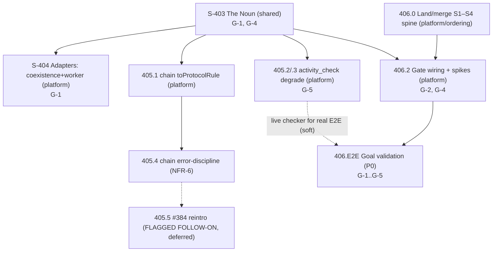

# Sprint Plan: The Eligibility Seam — order intake gated on a reconciled eligibility noun

**Version:** 1.0
**Date:** 2026-06-29
**Author:** Sprint Planner Agent
**Cycle:** `cycle/shadow-audit-runtime-ordering`
**PRD Reference:** grimoires/loa/prd.md (The Eligibility Seam)
**SDD Reference:** grimoires/loa/sdd.md (The Eligibility Seam)
**Domain (ADR-007):** cycle-level `shared`; split per-task — the noun is `shared/`, every adapter + the gate is `platform/`. No PR straddles domains (`.github/workflows/path-domain-check.yml`).
**Prior plan preserved →** `sprint.prev-2026-06-29-order-system.md`.

---

## Executive Summary

This cycle cuts **one seam in two moves** (SDD §1): reconcile the fractured `EligibilityRule` noun, then make it load-bearing at the order-intake gate. The MVP is G-1 (reconcile the noun) → G-2 (gate intake for one product, `audit`) with G-3/G-4/G-5 as invariants (PRD §6).

The sprint structure is dictated by the **ADR-007 domain firewall**: the sealed noun + verdict are `shared/` paths (one PR, lands first — contract before runtime); every inward adapter and the gate are `platform/` paths. The `chain/` touch is reconciled once — its adapter, the `activity_check` degrade-correctness, and the `chain/` error-discipline pass are bundled into one `chain/` sprint per NFR-6.

**Total Sprints:** 4 (global IDs 403–406) + 1 hard-prerequisite landing task
**Sprint Duration:** 2.5 days each
**Sequencing keystone:** reconcile the noun (S-403, shared) FIRST; all platform work is blocked-by it (platform→shared is the sanctioned dependency direction — only platform↔network blocked-by is forbidden, `ledger-domain-check.yml`).

### Hard prerequisite (operator-confirmed 2026-06-29)

> **[DEP] S1–S4 ordering spine is unmerged on this branch** (commits `267c2122`…`16ac8cced`, domain `platform/ordering`). The eligibility gate has **no intake to gate** without it. **Task 406.0** lands/merges the spine and **blocks** the gate-wiring task (406.2). The gate task carries the G-2 dependency on this landing.

### Flagged follow-on (NOT a blocker this cycle)

> #384's `makeScoreEligibilityChecker` + its `satisfies()` migration + its 11 fail-closed tests are **absent from the working tree** (grounded 2026-06-29: `grep makeScoreEligibilityChecker` → 0 hits; they live only in commit `7b227749`). Per operator decision, G-5 degrade-correctness targets the **LIVE in-tree checker** (`packages/adapters/chain/two-tier-provider.ts`). Reintroducing #384's checker is **Task 405.5 — a flagged follow-on, deferred**, not a cycle blocker.

---

## Sprint Overview

| Sprint | Global ID | Domain | Theme | Key Deliverables | Blocked-by |
|--------|-----------|--------|-------|------------------|------------|
| 1 | 403 | shared (PR-A) | The Noun | `@freeside/eligibility-protocol`: sealed `EligibilityRule`, `ChainId`, threshold union, `EligibilityVerdict` + round-trip/replay/strictness tests | None |
| 2 | 404 | platform (PR-B) | Inward adapters (coexistence + worker) | `toProtocolRule()` ×2 (non-chain sites) + lossless round-trip tests | 403 |
| 3 | 405 | platform (chain/ PR) | The chain/ sprint | chain `toProtocolRule()` + `activity_check` degrade-correctness + `chain/` error-discipline pass (one touch, NFR-6) | 403 |
| 4 | 406 | platform (PR-B) | The Gate | spine-merge prereq + `evaluateIntakeEligibility()` + intake wiring + refusal mapping + ACL pin + E2E | 403 (+ 406.0 spine landing) |

> **PR firewall:** S-403 is shared-only and MUST be its own PR. S-404, S-405, S-406 are platform-only. S-405 is the coupled `chain/` runtime PR (NFR-6). No single PR mixes platform and network paths (none here touch `network/`).

---

## Sprint 1 (403): The Noun — sealed `EligibilityRule` + `EligibilityVerdict`

**Duration:** 2.5 days · **Domain:** `shared` (PR-A) · **Dates:** 2026-06-30 – 2026-07-02

### Sprint Goal
Author the FORK-sealed unified `EligibilityRule` and the `EligibilityVerdict` as pure sealed-Zod nouns in `packages/protocol/eligibility/`, retiring the 3 incompatible local types' authority — the contract that all downstream runtime work binds to.

### Deliverables
- [ ] New package `@freeside/eligibility-protocol` at `packages/protocol/eligibility/` (parallel to `ordering`, `shadow-audit`; classifies as `shared` per `tools/lib/domain-classify.sh`)
- [ ] `EligibilityRuleSchema` + `ChainIdSchema` + threshold discriminated union (SDD §3.2), `.strict()`
- [ ] `EligibilityVerdictSchema` + `EligibilitySourceSchema` (SDD §3.4), `.strict()`
- [ ] Round-trip + replay-safety + strictness test suite (Vitest)

### Acceptance Criteria
- [ ] Canonical `EligibilityRule` sample validates; a `chainId` given as string `"1"` and a smuggled `bigint` field are **both** hard parse failures (FORK-1, FORK-2, `.strict()`) — runnable test
- [ ] `threshold` discriminated union accepts exactly the 4 `kind`s (`balance{minAmount:string}｜score{minScore:number}｜ownership｜activity{minActivity:number}`); `minAmount` is `string`, never `bigint` (NFR-2) — runnable test
- [ ] `EligibilityVerdict.decision` is exactly `eligible｜ineligible｜degraded`; `degraded` is first-class (G-5), never folded into `ineligible` — runnable test
- [ ] Every rule + verdict field survives `JSON.parse(JSON.stringify(x))` snapshot→replay with no `bigint` present (NFR-2 / G-4) — runnable test
- [ ] `tools/lib/domain-classify.sh "packages/protocol/eligibility/src/eligibility-rule.ts"` echoes `shared`

### Technical Tasks
- [ ] Task 403.1: Scaffold `@freeside/eligibility-protocol` (`package.json`, `tsconfig`, `src/index.ts`) mirroring `@freeside/ordering-protocol` layout → **[G-1]**
- [ ] Task 403.2: Author `eligibility-rule.ts` — `ChainIdSchema` (branded EIP-155 int, FORK-1), `EligibilityRuleType` enum (4-variant superset incl `activity_check`), `EligibilityRuleSchema` with the threshold union (FORK-2 string amount), `.strict()` (SDD §3.2) → **[G-1]**
- [ ] Task 403.3: Author `eligibility-verdict.ts` — `EligibilitySourceSchema` (`native｜score_service｜native_degraded`) + `EligibilityVerdictSchema` `.strict()` (SDD §3.4) → **[G-4]**
- [ ] Task 403.4: Round-trip + replay + strictness Vitest suite (SDD §14 rows: round-trip, strictness, replay) → **[G-1, G-4]**

### Dependencies
- None (first sprint; the contract foundation). Blocks all platform sprints.

### Security Considerations
- **Trust boundaries:** the schema IS the trust boundary — `.strict()` + branded `ChainId` reject lossy/smuggled inputs at parse time (fail-closed, NFR-1).
- **External dependencies:** none added — Zod is already used across `packages/protocol/*` (Karpathy ladder: reuse).
- **Sensitive data:** none in the noun; the verdict's `reason` is operator-safe one-line only (full cause stays in private ops, M-8 / SDD §3.4).

### Risks & Mitigation
| Risk | Probability | Impact | Mitigation |
|------|-------------|--------|------------|
| False shared kernel — the 3 legacy semantics secretly diverge | Med | High | The verdict is a **separate** noun from the rule (§3.4) so a future divergence is a schema change, not a silent re-interpretation; round-trip meter in S-404/405 surfaces loss |
| `chainId` brand over-tightens valid legacy data | Low | Med | Brand coercion is applied at the **adapter edge** (S-404/405), not in the noun; the noun stays strict |

### Success Metrics
- 1 new `shared` package; 0 platform/network paths in PR-A
- Test suite green: round-trip + replay + strictness (≥4 assertions, all runnable)

---

## Sprint 2 (404): Inward Adapters — coexistence + worker

**Duration:** 2.5 days · **Domain:** `platform` (PR-B) · **Dates:** 2026-07-02 – 2026-07-04

### Sprint Goal
Provide one-function `toProtocolRule()` anti-corruption adapters for the two **non-chain** legacy sites so they produce the unified noun without a big-bang migration (the chain site is reconciled in S-405 per NFR-6).

### Deliverables
- [ ] `toProtocolRule()` for `packages/adapters/coexistence/shadow-sync-job.ts` (local `EligibilityRule` at `:121`, grounded 2026-06-29)
- [ ] `toProtocolRule()` for `apps/worker/src/repositories/EligibilityRepository.ts` (grounded path — SDD cited `apps/worker/EligibilityRepository.ts:36`; actual is `apps/worker/src/repositories/`)
- [ ] Lossless round-trip tests for both adapters

### Acceptance Criteria
- [ ] coexistence `local → toProtocolRule() → EligibilityRuleSchema → back` round-trips **without loss on `chainId` and `threshold`** (`string` chainId → branded int; `bigint minAmount` → `string`; `minScore` → `kind:'score'`; `nft_ownership` → `kind:'ownership'`) — runnable test (G-1 meter, `eligibility-rule-reconciliation.md:71-75`)
- [ ] worker `local → toProtocolRule() → back` round-trips lossless (`number` chainId → branded; `minBalance:string` → `kind:'balance'`; `ruleType` inferred `token_balance`) — runnable test
- [ ] A non-numeric `chainId` is **rejected** (fail-closed), never silently coerced — runnable test (NFR-1)
- [ ] Nothing downstream binds the local shapes (adapter is the only consumer of the local type)
- [ ] `tools/lib/domain-classify.sh` echoes `platform` for both adapter paths; PR-B touches no `network/` path

### Technical Tasks
- [ ] Task 404.1: `toProtocolRule()` for coexistence (`shadow-sync-job.ts`) per SDD §5 mapping row 1 → **[G-1]**
- [ ] Task 404.2: `toProtocolRule()` for worker (`EligibilityRepository.ts`) per SDD §5 mapping row 3 → **[G-1]**
- [ ] Task 404.3: Round-trip-without-loss Vitest tests for both adapters incl the fail-closed non-numeric `chainId` case → **[G-1]**

### Dependencies
- **Blocked-by Sprint 403** (consumes the shared `EligibilityRuleSchema`). Platform→shared is the sanctioned direction (`ledger-domain-check.yml` forbids only platform↔network).

### Security Considerations
- **Trust boundaries:** adapters sit at the legacy→unified edge; `ChainIdSchema.parse(Number(...))` fail-closes on bad chain ids.
- **External dependencies:** none added.
- **Sensitive data:** none.

### Risks & Mitigation
| Risk | Probability | Impact | Mitigation |
|------|-------------|--------|------------|
| Hidden semantic loss in a mapping | Med | High | The round-trip meter is the test, not a claim — loss fails the assertion |
| worker site path drift (SDD path stale) | Resolved | — | Grounded to `apps/worker/src/repositories/EligibilityRepository.ts` this session |

### Success Metrics
- 2 adapters, each with a passing lossless round-trip test
- 0 downstream binders of the local shapes remaining

---

## Sprint 3 (405): The chain/ Sprint — adapter + degrade-correctness + error-discipline (one touch)

**Duration:** 2.5 days · **Domain:** `platform` (chain/ PR) · **Dates:** 2026-07-04 – 2026-07-07

### Sprint Goal
Touch `packages/adapters/chain/` exactly once (NFR-6): reconcile the chain `EligibilityRule` to the unified noun (contract), make `activity_check` degrade-refuse like `token_balance` in the LIVE in-tree checker (G-5), then run the sequenced `chain/` error-discipline pass (runtime) — in that order.

### Deliverables
- [ ] `toProtocolRule()` for `packages/adapters/chain/two-tier-provider.ts` (local `EligibilityRule` at `:41`/`:47`, already 4-variant)
- [ ] `activity_check` degrade-correctness in the live checker (`two-tier-provider.ts` switches at `:217`, `:331`, `:398`; `native_degraded` source at `:411`)
- [ ] `chain/` error-discipline pass per `context/2026-06-28-chain-error-discipline-fix-spec.md` (`arrakis-kskt`, `7bnk`, `zt17`)
- [ ] Degrade tests pinned alongside the chain checker's existing fail-closed tests

### Acceptance Criteria
- [ ] chain `local → toProtocolRule() → back` round-trips lossless on `chainId` + `threshold` (`id → ruleId`; `parameters.* → threshold` union by `ruleType`; `communityId` carries) — runnable test (G-1)
- [ ] An `activity_check` rule fed to the score-backed path returns a **degrade** (`source: 'native_degraded'`), **not** `false` and **not** a `throw`-as-negative; identical shape to how `token_balance` degrades today — runnable test (G-5 / FR-4)
- [ ] No `default: return false` (or `default: throw`-treated-as-ineligible) silently banks a confident negative for an un-judgeable rule type — grep/test guard (G-5)
- [ ] Error-discipline: over-broad retry (`arrakis-kskt`) is scoped off the eligibility path; the unbounded metric (`7bnk`) is bounded; the swallow-as-negative (`zt17`) returns a degrade, not a fabricated `false` — per the chain spec, runnable tests
- [ ] Sequencing observed: the noun-reconcile commit (405.1) precedes the error-discipline commit (405.4) in the same PR (NFR-6)
- [ ] `tools/lib/domain-classify.sh` echoes `platform` for all `packages/adapters/chain/*` paths; PR touches no `network/` path

### Technical Tasks
- [ ] Task 405.1: `toProtocolRule()` for chain (`two-tier-provider.ts`) per SDD §5 mapping row 2 → **[G-1]**
- [ ] Task 405.2: `activity_check` degrade-correctness in the live in-tree checker — route `activity_check` (and confirm `token_balance`) to the degrade path returning `native_degraded`, never a confident negative (SDD §8.1) → **[G-5]**
- [ ] Task 405.3: Degrade Vitest test — `activity_check` & `token_balance` → degrade marker, never `false`/throw-as-negative; no `default` deny (SDD §14 degrade row) → **[G-5]**
- [ ] Task 405.4: `chain/` error-discipline pass (`arrakis-kskt`/`7bnk`/`zt17`) **sequenced after 405.1** per `context/2026-06-28-chain-error-discipline-fix-spec.md` (NFR-6; spec authored elsewhere, only sequenced here) → **[G-5]**
- [ ] Task 405.5: **[FLAGGED FOLLOW-ON — DEFERRED, NOT a cycle blocker]** Reintroduce #384 `makeScoreEligibilityChecker` + `satisfies()` union-threshold migration + its 11 fail-closed tests (from commit `7b227749`); pin `satisfies()` to read `rule.threshold.kind === 'score' ? …` (SDD §5 row 4). Open only after the live-checker degrade work lands. → **[G-1]** _(deferred)_

### Dependencies
- **Blocked-by Sprint 403** (consumes the shared noun). Within-sprint: 405.4 blocked-by 405.1 (reconcile-then-error-discipline, NFR-6).
- 405.5 is deferred (flagged follow-on); it does not block 405 closure or any other sprint.

### Security Considerations
- **Trust boundaries:** the degrade path is the fail-closed boundary — an un-judgeable rule yields an honest "can't judge", never a fabricated grant or a silent denial (NFR-1, refuse-not-approximate).
- **External dependencies:** none added.
- **Sensitive data:** degradation cause goes to private ops (M-8), not a public surface.

### Risks & Mitigation
| Risk | Probability | Impact | Mitigation |
|------|-------------|--------|------------|
| Touching `chain/` twice (noun then error-discipline split across PRs) | Med | Med | Bundled into one chain/ sprint/PR with enforced sequence (NFR-6) |
| Degrade path regresses to default-deny | Med | High | Grep/test guard forbids `default: return false`; degrade test pins the behavior |
| #384 reintroduction scope-creeps into this cycle | Med | Med | Explicitly flagged-deferred (405.5); not a blocker, opened only post-degrade |

### Success Metrics
- `packages/adapters/chain/` touched in exactly one PR this cycle
- Degrade test green; 0 `default`-deny paths for un-judgeable rule types

---

## Sprint 4 (406, Final): The Gate — intake gated on the eligibility verdict

**Duration:** 2.5 days · **Domain:** `platform` (PR-B) · **Dates:** 2026-07-07 – 2026-07-09

### Sprint Goal
Wire the intake gate so an order is evaluated for eligibility **before** acceptance: eligible proceeds to the saga, ineligible/degraded/error refuse end-to-end via the existing sanitized refusal envelope on the signed JetStream spine — without ordering ever importing shadow-audit.

### Deliverables
- [ ] **[PREREQUISITE]** S1–S4 ordering spine landed/merged (intake exists to gate)
- [ ] `evaluateIntakeEligibility(order, rules, checker): EligibilityVerdict` pure decision function (construct plane, no I/O — SDD §6.2)
- [ ] Gate wired between accept and `placed`; refusal mapping → `orders.lifecycle.failed.v1` + `OrderRefusal` on signed JetStream (SDD §6.3)
- [ ] Resolution-layer spikes resolved (rule source; subject-wallet extraction)
- [ ] ACL test stays green; E2E goal validation

### Acceptance Criteria
- [ ] An `order(audit)` from an **ineligible** requester is refused end-to-end (`failed.v1` + `OrderRefusal{code:'ineligible'}`); an **eligible** requester proceeds to `placed → routing → producing → fulfilled` — runnable test (G-2)
- [ ] `degraded` → refuse with `code:'eligibility_degraded'` (NOT a confident negative); checker-throw / no-rules → refuse with `code:'eligibility_error'` (NFR-1 fail-closed) — runnable tests (G-2 / G-4)
- [ ] The verdict rides the **Hounfour signed envelope** on durable JetStream; it survives snapshot→replay (G-4 / NFR-2) — runnable test
- [ ] `packages/protocol/ordering/src/__tests__/ordering-protocol.test.ts` ACL test stays green — no `from '…shadow-audit'` in ordering/gate sources (G-3 / NFR-4); the gate imports `@freeside/eligibility-protocol` freely (not shadow-audit) — runnable test
- [ ] **[SPIKE — acceptance criterion, not a fork]** Open Question 1 (SDD §15.1) resolved: where the gate sources `EligibilityRule[]` per product — decision documented (MVP `[ASSUMPTION]`: fixed/preset-attached rule set for `audit`; if a lookup is needed, a resolution port is added in-sprint). The chosen path has a runnable test.
- [ ] **[SPIKE — acceptance criterion, not a fork]** Open Question 2 (SDD §15.2) resolved: the **subject wallet** is extracted from the `OrderEnvelope` — `placed_by` is an operator/service identity (`order.ts:23`), not a wallet; decision documented (derive from `inputs` or add a subject field) with a runnable test that the gate judges the correct wallet.
- [ ] `tools/lib/domain-classify.sh` echoes `platform` for gate paths; PR-B touches no `network/` path

### Technical Tasks
- [ ] Task 406.0: **[PREREQUISITE]** Land/merge the S1–S4 ordering spine (commits `267c2122`…`16ac8cced`, `platform/ordering`). Blocks 406.2. → **[G-2]**
- [ ] Task 406.1: `evaluateIntakeEligibility()` pure decision function → `EligibilityVerdict` (SDD §6.2) → **[G-2]**
- [ ] Task 406.2: Wire the gate into intake (between accept and `placed`) + refusal mapping to `failed.v1` + `OrderRefusal` on signed JetStream (SDD §6.3); **resolve OQ1 (rule source) + OQ2 (subject wallet) as in-task spikes** (SDD §15). Blocked-by 406.0. → **[G-2, G-4]**
- [ ] Task 406.3: ACL pin — assert `ordering-protocol.test.ts` stays green and the gate imports only `@freeside/eligibility-protocol` + ordering refusal shape (SDD §10) → **[G-3]**
- [ ] Task 406.E2E: **End-to-End Goal Validation (P0)** — validate every PRD goal: G-1 (round-trip green), G-2 (ineligible refused / eligible saga E2E), G-3 (ACL green), G-4 (verdict replay round-trip; `AccessDecisionRecord` still `.strict()` bands-only — smuggled `score` rejected), G-5 (`activity_check` degrade, no `default` deny) → **[G-1, G-2, G-3, G-4, G-5]**

### Dependencies
- **Blocked-by Sprint 403** (consumes the shared verdict noun) and **Task 406.0** (spine landing — the gate has no intake without it).
- **SHOULD follow Sprint 405** for a live chain checker, but is NOT hard-blocked: the gate is built/tested against the `IEligibilityChecker` interface with a test double (SDD §6.2). 405 is required only for a real-checker E2E.

### Security Considerations
- **Trust boundaries:** the gate is the order-admission boundary — every decision path defaults to refusal (refuse-not-approximate); no code path admits on an unverified/approximated grant (SDD §6.3).
- **External dependencies:** none added — reuses the Hounfour signed-event spine + JetStream.
- **Sensitive data:** the public `failed` topic carries only the operator-safe `OrderRefusal` reason; full diagnostic cause → private ops channel (M-8).

### Risks & Mitigation
| Risk | Probability | Impact | Mitigation |
|------|-------------|--------|------------|
| Spine never lands → no intake to gate (G-2 blocked) | Med | High | 406.0 is an explicit blocking prerequisite task |
| Premature gate — external orderer doesn't exist (Mom-test) | High | Med | Lead with the reconciliation (real fix); the gate's first consumer can be the coexistence checker, not external orders |
| Wallet/rule-source spike balloons into a fork | Med | Med | Scoped as in-task acceptance spikes with MVP fallbacks (fixed rule set; derive wallet from inputs); neither changes the noun/verdict/firewall |
| Gate accidentally imports shadow-audit (G-3 red) | Low | High | ACL test (`ordering-protocol.test.ts:91-101`) pins it green |

### Success Metrics
- Ineligible/degraded/error all refuse E2E; eligible reaches the saga
- ACL test green; verdict replay-safe; `AccessDecisionRecord` unchanged (`.strict()` bands-only)
- 100% of G-1…G-5 validated by Task 406.E2E

---

## Risk Register (cycle-level)

| Risk / Dependency | Impact | Mitigation | Owner sprint |
|---|---|---|---|
| **[DEP]** S1–S4 spine unmerged | No intake to gate | Explicit blocking prereq 406.0 | 406 |
| **[RISK]** False shared kernel | Silent mis-gating | Separate verdict noun + round-trip meter | 403, 404, 405 |
| **[RISK]** Premature gate (no external orderer) | Unconsumed gate edge | Reconciliation leads; coexistence checker as first consumer | 406 |
| **[DEP]** #384 checker absent from tree | G-5 can't pin #384's tests | G-5 retargeted to live in-tree checker; #384 reintro = flagged follow-on 405.5 | 405 |
| **[DEP]** `chain/` double-touch | Two passes over one surface | NFR-6 bundle: one chain/ sprint, reconcile-then-error-discipline | 405 |
| **[RISK]** `AccessDecisionRecord` placement (ordering ACL forbids importing it) | G-3 red | Gate consumes the **shared** verdict, not shadow-audit's record | 406 |

---

## Appendix A: Task Dependency Graph

> platform→shared edges are sanctioned (only platform↔network blocked-by is forbidden, `ledger-domain-check.yml`). 405.5 is deferred (dashed, no blocking edge).

## Appendix B: Domain firewall (ADR-007) — per-sprint classification

| Sprint | Paths touched | `domain-classify.sh` verdict | PR |
|--------|---------------|------------------------------|-----|
| 403 | `packages/protocol/eligibility/*` | `shared` | PR-A (shared-only) |
| 404 | `packages/adapters/coexistence/*`, `apps/worker/*` | `platform` | PR-B (platform-only) |
| 405 | `packages/adapters/chain/*` | `platform` | chain/ PR (platform-only) |
| 406 | ordering service + gate (`packages/adapters/*`, `apps/*`) | `platform` | PR-B (platform-only) |

No sprint touches a `network/` path; no PR straddles platform+network (`path-domain-check.yml` passes).

## Appendix C: Goal Traceability

| Goal (PRD §2) | Contributing tasks | E2E validation |
|---------------|--------------------|----------------|
| **G-1** — sealed unified `EligibilityRule` + inward adapters | 403.1, 403.2, 403.4, 404.1, 404.2, 404.3, 405.1, (405.5 deferred) | 406.E2E (round-trip green) |
| **G-2** — intake gates on a verdict; ineligible → refusal | 406.0, 406.1, 406.2 | 406.E2E (ineligible refused / eligible saga E2E) |
| **G-3** — ordering never imports shadow-audit (ACL) | 406.3 | 406.E2E (ACL test green) |
| **G-4** — replay-safe verdict; `AccessDecisionRecord` `.strict()` bands-only | 403.3, 403.4, 406.2 | 406.E2E (verdict replay + smuggled `score` rejected) |
| **G-5** — `activity_check` degrades like `token_balance`, no silent confident-negative | 405.2, 405.3, 405.4 | 406.E2E (degrade, no `default` deny) |

**Warnings:** none. Every G has ≥1 contributing task; the final sprint (406) includes the E2E validation task (406.E2E, P0). Each task carries a `→ [G-N]` annotation and ≥1 runnable acceptance check.

## Appendix D: Open Questions carried as in-task spikes (SDD §15)

Both are **resolution-layer** details that do not change the noun, verdict, or firewall split — they surface at the gate (Task 406.2) as acceptance-criteria spikes, **not forks**:

1. **Rule source** — where the gate gets `EligibilityRule[]` per product. MVP `[ASSUMPTION]`: fixed/preset-attached rule set for `audit`; a resolution port is added in-sprint only if a lookup is required.
2. **Subject wallet** — `OrderEnvelope.placed_by` is an operator/service identity (`order.ts:23`), not a wallet. The subject wallet is derived from `inputs` (or an envelope/preset subject field). Confirmed at 406.2 with a runnable test that the gate judges the correct wallet.
